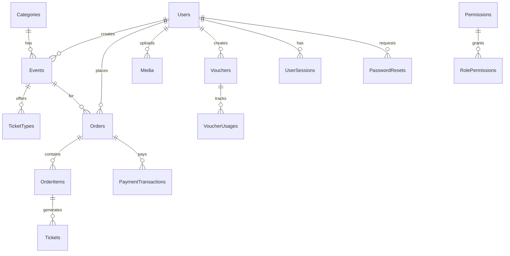
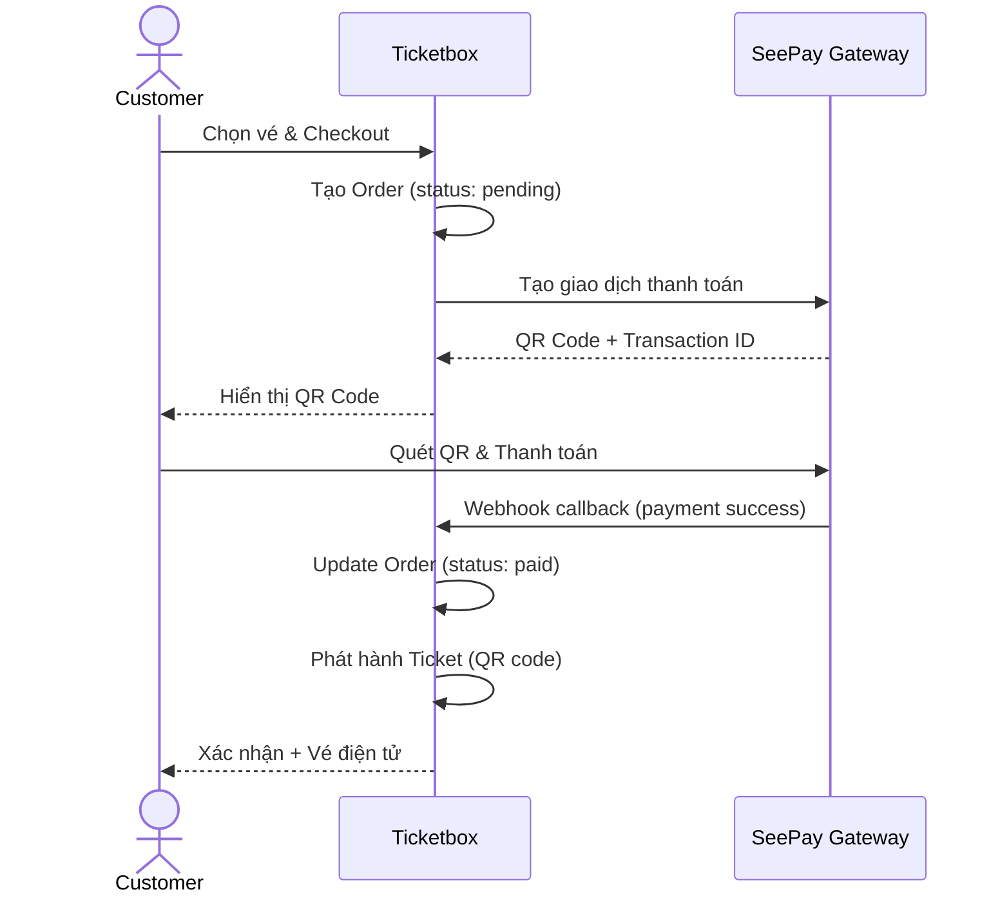

<p align="center">
  
  
  
  
</p>

# 🎫 Ticketbox — Nền tảng bán vé sự kiện trực tuyến

> **PRJ301 — Group 4** | Java Web Application (Servlet + JSP + MVC)

Ticketbox là nền tảng bán vé sự kiện toàn diện được xây dựng bằng **Java Servlet/JSP** theo kiến trúc **MVC 3-layer**. Hệ thống hỗ trợ **4 vai trò người dùng**, tích hợp **thanh toán SeePay**, **Google OAuth**, **Cloudinary media**, và **hệ thống bảo mật đa tầng**.

---

## 📑 Mục lục

- [Tính năng chính](#-tính-năng-chính)
- [Kiến trúc hệ thống](#-kiến-trúc-hệ-thống)
- [Công nghệ sử dụng](#-công-nghệ-sử-dụng)
- [Cấu trúc thư mục](#-cấu-trúc-thư-mục)
- [Cơ sở dữ liệu](#-cơ-sở-dữ-liệu)
- [Cài đặt & Chạy dự án](#-cài-đặt--chạy-dự-án)
- [Cấu hình](#-cấu-hình)
- [Tài khoản mặc định](#-tài-khoản-mặc-định)
- [Trang & Chức năng theo vai trò](#-trang--chức-năng-theo-vai-trò)
- [API Endpoints](#-api-endpoints)
- [Bảo mật](#-bảo-mật)
- [Tài liệu bổ sung](#-tài-liệu-bổ-sung)
- [Đóng góp](#-đóng-góp)

---

## ✨ Tính năng chính

### 🛒 Khách hàng (Customer)
- Duyệt & tìm kiếm sự kiện theo danh mục, từ khóa, ngày
- Xem chi tiết sự kiện (mô tả rich-text, gallery ảnh, bản đồ)
- Chọn loại vé & số lượng → Thanh toán qua SeePay / Chuyển khoản
- Quản lý vé đã mua (mã QR, tải vé)
- Áp mã giảm giá (voucher) khi checkout
- Hỗ trợ khách hàng (support ticket system)
- Thông báo real-time
- Đăng nhập bằng Google OAuth / Email-Password

### 🎤 Ban tổ chức (Organizer)
- Dashboard thống kê doanh thu, vé bán, lượt xem
- Tạo & quản lý sự kiện (CRUD, rich-text editor, upload ảnh/video)
- Quản lý loại vé (giá, số lượng, thời gian bán)
- Tạo & quản lý mã giảm giá (voucher)
- Quản lý đơn hàng & hoàn tiền
- Soát vé QR Code tại sự kiện (check-in)
- Quản lý nhân viên sự kiện (event staff)
- Thống kê doanh thu chi tiết (biểu đồ, xuất báo cáo)
- Chat hỗ trợ khách hàng

### 🛡️ Quản trị viên (Admin)
- Dashboard tổng quan toàn hệ thống
- Duyệt / từ chối sự kiện (approval workflow)
- Quản lý người dùng (active/ban, phân quyền)
- Quản lý danh mục sự kiện
- Hệ thống voucher toàn hệ thống (system vouchers)
- Quản lý đơn hàng & xác nhận thanh toán thủ công
- Báo cáo doanh thu & thống kê nâng cao
- Nhật ký hoạt động (activity log)
- Cài đặt hệ thống (site settings)
- Chat dashboard & hỗ trợ

### 👷 Nhân viên sự kiện (Staff)
- Dashboard sự kiện được phân công
- Soát vé QR Code tại cổng vào

---

## 🏗 Kiến trúc hệ thống

```
┌─────────────────────────────────────────────────────────────┐
│                      CLIENT (Browser)                       │
│              JSP + Bootstrap 5 + Chart.js                   │
└─────────────────┬───────────────────────────────────────────┘
                  │ HTTP Request
┌─────────────────▼───────────────────────────────────────────┐
│                   FILTER CHAIN (7 Filters)                  │
│  CacheFilter → SecurityHeaders → CSRF → Auth → Access      │
└─────────────────┬───────────────────────────────────────────┘
                  │
┌─────────────────▼───────────────────────────────────────────┐
│               CONTROLLER LAYER (Servlets)                   │
│  ┌──────────┐ ┌──────────┐ ┌──────────┐ ┌──────────┐       │
│  │ Public   │ │ Admin    │ │Organizer │ │   API    │       │
│  │(19 files)│ │(13 files)│ │(11 files)│ │(15 files)│       │
│  └──────────┘ └──────────┘ └──────────┘ └──────────┘       │
└─────────────────┬───────────────────────────────────────────┘
                  │
┌─────────────────▼───────────────────────────────────────────┐
│                  SERVICE LAYER (15 Services)                │
│  Auth · Event · Order · Ticket · Voucher · Dashboard · ...  │
│  ┌─────────────────────────────────────┐                    │
│  │  Payment Provider (Factory Pattern) │                    │
│  │  SeePay · BankTransfer · Cash       │                    │
│  └─────────────────────────────────────┘                    │
└─────────────────┬───────────────────────────────────────────┘
                  │
┌─────────────────▼───────────────────────────────────────────┐
│                    DAO LAYER (18 DAOs)                      │
│  BaseDAO (abstract) → UserDAO · EventDAO · OrderDAO · ...   │
└─────────────────┬───────────────────────────────────────────┘
                  │ JDBC (mssql-jdbc)
┌─────────────────▼───────────────────────────────────────────┐
│              SQL SERVER (15 Tables + Indexes)               │
│  Users · Events · TicketTypes · Orders · Tickets · ...      │
└─────────────────────────────────────────────────────────────┘
                  │
            External Services
    ┌─────────────┼─────────────┐
    │             │             │
 Cloudinary    SeePay      Google OAuth
 (Media CDN)  (Payment)   (Social Login)
```

---

## 🔧 Công nghệ sử dụng

| Thành phần | Công nghệ |
|-----------|-----------|
| **Backend** | Java 17+, Jakarta Servlet 6.0, JSP, JSTL |
| **Server** | Apache Tomcat 10.1+ |
| **Database** | Microsoft SQL Server 2019+ |
| **ORM/Data** | JDBC trực tiếp (mssql-jdbc driver) |
| **Frontend** | Bootstrap 5.3, Chart.js, Font Awesome 6 |
| **Authentication** | JWT (jjwt) + Session + Google OAuth 2.0 |
| **Password** | BCrypt (jBCrypt) |
| **Payment** | SeePay QR Payment Gateway |
| **Media Storage** | Cloudinary (Image/Video CDN) |
| **JSON** | Gson (Google) |
| **Build** | Apache Ant (NetBeans project) |
| **IDE** | NetBeans 21+ / IntelliJ IDEA |

---

## 📁 Cấu trúc thư mục

```
SellingTicketJava/
├── .env.example                    # Biến môi trường mẫu
├── build.xml                       # Ant build script
│
├── conf/
│   └── tomcat-connector.dev-example.xml
│
├── database/
│   ├── schema/
│   │   ├── ticketbox_schema.sql    # Schema đầy đủ (15 tables)
│   │   └── full_reset_seed.sql     # Reset + seed data
│   ├── migrations/                 # Migration files
│   └── seeds/                      # Seed data
│
├── docs/                           # Tài liệu dự án
│   ├── architecture.md
│   ├── business-flows.md
│   ├── database-schema.md
│   ├── payment_ticket_flow.md
│   └── diagrams/                   # PlantUML diagrams
│
└── src/
    ├── java/com/sellingticket/
    │   ├── controller/             # Servlet Controllers
    │   │   ├── *.java              # 19 public controllers
    │   │   ├── admin/              # 13 admin controllers
    │   │   ├── organizer/          # 11 organizer controllers
    │   │   ├── staff/              # 2 staff controllers
    │   │   └── api/                # 15 REST API servlets
    │   │
    │   ├── dao/                    # Data Access Objects (18 files)
    │   │   ├── BaseDAO.java        # Abstract base with connection pooling
    │   │   ├── UserDAO.java
    │   │   ├── EventDAO.java
    │   │   ├── OrderDAO.java
    │   │   ├── TicketDAO.java
    │   │   ├── DashboardDAO.java
    │   │   └── ...
    │   │
    │   ├── model/                  # POJOs / Entities (17 files)
    │   │   ├── User.java
    │   │   ├── Event.java
    │   │   ├── Order.java / OrderItem.java
    │   │   ├── Ticket.java / TicketType.java
    │   │   ├── Category.java
    │   │   ├── Voucher.java
    │   │   ├── Media.java
    │   │   ├── SupportTicket.java / TicketMessage.java
    │   │   ├── ChatSession.java / ChatMessage.java
    │   │   ├── Notification.java
    │   │   ├── ActivityLog.java
    │   │   └── PageResult.java     # Pagination wrapper
    │   │
    │   ├── service/                # Business Logic (15 files)
    │   │   ├── EventService.java
    │   │   ├── OrderService.java
    │   │   ├── AuthTokenService.java
    │   │   ├── DashboardService.java
    │   │   ├── payment/            # Payment providers
    │   │   │   ├── PaymentProvider.java   (interface)
    │   │   │   ├── PaymentFactory.java    (factory pattern)
    │   │   │   ├── SeepayProvider.java
    │   │   │   └── BankTransferProvider.java
    │   │   └── ...
    │   │
    │   ├── filter/                 # Servlet Filters (7 files)
    │   │   ├── AuthFilter.java             # JWT + Session auth
    │   │   ├── CsrfFilter.java             # CSRF protection
    │   │   ├── SecurityHeadersFilter.java  # X-XSS, CSP, etc.
    │   │   ├── CacheFilter.java            # Static asset caching
    │   │   ├── OrganizerAccessFilter.java  # Role-based access
    │   │   ├── StaffAccessFilter.java
    │   │   └── ProtectedJspAccessFilter.java
    │   │
    │   ├── security/
    │   │   └── LoginAttemptTracker.java  # Brute-force protection
    │   │
    │   ├── util/                   # Utility Classes (12 files)
    │   │   ├── DBContext.java      # DB connection manager
    │   │   ├── JwtUtil.java        # JWT token management
    │   │   ├── CloudinaryUtil.java # Media upload helper
    │   │   ├── InputValidator.java # Input sanitization
    │   │   ├── PasswordUtil.java   # BCrypt wrapper
    │   │   ├── JsonResponse.java   # JSON response builder
    │   │   ├── CookieUtil.java     # Secure cookie helper
    │   │   ├── FlashUtil.java      # Flash messages
    │   │   ├── AppConstants.java   # App-wide constants
    │   │   ├── PermissionCache.java
    │   │   ├── ServletUtil.java
    │   │   └── ValidationUtil.java
    │   │
    │   └── exception/              # Custom exceptions
    │
    └── webapp/
        ├── index.jsp               # Entry point → redirect /home
        ├── home.jsp                # Trang chủ
        ├── login.jsp / register.jsp
        ├── events.jsp              # Danh sách sự kiện
        ├── event-detail.jsp        # Chi tiết sự kiện
        ├── ticket-selection.jsp    # Chọn vé
        ├── checkout.jsp            # Thanh toán
        ├── order-confirmation.jsp  # Xác nhận đơn hàng
        ├── my-tickets.jsp          # Vé của tôi
        ├── profile.jsp             # Hồ sơ người dùng
        ├── categories.jsp          # Danh mục sự kiện
        ├── support-ticket.jsp      # Hỗ trợ
        ├── notifications.jsp       # Thông báo
        ├── header.jsp / footer.jsp # Layout chung
        ├── 404.jsp / 500.jsp       # Error pages
        │
        ├── admin/                  # 18 trang admin
        │   ├── dashboard.jsp
        │   ├── events.jsp / event-detail.jsp / event-approval.jsp
        │   ├── users.jsp / user-detail.jsp
        │   ├── orders.jsp
        │   ├── categories.jsp
        │   ├── reports.jsp
        │   ├── system-vouchers.jsp
        │   ├── support.jsp / support-detail.jsp
        │   ├── settings.jsp
        │   ├── activity-log.jsp
        │   ├── chat-dashboard.jsp
        │   ├── notifications.jsp
        │   └── sidebar.jsp
        │
        ├── organizer/              # 19 trang organizer
        │   ├── dashboard.jsp
        │   ├── create-event.jsp / edit-event.jsp
        │   ├── events.jsp / event-detail.jsp
        │   ├── tickets.jsp
        │   ├── orders.jsp / event-orders.jsp
        │   ├── vouchers.jsp / voucher-form.jsp
        │   ├── statistics.jsp
        │   ├── check-in.jsp
        │   ├── team.jsp / manage-staff.jsp
        │   ├── support.jsp / support-detail.jsp
        │   ├── chat.jsp
        │   ├── settings.jsp
        │   └── sidebar.jsp
        │
        ├── staff/                  # 3 trang staff
        │   ├── dashboard.jsp
        │   ├── check-in.jsp
        │   └── sidebar.jsp
        │
        ├── assets/
        │   ├── css/                # Stylesheets
        │   ├── js/                 # JavaScript
        │   └── i18n/               # Internationalization (VI/EN)
        │
        └── WEB-INF/
            ├── web.xml             # Servlet & filter config
            ├── google-oauth.properties
            ├── lib/                # JAR dependencies
            └── tags/               # Custom tag files
```

---

## 🗄 Cơ sở dữ liệu

### 15 Bảng chính



| # | Bảng | Mô tả |
|---|------|-------|
| 1 | **Users** | Người dùng (customer, organizer, admin, support_agent) |
| 2 | **Categories** | Danh mục sự kiện (Âm nhạc, Thể thao, Workshop, ...) |
| 3 | **Media** | Cloudinary media (polymorphic: user/event/ticket_type) |
| 4 | **Events** | Sự kiện (draft → pending → approved → completed) |
| 5 | **TicketTypes** | Loại vé (VIP, Standard, Early Bird, ...) |
| 6 | **Orders** | Đơn hàng (pending → paid → checked_in / refunded) |
| 7 | **OrderItems** | Chi tiết đơn hàng (loại vé × số lượng) |
| 8 | **Tickets** | Vé phát hành (QR code, check-in tracking) |
| 9 | **PaymentTransactions** | Giao dịch thanh toán SeePay |
| 10 | **Vouchers** | Mã giảm giá (percentage/fixed, event/system scope) |
| 11 | **VoucherUsages** | Lịch sử sử dụng voucher |
| 12 | **UserSessions** | Phiên đăng nhập (token, device, IP) |
| 13 | **PasswordResets** | Token đặt lại mật khẩu |
| 14 | **Permissions** | Quyền hạn (17 permissions, 5 modules) |
| 15 | **RolePermissions** | Phân quyền theo vai trò (RBAC) |

---

## 🚀 Cài đặt & Chạy dự án

### Yêu cầu hệ thống

| Phần mềm | Phiên bản |
|----------|-----------|
| **JDK** | 17 trở lên |
| **Apache Tomcat** | 10.1+ (Jakarta EE 10) |
| **SQL Server** | 2019+ (hoặc SQL Server Express) |
| **IDE** | NetBeans 21+ hoặc IntelliJ IDEA |
| **Git** | 2.x |

### Bước 1: Clone repository

```bash
git clone https://github.com/your-org/PRJ301_GROUP4_SELLING_TICKET.git
cd PRJ301_GROUP4_SELLING_TICKET/SellingTicketJava
```

### Bước 2: Tạo cơ sở dữ liệu

Mở **SQL Server Management Studio (SSMS)** và chạy:

```sql
-- Tạo database + bảng + indexes + seed data (an toàn chạy lại nhiều lần)
-- File này tự tạo DB "SellingTicketDB" nếu chưa có
:r database/schema/ticketbox_schema.sql
```

Hoặc chạy từ command line:

```bash
sqlcmd -S localhost -i database/schema/ticketbox_schema.sql
```

> **Seed data bao gồm:** 6 danh mục, 17 quyền hạn, 3 tài khoản mẫu, 3 sự kiện mẫu, 6 loại vé mẫu.

### Bước 3: Cấu hình kết nối database

Cấu hình trong `src/java/com/sellingticket/util/DBContext.java` hoặc qua biến môi trường:

```properties
# Mặc định (DBContext.java)
DB_SERVER=localhost
DB_PORT=1433
DB_NAME=SellingTicketDB
DB_USER=sa
DB_PASSWORD=your_password
```

### Bước 4: Cấu hình biến môi trường

```bash
# Copy file mẫu
cp .env.example .env
```

Chỉnh sửa `.env`:

```properties
# JWT Secret - Dùng cho signing token
# Tạo: openssl rand -base64 64
TICKETBOX_JWT_SECRET=YOUR_STRONG_SECRET_HERE

# Admin Key - Dùng cho admin role upgrade
# Tạo: openssl rand -hex 16
TICKETBOX_ADMIN_KEY=YOUR_ADMIN_KEY_HERE
```

### Bước 5: Cấu hình Google OAuth (tuỳ chọn)

Chỉnh sửa `src/webapp/WEB-INF/google-oauth.properties`:

```properties
google.client.id=YOUR_GOOGLE_CLIENT_ID
google.client.secret=YOUR_GOOGLE_CLIENT_SECRET
google.redirect.uri=http://localhost:8080/SellingTicketJava/oauth/google/callback
```

### Bước 6: Cấu hình Cloudinary (tuỳ chọn)

Thêm vào biến môi trường hoặc `AppConstants.java`:

```properties
CLOUDINARY_CLOUD_NAME=your_cloud_name
CLOUDINARY_API_KEY=your_api_key
CLOUDINARY_API_SECRET=your_api_secret
```

### Bước 7: Deploy & Chạy

**Với NetBeans:**
1. Mở project `SellingTicketJava` (File → Open Project)
2. Right-click project → Properties → Run → Server: **Apache Tomcat 10.1+**
3. Click **Run** (▶) hoặc **F6**
4. Truy cập: `http://localhost:8080/SellingTicketJava/`

**Với IntelliJ IDEA:**
1. Mở thư mục `SellingTicketJava`
2. Cấu hình Tomcat: Run → Edit Configurations → Tomcat Server → Local
3. Deployment: `SellingTicketJava:war exploded`
4. Run và truy cập: `http://localhost:8080/SellingTicketJava/`

**Với Ant (command line):**
```bash
ant clean build
# Copy build/web vào Tomcat webapps
```

---

## ⚙ Cấu hình

### Biến môi trường

| Biến | Bắt buộc | Mô tả |
|------|----------|-------|
| `TICKETBOX_JWT_SECRET` | ✅ | Secret key cho JWT token signing |
| `TICKETBOX_ADMIN_KEY` | ✅ | Private key cho admin role upgrade |
| `DB_SERVER` | ❌ | SQL Server host (default: `localhost`) |
| `DB_PORT` | ❌ | SQL Server port (default: `1433`) |
| `DB_NAME` | ❌ | Database name (default: `SellingTicketDB`) |
| `DB_USER` | ❌ | Database user (default: `sa`) |
| `DB_PASSWORD` | ❌ | Database password |
| `CLOUDINARY_CLOUD_NAME` | ❌ | Cloudinary cloud name |
| `CLOUDINARY_API_KEY` | ❌ | Cloudinary API key |
| `CLOUDINARY_API_SECRET` | ❌ | Cloudinary API secret |

### Session Configuration (web.xml)

```xml
<session-config>
    <session-timeout>60</session-timeout>  <!-- 60 phút -->
    <cookie-config>
        <http-only>true</http-only>
    </cookie-config>
</session-config>
```

---

## 🔑 Tài khoản mặc định

| Vai trò | Email | Mật khẩu |
|---------|-------|----------|
| **Admin** | `admin@ticketbox.vn` | `Admin@123` |
| **Organizer** | `organizer@ticketbox.vn` | `Organizer@123` |
| **Customer** | `customer@ticketbox.vn` | `Customer@123` |

> ⚠️ **Quan trọng:** Đổi mật khẩu ngay sau lần đăng nhập đầu tiên trong môi trường production.

---

## 📱 Trang & Chức năng theo vai trò

### Khách hàng (Public + Authenticated)

| # | Trang | URL | Mô tả |
|---|-------|-----|-------|
| 1 | Trang chủ | `/home` | Featured events, upcoming, stats, testimonials |
| 2 | Danh sách sự kiện | `/events` | Tìm kiếm, lọc theo danh mục/ngày |
| 3 | Chi tiết sự kiện | `/event/{slug}` | Thông tin đầy đủ, gallery, loại vé |
| 4 | Chọn vé | `/tickets?event={id}` | Chọn loại vé & số lượng |
| 5 | Thanh toán | `/checkout` | Nhập thông tin, áp voucher, thanh toán |
| 6 | Xác nhận | `/order-confirmation` | Mã đơn hàng, QR code |
| 7 | Vé của tôi | `/my-tickets` | Danh sách vé, tải QR |
| 8 | Hồ sơ | `/profile` | Cập nhật thông tin cá nhân |
| 9 | Đổi mật khẩu | `/change-password` | Đổi mật khẩu |
| 10 | Danh mục | `/categories` | Danh mục sự kiện |
| 11 | Hỗ trợ | `/support/new` | Tạo yêu cầu hỗ trợ |
| 12 | Thông báo | `/notifications` | Thông báo hệ thống |
| 13 | Đăng nhập | `/login` | Email/Password + Google OAuth |
| 14 | Đăng ký | `/register` | Đăng ký tài khoản mới |

### Ban tổ chức (Organizer)

| # | Trang | URL | Mô tả |
|---|-------|-----|-------|
| 1 | Dashboard | `/organizer/dashboard` | Tổng quan doanh thu, sự kiện, đơn hàng |
| 2 | Tạo sự kiện | `/organizer/events/create` | Form tạo sự kiện (rich editor, upload) |
| 3 | Sửa sự kiện | `/organizer/events/edit/{id}` | Chỉnh sửa sự kiện đã tạo |
| 4 | Danh sách sự kiện | `/organizer/events` | Quản lý tất cả sự kiện |
| 5 | Chi tiết sự kiện | `/organizer/events/{id}` | Xem chi tiết & trạng thái |
| 6 | Quản lý vé | `/organizer/tickets` | Loại vé, số lượng, giá |
| 7 | Đơn hàng | `/organizer/orders` | Danh sách đơn hàng |
| 8 | Voucher | `/organizer/vouchers` | Tạo & quản lý mã giảm giá |
| 9 | Thống kê | `/organizer/statistics` | Biểu đồ doanh thu, vé bán |
| 10 | Soát vé | `/organizer/check-in` | Quét QR code check-in |
| 11 | Nhân viên | `/organizer/team` | Quản lý event staff |
| 12 | Chat | `/organizer/chat` | Chat hỗ trợ khách hàng |
| 13 | Hỗ trợ | `/organizer/support` | Yêu cầu hỗ trợ từ admin |
| 14 | Cài đặt | `/organizer/settings` | Thông tin tổ chức, social links |

### Quản trị viên (Admin)

| # | Trang | URL | Mô tả |
|---|-------|-----|-------|
| 1 | Dashboard | `/admin/dashboard` | Tổng quan toàn hệ thống |
| 2 | Duyệt sự kiện | `/admin/events/approval` | Approve / Reject events |
| 3 | Quản lý sự kiện | `/admin/events` | CRUD sự kiện toàn hệ thống |
| 4 | Quản lý người dùng | `/admin/users` | Active/Ban, xem chi tiết |
| 5 | Quản lý đơn hàng | `/admin/orders` | Xem & xác nhận thanh toán |
| 6 | Danh mục | `/admin/categories` | CRUD danh mục sự kiện |
| 7 | Voucher hệ thống | `/admin/system-vouchers` | Voucher toàn platform |
| 8 | Báo cáo | `/admin/reports` | Báo cáo doanh thu nâng cao |
| 9 | Hỗ trợ | `/admin/support` | Xử lý support tickets |
| 10 | Nhật ký | `/admin/activity-log` | Activity log toàn hệ thống |
| 11 | Cài đặt | `/admin/settings` | Site settings |
| 12 | Chat | `/admin/chat-dashboard` | Chat dashboard |
| 13 | Thông báo | `/admin/notifications` | Gửi thông báo hệ thống |

---

## 🔌 API Endpoints

### Public APIs (không cần auth)

```
GET  /api/events                    # Danh sách sự kiện (search, filter, pagination)
GET  /api/events/{id}               # Chi tiết sự kiện
GET  /api/check-email               # Kiểm tra email tồn tại
POST /api/webhook/seepay            # SeePay payment webhook
```

### Authenticated APIs

```
GET  /api/my-tickets                # Vé của tôi
GET  /api/my-orders                 # Đơn hàng của tôi
GET  /api/payment/status            # Trạng thái thanh toán
POST /api/voucher/validate          # Kiểm tra mã giảm giá
POST /api/upload                    # Upload media (Cloudinary)

# Chat
GET  /api/chat/sessions             # Danh sách chat sessions
POST /api/chat/send                 # Gửi tin nhắn
GET  /api/chat/messages/{sessionId} # Lịch sử tin nhắn
```

### Organizer APIs

```
GET  /api/organizer/events          # Sự kiện của organizer
PUT  /api/organizer/events/{id}     # Cập nhật sự kiện
```

### Admin APIs

```
PUT  /api/admin/events/{id}/approve     # Duyệt sự kiện
PUT  /api/admin/events/{id}/feature     # Toggle featured
POST /api/admin/orders/{id}/confirm     # Xác nhận thanh toán
PUT  /api/admin/users/{id}/status       # Active/Ban user
```

---

## 🔒 Bảo mật

### Hệ thống bảo mật đa tầng

| Layer | Cơ chế | File |
|-------|--------|------|
| **Authentication** | JWT + HttpOnly Session Cookie | `AuthFilter.java`, `JwtUtil.java` |
| **CSRF Protection** | Double-submit cookie pattern | `CsrfFilter.java` |
| **XSS Prevention** | Security headers + Input sanitization | `SecurityHeadersFilter.java`, `InputValidator.java` |
| **Password** | BCrypt hashing (12 rounds) | `PasswordUtil.java` |
| **Brute Force** | Login attempt tracking + lockout | `LoginAttemptTracker.java` |
| **Authorization** | Role-based (RBAC) + Permission-based | `AuthFilter.java`, `OrganizerAccessFilter.java` |
| **Session** | Secure cookie config, 60min timeout | `web.xml` |
| **SQL Injection** | Prepared statements throughout | All DAOs |
| **Static Assets** | Cache headers for CSS/JS/images | `CacheFilter.java` |

### Security Headers

```
X-Content-Type-Options: nosniff
X-Frame-Options: DENY
X-XSS-Protection: 1; mode=block
Content-Security-Policy: configured
Referrer-Policy: strict-origin-when-cross-origin
```

---

## 💳 Luồng thanh toán



**Phương thức thanh toán:**
- **SeePay** — Thanh toán QR Code tự động
- **Chuyển khoản** — Chuyển khoản ngân hàng (admin xác nhận thủ công)
- **Tiền mặt** — Thanh toán trực tiếp tại quầy

---

## 📚 Tài liệu bổ sung

| Tài liệu | Đường dẫn |
|----------|-----------|
| Kiến trúc hệ thống | [`docs/architecture.md`](SellingTicketJava/docs/architecture.md) |
| Database Schema | [`docs/database-schema.md`](SellingTicketJava/docs/database-schema.md) |
| Business Flows | [`docs/business-flows.md`](SellingTicketJava/docs/business-flows.md) |
| Payment & Ticket Flow | [`docs/payment_ticket_flow.md`](SellingTicketJava/docs/payment_ticket_flow.md) |
| Security Report | [`docs/chapter6_security_report.md`](SellingTicketJava/docs/chapter6_security_report.md) |
| Use Case Specification | [`docs/usecase-specification.md`](SellingTicketJava/docs/usecase-specification.md) |
| API Reference | [`docs/API_REFERENCE.md`](docs/API_REFERENCE.md) |
| Auth Flow | [`docs/AUTH_FLOW.md`](docs/AUTH_FLOW.md) |
| Endpoint Reference | [`docs/ENDPOINT_REFERENCE.md`](docs/ENDPOINT_REFERENCE.md) |
| System Documentation | [`docs/SYSTEM_DOCUMENTATION.md`](docs/SYSTEM_DOCUMENTATION.md) |

---

## 🤝 Đóng góp

### Development Workflow

```bash
# 1. Fork & Clone
git clone https://github.com/your-username/PRJ301_GROUP4_SELLING_TICKET.git

# 2. Tạo branch
git checkout -b feature/ten-tinh-nang

# 3. Commit với conventional commits
git commit -m "feat: thêm chức năng XYZ"
git commit -m "fix: sửa lỗi thanh toán"
git commit -m "docs: cập nhật README"

# 4. Push & tạo Pull Request
git push origin feature/ten-tinh-nang
```

### Commit Convention

| Prefix | Mô tả |
|--------|-------|
| `feat:` | Tính năng mới |
| `fix:` | Sửa lỗi |
| `docs:` | Tài liệu |
| `style:` | Formatting (không thay đổi logic) |
| `refactor:` | Refactoring code |
| `test:` | Thêm test |
| `chore:` | Build, CI, dependencies |

---

## 👥 Nhóm phát triển

**PRJ301 — Group 4** | FPT University

---

## 📄 License

Dự án này được phát triển cho mục đích học tập tại FPT University.

---

<p align="center">
  <b>🎫 Ticketbox — Kết nối sự kiện, trải nghiệm vượt trội</b>
</p>
