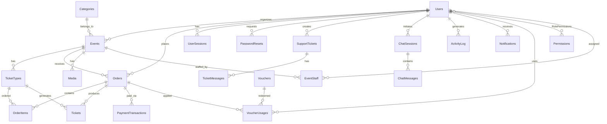

<p align="center">
  
  
  
  
</p>

<h1 align="center">🎫 Ticketbox — Nền tảng Mua Bán Vé Sự kiện</h1>

<p align="center">
  <b>Đồ án môn PRJ301 — Web Application Development with Java</b><br/>
  Học kỳ Spring 2026 · FPT University
</p>

---

## 📋 Thông tin dự án

| Mục | Chi tiết |
|-----|----------|
| **Tên dự án** | Ticketbox — Online Ticket Selling Platform |
| **Môn học** | PRJ301 — Web Application Development with Java |
| **Nhóm** | **Nhóm 7** |
| **Giảng viên** | *Phan Ngọc Hoàngg* |
| **Trường** | FPT University |

### 👥 Thành viên Nhóm 7

| MSSV | Họ và tên | Vai trò |
|------|-----------|---------|
| **HE191087** | **Dương Minh Hoàng** | Team Leader · Full-stack Developer |
| **HE194923** | **Nguyễn Tấn Dũng** | Backend Developer · Database |
| **HE191292** | **Doãn Thu Hằng** | Frontend Developer · UI/UX |

---

## 🎯 Bối cảnh Nghiệp vụ & Mô tả Dự án

### Bài toán kinh doanh

**Ticketbox** giải quyết bài toán **số hóa quy trình mua bán vé sự kiện** tại Việt Nam — nơi phần lớn giao dịch vé còn diễn ra thủ công (qua Zalo, Facebook, chuyển khoản trực tiếp). Hệ thống hướng đến:

- **Khách hàng:** Trải nghiệm tìm kiếm, đặt vé, thanh toán trực tuyến liền mạch — tương tự Ticketbox.vn, Eventbrite
- **Nhà tổ chức (Organizer):** Tự tạo sự kiện, quản lý vé, theo dõi doanh thu, check-in tại cổng
- **Quản trị viên (Admin):** Kiểm duyệt sự kiện, giám sát toàn hệ thống, quản lý mã giảm giá, báo cáo doanh thu

### Các luồng nghiệp vụ chính

#### 🔄 Luồng 1: Vòng đời Sự kiện (Event Lifecycle)

```
Organizer tạo sự kiện (status=draft)
       │
       ▼ [Submit for Approval]
  status=pending ──────────────► Admin duyệt
       │                              │
       │                    ┌─────────┴──────────┐
       │                    ▼                    ▼
       │             status=approved       status=rejected
       │                    │               (kèm lý do)
       │                    ▼
       │            Hiển thị trên trang chủ
       │            Khách hàng có thể đặt vé
       │                    │
       │                    ▼ [Ngày sự kiện]
       │              Check-in tại cổng
       │                    │
       │                    ▼ [Kết thúc]
       │              status=ended
       ▼
  Organizer có thể chỉnh sửa & gửi lại
```

**Quy tắc nghiệp vụ:**
- Mỗi Organizer tối đa **3 sự kiện pending** cùng lúc (chống spam)
- Sự kiện bị reject có thể sửa lại và submit lại
- Admin có thể **pin** (ghim) sự kiện lên đầu trang chủ
- Admin có thể **feature** (nổi bật) sự kiện vào carousel
- Mỗi sự kiện có **view count** tự động tăng khi xem chi tiết

#### 🛒 Luồng 2: Đặt vé & Thanh toán (Order Flow)

```
Khách chọn sự kiện → Xem chi tiết → Chọn loại vé & số lượng
       │
       ▼ [Validate]
  Kiểm tra: còn vé? Vượt giới hạn mua?
       │
       ▼ [Checkout Page]
  Nhập thông tin → Áp mã giảm giá (optional)
       │
       ▼ [Tạo đơn hàng]
  Order (status=pending) + Lock số vé (atomic transaction)
       │
       ▼ [Chọn phương thức thanh toán]
  ┌─────────────────┬──────────────────┐
  │   VietQR/SeePay │  Chuyển khoản    │
  │   (tự động)     │  (thủ công)      │
  └────────┬────────┴────────┬─────────┘
           │                 │
           ▼                 ▼
  QR Code hiển thị    Hướng dẫn CK
  KH quét & thanh     KH tự CK → Admin
  toán qua app NH     confirm thủ công
           │                 │
           ▼                 ▼
  Webhook SeePay ──► Order status=paid
           │
           ▼
  Hệ thống tự động phát hành E-ticket (QR code JWT)
           │
           ▼
  Khách nhận vé điện tử → Xem/Tải trong "Vé của tôi"
```

**Quy tắc nghiệp vụ:**
- **Atomic reservation:** Khi tạo đơn, hệ thống kiểm tra + giữ chỗ trong 1 transaction (chống race condition)
- **Giới hạn mua:** Mỗi event có `max_tickets_per_order` (mặc định 10 vé/đơn)
- **QR Code vé:** Mã QR chứa JWT token, bao gồm ticketId + orderId + eventId → quét tại cổng
- **Dedup webhook:** Bảng `SeepayWebhookDedup` chống xử lý trùng callback từ cổng thanh toán
- **Order code:** Format `ORD-{timestamp}-{UUID8}` đảm bảo unique

#### 🎫 Luồng 3: Check-in tại Sự kiện

```
Staff/Organizer mở trang Check-in
       │
       ▼ [Quét QR]
  Camera quét mã QR trên vé điện tử
       │
       ▼ [Verify JWT]
  Giải mã JWT → Lấy ticketId → Kiểm tra DB
       │
  ┌────┴────────────────────────┐
  │ Hợp lệ + Chưa check-in    │ Đã check-in / Không hợp lệ
  │          ▼                  │          ▼
  │  Đánh dấu checked_in      │  Hiển thị cảnh báo
  │  Hiển thị ✅ + thông tin vé │  Hiển thị ❌ + lý do
  └─────────────────────────────┘
```

#### 🏷️ Luồng 4: Voucher / Mã giảm giá

| Loại | Phạm vi | Người tạo | Nguồn chi phí |
|------|---------|-----------|---------------|
| **System Voucher** | Toàn bộ sự kiện | Admin | Nền tảng chịu |
| **Event Voucher** | 1 sự kiện cụ thể | Organizer | Organizer chịu |

**Quy tắc validate:**
1. Mã tồn tại? → Mã đang active? → Chưa hết hạn?
2. Còn lượt sử dụng? (`used_count < usage_limit`)
3. Event voucher: đúng sự kiện? | System voucher: áp dụng mọi sự kiện
4. Đơn hàng đạt giá trị tối thiểu? (`min_order_amount`)
5. Tính giảm giá: **percentage** (có cap `max_discount`) hoặc **fixed amount**

#### 💬 Luồng 5: Chat Hỗ trợ & Support Tickets

| Kênh | Cơ chế | Đối tượng |
|------|--------|-----------|
| **Live Chat** | Polling-based (AJAX mỗi 3s) | Customer ↔ Organizer/Admin |
| **Support Tickets** | Ticket system (tạo → phản hồi → đóng) | Organizer ↔ Admin |

### Hệ thống Phân quyền (Permission Engine)

Ticketbox triển khai **RBAC (Role-Based Access Control)** đa tầng:

#### Tầng 1: System Roles (4 vai trò)

| Role | Quyền tổng quan |
|------|-----------------|
| **admin** | Toàn quyền hệ thống: duyệt event, quản lý user, báo cáo, voucher hệ thống |
| **organizer** | Tạo/quản lý sự kiện riêng, team, vé, voucher event, thống kê |
| **customer** | Tìm, mua vé, xem vé, chat, quản lý hồ sơ |
| **staff** | Check-in, xem attendee list (chỉ event được phân công) |

#### Tầng 2: Event-level Roles (Phân quyền theo sự kiện)

| Event Role | Nguồn | Quyền |
|------------|-------|-------|
| **owner** | Người tạo event | Toàn quyền event: CRUD, xóa, voucher, team |
| **manager** | Được Organizer assign | Quản lý vé, đơn hàng, thống kê, voucher |
| **staff** | Được Organizer assign | Xem thông tin, hỗ trợ |
| **scanner** | Được Organizer assign | Chỉ check-in tại cổng |

```
getUserEventRole(eventId, userId, systemRole)
  → "admin" (nếu system admin)
  → "owner" (nếu organizer_id = userId)
  → "manager" / "staff" / "scanner" (từ bảng EventStaff)
  → null (không có quyền)
```

## 📡 API & Controller Reference

### Public Controllers (19 Servlets)

| Servlet | URL Pattern | Chức năng |
|---------|------------|-----------|
| `HomeServlet` | `/` | Trang chủ: featured events, upcoming events, categories |
| `EventsServlet` | `/events` | Danh sách sự kiện: search, filter, pagination |
| `EventDetailServlet` | `/event/*` | Chi tiết sự kiện (SEO slug), ticket types, related events |
| `LoginServlet` | `/login` | Form đăng nhập + xử lý POST (email/password) |
| `RegisterServlet` | `/register` | Đăng ký tài khoản mới + validation |
| `GoogleOAuthServlet` | `/google-oauth` | OAuth 2.0 callback handler |
| `LogoutServlet` | `/logout` | Revoke tokens + clear cookies |
| `CheckoutServlet` | `/checkout` | Multi-step checkout: validate → create order → payment |
| `TicketSelectionServlet` | `/ticket-selection` | Chọn loại vé & số lượng trước checkout |
| `OrderConfirmationServlet` | `/order-confirmation` | Xác nhận đơn hàng sau thanh toán |
| `ResumePaymentServlet` | `/resume-payment` | Tiếp tục thanh toán cho đơn pending |
| `MyTicketsServlet` | `/my-tickets` | Vé điện tử của khách hàng |
| `ProfileServlet` | `/profile` | Xem/sửa hồ sơ cá nhân |
| `ChangePasswordServlet` | `/change-password` | Đổi mật khẩu (revoke all sessions) |
| `SupportTicketServlet` | `/support` | Tạo/xem support tickets |
| `MediaUploadServlet` | `/upload` | Upload ảnh/video lên Cloudinary |
| `StaticPagesServlet` | `/about`, `/faq` | Trang tĩnh |
| `TermsServlet` | `/terms` | Điều khoản sử dụng |
| `NotificationController` | `/notifications` | Danh sách thông báo |

### Admin Controllers (13 Servlets — `/admin/*`)

| Servlet | Chức năng chính |
|---------|----------------|
| `AdminDashboardController` | Dashboard: revenue charts, user stats, order stats, system health |
| `AdminEventController` | CRUD events, approve/reject, pin/feature, paged search |
| `AdminEventApprovalController` | Duyệt sự kiện pending (approve/reject + reason) |
| `AdminOrderController` | Quản lý đơn hàng toàn hệ thống, confirm payment thủ công |
| `AdminUserController` | CRUD users, activate/deactivate, change roles |
| `AdminCategoryController` | CRUD categories (Music, Sports, Tech...) |
| `AdminSystemVoucherController` | Voucher hệ thống (áp dụng toàn sự kiện) |
| `AdminReportsController` | Báo cáo: revenue by period, top events, export |
| `AdminNotificationController` | Gửi thông báo hệ thống |
| `AdminSupportController` | Xử lý support tickets từ organizers |
| `AdminSettingsController` | Cấu hình site settings |
| `AdminActivityLogController` | Activity log toàn hệ thống |
| `AdminChatDashboardController` | Giám sát chat sessions |

### Organizer Controllers (11 Servlets — `/organizer/*`)

| Servlet | Chức năng chính |
|---------|----------------|
| `OrganizerEventController` | Tạo/sửa/xóa sự kiện, submit for approval, quản lý settings |
| `OrganizerDashboardController` | Dashboard riêng: own events stats, recent orders |
| `OrganizerOrderController` | Xem đơn hàng theo sự kiện, export attendee list |
| `OrganizerTicketController` | Quản lý ticket types (VIP, Standard...) |
| `OrganizerVoucherController` | CRUD voucher theo sự kiện |
| `OrganizerStatisticsController` | Thống kê chi tiết: revenue, attendees, time series |
| `OrganizerCheckInController` | Check-in dashboard: QR scan, attendee list, donut chart |
| `OrganizerTeamController` | Quản lý team: add/remove staff, assign roles |
| `OrganizerSettingsController` | Cài đặt sự kiện: max tickets, pre-order toggle |
| `OrganizerSupportController` | Tạo/xử lý support tickets |
| `OrganizerChatController` | Chat dashboard cho organizer |

### REST API Endpoints (15 Servlets — `/api/*`)

| Endpoint | Method | Chức năng |
|----------|--------|-----------|
| `/api/events` | GET | Search events (public), filter, paginate |
| `/api/event-detail` | GET | Chi tiết event + ticket availability |
| `/api/voucher/validate` | POST | Validate voucher code real-time (AJAX) |
| `/api/my-orders` | GET | Lấy danh sách đơn hàng (user) |
| `/api/my-tickets` | GET | Lấy danh sách vé (user) |
| `/api/payment-status` | GET | Polling trạng thái thanh toán |
| `/api/seepay-webhook` | POST | IPN webhook nhận callback từ SeePay |
| `/api/upload` | POST | Upload file lên Cloudinary (multipart) |
| `/api/chat` | GET/POST | Real-time chat (polling-based) |
| `/api/email-available` | GET | Kiểm tra email trùng (register form) |
| `/api/admin/events` | PUT/DELETE | Admin CRUD events |
| `/api/admin/event-feature` | POST | Toggle featured/pinned |
| `/api/admin/orders` | PUT | Admin update order status |
| `/api/admin/confirm-payment` | POST | Admin confirm payment thủ công |
| `/api/admin/users` | PUT/DELETE | Admin CRUD users |
| `/api/organizer/events` | PUT/DELETE | Organizer CRUD own events |

---

## 💳 Hệ thống Thanh toán (Payment Integration)

### Payment Factory Pattern (Strategy Pattern)

```java
// PaymentFactory.getProvider("seepay") → SeepayProvider
// PaymentFactory.getProvider("bank_transfer") → BankTransferProvider

public interface PaymentProvider {
    String getMethodName();
    PaymentResult initiatePayment(Order order);
}
```

### Phương thức thanh toán

| Provider | Class | Cơ chế |
|----------|-------|--------|
| **SeePay (VietQR)** | `SeepayProvider` | Generate QR code → KH quét → Webhook IPN tự động confirm |
| **Chuyển khoản** | `BankTransferProvider` | Hiển thị thông tin CK → Admin/Organizer confirm thủ công |

### SeePay Webhook Flow (Idempotent)

```
SeePay Server gọi POST /api/seepay-webhook
       │
       ▼
  Verify signature (HMAC-SHA256)
       │
       ▼
  Check SeepayWebhookDedup (đã xử lý chưa?)
       │
  ┌────┴─────────┐
  │ Chưa xử lý   │ Đã xử lý (trùng)
  │      ▼        │       ▼
  │ Parse order   │  Return 200 OK
  │  code từ      │  (skip processing)
  │  description  │
  │      ▼        │
  │ confirmPaymentAtomic(orderId, txRef)
  │  → UPDATE orders SET status='paid'
  │    WHERE status='pending'  ← Idempotent!
  │      ▼        │
  │ createTicketsForOrder()
  │  → Phát hành e-tickets
  │      ▼        │
  │ Insert dedup  │
  │  record       │
  └───────────────┘
```

---

## 🗄️ Service Layer Architecture (15 Services)

| Service | Trách nhiệm | DAO phụ thuộc |
|---------|-------------|---------------|
| `EventService` | Event CRUD, lifecycle, permission engine, paged search, staff management | `EventDAO`, `TicketTypeDAO`, `CategoryDAO`, `EventStaffDAO` |
| `OrderService` | Order CRUD, payment routing (Factory Pattern), ticket issuance, refund flow | `OrderDAO`, `TicketDAO` |
| `UserService` | User CRUD, authentication, profile, activate/deactivate | `UserDAO` |
| `AuthTokenService` | JWT token lifecycle: issue → validate → refresh → revoke | `RefreshTokenDAO`, `UserDAO` |
| `VoucherService` | Voucher CRUD, validate (scope/event/amount), discount calculation | `VoucherDAO` |
| `TicketService` | Individual ticket management, QR code generation, check-in | `TicketDAO` |
| `CategoryService` | Category CRUD for event classification | `CategoryDAO` |
| `DashboardService` | Aggregated stats: revenue, orders, users, time series data | `DashboardDAO` |
| `ChatService` | Chat session management, message CRUD, polling | `ChatDAO` |
| `NotificationService` | System notifications, read/unread tracking | `NotificationDAO` |
| `MediaService` | File upload orchestration, Cloudinary integration | `MediaDAO` |
| `SupportTicketService` | Support ticket lifecycle (open → in-progress → resolved) | `SupportTicketDAO` |
| `CustomerTierService` | Customer loyalty tiers based on purchase history | Computed |
| `ActivityLogService` | Audit trail: who did what, when | `ActivityLogDAO` |
| `PaymentFactory` | Strategy pattern: routes to correct PaymentProvider | — |

### DAO Layer (18 Data Access Objects)

| DAO | Bảng chính | Notable patterns |
|-----|-----------|-----------------|
| `BaseDAO` | — | Abstract base: connection pooling, common CRUD helpers |
| `EventDAO` (39KB) | `Events` | Complex search with dynamic SQL builder, paged results |
| `OrderDAO` (32KB) | `Orders` + `OrderItems` | `createOrderAtomic()`: transaction-based reservation |
| `DashboardDAO` (31KB) | Multiple | Heavy aggregation queries, time-series, cross-table joins |
| `UserDAO` (19KB) | `Users` | BCrypt password handling, Google merge, role changes |
| `ChatDAO` (18KB) | `ChatSessions` + `ChatMessages` | Session-based messaging, unread count tracking |
| `TicketDAO` (17KB) | `Tickets` | JWT QR code generation, check-in status management |
| `TicketTypeDAO` (10KB) | `TicketTypes` | Quantity/sold tracking, price ranges |
| `SupportTicketDAO` (15KB) | `SupportTickets` + `TicketMessages` | Thread-based conversation |
| `VoucherDAO` (9KB) | `Vouchers` | Atomic `incrementUsedCount()`, expiry checks |
| `CategoryDAO` (11KB) | `Categories` | Hierarchical categories, event count aggregation |
| `SeepayWebhookDedupDAO` | `SeepayWebhookDedup` | Idempotency check for payment webhooks |
| `RefreshTokenDAO` | `UserSessions` | Token lifecycle, revocation, cleanup expired |
| `SiteSettingsDAO` | `SiteSettings` | Key-value configuration store |

---

## 🛠️ Utility Layer (12 Classes)

| Utility Class | Mục đích |
|---------------|----------|
| `DBContext` | Connection pooling (Microsoft SQL Server), JDBC URL builder, schema init |
| `JwtUtil` | JWT creation/verification (HMAC-SHA256), ticket QR tokens, auth tokens |
| `CloudinaryUtil` | Cloudinary SDK wrapper: upload, transform, delete images/videos |
| `CookieUtil` | Secure cookie management: HttpOnly, Secure, SameSite flags |
| `InputValidator` | Regex-based validation: email, phone, URL, Vietnamese names |
| `ValidationUtil` | Business rule validation: age, date ranges, ticket limits |
| `FlashUtil` | Flash messages across redirects (success/error/warning) |
| `JsonResponse` | Standardized JSON response builder for API endpoints |
| `ServletUtil` | Request parsing helpers: getIntParam, getStringParam, pagination |
| `AppConstants` | System-wide constants: roles, statuses, limits, messages |
| `PasswordUtil` | BCrypt wrapper: hash + verify passwords |
| `PermissionCache` | In-memory cache for frequently-checked permissions |

---

## 🏗️ Kiến trúc hệ thống

### Tổng quan MVC Architecture

```
┌─────────────────────────────────────────────────────────┐
│                    CLIENT (Browser)                      │
│  JSP Views + Bootstrap 5 + AJAX + i18n (VI/EN/JA)      │
└────────────────────────┬────────────────────────────────┘
                         │ HTTP Request/Response
┌────────────────────────▼────────────────────────────────┐
│              FILTER CHAIN (7 Filters)                    │
│  SecurityHeaders → CSRF → Auth → Cache → Access Control │
└────────────────────────┬────────────────────────────────┘
                         │
┌────────────────────────▼────────────────────────────────┐
│              CONTROLLER LAYER (60 Servlets)              │
│  ┌──────────┐ ┌───────────┐ ┌──────────┐ ┌───────────┐ │
│  │  Public   │ │   Admin   │ │Organizer │ │   Staff   │ │
│  │(19 servs) │ │(13 ctrls) │ │(10 ctrls)│ │ (3 ctrls) │ │
│  └─────┬────┘ └─────┬─────┘ └────┬─────┘ └─────┬─────┘ │
│        │             │            │              │       │
│  ┌─────▼─────────────▼────────────▼──────────────▼─────┐│
│  │           API LAYER (15 REST Endpoints)              ││
│  └─────────────────────┬───────────────────────────────┘│
└────────────────────────┬────────────────────────────────┘
                         │
┌────────────────────────▼────────────────────────────────┐
│              SERVICE LAYER (20 Services)                  │
│  Auth · Event · Order · Ticket · Chat · Payment · ...    │
│  ┌─────────────────────────────────────────────────────┐│
│  │          Payment Subsystem (Factory Pattern)         ││
│  │    PaymentFactory → BankTransfer / SeepayProvider    ││
│  └─────────────────────────────────────────────────────┘│
└────────────────────────┬────────────────────────────────┘
                         │
┌────────────────────────▼────────────────────────────────┐
│               DAO LAYER (18 Data Access Objects)         │
│  BaseDAO (abstract) → UserDAO, EventDAO, OrderDAO, ...   │
└────────────────────────┬────────────────────────────────┘
                         │ JDBC
┌────────────────────────▼────────────────────────────────┐
│         SQL SERVER DATABASE (24 Tables)                   │
│  Users · Events · Orders · Tickets · Chat · Vouchers ... │
└─────────────────────────────────────────────────────────┘
```

### Package Structure

```
src/java/com/sellingticket/
├── controller/               # 60 Servlet controllers
│   ├── (19 public servlets)  # Home, Events, Login, Register, Checkout...
│   ├── admin/                # 13 admin controllers
│   ├── organizer/            # 10 organizer controllers
│   ├── staff/                # 3 staff controllers
│   └── api/                  # 15 REST API endpoints
├── service/                  # 20 Business logic services
│   └── payment/              # Payment subsystem (Factory Pattern)
├── dao/                      # 18 Data Access Objects (JDBC)
├── model/                    # 17 Entity models (POJO)
├── filter/                   # 7 Servlet filters
└── util/                     # 12 Utility classes

src/webapp/
├── assets/
│   ├── css/                  # main.css, navbar.css
│   ├── js/                   # 6 JS modules (AJAX, i18n, animations...)
│   └── i18n/                 # 3 locales: vi.json, en.json, ja.json
├── admin/                    # 17 admin JSP pages
├── organizer/                # 12 organizer JSP pages
├── staff/                    # 5 staff JSP pages
├── WEB-INF/web.xml           # Jakarta EE 6.0 config
└── (30+ public JSP pages)    # home, events, checkout, profile...
```

---

## 🚀 Tính năng chính

### 🎯 Customer (Khách hàng)
| # | Tính năng | Mô tả |
|---|-----------|-------|
| 1 | **Trang chủ** | Hero banner, stats animated counter, trending/featured/upcoming events |
| 2 | **Tìm kiếm & Lọc** | AJAX real-time search, lọc theo danh mục/ngày/giá/sắp xếp |
| 3 | **Chi tiết sự kiện** | Countdown timer, chọn loại vé, terms modal, similar events |
| 4 | **Đặt vé & Checkout** | Multi-step checkout (chọn vé → thông tin → thanh toán) |
| 5 | **Thanh toán QR** | VietQR integration via SeePay, auto-verify webhook |
| 6 | **Mã giảm giá** | Voucher validation, discount calculation real-time |
| 7 | **Vé điện tử** | QR code e-ticket, download, anti-fraud watermark |
| 8 | **Quản lý vé** | Xem đơn hàng, trạng thái vé, lịch sử mua |
| 9 | **Hồ sơ cá nhân** | Cập nhật thông tin, đổi mật khẩu, avatar (Cloudinary) |
| 10 | **Chat hỗ trợ** | Real-time chat với tư vấn viên (polling-based) |
| 11 | **Đa ngôn ngữ** | Tiếng Việt, English, 日本語 (i18n client-side) |
| 12 | **Google OAuth** | Đăng nhập/Đăng ký bằng Google |
| 13 | **Thông báo** | Notification center cho đơn hàng, sự kiện |

### 🏢 Organizer (Nhà tổ chức)
| # | Tính năng | Mô tả |
|---|-----------|-------|
| 1 | **Dashboard** | Doanh thu, vé bán, biểu đồ thống kê |
| 2 | **Quản lý sự kiện** | Tạo, sửa, xóa mềm sự kiện + upload ảnh |
| 3 | **Quản lý vé** | Tạo loại vé, giá, số lượng, thời gian bán |
| 4 | **Quản lý đơn hàng** | Xem đơn hàng, xác nhận thanh toán manual |
| 5 | **Check-in** | Quét QR check-in tại sự kiện |
| 6 | **Thống kê chi tiết** | Doanh thu theo ngày/tháng, loại vé, biểu đồ |
| 7 | **Quản lý staff** | Thêm/xóa nhân viên cho sự kiện |
| 8 | **Chat hỗ trợ** | Trả lời chat từ khách hàng |
| 9 | **Support tickets** | Gửi/phản hồi yêu cầu hỗ trợ đến Admin |

### 🛡️ Admin (Quản trị viên)
| # | Tính năng | Mô tả |
|---|-----------|-------|
| 1 | **Dashboard** | Tổng quan hệ thống: users, events, revenue charts |
| 2 | **Duyệt sự kiện** | Approve/Reject sự kiện từ organizer |
| 3 | **Quản lý người dùng** | CRUD users, phân quyền, ban/unban |
| 4 | **Quản lý danh mục** | CRUD categories sự kiện |
| 5 | **Quản lý đơn hàng** | Xem tất cả đơn, confirm payment thủ công |
| 6 | **Voucher hệ thống** | Tạo/quản lý mã giảm giá toàn hệ thống |
| 7 | **Báo cáo** | Revenue reports, event analytics |
| 8 | **Chat dashboard** | Monitor & respond chat sessions |
| 9 | **Support tickets** | Quản lý tất cả yêu cầu hỗ trợ |
| 10 | **Activity log** | Audit trail mọi hành động hệ thống |
| 11 | **Thông báo** | Gửi thông báo đến users |
| 12 | **Cài đặt hệ thống** | Site settings, cấu hình chung |

### 👷 Staff (Nhân viên sự kiện)
| # | Tính năng | Mô tả |
|---|-----------|-------|
| 1 | **Dashboard** | Thống kê sự kiện được phân công |
| 2 | **Check-in** | Quét QR xác thực vé tại sự kiện |
| 3 | **Danh sách vé** | Xem danh sách attendee |

---

## 💻 Tech Stack

### Backend
| Công nghệ | Version | Mục đích |
|-----------|---------|----------|
| **Java** | 17+ | Ngôn ngữ chính |
| **Jakarta EE** | 6.0 | Servlet API, JSP |
| **Apache Tomcat** | 10.x | Application Server |
| **JDBC** | — | Database connectivity |
| **JSTL** | 3.0 | JSP tag library |
| **Jackson** | 2.x | JSON processing |
| **Google OAuth** | 2.0 | Social login |
| **JWT (jsonwebtoken)** | — | Token-based auth |
| **Cloudinary** | — | Image upload & CDN |
| **BCrypt** | — | Password hashing |

### Frontend
| Công nghệ | Version | Mục đích |
|-----------|---------|----------|
| **JSP** | — | Server-side rendering |
| **Bootstrap** | 5.3 | Responsive UI framework |
| **Font Awesome** | 6.x | Icon library |
| **Vanilla JS** | ES6+ | Client-side logic |
| **AJAX** | Fetch API | Async data fetching |
| **CSS3** | — | Custom styling, animations |
| **Chart.js** | — | Dashboard charts |

### Database & Infrastructure
| Công nghệ | Mục đích |
|-----------|----------|
| **SQL Server** 2019+ | Primary database |
| **SeePay** | Payment gateway (VietQR) |
| **Cloudinary** | Media storage & CDN |

---

## 🗄️ Cơ sở dữ liệu

### ER Diagram — 24 Bảng



### Chi tiết 24 Bảng

| # | Bảng | Mô tả | Cột chính | Seed Data |
|---|------|-------|-----------|-----------|
| 1 | **Users** | Tài khoản (admin/organizer/customer/staff) | user_id, email, role, password_hash | 16 users |
| 2 | **Categories** | Danh mục sự kiện | category_id, name, icon, color | 8 categories |
| 3 | **Media** | Ảnh/video sự kiện (Cloudinary) | media_id, event_id, url, type | 22 media |
| 4 | **Events** | Sự kiện (approved/pending/draft/rejected) | event_id, title, status, organizer_id | 28 events |
| 5 | **TicketTypes** | Loại vé (VIP, Standard, ...) | ticket_type_id, price, quantity, sold_quantity | 65 types |
| 6 | **Orders** | Đơn hàng (paid/pending/cancelled/refunded) | order_id, order_code, final_amount, status | 35 orders |
| 7 | **OrderItems** | Chi tiết đơn hàng | item_id, order_id, ticket_type_id, quantity | 55 items |
| 8 | **Tickets** | Vé điện tử (QR code) | ticket_id, qr_code, check_in_status | 72 tickets |
| 9 | **PaymentTransactions** | Giao dịch thanh toán | transaction_id, payment_ref, status | 30 txns |
| 10 | **SeepayWebhookDedup** | Chống duplicate webhook | id, transaction_ref | — |
| 11 | **Vouchers** | Mã giảm giá | voucher_id, code, discount_type, value | 8 vouchers |
| 12 | **VoucherUsages** | Lịch sử dùng voucher | usage_id, voucher_id, user_id | 5 usages |
| 13 | **UserSessions** | Phiên đăng nhập (JWT) | session_id, refresh_token, expires_at | — |
| 14 | **PasswordResets** | Token reset mật khẩu | id, token, expires_at | — |
| 15 | **Permissions** | Quyền hệ thống | permission_id, permission_key | 20 perms |
| 16 | **RolePermissions** | Gán quyền theo role | role, permission_id | 52 mappings |
| 17 | **EventStaff** | Nhân viên sự kiện | id, event_id, user_id, role | 5 staff |
| 18 | **SupportTickets** | Yêu cầu hỗ trợ | ticket_id, subject, status, priority | 6 tickets |
| 19 | **TicketMessages** | Tin nhắn trong support ticket | message_id, ticket_id, content | 14 msgs |
| 20 | **ChatSessions** | Phiên chat live | session_id, status | 3 sessions |
| 21 | **ChatMessages** | Tin nhắn chat | message_id, session_id, content | 10 msgs |
| 22 | **SiteSettings** | Cài đặt hệ thống | setting_key, setting_value | 10 settings |
| 23 | **ActivityLog** | Nhật ký hoạt động | log_id, action, entity_type | 15 logs |
| 24 | **Notifications** | Thông báo người dùng | notification_id, type, message | 12 notifs |

---

## 🔐 Bảo mật & Xác thực

### Security Layers (7 Servlet Filters)

| Filter | Thứ tự | Chức năng chi tiết |
|--------|--------|-------------------|
| `SecurityHeadersFilter` | 1 | Inject `X-Frame-Options: DENY`, `X-Content-Type-Options: nosniff`, `CSP`, `Referrer-Policy`, `Permissions-Policy` |
| `CsrfFilter` | 2 | Sinh CSRF token per-session, validate trên mọi POST/PUT/DELETE form. API endpoints (`/api/*`) exempt |
| `AuthFilter` | 3 | Đọc refresh token cookie → Restore session → Inject `currentUser` vào `request.setAttribute`. Auto-cleanup cookie cho user bị deactivate |
| `CacheFilter` | 4 | Set `Cache-Control: no-cache, no-store` cho dynamic pages, `max-age=86400` cho static assets |
| `OrganizerAccessFilter` | 5 | Block non-organizer truy cập `/organizer/*`. Verify `organizer_id` match cho event-specific operations |
| `StaffAccessFilter` | 6 | Block non-staff truy cập `/staff/*`. Verify assignment qua `EventStaff` table |
| `ProtectedJspAccessFilter` | 7 | Block direct access tới `.jsp` trong `/admin/`, `/organizer/`, `/staff/` — bắt buộc đi qua Servlet |

### Authentication Flow (JWT + Refresh Token)

```
[Login/Register/Google OAuth]
       │
       ▼
  AuthTokenService.issueTokens()
       │
       ├── Generate refresh token ID (UUID)
       ├── Save to DB: UserSessions(user_id, jti, user_agent, ip, expires_at)
       └── Set HttpOnly cookie: refresh_token = jti
              │
              ▼ [Mỗi request tiếp theo]
         AuthFilter đọc refresh cookie
              │
              ▼
         refreshTokenDAO.getUserIdByActiveToken(jti)
              │
         ┌────┴─────────┐
         │ Token valid   │ Token invalid/expired
         │      ▼        │       ▼
         │ Load User     │  Redirect → Login
         │ from DB       │
         │      ▼        │
         │ Set attribute │
         │ currentUser   │
         └───────────────┘

[Logout]
  → revokeToken(jti) trong DB
  → Delete refresh cookie
  → Invalidate session

[Đổi mật khẩu / Security event]
  → revokeAllTokens(userId)  ← Đăng xuất mọi thiết bị
```

**Đặc điểm bảo mật:**
- **Cookie HttpOnly + Secure:** Refresh token không thể đọc từ JavaScript
- **Cookie Path:** Scoped theo context path, không leak cross-app
- **Token rotation:** Mỗi login tạo refresh token mới
- **DB-backed sessions:** Revoke bất kỳ session nào từ server-side
- **IP + User-Agent tracking:** Ghi lại thông tin thiết bị đăng nhập

### Google OAuth 2.0 Flow

```
Customer click "Đăng nhập bằng Google"
       │
       ▼
  Redirect → Google Authorization URL
  (scope: email + profile)
       │
       ▼
  Google callback → /google-oauth?code=xxx
       │
       ▼
  Exchange code → Access Token → Fetch user info
       │
       ▼
  ┌── Email đã tồn tại trong DB? ──┐
  │         YES                      │ NO
  │          ▼                       │  ▼
  │  Login user hiện tại             │ Tạo user mới (role=customer)
  │  (merge Google info)             │ password = random BCrypt hash
  │          ▼                       │  ▼
  └──── issueTokens() ──────────────┘
              │
              ▼
  Redirect → Trang chủ (đã đăng nhập)
```

### Bảng tổng hợp cơ chế bảo mật

| Cơ chế | Chi tiết kỹ thuật |
|--------|-------------------|
| **Password Hashing** | BCrypt (cost factor 12) — ~250ms/hash |
| **CSRF Protection** | Token per-session, validate trên form POST, exempt API |
| **SQL Injection** | PreparedStatement 100% — tất cả 18 DAO files |
| **XSS Prevention** | JSTL `<c:out>` auto-encode + CSP headers |
| **Input Validation** | `InputValidator` (regex patterns) + `ValidationUtil` (business rules) |
| **Access Control** | 7 filters + Event-level RBAC permission engine |
| **Session Security** | Refresh-token-only (no access token cookie) + DB revocation |

---

## 🔍 Hệ thống Tìm kiếm

### Search Architecture

```
User Input → AJAX Request (ajax-cards.js)
                │
                ▼
    Servlet (EventsServlet / OrganizerEventController)
                │
                ▼
    EventService → EventDAO (SQL LIKE + filters)
                │
                ▼
    JSON Response → Client-side Render (card template)
```

### Search Features
- **Real-time AJAX search** — Không reload trang, debounced input
- **Multi-parameter filtering** — Keyword (`?q=`), category, date range, price range
- **Sorting** — Theo ngày, mới nhất, phổ biến, giá tăng/giảm
- **Pagination** — Server-side pagination với PageResult
- **Homepage search** — Redirect từ hero search form → `/events?q=...`
- **My Tickets search** — AJAX search trong danh sách vé
- **Organizer search** — AJAX search trong quản lý sự kiện
- **Admin search** — Search trong users, events, orders

---

## 💳 Hệ thống Thanh toán

### Payment Flow

```
1. Customer chọn vé → Checkout form
2. Validate voucher (optional) → API /api/voucher/validate
3. Tạo Order (status=pending) + Generate QR
4. Hiển thị QR VietQR cho customer
5. Customer quét QR → Chuyển khoản ngân hàng
6. SeePay webhook → /api/seepay-webhook
7. Verify webhook (dedup + amount check)
8. Order status → paid, Tickets generated
9. Redirect → Order Confirmation page
```

### Payment Components
| Component | File | Mô tả |
|-----------|------|-------|
| `PaymentFactory` | `service/payment/` | Factory Pattern tạo payment provider |
| `SeepayProvider` | `service/payment/` | SeePay VietQR integration |
| `BankTransferProvider` | `service/payment/` | Manual bank transfer |
| `SeepayWebhookServlet` | `controller/api/` | Webhook receiver & verifier |
| `SeepayWebhookDedupDAO` | `dao/` | Chống duplicate webhook |
| `PaymentStatusServlet` | `controller/api/` | Polling payment status |

---

## 🌐 Đa ngôn ngữ (i18n)

| Ngôn ngữ | File | Keys |
|----------|------|------|
| 🇻🇳 Tiếng Việt | `assets/i18n/vi.json` | 370+ keys |
| 🇺🇸 English | `assets/i18n/en.json` | 370+ keys |
| 🇯🇵 日本語 | `assets/i18n/ja.json` | 370+ keys |

**Cơ chế:** Client-side i18n via `i18n.js` — detect `data-i18n` attributes, load JSON, replace text. Lưu preference vào `localStorage`.

---

## 📊 API Endpoints

### Public APIs

| Method | Endpoint | Mô tả |
|--------|----------|-------|
| `GET` | `/api/events` | Danh sách sự kiện (search, filter, pagination) |
| `GET` | `/api/events/{id}` | Chi tiết sự kiện |
| `POST` | `/api/voucher/validate` | Validate mã giảm giá |
| `GET` | `/api/payment-status` | Kiểm tra trạng thái thanh toán |
| `POST` | `/api/seepay-webhook` | SeePay payment callback |
| `GET` | `/api/email-check` | Kiểm tra email đã tồn tại |

### Authenticated APIs

| Method | Endpoint | Mô tả |
|--------|----------|-------|
| `GET` | `/api/my-tickets` | Vé của user |
| `GET` | `/api/my-orders` | Đơn hàng của user |
| `GET/POST` | `/api/chat` | Chat messages |
| `POST` | `/api/upload` | Upload file (Cloudinary) |

### Admin APIs

| Method | Endpoint | Mô tả |
|--------|----------|-------|
| `GET/PUT` | `/api/admin/events` | Admin event management |
| `POST` | `/api/admin/events/feature` | Toggle featured event |
| `GET/PUT` | `/api/admin/orders` | Admin order management |
| `POST` | `/api/admin/confirm-payment` | Xác nhận thanh toán thủ công |
| `GET/PUT/DELETE` | `/api/admin/users` | Admin user management |

### Organizer APIs

| Method | Endpoint | Mô tả |
|--------|----------|-------|
| `GET/POST/PUT/DELETE` | `/api/organizer/events` | CRUD sự kiện của organizer |

---

## 🛠️ Cài đặt & Chạy

### Prerequisites

| Tool | Version | Download |
|------|---------|----------|
| **JDK** | 17+ | [Oracle](https://www.oracle.com/java/technologies/downloads/) / [OpenJDK](https://adoptium.net/) |
| **Apache Tomcat** | 10.x | [tomcat.apache.org](https://tomcat.apache.org/) |
| **SQL Server** | 2019+ | [Microsoft](https://www.microsoft.com/en-us/sql-server/sql-server-downloads) |
| **IDE** | NetBeans 19+ / IntelliJ | Recommended |
| **Git** | 2.x | [git-scm.com](https://git-scm.com/) |

### 1. Clone Repository

```bash
git clone https://github.com/dghoang/PRJ301_GROUP4_SELLING_TICKET.git
cd PRJ301_GROUP4_SELLING_TICKET
```

### 2. Cấu hình Database

**Option A: Schema only (tạo bảng trống)**
```sql
-- Mở SQL Server Management Studio
-- Tạo database mới: TicketBoxDB
-- Chạy file:
database/schema/ticketbox_schema.sql
```

**Option B: Full reset + Seed data (khuyên dùng cho demo)**
```sql
-- File này DROP + CREATE lại toàn bộ 24 bảng
-- Kèm 460+ dòng INSERT realistic data
database/schema/full_reset_seed.sql
```

### 3. Cấu hình Connection String

Mở file `src/java/com/sellingticket/util/DBContext.java` và cập nhật:

```java
private static final String URL = "jdbc:sqlserver://localhost:1433;databaseName=TicketBoxDB;encrypt=true;trustServerCertificate=true";
private static final String USER = "sa";
private static final String PASSWORD = "your_password";
```

### 4. Cấu hình External Services (Optional)

| Service | File cấu hình | Biến môi trường |
|---------|---------------|-----------------|
| **Cloudinary** | `CloudinaryUtil.java` | `CLOUDINARY_URL` |
| **Google OAuth** | `GoogleOAuthServlet.java` | `GOOGLE_CLIENT_ID`, `GOOGLE_CLIENT_SECRET` |
| **SeePay** | `SeepayProvider.java` | `SEEPAY_API_KEY` |
| **JWT** | `JwtUtil.java` | `JWT_SECRET` |

### 5. Build & Deploy

```bash
# Với NetBeans:
# 1. Mở project → Clean and Build
# 2. Run on Tomcat 10.x
# 3. Truy cập: http://localhost:8080/SellingTicketJava/

# Với Maven (nếu có):
mvn clean package
# Deploy WAR file lên Tomcat
```

### 6. Tài khoản Demo

| Role | Email | Password |
|------|-------|----------|
| **Admin** | `admin@ticketbox.vn` | `Admin@123` |
| **Organizer** | `organizer@ticketbox.vn` | `Org@12345` |
| **Customer** | `customer@ticketbox.vn` | `Cust@1234` |
| **Staff** | `staff@ticketbox.vn` | `Staff@123` |

---

## 📁 Cấu trúc thư mục

```
PRJ301_GROUP4_SELLING_TICKET/
├── SellingTicketJava/
│   ├── database/
│   │   └── schema/
│   │       ├── ticketbox_schema.sql     # DDL only (24 tables + indexes)
│   │       └── full_reset_seed.sql      # DDL + 460+ rows seed data
│   ├── src/
│   │   ├── java/com/sellingticket/
│   │   │   ├── controller/              # 60 Servlet controllers
│   │   │   │   ├── admin/               #   13 admin controllers
│   │   │   │   ├── organizer/           #   10 organizer controllers
│   │   │   │   ├── staff/               #   3 staff controllers
│   │   │   │   └── api/                 #   15 REST API servlets
│   │   │   ├── service/                 # 20 Business services
│   │   │   │   └── payment/             #   Payment subsystem
│   │   │   ├── dao/                     # 18 DAOs (JDBC)
│   │   │   ├── model/                   # 17 Entity models
│   │   │   ├── filter/                  # 7 Security/cache filters
│   │   │   └── util/                    # 12 Utilities
│   │   └── webapp/
│   │       ├── assets/
│   │       │   ├── css/                 # main.css, navbar.css
│   │       │   ├── js/                  # 6 JS modules
│   │       │   └── i18n/               # vi.json, en.json, ja.json
│   │       ├── admin/                   # 17 admin JSP views
│   │       ├── organizer/               # 12 organizer JSP views
│   │       ├── staff/                   # 5 staff JSP views
│   │       ├── WEB-INF/web.xml          # Jakarta EE 6.0 config
│   │       └── *.jsp                    # 30+ public pages
│   └── docs/                            # Tài liệu UML diagrams
└── README.md                            # ← Bạn đang đọc file này
```

---

## 🎨 Frontend Components

### JavaScript Modules

| Module | File | Chức năng |
|--------|------|-----------|
| **AJAX Cards** | `ajax-cards.js` | Lazy-load, search, filter, render event cards |
| **AJAX Table** | `ajax-table.js` | Admin data tables with AJAX pagination |
| **i18n** | `i18n.js` | Multi-language support (VI/EN/JA) |
| **Animations** | `animations.js` | Scroll animations, counter, stagger effects |
| **Navbar** | `navbar.js` | Sticky navbar, mobile menu, scroll behavior |
| **Toast** | `toast.js` | Notification toasts (success/error/warning) |

### CSS Architecture
- **`main.css`** — Design system: CSS variables, components, utilities, responsive
- **`navbar.css`** — Navigation styles, mobile hamburger menu
- **Bootstrap 5.3** — Grid, forms, modals, cards, badges
- **Inline JSP styles** — Page-specific styles embedded in JSP

---

## 📐 Design Patterns

| Pattern | Áp dụng |
|---------|---------|
| **MVC** | Controller (Servlet) → Service → DAO → Model → View (JSP) |
| **DAO Pattern** | BaseDAO abstract class, mỗi entity có dedicated DAO |
| **Service Layer** | Business logic tách biệt khỏi controller |
| **Factory Pattern** | PaymentFactory tạo PaymentProvider theo loại |
| **Filter Chain** | 7 filters xử lý security, caching, access control |
| **Repository Pattern** | DAO layer đóng gói JDBC queries |
| **Template Pattern** | BaseDAO cung cấp connection management chung |

---

## 📈 Seed Data Statistics

Khi chạy `full_reset_seed.sql`:

| Entity | Số lượng | Chi tiết |
|--------|----------|----------|
| **Users** | 16 | 1 admin, 3 organizers, 8 customers, 3 staff, 1 inactive |
| **Categories** | 8 | Âm nhạc, Thể thao, Workshop, Ẩm thực, Nghệ thuật, Công nghệ, Giải trí, Kinh doanh |
| **Events** | 28 | 20 approved, 4 pending, 2 draft, 1 rejected, 1 past |
| **Ticket Types** | 65 | 2-4 loại mỗi event, giá 0đ → 6.000.000đ |
| **Orders** | 35 | 25 paid, 3 pending, 4 cancelled, 3 refunded |
| **Tickets** | 72 | QR codes, check-in tracking |
| **Vouchers** | 8 | %, fixed amount, max usage, expiry |
| **Total Tickets Sold** | **~35.300+** | SUM(sold_quantity) từ TicketTypes |

---

## 🧪 Testing

### Manual Testing
- Đăng nhập/Đăng ký với 4 roles
- Tìm kiếm sự kiện, filter, sorting
- Flow mua vé: chọn vé → checkout → thanh toán QR
- Admin: duyệt event, quản lý user, báo cáo
- Organizer: tạo event, check-in, thống kê
- Đa ngôn ngữ: chuyển VI/EN/JA

### Account Testing Matrix

| Test Scenario | Account | Expected |
|--------------|---------|----------|
| Admin Dashboard | `admin@ticketbox.vn` | Full system access |
| Event Creation | `organizer@ticketbox.vn` | Create + manage events |
| Buy Ticket Flow | `customer@ticketbox.vn` | Search → Buy → E-ticket |
| Check-in | `staff@ticketbox.vn` | QR scan at event |
| Google Login | Any Google account | OAuth flow |

---

## 📄 License

Dự án này được phát triển cho mục đích học tập tại **FPT University**, môn **PRJ301**.

© 2026 Nhóm 7 — Dương Minh Hoàng, Nguyễn Tấn Dũng, Doãn Thu Hằng

---

<p align="center">
  <i>Built with ❤️ by <b>Nhóm 7</b> — FPT University Spring 2026</i>
</p>
