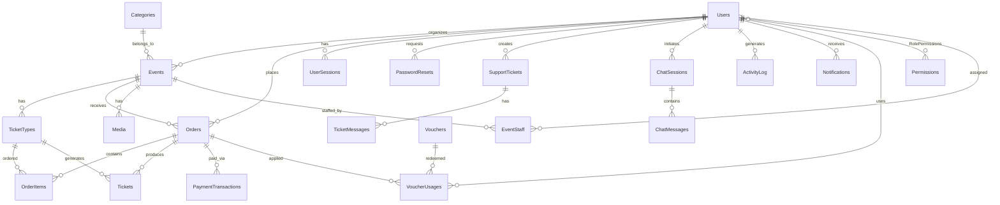

<p align="center">
  
  
  
  
</p>

<h1 align="center">🎫 Ticketbox — Nền tảng Mua Bán Vé Sự kiện</h1>

<p align="center">
  <b>Đồ án môn PRJ301 — Web Application Development with Java</b><br/>
  Học kỳ Spring 2026 · FPT University
</p>

---

## 📋 Thông tin dự án

| Mục | Chi tiết |
|-----|----------|
| **Tên dự án** | Ticketbox — Online Ticket Selling Platform |
| **Môn học** | PRJ301 — Web Application Development with Java |
| **Nhóm** | **Nhóm 7** |
| **Giảng viên** | *(ghi tên GV tại đây)* |
| **Trường** | FPT University |

### 👥 Thành viên Nhóm 7

| MSSV | Họ và tên | Vai trò |
|------|-----------|---------|
| **HE191087** | **Dương Minh Hoàng** | Team Leader · Full-stack Developer |
| **HE194923** | **Nguyễn Tấn Dũng** | Backend Developer · Database |
| **HE191292** | **Doãn Thu Hằng** | Frontend Developer · UI/UX |

---

## 🏗️ Kiến trúc hệ thống

### Tổng quan MVC Architecture

```
┌─────────────────────────────────────────────────────────┐
│                    CLIENT (Browser)                      │
│  JSP Views + Bootstrap 5 + AJAX + i18n (VI/EN/JA)      │
└────────────────────────┬────────────────────────────────┘
                         │ HTTP Request/Response
┌────────────────────────▼────────────────────────────────┐
│              FILTER CHAIN (7 Filters)                    │
│  SecurityHeaders → CSRF → Auth → Cache → Access Control │
└────────────────────────┬────────────────────────────────┘
                         │
┌────────────────────────▼────────────────────────────────┐
│              CONTROLLER LAYER (60 Servlets)              │
│  ┌──────────┐ ┌───────────┐ ┌──────────┐ ┌───────────┐ │
│  │  Public   │ │   Admin   │ │Organizer │ │   Staff   │ │
│  │(19 servs) │ │(13 ctrls) │ │(10 ctrls)│ │ (3 ctrls) │ │
│  └─────┬────┘ └─────┬─────┘ └────┬─────┘ └─────┬─────┘ │
│        │             │            │              │       │
│  ┌─────▼─────────────▼────────────▼──────────────▼─────┐│
│  │           API LAYER (15 REST Endpoints)              ││
│  └─────────────────────┬───────────────────────────────┘│
└────────────────────────┬────────────────────────────────┘
                         │
┌────────────────────────▼────────────────────────────────┐
│              SERVICE LAYER (20 Services)                  │
│  Auth · Event · Order · Ticket · Chat · Payment · ...    │
│  ┌─────────────────────────────────────────────────────┐│
│  │          Payment Subsystem (Factory Pattern)         ││
│  │    PaymentFactory → BankTransfer / SeepayProvider    ││
│  └─────────────────────────────────────────────────────┘│
└────────────────────────┬────────────────────────────────┘
                         │
┌────────────────────────▼────────────────────────────────┐
│               DAO LAYER (18 Data Access Objects)         │
│  BaseDAO (abstract) → UserDAO, EventDAO, OrderDAO, ...   │
└────────────────────────┬────────────────────────────────┘
                         │ JDBC
┌────────────────────────▼────────────────────────────────┐
│         SQL SERVER DATABASE (24 Tables)                   │
│  Users · Events · Orders · Tickets · Chat · Vouchers ... │
└─────────────────────────────────────────────────────────┘
```

### Package Structure

```
src/java/com/sellingticket/
├── controller/               # 60 Servlet controllers
│   ├── (19 public servlets)  # Home, Events, Login, Register, Checkout...
│   ├── admin/                # 13 admin controllers
│   ├── organizer/            # 10 organizer controllers
│   ├── staff/                # 3 staff controllers
│   └── api/                  # 15 REST API endpoints
├── service/                  # 20 Business logic services
│   └── payment/              # Payment subsystem (Factory Pattern)
├── dao/                      # 18 Data Access Objects (JDBC)
├── model/                    # 17 Entity models (POJO)
├── filter/                   # 7 Servlet filters
└── util/                     # 12 Utility classes

src/webapp/
├── assets/
│   ├── css/                  # main.css, navbar.css
│   ├── js/                   # 6 JS modules (AJAX, i18n, animations...)
│   └── i18n/                 # 3 locales: vi.json, en.json, ja.json
├── admin/                    # 17 admin JSP pages
├── organizer/                # 12 organizer JSP pages
├── staff/                    # 5 staff JSP pages
├── WEB-INF/web.xml           # Jakarta EE 6.0 config
└── (30+ public JSP pages)    # home, events, checkout, profile...
```

---

## 🚀 Tính năng chính

### 🎯 Customer (Khách hàng)
| # | Tính năng | Mô tả |
|---|-----------|-------|
| 1 | **Trang chủ** | Hero banner, stats animated counter, trending/featured/upcoming events |
| 2 | **Tìm kiếm & Lọc** | AJAX real-time search, lọc theo danh mục/ngày/giá/sắp xếp |
| 3 | **Chi tiết sự kiện** | Countdown timer, chọn loại vé, terms modal, similar events |
| 4 | **Đặt vé & Checkout** | Multi-step checkout (chọn vé → thông tin → thanh toán) |
| 5 | **Thanh toán QR** | VietQR integration via SeePay, auto-verify webhook |
| 6 | **Mã giảm giá** | Voucher validation, discount calculation real-time |
| 7 | **Vé điện tử** | QR code e-ticket, download, anti-fraud watermark |
| 8 | **Quản lý vé** | Xem đơn hàng, trạng thái vé, lịch sử mua |
| 9 | **Hồ sơ cá nhân** | Cập nhật thông tin, đổi mật khẩu, avatar (Cloudinary) |
| 10 | **Chat hỗ trợ** | Real-time chat với tư vấn viên (polling-based) |
| 11 | **Đa ngôn ngữ** | Tiếng Việt, English, 日本語 (i18n client-side) |
| 12 | **Google OAuth** | Đăng nhập/Đăng ký bằng Google |
| 13 | **Thông báo** | Notification center cho đơn hàng, sự kiện |

### 🏢 Organizer (Nhà tổ chức)
| # | Tính năng | Mô tả |
|---|-----------|-------|
| 1 | **Dashboard** | Doanh thu, vé bán, biểu đồ thống kê |
| 2 | **Quản lý sự kiện** | Tạo, sửa, xóa mềm sự kiện + upload ảnh |
| 3 | **Quản lý vé** | Tạo loại vé, giá, số lượng, thời gian bán |
| 4 | **Quản lý đơn hàng** | Xem đơn hàng, xác nhận thanh toán manual |
| 5 | **Check-in** | Quét QR check-in tại sự kiện |
| 6 | **Thống kê chi tiết** | Doanh thu theo ngày/tháng, loại vé, biểu đồ |
| 7 | **Quản lý staff** | Thêm/xóa nhân viên cho sự kiện |
| 8 | **Chat hỗ trợ** | Trả lời chat từ khách hàng |
| 9 | **Support tickets** | Gửi/phản hồi yêu cầu hỗ trợ đến Admin |

### 🛡️ Admin (Quản trị viên)
| # | Tính năng | Mô tả |
|---|-----------|-------|
| 1 | **Dashboard** | Tổng quan hệ thống: users, events, revenue charts |
| 2 | **Duyệt sự kiện** | Approve/Reject sự kiện từ organizer |
| 3 | **Quản lý người dùng** | CRUD users, phân quyền, ban/unban |
| 4 | **Quản lý danh mục** | CRUD categories sự kiện |
| 5 | **Quản lý đơn hàng** | Xem tất cả đơn, confirm payment thủ công |
| 6 | **Voucher hệ thống** | Tạo/quản lý mã giảm giá toàn hệ thống |
| 7 | **Báo cáo** | Revenue reports, event analytics |
| 8 | **Chat dashboard** | Monitor & respond chat sessions |
| 9 | **Support tickets** | Quản lý tất cả yêu cầu hỗ trợ |
| 10 | **Activity log** | Audit trail mọi hành động hệ thống |
| 11 | **Thông báo** | Gửi thông báo đến users |
| 12 | **Cài đặt hệ thống** | Site settings, cấu hình chung |

### 👷 Staff (Nhân viên sự kiện)
| # | Tính năng | Mô tả |
|---|-----------|-------|
| 1 | **Dashboard** | Thống kê sự kiện được phân công |
| 2 | **Check-in** | Quét QR xác thực vé tại sự kiện |
| 3 | **Danh sách vé** | Xem danh sách attendee |

---

## 💻 Tech Stack

### Backend
| Công nghệ | Version | Mục đích |
|-----------|---------|----------|
| **Java** | 17+ | Ngôn ngữ chính |
| **Jakarta EE** | 6.0 | Servlet API, JSP |
| **Apache Tomcat** | 10.x | Application Server |
| **JDBC** | — | Database connectivity |
| **JSTL** | 3.0 | JSP tag library |
| **Jackson** | 2.x | JSON processing |
| **Google OAuth** | 2.0 | Social login |
| **JWT (jsonwebtoken)** | — | Token-based auth |
| **Cloudinary** | — | Image upload & CDN |
| **BCrypt** | — | Password hashing |

### Frontend
| Công nghệ | Version | Mục đích |
|-----------|---------|----------|
| **JSP** | — | Server-side rendering |
| **Bootstrap** | 5.3 | Responsive UI framework |
| **Font Awesome** | 6.x | Icon library |
| **Vanilla JS** | ES6+ | Client-side logic |
| **AJAX** | Fetch API | Async data fetching |
| **CSS3** | — | Custom styling, animations |
| **Chart.js** | — | Dashboard charts |

### Database & Infrastructure
| Công nghệ | Mục đích |
|-----------|----------|
| **SQL Server** 2019+ | Primary database |
| **SeePay** | Payment gateway (VietQR) |
| **Cloudinary** | Media storage & CDN |

---

## 🗄️ Cơ sở dữ liệu

### ER Diagram — 24 Bảng



### Chi tiết 24 Bảng

| # | Bảng | Mô tả | Cột chính | Seed Data |
|---|------|-------|-----------|-----------|
| 1 | **Users** | Tài khoản (admin/organizer/customer/staff) | user_id, email, role, password_hash | 16 users |
| 2 | **Categories** | Danh mục sự kiện | category_id, name, icon, color | 8 categories |
| 3 | **Media** | Ảnh/video sự kiện (Cloudinary) | media_id, event_id, url, type | 22 media |
| 4 | **Events** | Sự kiện (approved/pending/draft/rejected) | event_id, title, status, organizer_id | 28 events |
| 5 | **TicketTypes** | Loại vé (VIP, Standard, ...) | ticket_type_id, price, quantity, sold_quantity | 65 types |
| 6 | **Orders** | Đơn hàng (paid/pending/cancelled/refunded) | order_id, order_code, final_amount, status | 35 orders |
| 7 | **OrderItems** | Chi tiết đơn hàng | item_id, order_id, ticket_type_id, quantity | 55 items |
| 8 | **Tickets** | Vé điện tử (QR code) | ticket_id, qr_code, check_in_status | 72 tickets |
| 9 | **PaymentTransactions** | Giao dịch thanh toán | transaction_id, payment_ref, status | 30 txns |
| 10 | **SeepayWebhookDedup** | Chống duplicate webhook | id, transaction_ref | — |
| 11 | **Vouchers** | Mã giảm giá | voucher_id, code, discount_type, value | 8 vouchers |
| 12 | **VoucherUsages** | Lịch sử dùng voucher | usage_id, voucher_id, user_id | 5 usages |
| 13 | **UserSessions** | Phiên đăng nhập (JWT) | session_id, refresh_token, expires_at | — |
| 14 | **PasswordResets** | Token reset mật khẩu | id, token, expires_at | — |
| 15 | **Permissions** | Quyền hệ thống | permission_id, permission_key | 20 perms |
| 16 | **RolePermissions** | Gán quyền theo role | role, permission_id | 52 mappings |
| 17 | **EventStaff** | Nhân viên sự kiện | id, event_id, user_id, role | 5 staff |
| 18 | **SupportTickets** | Yêu cầu hỗ trợ | ticket_id, subject, status, priority | 6 tickets |
| 19 | **TicketMessages** | Tin nhắn trong support ticket | message_id, ticket_id, content | 14 msgs |
| 20 | **ChatSessions** | Phiên chat live | session_id, status | 3 sessions |
| 21 | **ChatMessages** | Tin nhắn chat | message_id, session_id, content | 10 msgs |
| 22 | **SiteSettings** | Cài đặt hệ thống | setting_key, setting_value | 10 settings |
| 23 | **ActivityLog** | Nhật ký hoạt động | log_id, action, entity_type | 15 logs |
| 24 | **Notifications** | Thông báo người dùng | notification_id, type, message | 12 notifs |

---

## 🔐 Bảo mật

| Cơ chế | Chi tiết |
|--------|----------|
| **Password Hashing** | BCrypt (cost factor 12) |
| **CSRF Protection** | Token-based CSRF filter trên mọi form POST |
| **Security Headers** | X-Frame-Options, X-Content-Type-Options, CSP, Referrer-Policy |
| **Input Validation** | Server-side validation (InputValidator + ValidationUtil) |
| **SQL Injection** | PreparedStatement 100% — không dùng string concatenation |
| **XSS Prevention** | JSTL `<c:out>` encoding + CSP headers |
| **Auth Filter** | Role-based access control trên mọi protected URL |
| **JWT Tokens** | Refresh token rotation cho remember-me |
| **Google OAuth 2.0** | Social login an toàn |
| **Access Filters** | OrganizerAccessFilter, StaffAccessFilter, ProtectedJspAccessFilter |

---

## 🔍 Hệ thống Tìm kiếm

### Search Architecture

```
User Input → AJAX Request (ajax-cards.js)
                │
                ▼
    Servlet (EventsServlet / OrganizerEventController)
                │
                ▼
    EventService → EventDAO (SQL LIKE + filters)
                │
                ▼
    JSON Response → Client-side Render (card template)
```

### Search Features
- **Real-time AJAX search** — Không reload trang, debounced input
- **Multi-parameter filtering** — Keyword (`?q=`), category, date range, price range
- **Sorting** — Theo ngày, mới nhất, phổ biến, giá tăng/giảm
- **Pagination** — Server-side pagination với PageResult
- **Homepage search** — Redirect từ hero search form → `/events?q=...`
- **My Tickets search** — AJAX search trong danh sách vé
- **Organizer search** — AJAX search trong quản lý sự kiện
- **Admin search** — Search trong users, events, orders

---

## 💳 Hệ thống Thanh toán

### Payment Flow

```
1. Customer chọn vé → Checkout form
2. Validate voucher (optional) → API /api/voucher/validate
3. Tạo Order (status=pending) + Generate QR
4. Hiển thị QR VietQR cho customer
5. Customer quét QR → Chuyển khoản ngân hàng
6. SeePay webhook → /api/seepay-webhook
7. Verify webhook (dedup + amount check)
8. Order status → paid, Tickets generated
9. Redirect → Order Confirmation page
```

### Payment Components
| Component | File | Mô tả |
|-----------|------|-------|
| `PaymentFactory` | `service/payment/` | Factory Pattern tạo payment provider |
| `SeepayProvider` | `service/payment/` | SeePay VietQR integration |
| `BankTransferProvider` | `service/payment/` | Manual bank transfer |
| `SeepayWebhookServlet` | `controller/api/` | Webhook receiver & verifier |
| `SeepayWebhookDedupDAO` | `dao/` | Chống duplicate webhook |
| `PaymentStatusServlet` | `controller/api/` | Polling payment status |

---

## 🌐 Đa ngôn ngữ (i18n)

| Ngôn ngữ | File | Keys |
|----------|------|------|
| 🇻🇳 Tiếng Việt | `assets/i18n/vi.json` | 370+ keys |
| 🇺🇸 English | `assets/i18n/en.json` | 370+ keys |
| 🇯🇵 日本語 | `assets/i18n/ja.json` | 370+ keys |

**Cơ chế:** Client-side i18n via `i18n.js` — detect `data-i18n` attributes, load JSON, replace text. Lưu preference vào `localStorage`.

---

## 📊 API Endpoints

### Public APIs

| Method | Endpoint | Mô tả |
|--------|----------|-------|
| `GET` | `/api/events` | Danh sách sự kiện (search, filter, pagination) |
| `GET` | `/api/events/{id}` | Chi tiết sự kiện |
| `POST` | `/api/voucher/validate` | Validate mã giảm giá |
| `GET` | `/api/payment-status` | Kiểm tra trạng thái thanh toán |
| `POST` | `/api/seepay-webhook` | SeePay payment callback |
| `GET` | `/api/email-check` | Kiểm tra email đã tồn tại |

### Authenticated APIs

| Method | Endpoint | Mô tả |
|--------|----------|-------|
| `GET` | `/api/my-tickets` | Vé của user |
| `GET` | `/api/my-orders` | Đơn hàng của user |
| `GET/POST` | `/api/chat` | Chat messages |
| `POST` | `/api/upload` | Upload file (Cloudinary) |

### Admin APIs

| Method | Endpoint | Mô tả |
|--------|----------|-------|
| `GET/PUT` | `/api/admin/events` | Admin event management |
| `POST` | `/api/admin/events/feature` | Toggle featured event |
| `GET/PUT` | `/api/admin/orders` | Admin order management |
| `POST` | `/api/admin/confirm-payment` | Xác nhận thanh toán thủ công |
| `GET/PUT/DELETE` | `/api/admin/users` | Admin user management |

### Organizer APIs

| Method | Endpoint | Mô tả |
|--------|----------|-------|
| `GET/POST/PUT/DELETE` | `/api/organizer/events` | CRUD sự kiện của organizer |

---

## 🛠️ Cài đặt & Chạy

### Prerequisites

| Tool | Version | Download |
|------|---------|----------|
| **JDK** | 17+ | [Oracle](https://www.oracle.com/java/technologies/downloads/) / [OpenJDK](https://adoptium.net/) |
| **Apache Tomcat** | 10.x | [tomcat.apache.org](https://tomcat.apache.org/) |
| **SQL Server** | 2019+ | [Microsoft](https://www.microsoft.com/en-us/sql-server/sql-server-downloads) |
| **IDE** | NetBeans 19+ / IntelliJ | Recommended |
| **Git** | 2.x | [git-scm.com](https://git-scm.com/) |

### 1. Clone Repository

```bash
git clone https://github.com/dghoang/PRJ301_GROUP4_SELLING_TICKET.git
cd PRJ301_GROUP4_SELLING_TICKET
```

### 2. Cấu hình Database

**Option A: Schema only (tạo bảng trống)**
```sql
-- Mở SQL Server Management Studio
-- Tạo database mới: TicketBoxDB
-- Chạy file:
database/schema/ticketbox_schema.sql
```

**Option B: Full reset + Seed data (khuyên dùng cho demo)**
```sql
-- File này DROP + CREATE lại toàn bộ 24 bảng
-- Kèm 460+ dòng INSERT realistic data
database/schema/full_reset_seed.sql
```

### 3. Cấu hình Connection String

Mở file `src/java/com/sellingticket/util/DBContext.java` và cập nhật:

```java
private static final String URL = "jdbc:sqlserver://localhost:1433;databaseName=TicketBoxDB;encrypt=true;trustServerCertificate=true";
private static final String USER = "sa";
private static final String PASSWORD = "your_password";
```

### 4. Cấu hình External Services (Optional)

| Service | File cấu hình | Biến môi trường |
|---------|---------------|-----------------|
| **Cloudinary** | `CloudinaryUtil.java` | `CLOUDINARY_URL` |
| **Google OAuth** | `GoogleOAuthServlet.java` | `GOOGLE_CLIENT_ID`, `GOOGLE_CLIENT_SECRET` |
| **SeePay** | `SeepayProvider.java` | `SEEPAY_API_KEY` |
| **JWT** | `JwtUtil.java` | `JWT_SECRET` |

### 5. Build & Deploy

```bash
# Với NetBeans:
# 1. Mở project → Clean and Build
# 2. Run on Tomcat 10.x
# 3. Truy cập: http://localhost:8080/SellingTicketJava/

# Với Maven (nếu có):
mvn clean package
# Deploy WAR file lên Tomcat
```

### 6. Tài khoản Demo

| Role | Email | Password |
|------|-------|----------|
| **Admin** | `admin@ticketbox.vn` | `Admin@123` |
| **Organizer** | `organizer@ticketbox.vn` | `Org@12345` |
| **Customer** | `customer@ticketbox.vn` | `Cust@1234` |
| **Staff** | `staff@ticketbox.vn` | `Staff@123` |

---

## 📁 Cấu trúc thư mục

```
PRJ301_GROUP4_SELLING_TICKET/
├── SellingTicketJava/
│   ├── database/
│   │   └── schema/
│   │       ├── ticketbox_schema.sql     # DDL only (24 tables + indexes)
│   │       └── full_reset_seed.sql      # DDL + 460+ rows seed data
│   ├── src/
│   │   ├── java/com/sellingticket/
│   │   │   ├── controller/              # 60 Servlet controllers
│   │   │   │   ├── admin/               #   13 admin controllers
│   │   │   │   ├── organizer/           #   10 organizer controllers
│   │   │   │   ├── staff/               #   3 staff controllers
│   │   │   │   └── api/                 #   15 REST API servlets
│   │   │   ├── service/                 # 20 Business services
│   │   │   │   └── payment/             #   Payment subsystem
│   │   │   ├── dao/                     # 18 DAOs (JDBC)
│   │   │   ├── model/                   # 17 Entity models
│   │   │   ├── filter/                  # 7 Security/cache filters
│   │   │   └── util/                    # 12 Utilities
│   │   └── webapp/
│   │       ├── assets/
│   │       │   ├── css/                 # main.css, navbar.css
│   │       │   ├── js/                  # 6 JS modules
│   │       │   └── i18n/               # vi.json, en.json, ja.json
│   │       ├── admin/                   # 17 admin JSP views
│   │       ├── organizer/               # 12 organizer JSP views
│   │       ├── staff/                   # 5 staff JSP views
│   │       ├── WEB-INF/web.xml          # Jakarta EE 6.0 config
│   │       └── *.jsp                    # 30+ public pages
│   └── docs/                            # Tài liệu UML diagrams
└── README.md                            # ← Bạn đang đọc file này
```

---

## 🎨 Frontend Components

### JavaScript Modules

| Module | File | Chức năng |
|--------|------|-----------|
| **AJAX Cards** | `ajax-cards.js` | Lazy-load, search, filter, render event cards |
| **AJAX Table** | `ajax-table.js` | Admin data tables with AJAX pagination |
| **i18n** | `i18n.js` | Multi-language support (VI/EN/JA) |
| **Animations** | `animations.js` | Scroll animations, counter, stagger effects |
| **Navbar** | `navbar.js` | Sticky navbar, mobile menu, scroll behavior |
| **Toast** | `toast.js` | Notification toasts (success/error/warning) |

### CSS Architecture
- **`main.css`** — Design system: CSS variables, components, utilities, responsive
- **`navbar.css`** — Navigation styles, mobile hamburger menu
- **Bootstrap 5.3** — Grid, forms, modals, cards, badges
- **Inline JSP styles** — Page-specific styles embedded in JSP

---

## 📐 Design Patterns

| Pattern | Áp dụng |
|---------|---------|
| **MVC** | Controller (Servlet) → Service → DAO → Model → View (JSP) |
| **DAO Pattern** | BaseDAO abstract class, mỗi entity có dedicated DAO |
| **Service Layer** | Business logic tách biệt khỏi controller |
| **Factory Pattern** | PaymentFactory tạo PaymentProvider theo loại |
| **Filter Chain** | 7 filters xử lý security, caching, access control |
| **Repository Pattern** | DAO layer đóng gói JDBC queries |
| **Template Pattern** | BaseDAO cung cấp connection management chung |

---

## 📈 Seed Data Statistics

Khi chạy `full_reset_seed.sql`:

| Entity | Số lượng | Chi tiết |
|--------|----------|----------|
| **Users** | 16 | 1 admin, 3 organizers, 8 customers, 3 staff, 1 inactive |
| **Categories** | 8 | Âm nhạc, Thể thao, Workshop, Ẩm thực, Nghệ thuật, Công nghệ, Giải trí, Kinh doanh |
| **Events** | 28 | 20 approved, 4 pending, 2 draft, 1 rejected, 1 past |
| **Ticket Types** | 65 | 2-4 loại mỗi event, giá 0đ → 6.000.000đ |
| **Orders** | 35 | 25 paid, 3 pending, 4 cancelled, 3 refunded |
| **Tickets** | 72 | QR codes, check-in tracking |
| **Vouchers** | 8 | %, fixed amount, max usage, expiry |
| **Total Tickets Sold** | **~35.300+** | SUM(sold_quantity) từ TicketTypes |

---

## 🧪 Testing

### Manual Testing
- Đăng nhập/Đăng ký với 4 roles
- Tìm kiếm sự kiện, filter, sorting
- Flow mua vé: chọn vé → checkout → thanh toán QR
- Admin: duyệt event, quản lý user, báo cáo
- Organizer: tạo event, check-in, thống kê
- Đa ngôn ngữ: chuyển VI/EN/JA

### Account Testing Matrix

| Test Scenario | Account | Expected |
|--------------|---------|----------|
| Admin Dashboard | `admin@ticketbox.vn` | Full system access |
| Event Creation | `organizer@ticketbox.vn` | Create + manage events |
| Buy Ticket Flow | `customer@ticketbox.vn` | Search → Buy → E-ticket |
| Check-in | `staff@ticketbox.vn` | QR scan at event |
| Google Login | Any Google account | OAuth flow |

---

## 📄 License

Dự án này được phát triển cho mục đích học tập tại **FPT University**, môn **PRJ301**.

© 2026 Nhóm 7 — Dương Minh Hoàng, Nguyễn Tấn Dũng, Doãn Thu Hằng

---

<p align="center">
  <i>Built with ❤️ by <b>Nhóm 7</b> — FPT University Spring 2026</i>
</p>
