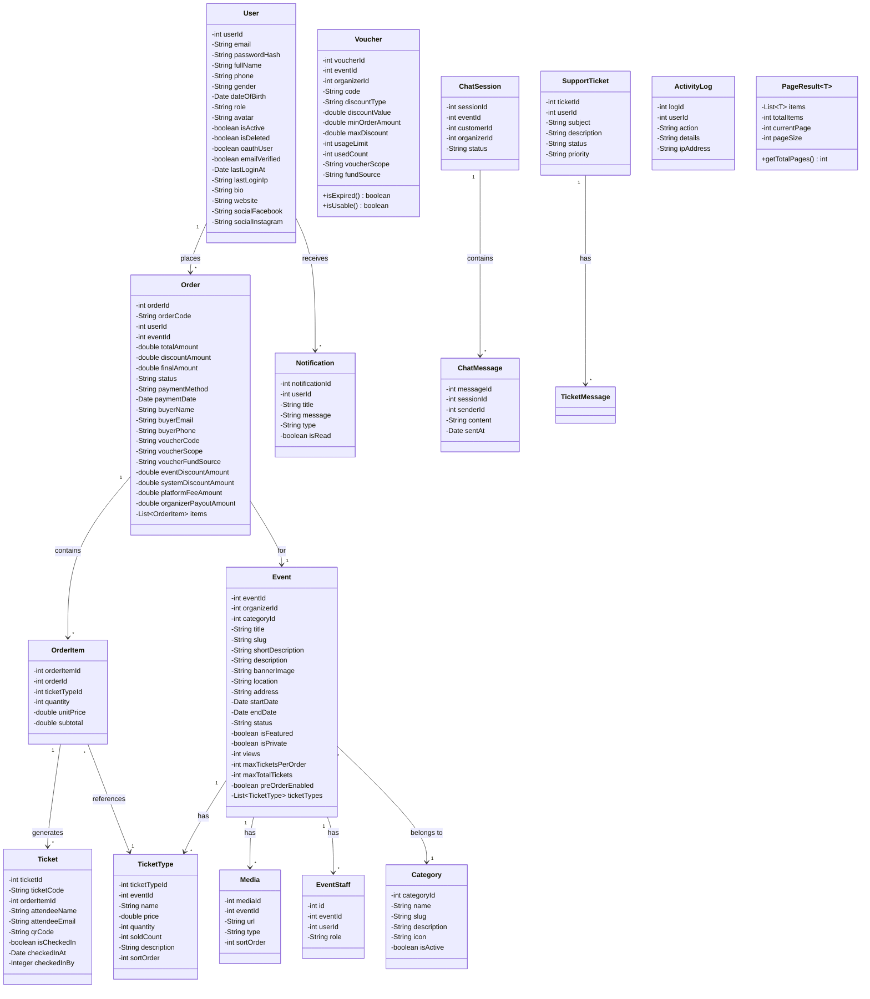
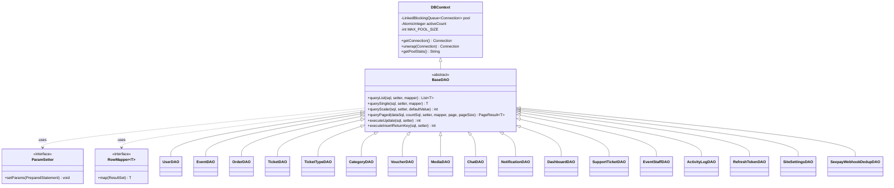
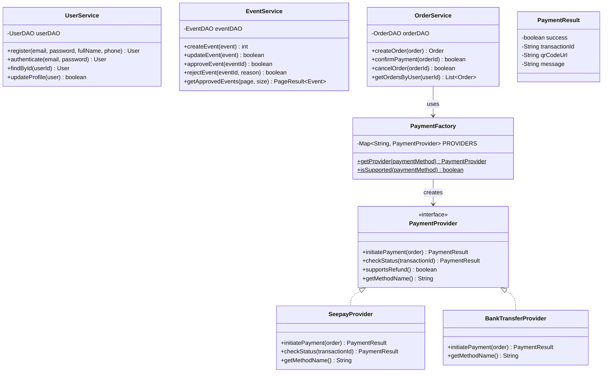
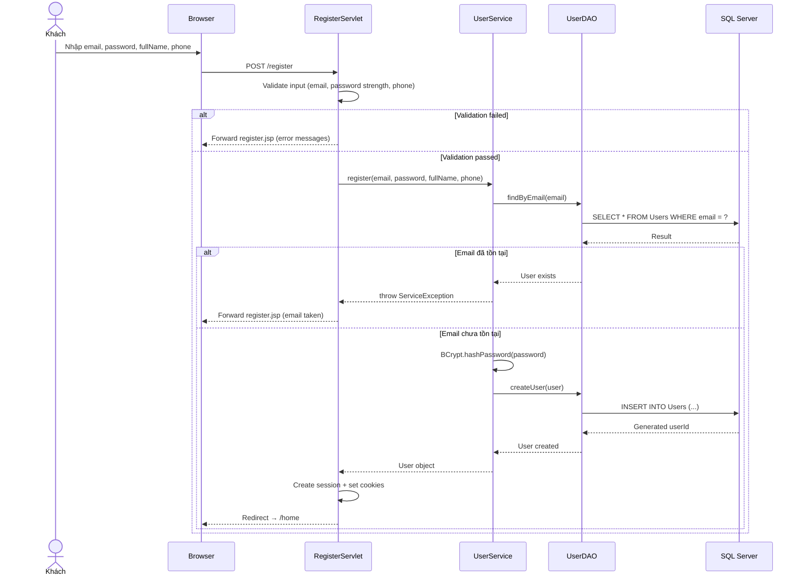
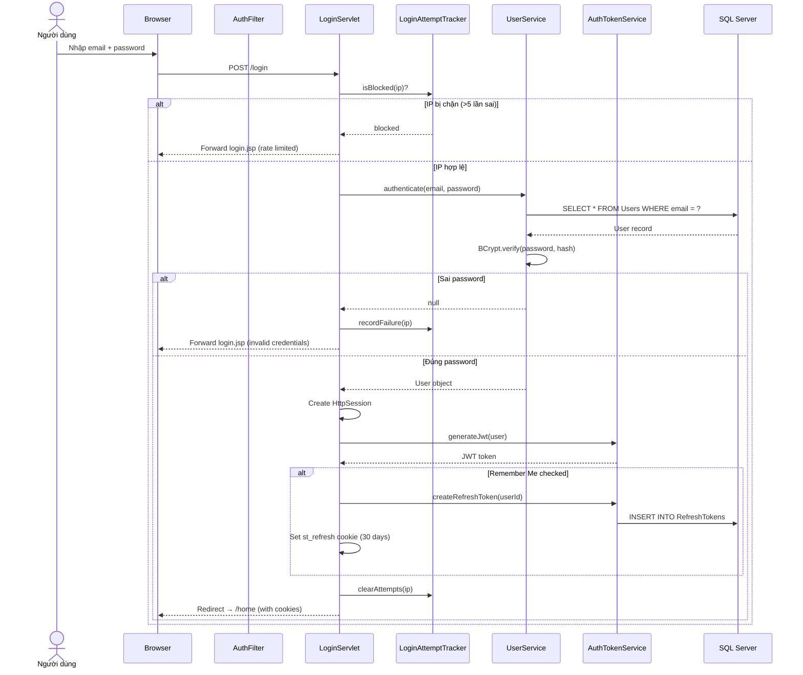
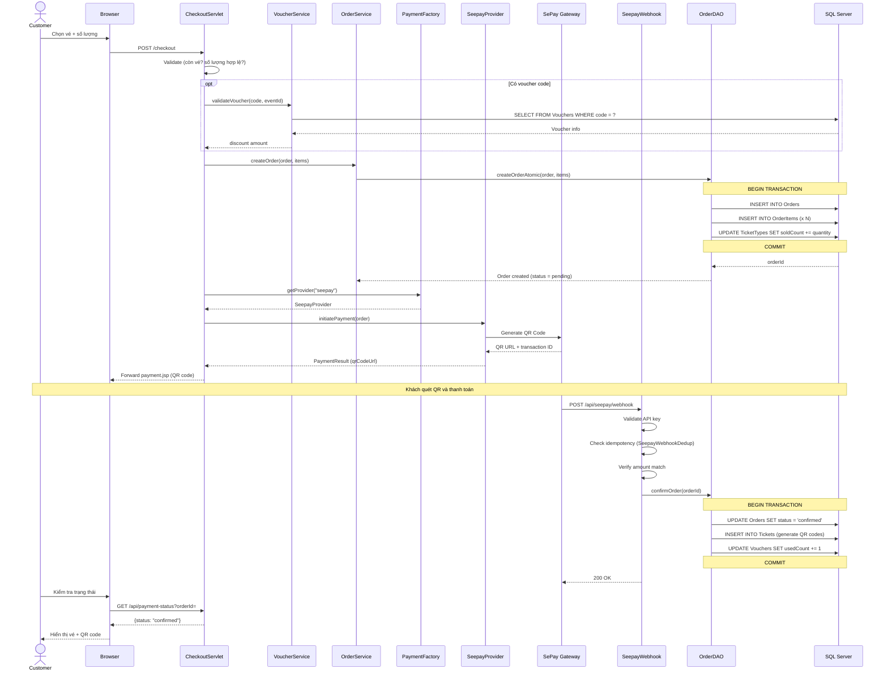
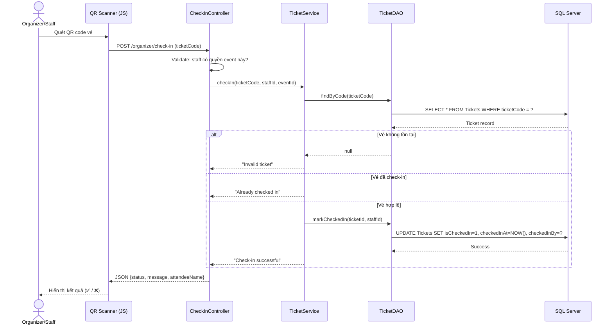
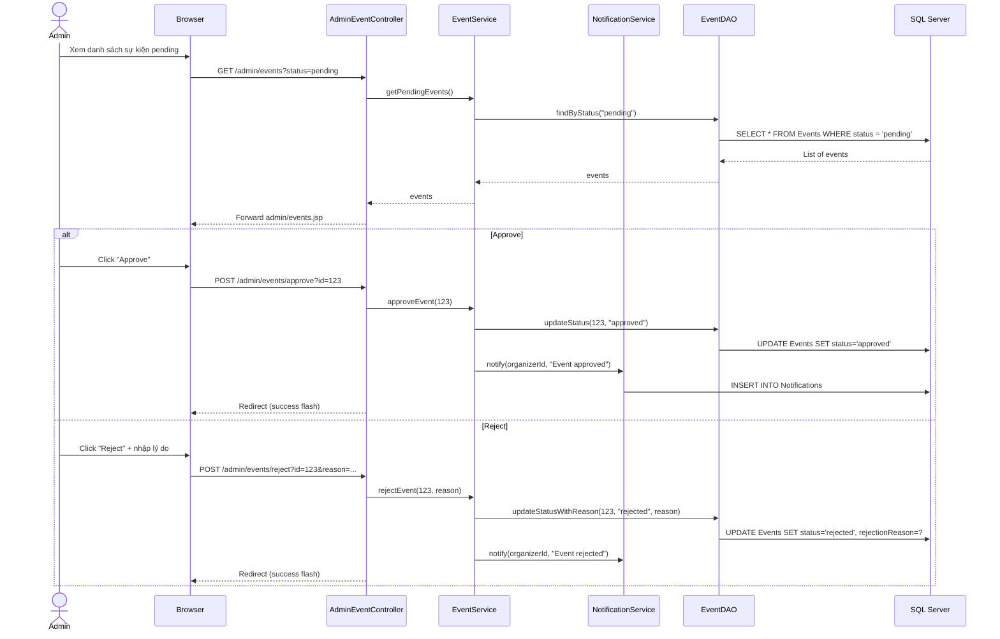

# CHƯƠNG 3: THIẾT KẾ HỆ THỐNG

## 3.1. Kiến trúc tổng quan (System Architecture)

### 3.1.1. Mô hình kiến trúc phân tầng (Layered Architecture)

Hệ thống Ticketbox được thiết kế theo **kiến trúc phân tầng 4 lớp** (Four‑Tier Layered Architecture), tuân thủ nguyên tắc **Separation of Concerns** – mỗi tầng chỉ phụ trách một nhiệm vụ duy nhất và giao tiếp qua interface rõ ràng.

```
┌──────────────────────────────────────────────────────────┐
│                   PRESENTATION LAYER                      │
│  ┌─────────────┐  ┌─────────────┐  ┌─────────────┐      │
│  │  Browser     │  │  Mobile     │  │  REST API   │      │
│  │  (JSP/JSTL)  │  │  Browser   │  │  Clients    │      │
│  └──────┬───────┘  └──────┬──────┘  └──────┬──────┘      │
└─────────┼─────────────────┼────────────────┼─────────────┘
          │                 │                │
          ▼                 ▼                ▼
┌──────────────────────────────────────────────────────────┐
│              APPLICATION SERVER (Tomcat 9)                │
│                                                          │
│  ┌────────────────────────────────────────────────────┐  │
│  │              FILTER CHAIN (7 Filters)              │  │
│  │  SecurityHeaders → CSRF → Auth → Cache →           │  │
│  │  OrganizerAccess → StaffAccess → ProtectedJsp      │  │
│  └────────────────────────────────────────────────────┘  │
│                                                          │
│  ┌────────────────────────────────────────────────────┐  │
│  │           CONTROLLER LAYER (60 Servlets)           │  │
│  │  ┌──────────┐ ┌──────────┐ ┌──────────┐          │  │
│  │  │ Public   │ │ Admin    │ │ API      │          │  │
│  │  │ (19)     │ │ (13)     │ │ (15)     │          │  │
│  │  ├──────────┤ ├──────────┤ ├──────────┤          │  │
│  │  │Organizer │ │ Staff    │ │          │          │  │
│  │  │ (11)     │ │ (2)      │ │          │          │  │
│  │  └──────────┘ └──────────┘ └──────────┘          │  │
│  └────────────────────────────────────────────────────┘  │
│                                                          │
│  ┌────────────────────────────────────────────────────┐  │
│  │           SERVICE LAYER (15 Services)              │  │
│  │  Core: UserService, EventService, OrderService     │  │
│  │  Payment: PaymentFactory → Strategy Pattern        │  │
│  │  Support: ChatService, VoucherService, etc.        │  │
│  └────────────────────────────────────────────────────┘  │
│                                                          │
│  ┌────────────────────────────────────────────────────┐  │
│  │        DATA ACCESS LAYER (18 DAOs + BaseDAO)       │  │
│  │  BaseDAO: Template Method + Functional Interface   │  │
│  │  JDBC + PreparedStatement (SQL Injection-safe)     │  │
│  └────────────────────────────────────────────────────┘  │
└──────────────────────┬───────────────────────────────────┘
                       │
                       ▼
┌──────────────────────────────────────────────────────────┐
│                INFRASTRUCTURE LAYER                       │
│  ┌──────────┐ ┌──────────┐ ┌──────────┐ ┌────────────┐ │
│  │SQL Server│ │  SePay   │ │Cloudinary│ │Google OAuth│ │
│  │ Database │ │  API     │ │  CDN     │ │  2.0       │ │
│  └──────────┘ └──────────┘ └──────────┘ └────────────┘ │
└──────────────────────────────────────────────────────────┘
```

**Bảng 3.1 – Mô tả các tầng kiến trúc:**

| Tầng | Vai trò | Thành phần chính |
|------|---------|------------------|
| **Presentation** | Hiển thị giao diện, tương tác người dùng | 64+ JSP pages, HTML5, CSS3, JavaScript |
| **Controller** | Tiếp nhận request, điều hướng, validate input | 60 Servlet classes (5 sub-packages) |
| **Service** | Xử lý logic nghiệp vụ, tính toán, validation phức tạp | 15 Service + 5 Payment classes |
| **Data Access** | Truy vấn CSDL, mapping dữ liệu | 18 DAO classes kế thừa BaseDAO |
| **Infrastructure** | Hạ tầng bên ngoài: DB, Payment, Storage, Auth | SQL Server, SePay, Cloudinary, Google OAuth |

### 3.1.2. Luồng xử lý Request tổng quát

```
Client Request
    │
    ▼
┌─────────────────────────────┐
│   SecurityHeadersFilter     │ → X-Frame-Options, CSP, HSTS
│   CsrfFilter               │ → Double-submit CSRF token
│   AuthFilter                │ → Session + JWT + Refresh Token
│   CacheFilter               │ → Cache-Control headers
│   OrganizerAccessFilter     │ → Role = organizer check
│   StaffAccessFilter         │ → Role = staff check
│   ProtectedJspAccessFilter  │ → Block direct .jsp access
└──────────────┬──────────────┘
               ▼
┌─────────────────────────────┐
│   Controller (Servlet)      │ → Parse params, call Service
└──────────────┬──────────────┘
               ▼
┌─────────────────────────────┐
│   Service Layer             │ → Business logic, validation
└──────────────┬──────────────┘
               ▼
┌─────────────────────────────┐
│   DAO Layer                 │ → SQL query via BaseDAO
└──────────────┬──────────────┘
               ▼
┌─────────────────────────────┐
│   Database (SQL Server)     │ → Execute & return ResultSet
└─────────────────────────────┘
```

---

## 3.2. Kiến trúc MVC (Model–View–Controller)

Dự án áp dụng nghiêm ngặt **MVC Pattern** theo chuẩn Java EE, với sự phân tách rõ ràng giữa ba thành phần:

### 3.2.1. Ánh xạ MVC trong dự án

| Thành phần | Vai trò | Package / Vị trí | Số lượng |
|------------|---------|-------------------|----------|
| **Model** | Entity classes – đại diện bảng CSDL, chứa thuộc tính + getter/setter | `com.sellingticket.model` | 17 classes |
| **View** | JSP pages – hiển thị dữ liệu, form, layout | `src/webapp/**/*.jsp` | 64+ pages |
| **Controller** | Servlet classes – nhận request, gọi Service, forward tới View | `com.sellingticket.controller.*` | 60 Servlets |

### 3.2.2. Sơ đồ MVC tổng quát

```
                    ┌─────────────────┐
     HTTP Request   │                 │   HTTP Response
    ───────────────►│   Controller    │◄───────────────
                    │   (Servlet)     │   (forward JSP)
                    └───────┬─────────┘
                            │
               ┌────────────┼────────────┐
               ▼                         ▼
    ┌──────────────────┐     ┌──────────────────┐
    │     Service      │     │      View        │
    │  (Business Logic)│     │    (JSP/JSTL)    │
    └────────┬─────────┘     └──────────────────┘
             │                        ▲
             ▼                        │
    ┌──────────────────┐              │
    │       DAO        │              │
    │  (Data Access)   │    Model objects passed
    └────────┬─────────┘    via request attributes
             │
             ▼
    ┌──────────────────┐
    │   SQL Server DB  │
    └──────────────────┘
```

### 3.2.3. Quy ước luồng dữ liệu MVC

1. **Controller** nhận HTTP request → parse parameters, validate cơ bản
2. **Controller** gọi **Service** để xử lý business logic
3. **Service** gọi **DAO** để đọc/ghi dữ liệu
4. **DAO** trả về **Model** objects (Entity classes)
5. **Controller** set Model objects vào `request.setAttribute()`
6. **Controller** forward tới **View** (JSP) để render HTML

---

## 3.3. Sơ đồ lớp (Class Diagram)

### 3.3.1. Package `model` — 17 Entity Classes



**Bảng 3.2 – Danh sách 17 Model classes:**

| # | Class | Mô tả | Thuộc tính chính |
|---|-------|-------|------------------|
| 1 | `User` | Người dùng hệ thống | email, passwordHash, role, avatar, oauthUser |
| 2 | `Event` | Sự kiện | title, slug, location, startDate, status, views |
| 3 | `TicketType` | Loại vé của sự kiện | name, price, quantity, soldCount |
| 4 | `Order` | Đơn hàng | orderCode, totalAmount, finalAmount, paymentMethod |
| 5 | `OrderItem` | Chi tiết đơn hàng | ticketTypeId, quantity, unitPrice, subtotal |
| 6 | `Ticket` | Vé điện tử (individual) | ticketCode, qrCode, isCheckedIn, checkedInAt |
| 7 | `Voucher` | Mã giảm giá | code, discountType, discountValue, usageLimit |
| 8 | `Category` | Danh mục sự kiện | name, slug, icon |
| 9 | `Notification` | Thông báo in-app | title, message, type, isRead |
| 10 | `ChatSession` | Phiên chat | eventId, customerId, organizerId, status |
| 11 | `ChatMessage` | Tin nhắn chat | sessionId, senderId, content |
| 12 | `Media` | Hình ảnh/video sự kiện | eventId, url, type, sortOrder |
| 13 | `SupportTicket` | Phiếu hỗ trợ | subject, status, priority |
| 14 | `TicketMessage` | Tin nhắn trong phiếu hỗ trợ | ticketId, senderId, content |
| 15 | `EventStaff` | Nhân viên BTC | eventId, userId, role |
| 16 | `ActivityLog` | Nhật ký hoạt động | userId, action, details, ipAddress |
| 17 | `PageResult<T>` | Kết quả phân trang (Generic) | items, totalItems, currentPage, pageSize |

### 3.3.2. Package `dao` — 18 DAO Classes

Toàn bộ DAO kế thừa `BaseDAO`, sử dụng **Template Method Pattern** kết hợp **Functional Interface** (Java 8 Lambda) để loại bỏ boilerplate code.



**Bảng 3.3 – Template methods của BaseDAO:**

| Method | Chức năng | Return type |
|--------|-----------|-------------|
| `queryList(sql, setter, mapper)` | SELECT trả về danh sách | `List<T>` |
| `querySingle(sql, setter, mapper)` | SELECT trả về 1 record | `T` hoặc `null` |
| `queryScalar(sql, setter, default)` | Aggregate (COUNT, SUM) | `int` |
| `queryPaged(dataSql, countSql, ...)` | SELECT có phân trang | `PageResult<T>` |
| `executeUpdate(sql, setter)` | INSERT/UPDATE/DELETE | `int` (affected rows) |
| `executeInsertReturnKey(sql, setter)` | INSERT + return auto-increment ID | `int` (generated key) |

### 3.3.3. Package `service` — 15 Service + 5 Payment Classes



**Design Patterns sử dụng trong Service Layer:**

| Pattern | Vị trí | Mô tả |
|---------|--------|-------|
| **Strategy Pattern** | `PaymentProvider` interface | Cho phép thay đổi payment gateway mà không sửa code |
| **Factory Pattern** | `PaymentFactory` | Tạo provider theo tên phương thức thanh toán |
| **Template Method** | `BaseDAO` | Cung cấp skeleton cho các thao tác CRUD |
| **Proxy Pattern** | `DBContext.wrapConnection()` | Intercept `close()` để return connection về pool |

### 3.3.4. Package `controller` — 60 Servlet Classes

**Bảng 3.4 – Phân bổ Controller theo module:**

| Sub-package | Số lượng | Mô tả | Ví dụ |
|-------------|----------|-------|-------|
| **(root)** | 19 | Trang công khai + customer | `HomeServlet`, `LoginServlet`, `CheckoutServlet` |
| `admin` | 13 | Quản trị hệ thống | `AdminDashboardController`, `AdminUserController` |
| `api` | 15 | REST API endpoints | `SeepayWebhookServlet`, `ChatApiServlet` |
| `organizer` | 11 | Quản lý BTC | `OrganizerEventController`, `OrganizerCheckInController` |
| `staff` | 2 | Nhân viên soát vé | `StaffCheckInController`, `StaffDashboardController` |
| **Tổng** | **60** | | |

### 3.3.5. Package `filter` — 7 Security Filters

| # | Filter | Thứ tự | Vai trò |
|---|--------|--------|---------|
| 1 | `SecurityHeadersFilter` | 1 | HTTP security headers (X-Frame-Options, CSP, HSTS, X-Content-Type-Options) |
| 2 | `CsrfFilter` | 2 | Double-submit CSRF token – validate trên mọi POST/PUT/DELETE |
| 3 | `AuthFilter` | 3 | Xác thực Session + JWT + Refresh Token tự động |
| 4 | `CacheFilter` | 4 | Thiết lập Cache-Control headers |
| 5 | `OrganizerAccessFilter` | 5 | Chặn truy cập `/organizer/*` nếu không phải organizer |
| 6 | `StaffAccessFilter` | 6 | Chặn truy cập `/staff/*` nếu không phải staff |
| 7 | `ProtectedJspAccessFilter` | 7 | Chặn truy cập trực tiếp file `.jsp` |

### 3.3.6. Package `util` — 12 Utility Classes

| Class | Chức năng |
|-------|-----------|
| `DBContext` | Connection pooling tự xây dựng (Proxy Pattern, max 20 connections) |
| `JwtUtil` | JWT token generation/validation (HMAC-SHA256) |
| `PasswordUtil` | BCrypt password hashing |
| `InputValidator` | Validate email, phone, URL, text length |
| `ValidationUtil` | Server-side validation helpers |
| `CookieUtil` | HttpOnly + Secure cookie management |
| `CloudinaryUtil` | Upload/delete ảnh lên Cloudinary CDN |
| `JsonResponse` | JSON response builder cho REST API |
| `ServletUtil` | Request parsing, pagination, error handling |
| `FlashUtil` | Flash message (success/error) giữa redirect |
| `AppConstants` | Hằng số toàn hệ thống (roles, statuses, limits) |
| `PermissionCache` | Cache phân quyền trong memory |

---

## 3.4. Sơ đồ tuần tự (Sequence Diagram)

### 3.4.1. Luồng Đăng ký tài khoản



### 3.4.2. Luồng Đăng nhập (Login)



### 3.4.3. Luồng Mua vé & Thanh toán SePay



### 3.4.4. Luồng Check-in sự kiện



### 3.4.5. Luồng Phê duyệt sự kiện



---

## 3.5. Sơ đồ hoạt động (Activity Diagram)

### 3.5.1. Activity Diagram — Quy trình mua vé & thanh toán

```mermaid
flowchart TD
    A([Khách truy cập trang sự kiện]) --> B{Đã đăng nhập?}
    B -->|Chưa| C[Redirect → Login]
    C --> D[Đăng nhập / Đăng ký]
    D --> B
    B -->|Rồi| E[Xem chi tiết sự kiện]
    E --> F[Chọn loại vé + số lượng]
    F --> G{Còn vé?}
    G -->|Hết vé| H[Hiển thị "Sold Out"]
    G -->|Còn| I[Trang Checkout]
    I --> J[Nhập thông tin người mua]
    J --> K{Có voucher?}
    K -->|Có| L[Nhập mã voucher]
    L --> M{Voucher hợp lệ?}
    M -->|Không| N[Hiển thị lỗi voucher]
    N --> L
    M -->|Có| O[Áp dụng giảm giá]
    K -->|Không| O
    O --> P[Hiển thị tổng thanh toán]
    P --> Q[Chọn phương thức thanh toán]
    Q --> R{Phương thức?}
    R -->|SePay QR| S[Tạo đơn hàng + Generate QR]
    S --> T[Hiển thị QR code]
    T --> U[Khách quét QR thanh toán]
    U --> V{Webhook callback?}
    V -->|Thành công| W[Xác nhận đơn + Tạo vé]
    V -->|Timeout 15 phút| X[Hủy đơn hàng]
    R -->|Chuyển khoản| Y[Tạo đơn + Hướng dẫn CK]
    Y --> Z{Admin xác nhận?}
    Z -->|Có| W
    Z -->|Không| X
    W --> AA[Gửi notification]
    AA --> AB([Hiển thị vé + QR code])
```

### 3.5.2. Activity Diagram — Quy trình Check-in sự kiện

```mermaid
flowchart TD
    A([Staff/Organizer mở trang Check-in]) --> B[Chọn sự kiện]
    B --> C{Phương thức?}
    C -->|QR Scan| D[Mở camera + quét QR]
    C -->|Manual| E[Nhập mã vé / mã đơn hàng]
    D --> F[Gửi ticketCode lên server]
    E --> F
    F --> G{Vé tồn tại?}
    G -->|Không| H[❌ "Vé không hợp lệ"]
    G -->|Có| I{Đơn hàng đã thanh toán?}
    I -->|Chưa| J[❌ "Đơn hàng chưa thanh toán"]
    I -->|Rồi| K{Vé thuộc event này?}
    K -->|Không| L[❌ "Vé không thuộc sự kiện này"]
    K -->|Có| M{Đã check-in?}
    M -->|Rồi| N[⚠️ "Đã check-in lúc HH:mm"]
    M -->|Chưa| O[✅ Mark check-in + ghi log]
    O --> P[Hiển thị thông tin: tên, loại vé, thời gian]
    H --> Q([Sẵn sàng quét tiếp])
    J --> Q
    L --> Q
    N --> Q
    P --> Q
```

---

## 3.6. Design Patterns áp dụng

**Bảng 3.5 – Tổng hợp Design Patterns trong dự án:**

| # | Pattern | Loại | Vị trí áp dụng | Lợi ích |
|---|---------|------|-----------------|---------|
| 1 | **MVC** | Architectural | Toàn bộ ứng dụng | Phân tách View–Logic–Data |
| 2 | **Template Method** | Behavioral | `BaseDAO` | Loại bỏ boilerplate JDBC code |
| 3 | **Strategy** | Behavioral | `PaymentProvider` interface | Thay đổi payment gateway dễ dàng |
| 4 | **Factory** | Creational | `PaymentFactory` | Tạo đúng provider theo tên |
| 5 | **Proxy** | Structural | `DBContext.wrapConnection()` | Tự động return connection về pool |
| 6 | **Filter Chain** | Behavioral | 7 Servlet Filters | Xử lý security theo chuỗi |
| 7 | **Singleton** | Creational | `DBContext` (static pool) | Một connection pool duy nhất |
| 8 | **DAO** | Structural | 18 DAO classes | Tách biệt data access logic |
| 9 | **Service Layer** | Architectural | 15 Service classes | Tập trung business logic |
| 10 | **Front Controller** | Architectural | Mỗi Servlet = 1 endpoint | Quản lý routing tập trung |

---

## 3.7. Thiết kế Connection Pooling

`DBContext` triển khai **lightweight connection pool** tự xây dựng thay vì sử dụng thư viện bên ngoài (HikariCP, C3P0), để phù hợp với yêu cầu môn học không sử dụng framework.

### 3.7.1. Cơ chế hoạt động

```
┌──────────────────────────────────────────────┐
│           DBContext Connection Pool           │
│                                              │
│  LinkedBlockingQueue<Connection> pool        │
│  AtomicInteger activeCount (thread-safe)     │
│  MAX_POOL_SIZE = 20                          │
│                                              │
│  getConnection():                            │
│    1. pool.poll() → reuse idle connection    │
│    2. CAS increment → create new if < max    │
│    3. pool.poll(timeout) → wait for return   │
│    4. throw SQLException if exhausted        │
│                                              │
│  close() intercepted by Proxy:               │
│    → raw.setAutoCommit(true)                 │
│    → pool.offer(raw)  // return to pool      │
└──────────────────────────────────────────────┘
```

### 3.7.2. Proxy Pattern cho Connection

`DBContext` sử dụng **Java Dynamic Proxy** (`java.lang.reflect.Proxy`) để wrap mỗi connection. Khi DAO code gọi `connection.close()` trong `try-with-resources`, proxy intercept lệnh `close()` và **trả connection về pool** thay vì đóng TCP connection thật.

**Lợi ích:**
- DAO code không cần biết về connection pooling  
- Tương thích hoàn toàn với `try-with-resources`  
- Thread-safe nhờ `AtomicInteger` + `CAS` (Compare-And-Swap)  
- Tự động recovery: connection stale sẽ bị loại bỏ và tạo mới

---

## 3.8. Thiết kế phân quyền đa tầng (Multi-Layer Authorization)

### 3.8.1. Kiến trúc phân quyền 3 lớp

```
Layer 1: Filter Chain     → URL-based access control
Layer 2: Controller       → Role + ownership validation
Layer 3: DAO/Service      → Data-level security (row-level)
```

| Layer | Mechanism | Ví dụ |
|-------|-----------|-------|
| **URL Filter** | `OrganizerAccessFilter` chặn `/organizer/*` | Chỉ role=organizer mới vào |
| **Controller** | Check `session.user.role` + ownership | Organizer chỉ sửa event của mình |
| **DAO** | WHERE clause có `organizerId = ?` | Query tự động filter theo user |

### 3.8.2. Session + JWT Hybrid Authentication

```
┌─────────────────────────────────────────────┐
│           Authentication Strategy            │
│                                             │
│  1. HttpSession (primary)                   │
│     → Active during browser session         │
│     → Stored server-side                    │
│                                             │
│  2. JWT Token (API calls)                   │
│     → HMAC-SHA256 signed                    │
│     → Short-lived (15 minutes)              │
│                                             │
│  3. Refresh Token (remember me)             │
│     → Stored in st_refresh cookie           │
│     → HttpOnly + Secure + SameSite=Strict   │
│     → 30-day expiry                         │
│     → Auto-renew session on visit           │
└─────────────────────────────────────────────┘
```

---

## 3.9. Thiết kế giao diện tổng quan (UI Architecture)

### 3.9.1. Cấu trúc trang JSP

| Khu vực | Số trang | Layout | Mô tả |
|---------|----------|--------|-------|
| **Public** (`/`) | 24 | Header + Content + Footer | Trang chủ, sự kiện, checkout, profile |
| **Admin** (`/admin/`) | 18 | Sidebar + Topbar + Content | Dashboard, quản lý user, sự kiện, đơn hàng |
| **Organizer** (`/organizer/`) | 19 | Sidebar + Topbar + Content | Dashboard BTC, tạo sự kiện, check-in |
| **Staff** (`/staff/`) | 3 | Sidebar + Content | Dashboard nhân viên, check-in |
| **Tổng** | **64+** | | |

### 3.9.2. Chiến lược Responsive & i18n

- **Responsive Design:** CSS Media Queries cho mobile/tablet/desktop
- **Internationalization:** JSON-based i18n (`vi.json`, `en.json`)
- **Dynamic switching:** `i18n.js` render text theo ngôn ngữ được chọn
- **Assets:** CSS/JS/images tổ chức trong `/assets/`

---

## 3.10. Tổng kết thiết kế hệ thống

**Bảng 3.6 – Thống kê tổng hợp kiến trúc:**

| Metric | Giá trị |
|--------|---------|
| Kiến trúc | 4-Tier Layered + MVC |
| Model classes | 17 |
| DAO classes | 18 (kế thừa BaseDAO) |
| Service classes | 15 + 5 Payment |
| Controller classes | 60 (5 sub-packages) |
| Security Filters | 7 |
| Utility classes | 12 |
| JSP pages | 64+ |
| Design Patterns | 10 patterns |
| Connection Pool | Custom (Proxy Pattern, max 20) |
| Authentication | Session + JWT + Refresh Token hybrid |
| Payment Integration | Strategy Pattern (SePay, BankTransfer) |

---

## Tài liệu tham khảo Chương 3

1. Gamma, E. et al. (1994). *Design Patterns: Elements of Reusable Object-Oriented Software*. Addison-Wesley.
2. Oracle Corporation. *Java Servlet 4.0 Specification*. https://jakarta.ee/specifications/servlet/
3. Oracle Corporation. *JavaServer Pages Technology*. https://www.oracle.com/java/technologies/jsps.html
4. Fowler, M. (2002). *Patterns of Enterprise Application Architecture*. Addison-Wesley.
5. Bloch, J. (2018). *Effective Java* (3rd Edition). Addison-Wesley.
6. Microsoft. *Microsoft JDBC Driver for SQL Server*. https://docs.microsoft.com/en-us/sql/connect/jdbc/
7. SePay. *SePay Payment API Documentation*. https://my.sepay.vn/docs
8. Cloudinary. *Cloudinary Java SDK*. https://cloudinary.com/documentation/java_integration
9. OWASP Foundation. *OWASP Top 10 – 2021*. https://owasp.org/Top10/
10. Richardson, C. (2018). *Microservices Patterns*. Manning Publications.
