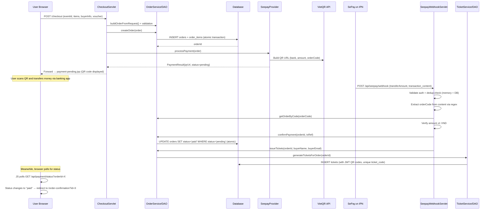
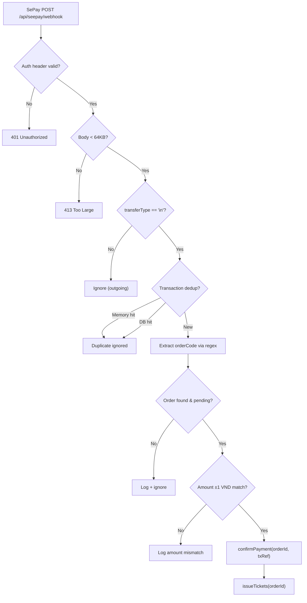
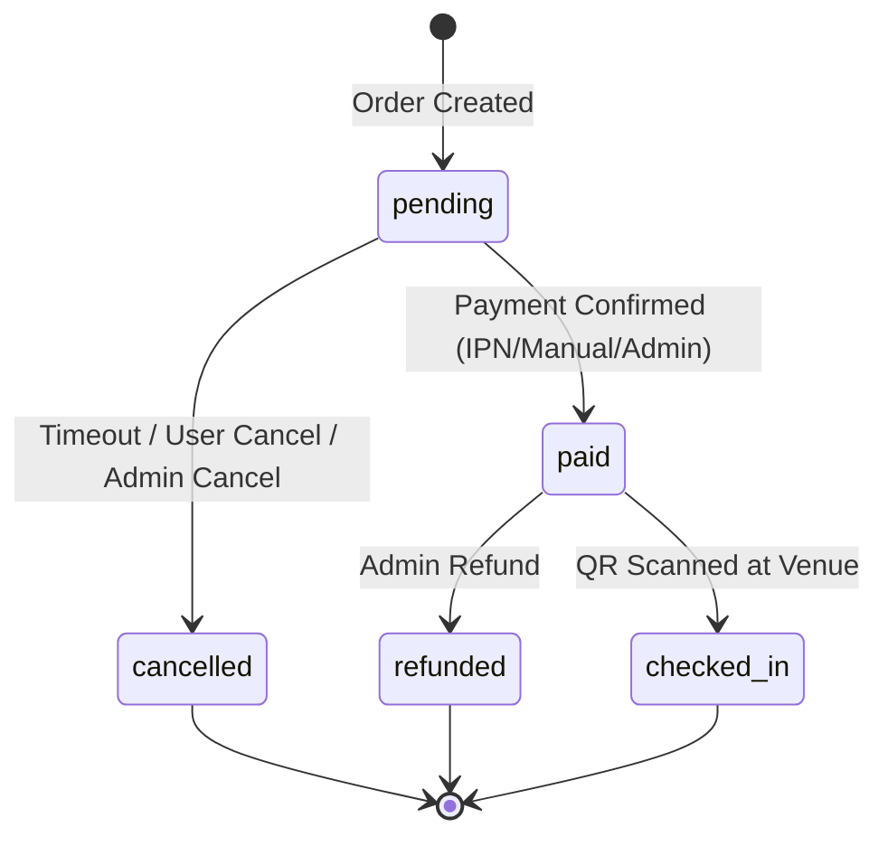

# 🎫 Payment & Ticket Lifecycle — Complete End-to-End Flow

> Comprehensive walkthrough of the order-payment-ticket pipeline in `PRJ301_GROUP4_SELLING_TICKET`

---

## Architecture Overview



---

## Phase 1: Checkout & Order Creation

### Entry: [CheckoutServlet](file:///d:/GITHUB/PRJ301_GROUP4_SELLING_TICKET/SellingTicketJava/src/java/com/sellingticket/controller/CheckoutServlet.java)

| Step | Action | File/Method |
|------|--------|-------------|
| 1 | **Auth check** — redirect to login if anonymous | [getSessionUser()](file:///d:/GITHUB/PRJ301_GROUP4_SELLING_TICKET/SellingTicketJava/src/java/com/sellingticket/util/ServletUtil.java#106-121) |
| 2 | **Double-submit guard** — session lock prevents duplicate clicks | `checkoutInProgress` flag |
| 3 | **Build order** — [buildOrderFromRequest()](file:///d:/GITHUB/PRJ301_GROUP4_SELLING_TICKET/SellingTicketJava/src/java/com/sellingticket/controller/CheckoutServlet.java#270-391) validates everything | See validation table below |
| 4 | **Voucher** — optional discount applied (AJAX pre-validate + server re-validate) | `VoucherService` |
| 5 | **Create order** — atomic DB insert | `OrderService.createOrder()` |
| 6 | **Initiate payment** — generate QR code | `SeepayProvider.initiatePayment()` |
| 7 | **Show payment page** — forward to [payment-pending.jsp](file:///d:/GITHUB/PRJ301_GROUP4_SELLING_TICKET/SellingTicketJava/src/webapp/payment-pending.jsp) | QR + countdown timer |

### Validation in [buildOrderFromRequest()](file:///d:/GITHUB/PRJ301_GROUP4_SELLING_TICKET/SellingTicketJava/src/java/com/sellingticket/controller/CheckoutServlet.java#270-391)

| Check | Detail |
|-------|--------|
| Event exists & approved | `event.getStatus() == "approved"` |
| Event not ended | `endDate > now` |
| Ticket belongs to event | `ticket.getEventId() == eventId` (V9 FIX) |
| Sale window active | `saleStart <= now <= saleEnd` |
| Stock available | `ticketService.checkAvailability(typeId, qty)` |
| Anti-hoarding limit | `existingUserTickets + newQty <= perBuyerLimit` |
| Event max total | `soldTickets + newQty <= maxTotalTickets` |
| Items format | `"typeId:qty,typeId:qty"` or legacy single params |

### Order DB Insert: [OrderDAO.createOrder()](file:///d:/GITHUB/PRJ301_GROUP4_SELLING_TICKET/SellingTicketJava/src/java/com/sellingticket/dao/OrderDAO.java)

```
BEGIN TRANSACTION
  → INSERT INTO orders (order_code, user_id, event_id, total_amount, ...)
  → For each OrderItem:
      INSERT INTO order_items (order_id, ticket_type_id, quantity, unit_price, subtotal)
  → For each OrderItem:
      UPDATE ticket_types SET sold = sold + qty
        WHERE id = ? AND (sold + qty) <= available_quantity  ← atomic stock decrement
      If rows_affected == 0 → ROLLBACK (sold out)
COMMIT → return orderId
```

> [!IMPORTANT]
> Stock decrement is **atomic** via `sold + qty <= available_quantity` in the UPDATE WHERE clause. Race conditions between concurrent buyers are handled at the DB level.

---

## Phase 2: Payment (SeePay VietQR)

### Payment Provider: [SeepayProvider](file:///d:/GITHUB/PRJ301_GROUP4_SELLING_TICKET/SellingTicketJava/src/java/com/sellingticket/service/payment/SeepayProvider.java)

- **Method**: VietQR bank transfer (no card, no redirect)
- **QR URL**: `https://img.vietqr.io/image/{BANK}-{ACCOUNT}-{TEMPLATE}.png?amount=X&addInfo=ORDER_CODE`
- **Config**: `seepay.properties` (bank_id, account_no, timeout_minutes)
- **Status**: Always `pending` until IPN webhook confirms

### Payment Page: [payment-pending.jsp](file:///d:/GITHUB/PRJ301_GROUP4_SELLING_TICKET/SellingTicketJava/src/webapp/payment-pending.jsp)

- Displays QR code image, bank details, countdown timer
- **JavaScript polling**: `GET /api/payment/status?orderId=X` every few seconds
- On `status == "paid"` → redirects to `/order-confirmation?id=X`
- On timeout → shows expiry message

### Resume Payment: [ResumePaymentServlet](file:///d:/GITHUB/PRJ301_GROUP4_SELLING_TICKET/SellingTicketJava/src/java/com/sellingticket/controller/ResumePaymentServlet.java)

If user navigates away and returns via "My Tickets":

| Order Status | Action |
|-------------|--------|
| `paid` / `checked_in` | → Redirect to `/order-confirmation` |
| `cancelled` / `refunded` | → Flash error + redirect to `/my-tickets` |
| `pending` + expired | → Auto-cancel + release stock + redirect |
| `pending` + valid | → Regenerate QR with remaining countdown |

---

## Phase 3: Payment Confirmation (Webhook IPN)

### Webhook: [SeepayWebhookServlet](file:///d:/GITHUB/PRJ301_GROUP4_SELLING_TICKET/SellingTicketJava/src/java/com/sellingticket/controller/api/SeepayWebhookServlet.java)

**URL**: `POST /api/seepay/webhook`



### Multi-Layer Idempotency

| Layer | Mechanism | Survives Restart? |
|-------|-----------|-------------------|
| 1 | `ConcurrentHashMap` in-memory (fast path, 10K cap with LRU eviction) | ❌ |
| 2 | `seepay_webhook_dedup` DB table via `SeepayWebhookDedupDAO` | ✅ |
| 3 | Order status check (`status != 'pending'` → skip) | ✅ |
| 4 | [confirmPaymentAtomic](file:///d:/GITHUB/PRJ301_GROUP4_SELLING_TICKET/SellingTicketJava/src/java/com/sellingticket/dao/OrderDAO.java#333-362) SQL: `UPDATE ... WHERE status = 'pending'` | ✅ |

### Manual Confirm: [PaymentStatusServlet POST](file:///d:/GITHUB/PRJ301_GROUP4_SELLING_TICKET/SellingTicketJava/src/java/com/sellingticket/controller/api/PaymentStatusServlet.java)

- `POST /api/payment/status?orderId=X` — user self-confirms (simulates IPN)
- Creates ref `"MANUAL-{timestamp}"` and calls same [confirmPayment](file:///d:/GITHUB/PRJ301_GROUP4_SELLING_TICKET/SellingTicketJava/src/java/com/sellingticket/service/OrderService.java#136-145) + [issueTickets](file:///d:/GITHUB/PRJ301_GROUP4_SELLING_TICKET/SellingTicketJava/src/java/com/sellingticket/service/OrderService.java#125-131) path

---

## Phase 4: Ticket Issuance

### After Payment: `OrderService.issueTickets(orderId, buyerName, buyerEmail)`

Calls [TicketDAO.generateTicketsForOrder()](file:///d:/GITHUB/PRJ301_GROUP4_SELLING_TICKET/SellingTicketJava/src/java/com/sellingticket/dao/TicketDAO.java):

```
For each order_item (ticket_type × quantity):
  → Generate unique ticket_code: "TKT-{timestamp}-{random4}"
  → Generate JWT QR:
      payload = { ticketCode, eventId, ticketTypeName, buyerName, issuedAt }
      signed with HMAC-SHA256 (secret from jwt.properties)
  → INSERT INTO tickets (
      order_id, order_item_id, ticket_type_id, event_id,
      ticket_code, qr_code_data, buyer_name, buyer_email,
      status='valid', issue_date=NOW()
    )
```

### JWT QR Code Structure

```json
{
  "ticketCode": "TKT-1719856200000-A3F2",
  "eventId": 42,
  "ticketType": "VIP",
  "buyerName": "Nguyen Van A",
  "issuedAt": 1719856200
}
```

> Signed with HMAC-SHA256. Verified at check-in without DB lookup for offline validation.

---

## Phase 5: Post-Purchase User Views

### My Tickets: [my-tickets.jsp](file:///d:/GITHUB/PRJ301_GROUP4_SELLING_TICKET/SellingTicketJava/src/webapp/my-tickets.jsp)

- Groups tickets by order → by event
- Status badges: `pending` (amber), `paid` (green), `checked_in` (blue), `cancelled` (red)
- **Pending** orders show "Tiếp tục thanh toán" → links to `/resume-payment?orderId=X`
- **Paid** orders show QR codes + "Xem chi tiết" → links to `/order-confirmation?id=X`
- **Cancel** button on pending orders → `POST /api/orders/{id}/cancel`

### Order Confirmation: [order-confirmation.jsp](file:///d:/GITHUB/PRJ301_GROUP4_SELLING_TICKET/SellingTicketJava/src/webapp/order-confirmation.jsp)

- Shows order summary, buyer info, voucher discount breakdown
- **Displays all issued tickets** with:
  - Ticket code
  - QR code image (Base64 inline or JWT data)
  - Status badge
  - Individual ticket details

---

## Phase 6: Admin Operations

### Admin Order Management: [orders.jsp](file:///d:/GITHUB/PRJ301_GROUP4_SELLING_TICKET/SellingTicketJava/src/webapp/admin/orders.jsp)

| Action | API Endpoint | Effect |
|--------|-------------|--------|
| Confirm Payment | `POST /api/admin/orders/{id}/confirm` | `status → paid` + issue tickets |
| Cancel Order | `POST /api/admin/orders/{id}/cancel` | `status → cancelled` + release stock |
| Refund Order | `POST /api/admin/orders/{id}/refund` | `status → refunded` + tickets invalidated |

### Admin API: [AdminOrderApiServlet](file:///d:/GITHUB/PRJ301_GROUP4_SELLING_TICKET/SellingTicketJava/src/java/com/sellingticket/controller/api/AdminOrderApiServlet.java)

- **Role check**: `user.getRole() == "admin"` required
- **Confirm**: Uses [confirmPaymentAtomic()](file:///d:/GITHUB/PRJ301_GROUP4_SELLING_TICKET/SellingTicketJava/src/java/com/sellingticket/dao/OrderDAO.java#333-362) (same atomic SQL as webhook)
- **Cancel**: [cancelOrder()](file:///d:/GITHUB/PRJ301_GROUP4_SELLING_TICKET/SellingTicketJava/src/java/com/sellingticket/service/OrderService.java#146-149) → restores `ticket_types.sold` count
- **Refund**: `refundOrder()` → marks tickets as `refunded`

---

## Order Status State Machine



---

## Key Design Decisions

| Decision | Rationale |
|----------|-----------|
| **VietQR bank transfer only** | Vietnam market standard, zero payment gateway fees, instant settlement |
| **Webhook IPN + manual confirm** | Dual path ensures no stuck orders (IPN auto, user manual fallback) |
| **4-layer idempotency** | Memory→DB→OrderStatus→AtomicSQL prevents duplicate ticket issues |
| **JWT QR tickets** | Offline-verifiable at venue gates, tamper-proof, no DB dependency at check-in |
| **Atomic stock decrement** | `UPDATE WHERE sold+qty<=available` prevents overselling at DB level |
| **Per-buyer limits** | Configurable per event (`maxTicketsPerOrder`), checked against existing purchases |
| **Factory Pattern for payments** | [PaymentFactory](file:///d:/GITHUB/PRJ301_GROUP4_SELLING_TICKET/SellingTicketJava/src/java/com/sellingticket/service/payment/PaymentFactory.java#10-48) maps method→provider, extensible for VNPay/Momo |
| **Session double-submit guard** | `checkoutInProgress` flag prevents rapid-fire duplicate orders |
