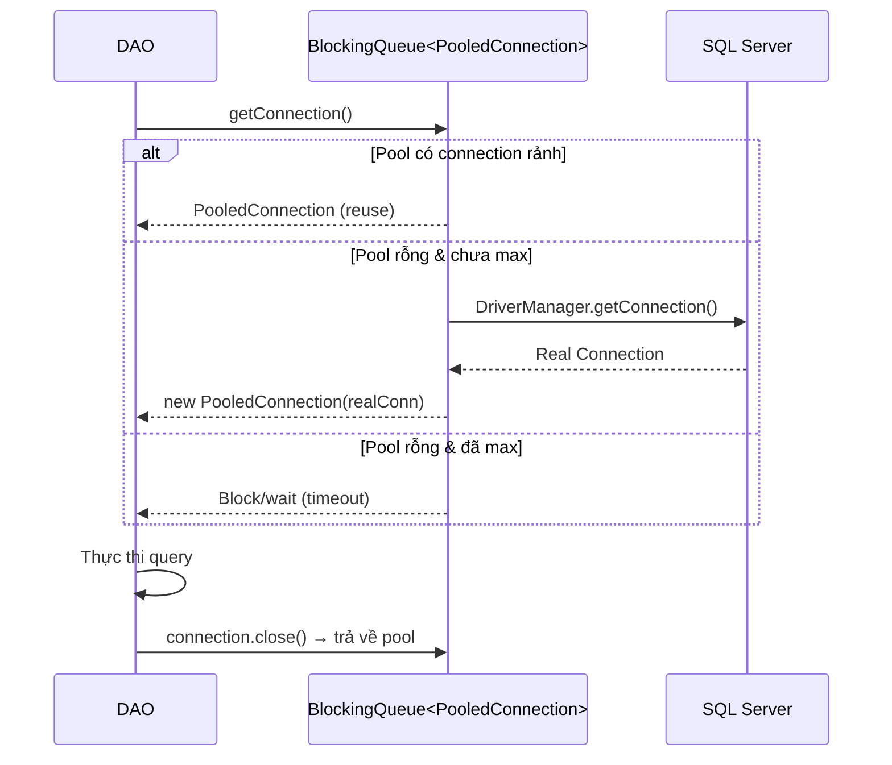
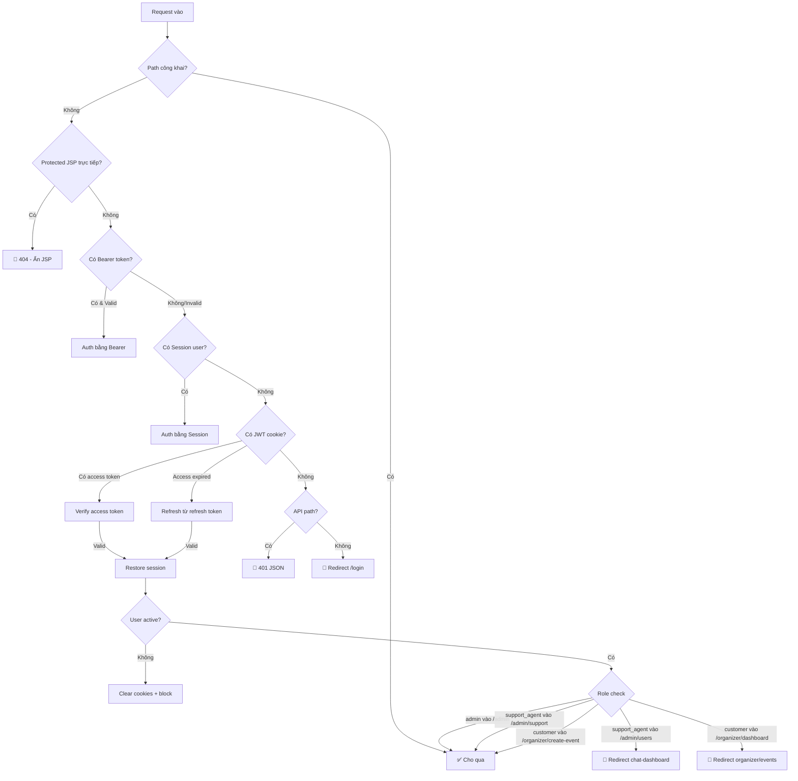
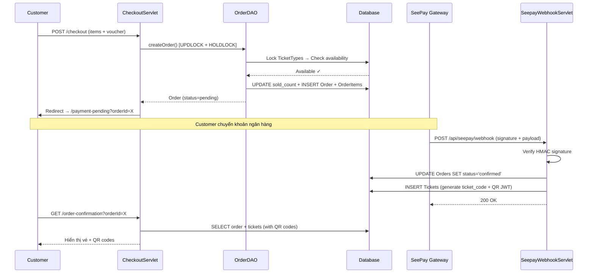
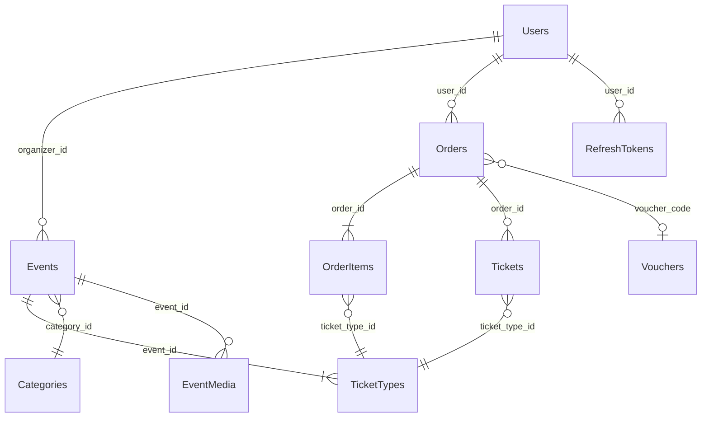

# 🎫 SellingTicketJava — Tài Liệu Kiến Trúc & Hệ Thống Toàn Diện

> **Dự án:** Hệ thống bán vé sự kiện trực tuyến
> **Stack:** Java Servlet (Jakarta EE) + JSP + SQL Server + BCrypt + JWT (HMAC-SHA256)
> **Quy mô:** 122+ Java files | 5 DAO chính | 4 vai trò người dùng | Thanh toán SeePay

---

## 📐 1. Kiến Trúc Tổng Thể

### 1.1 Mô Hình MVC Thuần (Không Framework)

```
┌─────────────┐     ┌────────────┐     ┌──────────┐     ┌──────────┐     ┌───────────┐
│  Browser     │────▶│  Filters   │────▶│ Servlet  │────▶│  DAO     │────▶│ SQL Server│
│  (JSP View)  │◀────│  Pipeline  │◀────│Controller│◀────│  Layer   │◀────│  Database │
└─────────────┘     └────────────┘     └──────────┘     └──────────┘     └───────────┘
                    │ CsrfFilter │     │ doGet()  │     │ BaseDAO  │     │ 15+ tables│
                    │ AuthFilter │     │ doPost() │     │ Template │     │ Stored    │
                    │ OrgFilter  │     │ forward()│     │ Method   │     │ Procedures│
                    └────────────┘     └──────────┘     └──────────┘     └───────────┘
```

> [!IMPORTANT]
> **Tại sao không dùng Spring Boot?** Đây là dự án PRJ301 — môn Java Web tại FPT University yêu cầu sử dụng **Java Servlet thuần**. Điều này buộc nhóm phải tự xây dựng mọi thứ: connection pooling, CSRF protection, JWT, RBAC — giúp hiểu sâu HTTP lifecycle thay vì dựa vào "magic" của framework.

### 1.2 Cấu Trúc Package

```
com.sellingticket/
├── controller/           # Servlets xử lý HTTP requests
│   ├── admin/            # 12 controllers cho Admin dashboard
│   ├── api/              # 14 API servlets (JSON responses)
│   └── organizer/        # 8 controllers cho Organizer
├── dao/                  # Data Access Objects (5 core + supporting)
├── filter/               # Security filters (Auth, CSRF, Organizer access)
├── model/                # POJOs (User, Event, Order, Ticket, etc.)
├── service/              # Business logic (AuthTokenService, etc.)
└── util/                 # Utilities (JWT, Password, Cookie, Constants)
```

---

## 🔗 2. DAO Layer — Chi Tiết & Giải Thích

### 2.1 DBContext — Connection Pool Tự Xây

**File:** [DBContext.java](file:///d:/GITHUB/PRJ301_GROUP4_SELLING_TICKET/SellingTicketJava/src/java/com/sellingticket/dao/DBContext.java)

```java
// Design Pattern: PROXY + OBJECT POOL
// Mỗi Connection thật được bọc trong PooledConnection (Proxy)
// Khi close() → trả về pool thay vì đóng thật
private static final BlockingQueue<PooledConnection> pool = new LinkedBlockingQueue<>(MAX_POOL_SIZE);
```

**Tại sao tự xây connection pool?**

| Câu hỏi | Trả lời |
|----------|---------|
| Sao không dùng HikariCP? | Ràng buộc môn học: không dùng thư viện pool bên ngoài |
| Pool size bao nhiêu? | `MAX_POOL_SIZE = 10`, đủ cho concurrent users của dự án |
| Health check như thế nào? | [isValid(3)](file:///d:/GITHUB/PRJ301_GROUP4_SELLING_TICKET/SellingTicketJava/src/java/com/sellingticket/service/UserService.java#172-178) — ping DB với timeout 3 giây trước khi cho mượn connection |
| Leak detection? | `PooledConnection.close()` trả connection về pool; nếu quên close → GC warning |

**Luồng hoạt động:**



---

### 2.2 BaseDAO — Template Method Pattern

**File:** [BaseDAO.java](file:///d:/GITHUB/PRJ301_GROUP4_SELLING_TICKET/SellingTicketJava/src/java/com/sellingticket/dao/BaseDAO.java)

```java
// Core abstraction: Functional interfaces thay cho abstract methods
protected <T> List<T> executeQuery(String sql, PreparedStatementSetter setter, RowMapper<T> mapper)
protected int executeUpdate(String sql, PreparedStatementSetter setter)
protected <T> T executeQuerySingle(String sql, PreparedStatementSetter setter, RowMapper<T> mapper)
```

> [!TIP]
> **Tại sao dùng Functional Interfaces thay vì abstract class truyền thống?**
> - `RowMapper<T>` — lambda [(rs) -> new Event(rs.getInt("id"), ...)](file:///d:/GITHUB/PRJ301_GROUP4_SELLING_TICKET/SellingTicketJava/src/java/com/sellingticket/dao/BaseDAO.java#45-46) — type-safe, compile-time check
> - `PreparedStatementSetter` — lambda [(ps) -> { ps.setInt(1, id); }](file:///d:/GITHUB/PRJ301_GROUP4_SELLING_TICKET/SellingTicketJava/src/java/com/sellingticket/dao/BaseDAO.java#45-46) — tránh SQL injection
> - **Kết quả:** Mỗi DAO method chỉ cần 3-5 dòng thay vì 30+ dòng boilerplate try/catch/finally

**Ví dụ so sánh — TRƯỚC vs SAU BaseDAO:**

```java
// ❌ TRƯỚC: 30 dòng cho mỗi query
public List<Event> getAll() {
    Connection conn = null;
    PreparedStatement ps = null;
    ResultSet rs = null;
    List<Event> list = new ArrayList<>();
    try {
        conn = DBContext.getConnection();
        ps = conn.prepareStatement("SELECT * FROM Events");
        rs = ps.executeQuery();
        while (rs.next()) { list.add(mapRow(rs)); }
    } catch (SQLException e) { ... }
    finally { close(rs); close(ps); close(conn); }
    return list;
}

// ✅ SAU: 3 dòng
public List<Event> getAll() {
    return executeQuery("SELECT * FROM Events", ps -> {}, this::mapEvent);
}
```

---

### 2.3 EventDAO — Aggregate Queries & Computed Status

**File:** [EventDAO.java](file:///d:/GITHUB/PRJ301_GROUP4_SELLING_TICKET/SellingTicketJava/src/java/com/sellingticket/dao/EventDAO.java)

#### 2.3.1 JOIN Chính — Tại Sao Cần?

```sql
SELECT e.*, c.name AS categoryName, c.slug AS categorySlug,
       u.full_name AS organizerName,
       COALESCE(ttStats.totalCapacity, 0) AS totalCapacity,
       COALESCE(ttStats.soldCount, 0) AS soldCount
FROM Events e
LEFT JOIN Categories c ON e.category_id = c.category_id
LEFT JOIN Users u ON e.organizer_id = u.user_id
LEFT JOIN (
    SELECT event_id,
           SUM(quantity) AS totalCapacity,
           SUM(sold_count) AS soldCount
    FROM TicketTypes
    GROUP BY event_id
) AS ttStats ON e.event_id = ttStats.event_id
```

| JOIN | Tại sao? |
|------|----------|
| `LEFT JOIN Categories` | Hiển thị tên danh mục trên card sự kiện. LEFT vì event có thể chưa gán category |
| `LEFT JOIN Users` | Hiển thị tên organizer. LEFT vì organizer có thể bị xóa |
| `LEFT JOIN (subquery) TicketTypes` | **Aggregate subquery** — tính tổng capacity & sold cho mỗi event TRƯỚC khi join. **Tại sao subquery thay vì GROUP BY trực tiếp?** Vì nếu GROUP BY trên bảng Events sẽ làm sai kết quả (duplicate rows từ multiple ticket types) |

#### 2.3.2 Computed Event Status — Logic Phức Tạp

```java
private Event.EventStatus computeStatus(ResultSet rs, String approvalStatus, int statusInt) {
    if ("rejected".equals(approvalStatus))  return REJECTED;
    if ("pending".equals(approvalStatus))   return PENDING_APPROVAL;
    if (statusInt == 0)                     return DRAFT;

    Timestamp endDate = rs.getTimestamp("end_date");
    Timestamp startDate = rs.getTimestamp("start_date");
    Timestamp now = new Timestamp(System.currentTimeMillis());

    if (endDate != null && now.after(endDate))     return COMPLETED;
    if (startDate != null && now.after(startDate))  return ONGOING;

    int totalCapacity = rs.getInt("totalCapacity");
    int soldCount = rs.getInt("soldCount");
    if (totalCapacity > 0 && soldCount >= totalCapacity) return SOLD_OUT;

    return ON_SALE;
}
```

> [!NOTE]
> **Tại sao tính status ở Java thay vì CASE WHEN trong SQL?**
> Status phụ thuộc vào **thời gian thực** (`now()`) VÀ **aggregate data** (`soldCount >= totalCapacity`). Nếu đặt trong SQL, mỗi query phải duplicate logic CASE WHEN dài >15 dòng. Đặt ở Java: **Single Source of Truth**, dễ test, dễ đổi logic.

---

### 2.4 OrderDAO — Atomic Transactions & Concurrency

**File:** [OrderDAO.java](file:///d:/GITHUB/PRJ301_GROUP4_SELLING_TICKET/SellingTicketJava/src/java/com/sellingticket/dao/OrderDAO.java)

#### 2.4.1 Tạo Đơn Hàng — Pessimistic Locking

```java
// BƯỚC 1: Tắt auto-commit → bắt đầu transaction
conn.setAutoCommit(false);

// BƯỚC 2: Lock hàng TicketTypes để tránh oversell
String lockSql = "SELECT quantity, sold_count FROM TicketTypes WITH (UPDLOCK, HOLDLOCK) WHERE ticket_type_id = ?";
// → UPDLOCK: khóa UPDATE (thread khác không thể đọc-rồi-ghi đè)
// → HOLDLOCK: giữ lock đến hết transaction (tương đương SERIALIZABLE cho row này)

// BƯỚC 3: Kiểm tra còn vé không
if (available < requestedQty) {
    conn.rollback(); // → KHÔNG tạo order, không mất tiền
    return null;
}

// BƯỚC 4: Cập nhật sold_count
"UPDATE TicketTypes SET sold_count = sold_count + ? WHERE ticket_type_id = ?"

// BƯỚC 5: Insert Order + OrderItems + Commit
conn.commit(); // → Atomic: tất cả hoặc không gì cả
```

> [!CAUTION]
> **Race Condition Prevention:** Nếu 100 người cùng mua vé cuối cùng, `UPDLOCK + HOLDLOCK` đảm bảo chỉ 1 người thành công. Không dùng `UPDLOCK` → **Dirty Read** → oversell!

#### 2.4.2 Batch Loading — Giải Quyết N+1

```java
// ❌ N+1 Problem: 50 orders → 50 queries lấy items
for (Order o : orders) {
    o.setItems(getItemsByOrderId(o.getId())); // 1 query mỗi order!
}

// ✅ Batch Loading: 1 query duy nhất cho TẤT CẢ orders
String sql = "SELECT oi.*, tt.name, tt.price FROM OrderItems oi "
           + "JOIN TicketTypes tt ON oi.ticket_type_id = tt.ticket_type_id "
           + "WHERE oi.order_id IN (" + placeholders + ")";
// → Map<orderId, List<OrderItem>> rồi gán vào từng order
```

| Approach | 50 orders | 100 orders |
|----------|-----------|------------|
| N+1 | 51 queries | 101 queries |
| Batch | **2 queries** | **2 queries** |

---

### 2.5 UserDAO — Auth & Soft Delete

**File:** [UserDAO.java](file:///d:/GITHUB/PRJ301_GROUP4_SELLING_TICKET/SellingTicketJava/src/java/com/sellingticket/dao/UserDAO.java)

#### 2.5.1 Login — BCrypt Verification

```java
public User login(String email, String password) {
    // 1. Tìm user bằng email (case-insensitive COLLATE)
    String sql = "SELECT * FROM Users WHERE email = ? COLLATE SQL_Latin1_General_CP1_CI_AS AND is_active = 1";

    // 2. BCrypt verify (cost factor = 12 → ~250ms per hash)
    // → Chậm có chủ đích: brute-force 1 triệu passwords mất ~70 giờ
    if (!PasswordUtil.checkPassword(password, user.getPassword())) return null;

    // 3. Kiểm tra google-only account (password = null)
    // → Nếu user đăng ký qua Google, không cho login bằng password
}
```

> [!IMPORTANT]
> **Tại sao BCrypt cost = 12?**
> - Cost 10 (default): ~100ms → 10,000 guesses/sec
> - **Cost 12**: ~250ms → **4,000 guesses/sec** (an toàn hơn 2.5x)
> - Cost 14: ~1s → quá chậm cho UX

#### 2.5.2 Google OAuth — Dual Account Strategy

```java
public User findOrCreateGoogleUser(String googleId, String email, String fullName, String avatar) {
    // Chiến lược: 3 bước
    // 1. Tìm bằng google_id (đã link trước đó)
    // 2. Tìm bằng email → link google_id vào account hiện có
    // 3. Không tìm thấy → tạo account mới (password = null, google_id = set)
}
```

#### 2.5.3 Soft Delete

```java
// Không DELETE FROM Users → đặt is_active = 0
"UPDATE Users SET is_active = 0, email = 'deleted_' + CAST(user_id AS VARCHAR) + '_' + email WHERE user_id = ?"
// → Email được prefix 'deleted_123_' để giải phóng email cho đăng ký mới
// → Tại sao? Giữ lại lịch sử đơn hàng, audit trail, foreign key integrity
```

---

### 2.6 TicketDAO — QR Code JWT & Atomic Check-in

**File:** [TicketDAO.java](file:///d:/GITHUB/PRJ301_GROUP4_SELLING_TICKET/SellingTicketJava/src/java/com/sellingticket/dao/TicketDAO.java)

#### 2.6.1 QR Code Generation

```java
// Mỗi vé có 1 JWT token chứa: ticketId, ticketCode, eventId, expiry
String jwt = JwtUtil.generateTicketToken(ticketId, ticketCode, eventId, expireTime);
// → JWT được encode thành QR code
// → Tại sao JWT thay vì UUID? Vì JWT chứa event context → verify KHÔNG cần query DB
```

#### 2.6.2 Check-in Flow — Double Verification

```java
// 1. Parse JWT → lấy ticketCode, eventId
// 2. Query DB: "SELECT * FROM Tickets WHERE ticket_code = ? AND event_id = ?"
// 3. Verify: chưa check-in (checked_in_at IS NULL), order đã thanh toán
// 4. Atomic update: "UPDATE Tickets SET checked_in_at = GETDATE() WHERE ticket_id = ?"
// 5. Kiểm tra: nếu TẤT CẢ tickets trong order đều checked-in
//    → "UPDATE Orders SET status = 'completed' WHERE order_id = ?"
//    → Status promotion: từ 'confirmed' lên 'completed'
```

---

## 🔒 3. Security Pipeline — Defense in Depth

### 3.1 Filter Chain Order

```
Request → CsrfFilter → AuthFilter → OrganizerAccessFilter → Servlet
```

> Thứ tự quan trọng: CSRF check TRƯỚC auth check. Tại sao? Vì CSRF token cần được generate cho mọi request (kể cả chưa login), nhưng validate chỉ trên POST.

### 3.2 AuthFilter — Triple Authentication

**File:** [AuthFilter.java](file:///d:/GITHUB/PRJ301_GROUP4_SELLING_TICKET/SellingTicketJava/src/java/com/sellingticket/filter/AuthFilter.java)



#### 3.2.1 Session Fixation Prevention

```java
// Khi restore session từ JWT:
HttpSession oldSession = httpRequest.getSession(false);
String csrfToken = null;
if (oldSession != null) {
    csrfToken = (String) oldSession.getAttribute("csrf_token");
    oldSession.invalidate();  // ← Hủy session cũ
}
HttpSession session = httpRequest.getSession(true);  // ← Tạo session MỚI
session.setAttribute("user", user);
if (csrfToken != null) {
    session.setAttribute("csrf_token", csrfToken);  // ← Giữ CSRF token liên tục
}
```

> **Tại sao invalidate + tạo mới?** Ngăn **Session Fixation Attack**: attacker gửi victim 1 session ID đã biết → victim login → attacker dùng session ID đó để hijack.

### 3.3 CsrfFilter — Token Rotation + Origin Validation

**File:** [CsrfFilter.java](file:///d:/GITHUB/PRJ301_GROUP4_SELLING_TICKET/SellingTicketJava/src/java/com/sellingticket/filter/CsrfFilter.java)

| Tính năng | Chi tiết |
|-----------|----------|
| **Token per session** | UUID.randomUUID() — 122 bit entropy |
| **Rotation** | Form POST → token cũ trở thành `csrf_token_prev`, token mới được sinh |
| **Grace period** | Chấp nhận cả token hiện tại VÀ token trước đó (xử lý race condition khi 2 tab submit) |
| **API exemption** | Bearer token hợp lệ → skip CSRF (API clients tự quản lý auth) |
| **Origin check** | Session-auth API calls phải có Origin/Referer khớp server host |
| **Multipart fallback** | CSRF token trong query string cho form upload file |
| **Login redirect** | CSRF fail trên /login → redirect thay vì 403 raw (better UX) |

### 3.4 JWT — Pure Java Implementation

**File:** [JwtUtil.java](file:///d:/GITHUB/PRJ301_GROUP4_SELLING_TICKET/SellingTicketJava/src/java/com/sellingticket/util/JwtUtil.java)

```java
// ⚡ Zero dependencies — chỉ dùng javax.crypto.Mac + java.util.Base64
// Tại sao không dùng jjwt/auth0-jwt? → Ràng buộc dự án: minimize dependencies

// Security measures:
// 1. Algorithm validation: reject alg:none attack
private static boolean isExpectedAlgorithm(String headerBase64) {
    return headerJson.contains("\"HS256\"");
}

// 2. Constant-time comparison: prevent timing attack
private static boolean constantTimeEquals(String a, String b) {
    return MessageDigest.isEqual(aBytes, bBytes);
}

// 3. Custom JSON parser: chỉ parse flat JWT payload (no eval, no injection)
```

**Token Lifecycle:**

| Token | Lifetime | Storage | Refresh |
|-------|----------|---------|---------|
| Access | 7 ngày | Cookie (HttpOnly, Secure, SameSite) | Tự verify, không query DB |
| Refresh | 30 ngày | Cookie (opaque JTI) + DB | Query DB verify, issue new access |
| Ticket QR | 1 năm | QR code image | Không refresh |

---

## 💳 4. Payment Flow — SeePay Integration

### 4.1 Checkout → Payment → Confirmation



### 4.2 Webhook Security

```java
// SeepayWebhookServlet.java
// 1. Verify HMAC signature: đảm bảo payload từ SeePay thật
// 2. Idempotency: nếu order đã 'confirmed' → skip
// 3. Exempt từ CSRF (webhook sử dụng API key auth riêng)
// 4. Exempt từ AuthFilter (không cần session/JWT)
```

---

## 👥 5. User Flows — Tất Cả Vai Trò

### 5.1 Customer Flow

```
Home → Browse Events → Event Detail → Select Tickets → Checkout → Payment → My Tickets → Check-in (QR)
                                                          ↳ Apply Voucher
                                                          ↳ Support Ticket
```

| Route | Servlet | DAO calls |
|-------|---------|-----------|
| `/home` | HomeServlet | EventDAO.getFeaturedEvents() |
| `/events` | EventsServlet | EventDAO.searchEvents(filters) |
| `/event-detail?id=X` | EventDetailServlet | EventDAO.getById() + getTicketTypes() |
| `/checkout` | CheckoutServlet | OrderDAO.createOrder() [transactional] |
| `/my-tickets` | MyTicketsServlet | TicketDAO.getByUserId() |

### 5.2 Organizer Flow

```
Create Event → Submit for Approval → (Admin approves) → Manage Event → View Orders → Check-in Dashboard
```

| Route | Controller | Đặc biệt |
|-------|-----------|-----------|
| `/organizer/create-event` | OrganizerCreateEventController | Customer role cũng được phép (tự động upgrade lên organizer khi event được duyệt) |
| `/organizer/dashboard` | OrganizerDashboardController | Revenue stats, ticket sales chart |
| `/organizer/check-in` | OrganizerCheckInController | QR scanner → JWT verify → mark checked-in |

### 5.3 Admin Flow

```
Dashboard (stats) → Manage Users → Approve Events → Manage Orders → System Vouchers → Reports
```

| Route | Controller | Quyền |
|-------|-----------|-------|
| `/admin/dashboard` | AdminDashboardController | Chỉ role `admin` |
| `/admin/users` | AdminUserController | CRUD users, soft delete |
| `/admin/event-approval` | AdminEventApprovalController | Duyệt/từ chối event của organizer |
| `/admin/orders` | AdminOrderController | Xem tất cả orders, confirm payment thủ công |
| `/admin/support` | AdminSupportController | **admin** VÀ **support_agent** |

### 5.4 Support Agent Flow

```
Chat Dashboard → View Support Tickets → Respond to customers
```

> **Hạn chế:** Support agent chỉ được truy cập `/admin/support*`, `/admin/chat-dashboard`, `/admin/notifications`. Cố truy cập route khác → redirect về `/admin/chat-dashboard`.

---

## 🗃️ 6. Database Schema — Quan Hệ Bảng



### Bảng Chính & Vai Trò

| Bảng | Vai trò | Columns đáng chú ý |
|------|---------|---------------------|
| **Users** | Tất cả users (customer, organizer, admin, support_agent) | `role`, `google_id`, `is_active`, `password` (BCrypt hash) |
| **Events** | Sự kiện | `approval_status` (pending/approved/rejected), `status` (0=draft, 1=active) |
| **TicketTypes** | Loại vé cho mỗi event | `quantity` (tổng), `sold_count` (đã bán) — atomic update |
| **Orders** | Đơn hàng | `status` (pending→confirmed→completed→cancelled) |
| **OrderItems** | Chi tiết đơn hàng | `quantity`, `unit_price` (snapshot giá tại thời điểm mua) |
| **Tickets** | Vé cụ thể (1 ticket = 1 QR code) | `ticket_code` (unique), `qr_token` (JWT), `checked_in_at` |
| **RefreshTokens** | JWT refresh tokens | `jti`, `user_agent`, `ip_address`, `expires_at`, `is_revoked` |

---

## 🔄 7. Data Flow — Từ DB đến Browser

### 7.1 Ví dụ: Xem Chi Tiết Sự Kiện

```
Browser GET /event-detail?id=5
    ↓
AuthFilter: Public route → cho qua
    ↓
EventDetailServlet.doGet():
    ↓
    EventDAO.getEventById(5)
        → SQL: SELECT e.*, c.name, u.full_name, SUM(tt.quantity), SUM(tt.sold_count)
               FROM Events e
               LEFT JOIN Categories c ON ...
               LEFT JOIN Users u ON ...
               LEFT JOIN TicketTypes tt ON ...
               WHERE e.event_id = 5
        → Java: computeStatus() → ON_SALE / SOLD_OUT / COMPLETED
        → Return: Event object
    ↓
    EventDAO.getTicketTypesByEventId(5)
        → SQL: SELECT * FROM TicketTypes WHERE event_id = 5
        → Return: List<TicketType>
    ↓
    request.setAttribute("event", event)
    request.setAttribute("ticketTypes", ticketTypes)
    request.getRequestDispatcher("/event-detail.jsp").forward()
    ↓
JSP: ${event.title}, ${event.status}, forEach ticketTypes → render cards
    ↓
Browser: Rendered HTML
```

### 7.2 Ví dụ: Checkout (Write Flow)

```
Browser POST /checkout (csrf_token + items + voucherCode)
    ↓
CsrfFilter: Validate csrf_token ✓ → Rotate token
    ↓
AuthFilter: Session user ✓ → Set AUTHENTICATED_USER_ATTR
    ↓
CheckoutServlet.doPost():
    ↓
    OrderDAO.createOrder(userId, items, voucherCode):
        BEGIN TRANSACTION
        ├── SELECT ... WITH (UPDLOCK, HOLDLOCK) → Lock ticket types
        ├── Check: quantity - sold_count >= requested ✓
        ├── UPDATE TicketTypes SET sold_count += requested
        ├── INSERT INTO Orders (user_id, total, status='pending')
        ├── INSERT INTO OrderItems (order_id, ticket_type_id, qty, price)
        COMMIT TRANSACTION
        → Return: Order
    ↓
    redirect("/payment-pending?orderId=" + order.getId())
```

---

## 🛡️ 8. Security Summary — Tại Sao Mỗi Layer

| Layer | Mechanism | Bảo vệ chống |
|-------|-----------|--------------|
| **Password** | BCrypt cost=12 | Brute force, rainbow tables |
| **Session** | Invalidate + recreate on auth change | Session fixation |
| **CSRF** | UUID token rotation + Origin check | Cross-site request forgery |
| **JWT** | HMAC-SHA256 + constant-time compare | Token tampering, timing attacks |
| **SQL** | PreparedStatement everywhere | SQL injection |
| **JSP** | Protected JSPs return 404 | Direct JSP access |
| **Concurrency** | UPDLOCK + HOLDLOCK | Ticket overselling |
| **Soft delete** | is_active flag + email prefix | Data integrity, audit trail |
| **Bearer auth** | Authorization header for API clients | Stateless API authentication |
| **Cookie** | HttpOnly + Secure + SameSite | XSS cookie theft |

---

## 📊 9. API Endpoints Summary

### Public APIs

| Method | Path | Response |
|--------|------|----------|
| GET | `/api/events` | List events (filterable) |
| GET | `/api/events/{id}` | Event detail + ticket types |
| POST | `/api/email-check` | `{available: true/false}` |

### Customer APIs (require auth)

| Method | Path | Response |
|--------|------|----------|
| GET | `/api/my-orders` | User's orders |
| GET | `/api/my-tickets` | User's tickets with QR |
| POST | `/api/voucher/validate` | Voucher validity + discount |
| GET | `/api/payment-status?orderId=X` | Poll payment status |

### Organizer APIs

| Method | Path | Response |
|--------|------|----------|
| GET | `/api/organizer/events` | Organizer's events |
| POST | `/api/organizer/events` | Create/update event |
| POST | `/api/organizer/check-in` | Check-in ticket by QR |

### Admin APIs (require `admin` role)

| Method | Path | Response |
|--------|------|----------|
| GET/POST | `/api/admin/users` | CRUD users |
| POST | `/api/admin/events/approve` | Approve/reject events |
| POST | `/api/admin/orders/confirm` | Manual payment confirm |
| POST | `/api/admin/events/feature` | Toggle featured events |

### Webhook

| Method | Path | Auth |
|--------|------|------|
| POST | `/api/seepay/webhook` | HMAC signature (not JWT/session) |

---

## 🧩 10. Design Patterns Sử Dụng

| Pattern | Nơi sử dụng | Tại sao |
|---------|-------------|---------|
| **Template Method** | BaseDAO | Eliminate boilerplate, enforce consistent resource management |
| **Proxy** | DBContext.PooledConnection | Intercept close() để trả connection về pool thay vì đóng |
| **Object Pool** | DBContext.pool (BlockingQueue) | Reuse expensive DB connections |
| **Strategy** | RowMapper, PreparedStatementSetter | Inject query-specific logic vào common execution framework |
| **Front Controller** | Servlet (doGet/doPost) | Single entry point per feature/resource |
| **Chain of Responsibility** | Filter chain | Layered security without coupling |
| **Observer-like** | Webhook → status update → ticket generation | Event-driven payment confirmation |

---

> [!TIP]
> **Đọc thêm:** Muốn hiểu chi tiết 1 flow cụ thể (ví dụ: Google OAuth, Admin Reports, Chat system), hãy yêu cầu và mình sẽ deep-dive vào phần đó.
