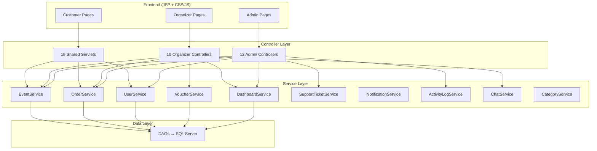
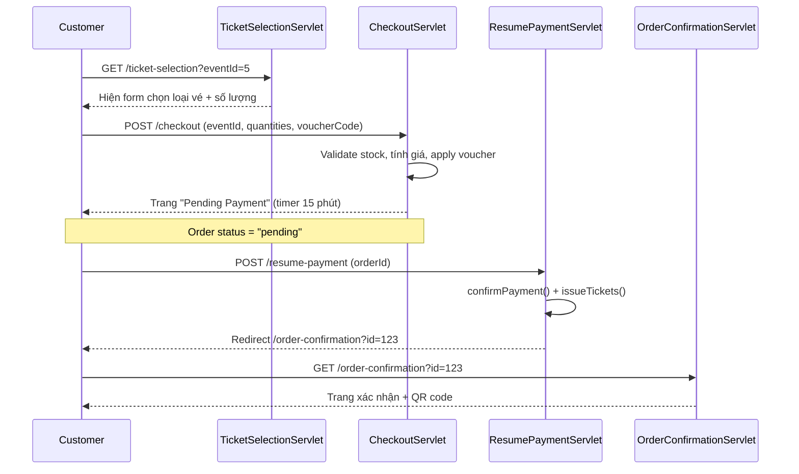
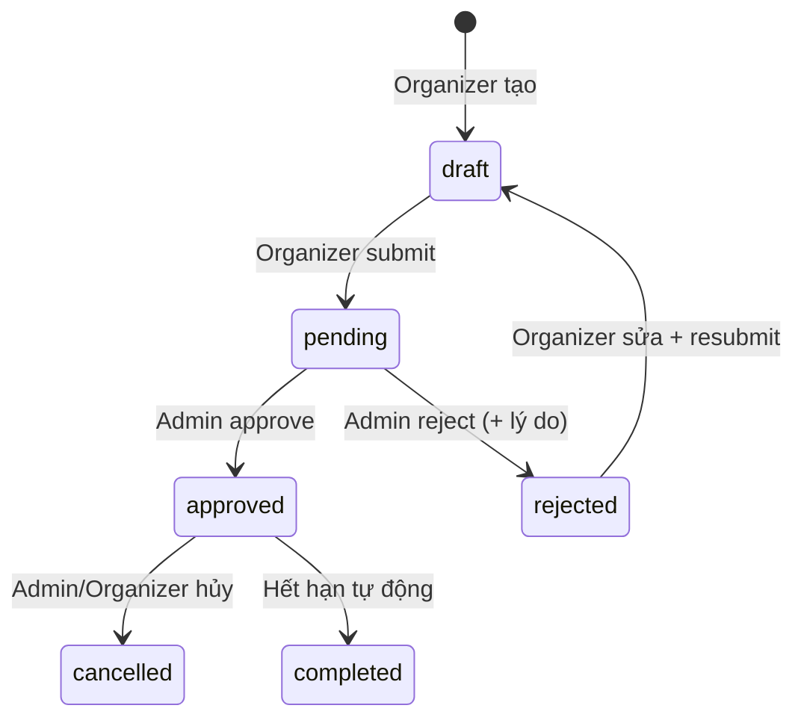
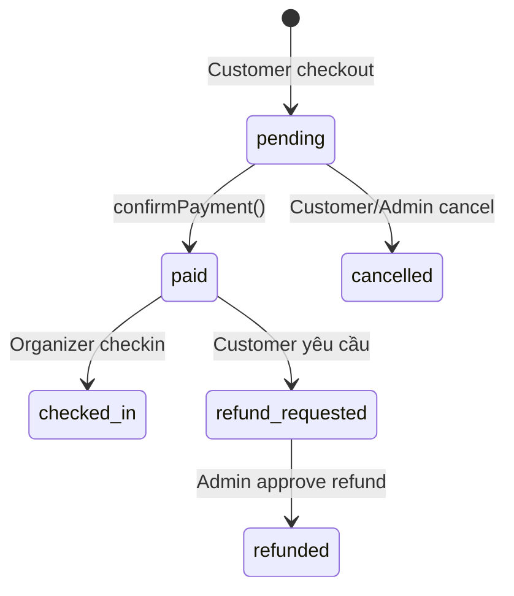
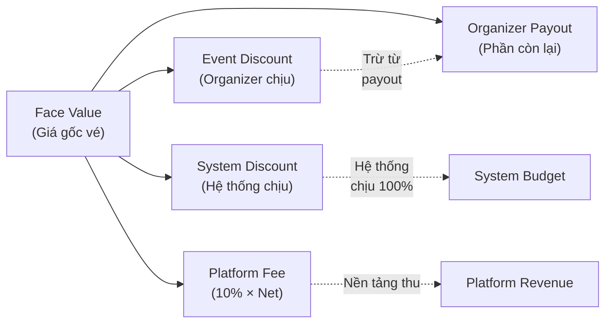
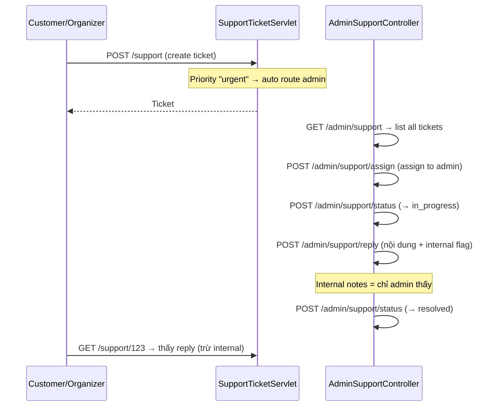

# 🎫 SellingTicket — Tổng Quan Toàn Bộ Nghiệp Vụ Theo Vai Trò

> **Kiến trúc**: Java Servlet (Jakarta EE) + JSP + SQL Server, 3-layer (Controller → Service → DAO).
> **Tổng**: **36 controller files** chia theo 3 vai trò + 19 shared servlets.

---

## 📐 Kiến Trúc Tổng Thể



---

## 1. 👤 Customer (Người dùng / Khách mua vé)

### 1.1 Đăng ký & Đăng nhập

| Servlet | URL Pattern | Mô tả |
|---------|-------------|-------|
| [RegisterServlet](file:///d:/GITHUB/PRJ301_GROUP4_SELLING_TICKET/SellingTicketJava/src/java/com/sellingticket/controller/RegisterServlet.java) | `/register` | Đăng ký bằng email+password, mã hóa BCrypt, gán role `customer` |
| [LoginServlet](file:///d:/GITHUB/PRJ301_GROUP4_SELLING_TICKET/SellingTicketJava/src/java/com/sellingticket/controller/LoginServlet.java) | `/login` | Đăng nhập, check active, redirect theo role (`admin`→`/admin`, `organizer`→`/organizer`, else→`/`) |
| [GoogleOAuthServlet](file:///d:/GITHUB/PRJ301_GROUP4_SELLING_TICKET/SellingTicketJava/src/java/com/sellingticket/controller/GoogleOAuthServlet.java) | `/auth/google`, `/auth/google/callback` | OAuth2 flow: redirect → Google → callback lấy token → lấy user info → auto-register nếu chưa có |
| [LogoutServlet](file:///d:/GITHUB/PRJ301_GROUP4_SELLING_TICKET/SellingTicketJava/src/java/com/sellingticket/controller/LogoutServlet.java) | `/logout` | Invalidate session → redirect `/login` |

**Luồng đăng ký chi tiết:**
1. User truy cập `/register` (GET) → hiện form
2. Nhập thông tin → POST → `UserService.register()`:
   - Validate email format + check trùng email
   - Hash password bằng BCrypt 
   - Tạo user với `role = "customer"`, `isActive = true`
3. Thành công → flash message → redirect `/login`

**Luồng Google OAuth:**
1. GET `/auth/google` → redirect tới Google Authorization URL (với `client_id`, `redirect_uri`, `scope=email+profile`)
2. Google callback → `/auth/google/callback?code=xxx`
3. Đổi code → access token (POST tới `oauth2.googleapis.com/token`)
4. Dùng token → GET user info từ `googleapis.com/oauth2/v2/userinfo`
5. Nếu email chưa có → auto tạo user mới (password = UUID random), gán role `customer`
6. Set session → redirect `/`

### 1.2 Duyệt Sự kiện

| Servlet | URL Pattern | Mô tả |
|---------|-------------|-------|
| [HomeServlet](file:///d:/GITHUB/PRJ301_GROUP4_SELLING_TICKET/SellingTicketJava/src/java/com/sellingticket/controller/HomeServlet.java) | `/`, `/home` | Trang chủ: featured events, upcoming, categories |
| [EventsServlet](file:///d:/GITHUB/PRJ301_GROUP4_SELLING_TICKET/SellingTicketJava/src/java/com/sellingticket/controller/EventsServlet.java) | `/events` | Danh sách sự kiện: filter theo category, search, pagination (page size = 12) |
| [EventDetailServlet](file:///d:/GITHUB/PRJ301_GROUP4_SELLING_TICKET/SellingTicketJava/src/java/com/sellingticket/controller/EventDetailServlet.java) | `/event/*` | Chi tiết sự kiện: event + ticket types + related events, support cả `/event/123` và `/event?id=123` |

**Trang chủ HomeServlet:**
- Lấy featured events (đã approved + `is_featured = true`)
- Lấy upcoming events (approved, chưa diễn ra)
- Lấy danh sách categories
- Set attributes → forward tới [home.jsp](file:///d:/GITHUB/PRJ301_GROUP4_SELLING_TICKET/SellingTicketJava/src/webapp/home.jsp)

**Events listing — Filter & Search:**
- `?category=music` → lọc theo danh mục
- `?q=concert` → tìm kiếm toàn văn
- `?page=2` → phân trang (12 events/page)
- Kết hợp được cả 3 filter cùng lúc

### 1.3 Mua Vé (Purchase Flow)

Đây là flow phức tạp nhất, gồm **4 bước liên tiếp**:



**Bước 1 — Chọn vé** ([TicketSelectionServlet](file:///d:/GITHUB/PRJ301_GROUP4_SELLING_TICKET/SellingTicketJava/src/java/com/sellingticket/controller/TicketSelectionServlet.java)):
- GET → hiện các loại vé (VIP, Standard...) + giá + remaining quantity
- Chỉ hiện event đã approved

**Bước 2 — Checkout** ([CheckoutServlet](file:///d:/GITHUB/PRJ301_GROUP4_SELLING_TICKET/SellingTicketJava/src/java/com/sellingticket/controller/CheckoutServlet.java)):
- POST nhận `eventId` + `quantity_<ticketTypeId>` + `voucherCode`
- **Validate**: Login required, max 10 vé/đơn, check còn vé
- **Voucher logic phân lớp**: 
  - Hệ thống quản lý 2 loại voucher: **Event Voucher** (organizer tạo, áp dụng cho event cụ thể) và **System Voucher** (admin tạo, áp dụng toàn hệ thống)
  - Một đơn hàng có thể dùng **cả 2** loại voucher cùng lúc (nếu cả 2 đều hợp lệ)
  - Kiểm tra: code hợp lệ → còn usage limit → đúng event/system scope → min order amount
  - Tính discount riêng, lưu `event_discount` và `system_discount` vào đơn
- **Tạo Order**: status `pending`, lưu `buyer_name`, `buyer_email`, `buyer_phone`
- **Tạo OrderItems**: mỗi ticket type × quantity = 1 order item
- Redirect → trang pending payment

**Bước 3 — Xác nhận thanh toán** ([ResumePaymentServlet](file:///d:/GITHUB/PRJ301_GROUP4_SELLING_TICKET/SellingTicketJava/src/java/com/sellingticket/controller/ResumePaymentServlet.java)):
- GET: hiện trang "chờ thanh toán" (demo mode, chưa tích hợp payment gateway thực)
- POST: `OrderService.confirmPayment()` → đổi status `pending` → `paid` + [issueTickets()](file:///d:/GITHUB/PRJ301_GROUP4_SELLING_TICKET/SellingTicketJava/src/java/com/sellingticket/service/OrderService.java#125-131) → tạo Ticket records + QR code unique
- **Atomic**: Chỉ confirm nếu vẫn đang `pending` (tránh double-pay)

**Bước 4 — Xác nhận đơn** ([OrderConfirmationServlet](file:///d:/GITHUB/PRJ301_GROUP4_SELLING_TICKET/SellingTicketJava/src/java/com/sellingticket/controller/OrderConfirmationServlet.java)):
- Hiện thông tin đơn hàng + danh sách vé + QR code
- Kiểm tra quyền: chỉ chủ đơn hoặc admin được xem

### 1.4 Tài khoản cá nhân

| Servlet | URL Pattern | Mô tả |
|---------|-------------|-------|
| [ProfileServlet](file:///d:/GITHUB/PRJ301_GROUP4_SELLING_TICKET/SellingTicketJava/src/java/com/sellingticket/controller/ProfileServlet.java) | `/profile` | Xem/sửa profile: fullName, phone, avatar URL. POST → update + refresh session |
| [ChangePasswordServlet](file:///d:/GITHUB/PRJ301_GROUP4_SELLING_TICKET/SellingTicketJava/src/java/com/sellingticket/controller/ChangePasswordServlet.java) | `/change-password` | Đổi mật khẩu: verify old password (BCrypt) → hash new → update |
| [MyTicketsServlet](file:///d:/GITHUB/PRJ301_GROUP4_SELLING_TICKET/SellingTicketJava/src/java/com/sellingticket/controller/MyTicketsServlet.java) | `/my-tickets` | Danh sách vé đã mua (upcoming + past) kèm QR code |

### 1.5 Hỗ trợ & Khác

| Servlet | URL Pattern | Mô tả |
|---------|-------------|-------|
| [SupportTicketServlet](file:///d:/GITHUB/PRJ301_GROUP4_SELLING_TICKET/SellingTicketJava/src/java/com/sellingticket/controller/SupportTicketServlet.java) | `/support`, `/support/*` | Tạo ticket hỗ trợ, xem danh sách + chi tiết, gửi reply. Category: general/payment/refund/technical/other |
| [NotificationController](file:///d:/GITHUB/PRJ301_GROUP4_SELLING_TICKET/SellingTicketJava/src/java/com/sellingticket/controller/NotificationController.java) | `/notifications`, `/notifications/*` | Universal notification: list (paginated) + mark read + mark all read + count JSON |
| [StaticPagesServlet](file:///d:/GITHUB/PRJ301_GROUP4_SELLING_TICKET/SellingTicketJava/src/java/com/sellingticket/controller/StaticPagesServlet.java) | `/about`, `/contact`, `/privacy`, `/faq` | Trang tĩnh |
| [MediaUploadServlet](file:///d:/GITHUB/PRJ301_GROUP4_SELLING_TICKET/SellingTicketJava/src/java/com/sellingticket/controller/MediaUploadServlet.java) | `/upload/media` | Upload ảnh (max 5MB, chỉ jpg/png/gif/webp), lưu vào `uploads/media/` |

---

## 2. 🎪 Organizer (Nhà tổ chức sự kiện)

### 2.1 Dashboard & Thống kê

| Controller | URL Pattern | Mô tả |
|------------|-------------|-------|
| [OrganizerDashboardController](file:///d:/GITHUB/PRJ301_GROUP4_SELLING_TICKET/SellingTicketJava/src/java/com/sellingticket/controller/organizer/OrganizerDashboardController.java) | `/organizer`, `/organizer/dashboard` | KPIs: tổng revenue, paid orders, events, tickets sold. Pinned events. Recent orders (5). |
| [OrganizerStatisticsController](file:///d:/GITHUB/PRJ301_GROUP4_SELLING_TICKET/SellingTicketJava/src/java/com/sellingticket/controller/organizer/OrganizerStatisticsController.java) | `/organizer/statistics`, `/organizer/statistics/*` | JSP + 3 JSON APIs |

**Statistics — 3 JSON endpoints:**
- `/api/summary` — Tổng hợp: total revenue, orders, tickets, average order value
- `/api/chart-data?type=revenue|tickets|hourly` — Dữ liệu chart theo thời gian
- `/api/event-stats` — Thống kê per-event: revenue + orders + sold/total tickets

**Settlement (Thanh toán cho Organizer):**
```
Face Value (Giá gốc) - Event Discount (Organizer chịu) - System Discount (Hệ thống chịu) - Platform Fee (10%) = Organizer Payout
```

### 2.2 Quản lý Sự kiện

| Controller | URL Pattern | Mô tả |
|------------|-------------|-------|
| [OrganizerEventController](file:///d:/GITHUB/PRJ301_GROUP4_SELLING_TICKET/SellingTicketJava/src/java/com/sellingticket/controller/organizer/OrganizerEventController.java) | `/organizer/events`, `/organizer/events/*` | CRUD: list (mine) + create + edit + delete + submit for approval |

**Tạo sự kiện — Full flow:**
1. GET `/organizer/events/create` → form tạo event
2. POST → validate (title 3-200 chars, date > now, location ≤ 500 chars)
3. `EventService.createEvent()`:
   - Set `organizerId` = current user
   - Set `status = "draft"` (chưa submit)
   - Lưu DB
4. Organizer review → POST `/organizer/events/submit` với `eventId`
5. `EventService.submitForApproval()` → đổi status `draft` → `pending`
6. Chờ Admin duyệt (approve/reject)

**Phân quyền**: Chỉ sửa/xóa event của chính mình (check `event.organizerId == userId`)

### 2.3 Quản lý Loại Vé

| Controller | URL Pattern | Mô tả |
|------------|-------------|-------|
| [OrganizerTicketController](file:///d:/GITHUB/PRJ301_GROUP4_SELLING_TICKET/SellingTicketJava/src/java/com/sellingticket/controller/organizer/OrganizerTicketController.java) | `/organizer/tickets`, `/organizer/tickets/*` | CRUD ticket types: name, price, quantity, description |

**Quản lý vé chi tiết:**
- Create: Gắn ticket type vào event cụ thể (VIP, Standard, Early Bird...)
- Edit: Check quyền sở hữu event trước khi cho phép sửa
- Display: Group theo event, hiển thị batch

### 2.4 Quản lý Voucher (Event-scoped)

| Controller | URL Pattern | Mô tả |
|------------|-------------|-------|
| [OrganizerVoucherController](file:///d:/GITHUB/PRJ301_GROUP4_SELLING_TICKET/SellingTicketJava/src/java/com/sellingticket/controller/organizer/OrganizerVoucherController.java) | `/organizer/vouchers`, `/organizer/vouchers/*` | CRUD voucher cho event cụ thể |

**Organizer Voucher vs System Voucher:**
- Organizer tạo voucher → **bắt buộc gắn `eventId`** (chỉ áp dụng cho event đó)
- Discount type: `percentage` hoặc `fixed`
- Có `minOrderAmount`, `maxDiscount`, `usageLimit`, `startDate`, [endDate](file:///d:/GITHUB/PRJ301_GROUP4_SELLING_TICKET/SellingTicketJava/src/java/com/sellingticket/dao/EventDAO.java#144-153)
- Khi customer dùng voucher event → **organizer chịu chi phí** (trừ vào payout)

### 2.5 Check-in & Chat & Đơn hàng

| Controller | URL Pattern | Mô tả |
|------------|-------------|-------|
| [OrganizerCheckinController](file:///d:/GITHUB/PRJ301_GROUP4_SELLING_TICKET/SellingTicketJava/src/java/com/sellingticket/controller/organizer/OrganizerCheckinController.java) | `/organizer/checkin`, `/organizer/checkin/*` | Check-in bằng QR code (`/verify` JSON API) + manual checkin (`/manual`) |
| [OrganizerChatController](file:///d:/GITHUB/PRJ301_GROUP4_SELLING_TICKET/SellingTicketJava/src/java/com/sellingticket/controller/organizer/OrganizerChatController.java) | `/organizer/chat`, `/organizer/chat/*` | Chat real-time: list conversations, `/send` message, `/messages` polling, mark as read |
| [OrganizerOrderController](file:///d:/GITHUB/PRJ301_GROUP4_SELLING_TICKET/SellingTicketJava/src/java/com/sellingticket/controller/organizer/OrganizerOrderController.java) | `/organizer/orders` | Xem đơn hàng cho events của mình, filter theo status/event |

**Check-in flow:**
```
1. Organizer mở /organizer/checkin → chọn event
2. Quét QR code → POST /organizer/checkin/verify (JSON)
   - Input: ticketCode (QR content)
   - Validate: ticket exists + belongs to their event + status "valid"
   - Success: đổi status "valid" → "checked_in" + trả JSON {success, ticketInfo}
3. Hoặc: Manual checkin → nhập mã vé thủ công
```

### 2.6 Settings & Support

| Controller | URL Pattern | Mô tả |
|------------|-------------|-------|
| [OrganizerSettingsController](file:///d:/GITHUB/PRJ301_GROUP4_SELLING_TICKET/SellingTicketJava/src/java/com/sellingticket/controller/organizer/OrganizerSettingsController.java) | `/organizer/settings` | Update profile + notification preferences (session-stored, in-memory defaults) |
| [OrganizerSupportController](file:///d:/GITHUB/PRJ301_GROUP4_SELLING_TICKET/SellingTicketJava/src/java/com/sellingticket/controller/organizer/OrganizerSupportController.java) | `/organizer/support`, `/organizer/support/*` | Tạo support ticket (urgent → auto route tới admin), xem + reply |

---

## 3. 🛡️ Admin (Quản trị viên)

### 3.1 Dashboard & Báo cáo

| Controller | URL Pattern | Mô tả |
|------------|-------------|-------|
| [AdminDashboardController](file:///d:/GITHUB/PRJ301_GROUP4_SELLING_TICKET/SellingTicketJava/src/java/com/sellingticket/controller/admin/AdminDashboardController.java) | `/admin`, `/admin/dashboard`, `/admin/dashboard/chart-data` | System stats + **5 loại chart data** (JSON API) |
| [AdminReportsController](file:///d:/GITHUB/PRJ301_GROUP4_SELLING_TICKET/SellingTicketJava/src/java/com/sellingticket/controller/admin/AdminReportsController.java) | `/admin/reports`, `/admin/reports/*` | KPIs + voucher settlement + per-event breakdown + **CSV export** |

**Dashboard chart types** (`/admin/dashboard/chart-data?type=`):
1. `revenue` — Doanh thu theo ngày (default 7 days, configurable `?days=30`)
2. `category` — Phân bổ sự kiện theo danh mục
3. `event-status` — Phân bổ trạng thái sự kiện (approved/pending/rejected)
4. `hourly-orders` — Đơn hàng theo giờ trong ngày
5. `top-events` — Top events theo doanh thu (default 10, configurable `?limit=20`)

**Dashboard 2.0 metrics**: Active users today, conversion rate, activity feed (recent 10 actions)

**Reports settlement:**
```
totalCustomerPaid      — Tổng khách trả
totalSystemSubsidy     — Hệ thống hỗ trợ (system voucher)
totalEventDiscount     — Organizer giảm giá (event voucher)
totalPlatformFee       — Phí nền tảng (10%)
totalOrganizerPayout   — Organizer nhận
```

### 3.2 Quản lý Người dùng

| Controller | URL Pattern | Actions |
|------------|-------------|---------|
| [AdminUserController](file:///d:/GITHUB/PRJ301_GROUP4_SELLING_TICKET/SellingTicketJava/src/java/com/sellingticket/controller/admin/AdminUserController.java) | `/admin/users`, `/admin/users/*` | List (filter: active/locked/support_agent), Search, View detail, **Update role**, Deactivate, Activate |

**Update role — bảo mật bổ sung:**
- Roles hợp lệ: `customer`, `admin`, `support_agent`
- Nâng cấp lên `admin` → **yêu cầu nhập `adminKey`** (check với `AppConstants.ADMIN_PRIVATE_KEY`)
- Mọi thay đổi → ghi [ActivityLog](file:///d:/GITHUB/PRJ301_GROUP4_SELLING_TICKET/SellingTicketJava/src/java/com/sellingticket/controller/admin/AdminActivityLogController.java#20-72) (audit trail)

### 3.3 Quản lý Sự kiện

| Controller | URL Pattern | Actions |
|------------|-------------|---------|
| [AdminEventController](file:///d:/GITHUB/PRJ301_GROUP4_SELLING_TICKET/SellingTicketJava/src/java/com/sellingticket/controller/admin/AdminEventController.java) | `/admin/events`, `/admin/events/*` | List + Pending list, View detail, **8 POST actions** |

**8 Admin event actions:**
1. [approve](file:///d:/GITHUB/PRJ301_GROUP4_SELLING_TICKET/SellingTicketJava/src/java/com/sellingticket/service/EventService.java#118-121) — Duyệt sự kiện (pending → approved)
2. [reject](file:///d:/GITHUB/PRJ301_GROUP4_SELLING_TICKET/SellingTicketJava/src/java/com/sellingticket/controller/admin/AdminEventController.java#148-167) — Từ chối + lý do (max 1000 chars, ghi audit log)
3. [delete](file:///d:/GITHUB/PRJ301_GROUP4_SELLING_TICKET/SellingTicketJava/src/java/com/sellingticket/controller/admin/AdminEventController.java#168-180) — Xóa sự kiện
4. `feature` — Toggle featured (hiển thị trang chủ)
5. [pin](file:///d:/GITHUB/PRJ301_GROUP4_SELLING_TICKET/SellingTicketJava/src/java/com/sellingticket/dao/EventDAO.java#594-601) — Ghim event (với priority number)
6. [unpin](file:///d:/GITHUB/PRJ301_GROUP4_SELLING_TICKET/SellingTicketJava/src/java/com/sellingticket/service/EventService.java#153-156) — Bỏ ghim
7. [update](file:///d:/GITHUB/PRJ301_GROUP4_SELLING_TICKET/SellingTicketJava/src/java/com/sellingticket/controller/admin/AdminUserController.java#150-180) — Cập nhật title/location/status/featured (validate title 3-200 chars, whitelist status)
8. Legacy redirect: [AdminEventApprovalController](file:///d:/GITHUB/PRJ301_GROUP4_SELLING_TICKET/SellingTicketJava/src/java/com/sellingticket/controller/admin/AdminEventApprovalController.java) → redirect `/admin/events?status=pending`

### 3.4 Quản lý Đơn hàng

| Controller | URL Pattern | Actions |
|------------|-------------|---------|
| [AdminOrderController](file:///d:/GITHUB/PRJ301_GROUP4_SELLING_TICKET/SellingTicketJava/src/java/com/sellingticket/controller/admin/AdminOrderController.java) | `/admin/orders`, `/admin/orders/*` | List (filter/search), Cancel, **Mark-paid**, Approve refund |

**Mark-paid (Xác nhận thanh toán thủ công) — 2-step atomic:**
```
Step 1: Nếu order đang pending → confirmPayment() → đổi sang "paid"
        Nếu đã paid → skip step 1
        Race condition: Nếu confirmPayment() fail → refresh order → check lại
        
Step 2: Phát hành vé (nếu chưa có)
        - Check existingTickets == 0 → issueTickets()
        - Nếu đã có tickets → thông báo "đã phát trước đó"
```

### 3.5 Category, Voucher, Support, Settings

| Controller | URL Pattern | Mô tả |
|------------|-------------|-------|
| [AdminCategoryController](file:///d:/GITHUB/PRJ301_GROUP4_SELLING_TICKET/SellingTicketJava/src/java/com/sellingticket/controller/admin/AdminCategoryController.java) | `/admin/categories` | CRUD danh mục: name (1-100 chars), icon, description, displayOrder. Xóa chặn nếu đang có events |
| [AdminSystemVoucherController](file:///d:/GITHUB/PRJ301_GROUP4_SELLING_TICKET/SellingTicketJava/src/java/com/sellingticket/controller/admin/AdminSystemVoucherController.java) | `/admin/system-vouchers` | CRUD **system voucher** (eventId=0, scope=SYSTEM, fundSource=SYSTEM). Validation: code format, discount type, dates, positive values |
| [AdminSupportController](file:///d:/GITHUB/PRJ301_GROUP4_SELLING_TICKET/SellingTicketJava/src/java/com/sellingticket/controller/admin/AdminSupportController.java) | `/admin/support` | List + detail (messages kèm internal notes). 4 POST actions: **reply** (max 5000 chars, toggle internal), **status** change, **assign** to admin, **priority** change |
| [AdminSettingsController](file:///d:/GITHUB/PRJ301_GROUP4_SELLING_TICKET/SellingTicketJava/src/java/com/sellingticket/controller/admin/AdminSettingsController.java) | `/admin/settings` | SiteSettings: `chat_enabled`, `chat_auto_accept`, `chat_cooldown_minutes` (1-1440), `require_event_approval`, `allow_organizer_registration` |

### 3.6 Audit & Monitoring

| Controller | URL Pattern | Mô tả |
|------------|-------------|-------|
| [AdminActivityLogController](file:///d:/GITHUB/PRJ301_GROUP4_SELLING_TICKET/SellingTicketJava/src/java/com/sellingticket/controller/admin/AdminActivityLogController.java) | `/admin/activity-log` | Paginated audit trail (20/page). Filter: [action](file:///d:/GITHUB/PRJ301_GROUP4_SELLING_TICKET/SellingTicketJava/src/java/com/sellingticket/dao/OrderDAO.java#363-382) type, `entity` type, `userId`. Dynamic dropdown từ distinct actions |
| [AdminNotificationController](file:///d:/GITHUB/PRJ301_GROUP4_SELLING_TICKET/SellingTicketJava/src/java/com/sellingticket/controller/admin/AdminNotificationController.java) | `/admin/notifications` | Backward-compatible: GET redirect → `/notifications`, `/count` → JSON. POST: mark read / read-all |
| [AdminChatDashboardController](file:///d:/GITHUB/PRJ301_GROUP4_SELLING_TICKET/SellingTicketJava/src/java/com/sellingticket/controller/admin/AdminChatDashboardController.java) | `/admin/chat-dashboard` | Hiển thị pending events count + open tickets count |

---

## 4. 🔀 Luồng Nghiệp Vụ Liên Vai Trò (Cross-Role Flows)

### 4.1 Event Lifecycle



### 4.2 Order & Ticket Lifecycle



### 4.3 Voucher Settlement Flow



### 4.4 Support Ticket Flow



---

## 5. ⚙️ Patterns & Shared Infrastructure

### 5.1 Utility Classes

| Class | Chức năng |
|-------|-----------|
| `FlashUtil` | Flash messages qua session: `success()`, `error()`, `apply()` → chuyển từ session sang request attributes |
| `ServletUtil` | Helpers: [parseIntOrDefault()](file:///d:/GITHUB/PRJ301_GROUP4_SELLING_TICKET/SellingTicketJava/src/java/com/sellingticket/controller/SupportTicketServlet.java#172-176), `parseDoubleOrDefault()`, `parseDateOrNull()`, `getSessionUser()`, `sendJson()`, `setToast()` |
| `InputValidator` | Validation: [isValidEmail()](file:///d:/GITHUB/PRJ301_GROUP4_SELLING_TICKET/SellingTicketJava/src/java/com/sellingticket/service/UserService.java#172-178), `isValidEventTitle()`, `isValidCategoryName()`, `isValidVoucherCode()`, `isOneOf()`, `isPositive()`, [truncate()](file:///d:/GITHUB/PRJ301_GROUP4_SELLING_TICKET/SellingTicketJava/src/java/com/sellingticket/controller/CheckoutServlet.java#403-407), `parseIntInRange()` |
| `AppConstants` | Constants: `ADMIN_PRIVATE_KEY`, `UPLOAD_DIR`, max values |
| `ActivityLogService` | Audit trail: `logAction(user, action, entity, entityId, details, request)` — ghi IP address từ request |

### 5.2 Security Patterns

- **BCrypt hashing** cho passwords (register + verify + change password)
- **Session-based auth**: User object stored in `session.getAttribute("user")` hoặc `"account"`
- **Role-based routing**: Login redirect theo role; URL prefix `/admin/*`, `/organizer/*`
- **Admin key protection**: Nâng cấp role lên "admin" yêu cầu `ADMIN_PRIVATE_KEY`
- **Input validation**: Whitelist status values, truncate strings, regex check codes
- **Ownership checks**: Organizer chỉ truy cập events/orders/vouchers của mình
- **Audit trail**: `ActivityLogService` ghi mọi thao tác admin quan trọng

### 5.3 Data Flow Pattern

```
Controller (HTTP) → Service (Business Logic) → DAO (SQL) → SQL Server
         ↓                    ↓
   Flash Message         Validation/
   (success/error)       Transform
```

Mỗi controller tuân theo pattern:
1. **doGet**: Parse params → call Service → set JSP attributes → forward
2. **doPost**: Parse params → validate → call Service → flash message → redirect (PRG pattern)
