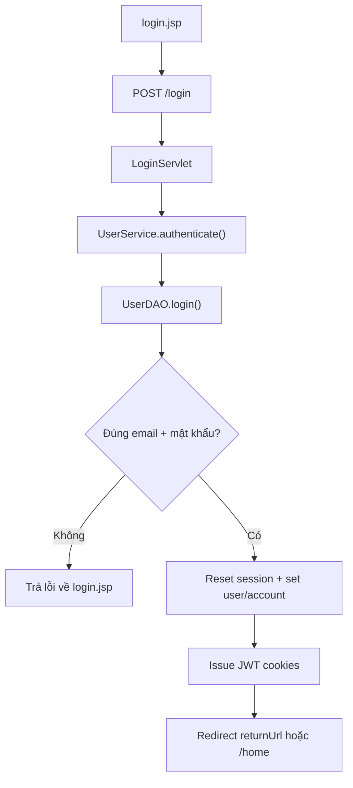
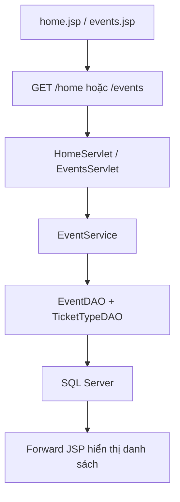
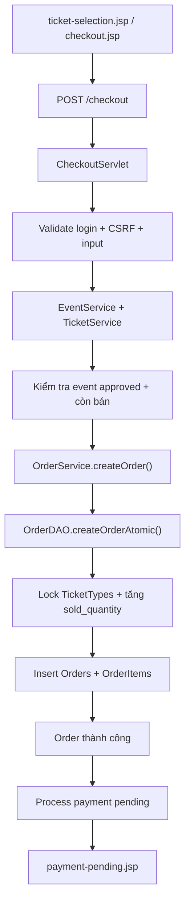
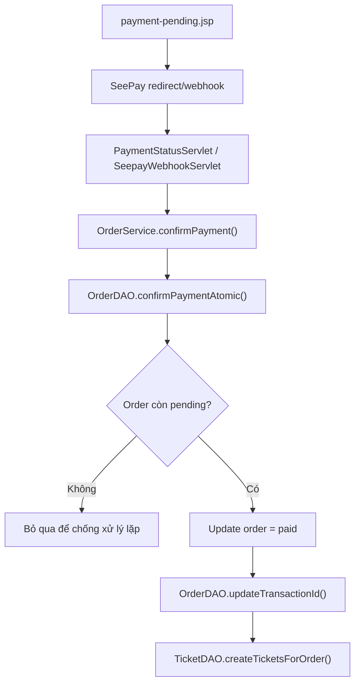
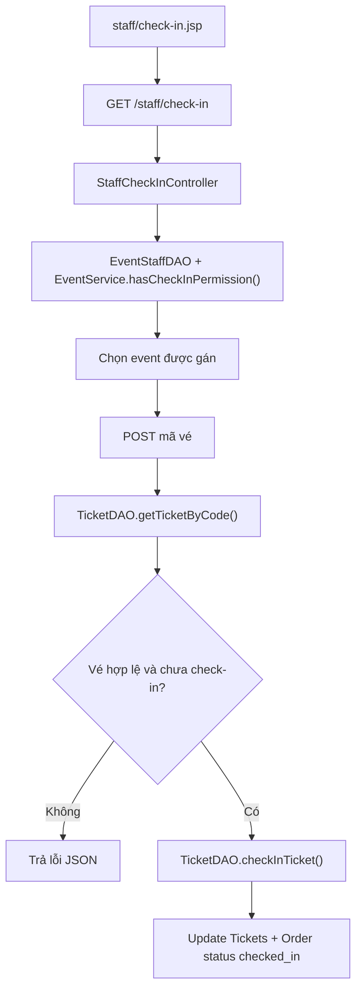
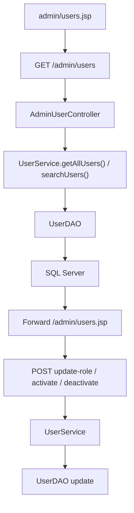
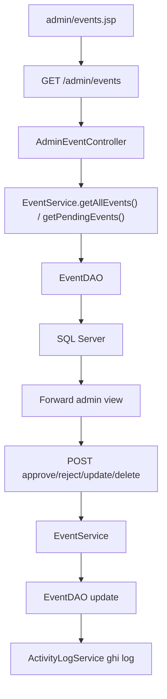

# 16. Short Flow Diagrams

## 1) Luồng đăng nhập

## 2) Luồng xem sự kiện

## 3) Luồng checkout đặt vé

## 4) Luồng thanh toán SeePay

## 5) Luồng check-in staff

## 6) Luồng quản lý user của admin

## 7) Luồng quản lý event của admin

## Tóm tắt dễ nhớ
- Login: JSP -> Servlet -> Service -> DAO -> session/JWT.
- Checkout: validate nhiều lớp rồi mới atomic reserve vé.
- Check-in: verify quyền theo event rồi update ticket/order.

## File nên mở tiếp theo
- `/D:/GITHUB/PRJ301_GROUP4_SELLING_TICKET/SellingTicketJava/docss/00_READ_FIRST.md`

## Điểm người mới hay nhầm
- Sơ đồ slide nên ngắn, chỉ giữ 5-7 bước chính. Đừng nhét quá nhiều chi tiết vào một flow.
