# 18. Master System Teaching Guide

Tài liệu này là bản giảng lại source code ở mức sâu nhất cho hệ thống `SellingTicketJava`.
Mục tiêu không phải tóm tắt, mà là giúp bạn trả lời được:

- request đi qua những file nào
- dữ liệu bị xử lý ra sao
- cơ chế bảo mật đang bảo vệ gì
- phương án hiện tại có tác dụng gì, đánh đổi gì
- nếu bị thầy hỏi thì nên trả lời thế nào cho gọn và đúng

Quy ước đọc:

- `Fact` là điều thấy trực tiếp trong source
- `Inference` là điều suy ra từ cách code/schema đang tổ chức
- chỗ nào là suy luận, tôi sẽ ghi rõ

---

## 1) Đọc tài liệu theo thứ tự nào?

Nếu muốn hiểu hệ thống nhanh mà không bị rối, đọc theo thứ tự:

1. `18_MASTER_SYSTEM_TEACHING_GUIDE.md`
2. `01_PROJECT_OVERVIEW.md`
3. `02_TECH_STACK_ANALYSIS.md`
4. `03_FOLDER_FILE_MAP.md`
5. `04_ARCHITECTURE_FLOW.md`
6. `05_AUTHENTICATION_AUTHORIZATION.md`
7. `06_USER_BUSINESS_FLOW.md`
8. `07_ADMIN_BUSINESS_FLOW.md`
9. `08_STAFF_BUSINESS_FLOW.md`
10. `09_CRUD_ANALYSIS.md`
11. `10_DATABASE_ANALYSIS.md`
12. `11_SECURITY_REVIEW.md`
13. `12_CONCURRENCY_TICKET_LOCKING.md`
14. `13_PERFORMANCE_CODE_QUALITY.md`
15. `14_BUG_RISK_AND_IMPROVEMENT_PLAN.md`
16. `15_LEARNING_PATH_FOR_BEGINNER.md`
17. `16_SHORT_FLOW_DIAGRAMS.md`
18. `17_DEEP_TEACHING_GUIDE.md`

`17_DEEP_TEACHING_GUIDE.md` vẫn hữu ích, nhưng bản này là bản master mới.

---

## 2) Hệ thống này thực chất là gì?

Đây là web app Java kiểu truyền thống:

- `JSP` lo phần giao diện
- `Servlet` nhận request
- `Service` chứa nghiệp vụ
- `DAO` nói chuyện với SQL Server
- `Filter` chặn đăng nhập, phân quyền, chống CSRF và xử lý một số lớp bảo vệ trước khi vào servlet

Đặc điểm nổi bật là hệ thống không đi theo Spring Security, mà tự dựng một lớp an ninh và luồng xử lý riêng.
Điều đó làm code “thủ công” hơn, nhưng lại dễ giải thích khi thuyết trình vì đường đi của request rất rõ.

`DBContext` cũng là một điểm đáng chú ý: nó tự load `db.properties`, mở JDBC tới SQL Server, giữ một pool connection nhẹ bằng `LinkedBlockingQueue`, và bọc `Connection` bằng proxy để `close()` trả connection về pool thay vì hủy thật.
Nghĩa là hệ thống đang dùng connection pool tự viết, không phải HikariCP hay pool ngoài.
Tác dụng là giảm chi phí mở kết nối liên tục; đánh đổi là phải tự giữ kỷ luật về quản lý state và lỗi kết nối.

Nguồn: `src/java/com/sellingticket/util/DBContext.java:17-135,145-216`.

### Bản đồ tổng quan

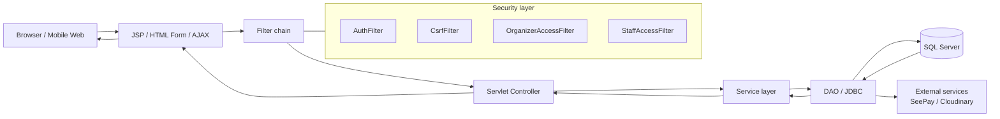

Nguồn chính cho mô hình này nằm ở `web.xml`, các `Servlet`, các `Filter`, `Service`, `DAO`, và `DBContext` (`src/webapp/WEB-INF/web.xml:64-190`, `src/java/com/sellingticket/filter/AuthFilter.java:53-226`, `src/java/com/sellingticket/util/DBContext.java:20-135`).

---

## 3) Request đi qua hệ thống như thế nào?

Cách nghĩ đúng là không đọc theo file, mà đọc theo hành trình của request:

1. Người dùng bấm nút hoặc gửi AJAX
2. Request vào `web.xml`
3. `Filter` chặn trước
4. `Servlet` xử lý
5. `Service` kiểm tra nghiệp vụ
6. `DAO` chạy SQL
7. DB trả kết quả
8. `Servlet` trả JSP, redirect, hoặc JSON

Điểm đáng nhớ:

- `web.xml` gắn `CsrfFilter` và `AuthFilter` cho các route quan trọng
- `AuthFilter` là lớp cửa chính
- `CsrfFilter` là lớp chống request giả
- sau đó mới tới controller thật

`web.xml` map CSRF cho `/login`, `/register`, `/checkout`, `/profile`, `/change-password`, `/support/*`, `/media/upload`, `/organizer/*`, `/admin/*`, `/api/*`; còn auth thì bảo vệ hầu hết route riêng tư như `/organizer/*`, `/admin/*`, `/checkout`, `/tickets`, `/my-tickets`, `/profile`, `/change-password`, `/support/*`, `/api/admin/*`, `/api/organizer/*`, `/api/chat/*`, `/api/payment/*`, `/api/voucher/*`, `/api/upload`, `/media/upload` (`src/webapp/WEB-INF/web.xml:64-190`).

---

## 4) Luồng đăng nhập, session và JWT hoạt động ra sao?

### Sơ đồ login

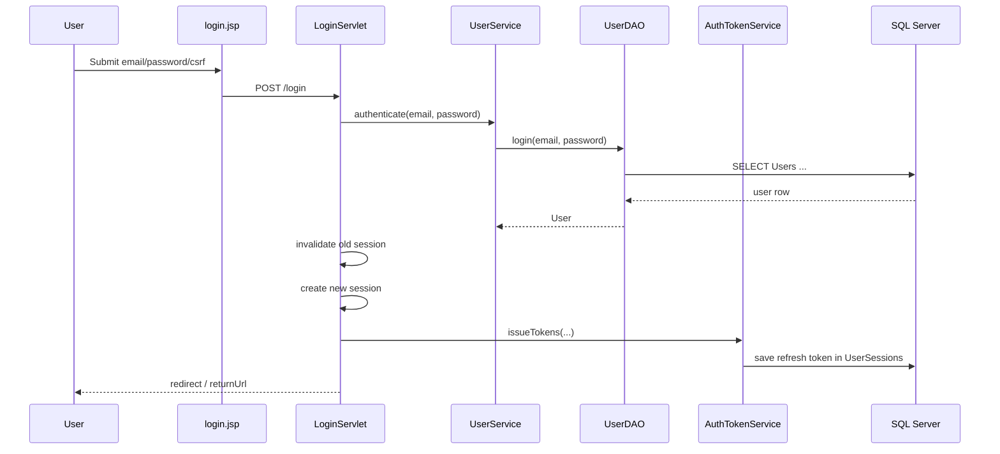

### LoginServlet làm gì?

`LoginServlet` không chỉ “đăng nhập” theo nghĩa đơn giản. Nó làm đồng thời nhiều việc:

- nhận `email`, `password`, `rememberMe`, `returnUrl`
- gọi `UserService.authenticate(email, password)`
- nếu đúng, nó hủy session cũ rồi tạo session mới
- set `user` và `account` vào session
- đảm bảo có `csrf_token`
- set session timeout 3600 giây
- phát hành JWT access/refresh token qua cookie
- xử lý redirect sau login

Các bước này nằm trong `LoginServlet.java:94, 139-175`, còn việc phát hành cookie/token nằm trong `AuthTokenService.java:38-58` và `JwtUtil.java:112-151`.

### Vì sao phải vừa session vừa JWT cookie?

Đây là “phương án hiện tại” của hệ thống:

- `session` là nơi giữ trạng thái đăng nhập nhanh cho JSP/Servlet
- `JWT access + refresh` giúp duy trì đăng nhập qua trình duyệt và cho phép khôi phục session khi access token hết hạn

Tác dụng:

- người dùng không phải đăng nhập lại quá nhanh
- request server-side dễ lấy user từ session
- có thể revoke refresh token trong DB

Tác hại / đánh đổi:

- có 2 nguồn trạng thái, nên logic phức tạp hơn
- phải đồng bộ session với cookie
- nếu quản lý không chặt thì dễ lệch trạng thái giữa cookie và session

`AuthFilter` đọc session trước, rồi mới đọc JWT cookie và phục hồi session nếu cần (`src/java/com/sellingticket/filter/AuthFilter.java:53-127,137-143`).

### Logout thì sao?

Logout không chỉ xóa session.

- `LogoutServlet` gọi `AuthTokenService.revokeTokens(...)`
- refresh token trong DB bị revoke
- auth cookies bị xóa
- session bị invalidate

Nguồn: `src/java/com/sellingticket/controller/LogoutServlet.java:18-29`, `src/java/com/sellingticket/service/AuthTokenService.java:134-168`.

### Token sống bao lâu?

`JwtUtil` cho thấy:

- access token sống 7 ngày
- refresh token sống 30 ngày
- thuật toán ký là `HS256`

Nguồn: `src/java/com/sellingticket/util/JwtUtil.java:26-28,159-212`.

---

## 5) Mật khẩu được bảo vệ thế nào?

Hệ thống không lưu mật khẩu plaintext.

`PasswordUtil` dùng BCrypt với độ khó `12`:

- hash lúc đăng ký / đổi mật khẩu
- check password lúc login

Nguồn: `src/java/com/sellingticket/util/PasswordUtil.java:8-21`.

### Tác dụng

- nếu DB lộ thì mật khẩu gốc không lộ ngay
- BCrypt có salt nên cùng mật khẩu vẫn ra hash khác nhau
- chống brute-force offline tốt hơn hash yếu

### Tác hại / đánh đổi

- tốn CPU hơn hash nhanh
- login chậm hơn một chút

### Phương án hiện tại

Phương án này là đúng và an toàn cho một hệ thống web thực tế. Điểm quan trọng là:

- không tự viết hash
- không dùng MD5/SHA1
- dùng BCrypt chuẩn thư viện

---

## 6) CSRF được xử lý thế nào?

`CsrfFilter` tạo token riêng cho session và kiểm tra mọi `POST` quan trọng.

Nó còn có một chế độ lai:

- request API có Bearer token hợp lệ thì có thể bỏ qua CSRF
- request session-based thì phải có token + origin/referer tin cậy
- webhook SeePay được exempt

Nguồn: `src/java/com/sellingticket/filter/CsrfFilter.java:19-22,43-92,130-205`.

### Sơ đồ CSRF

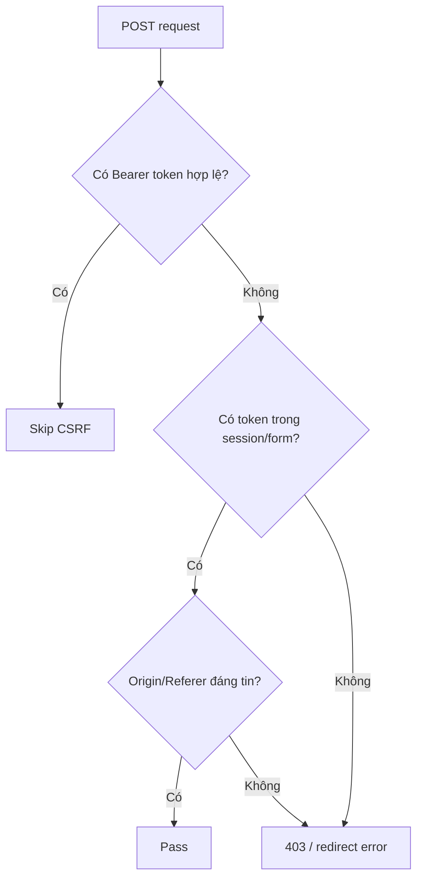

### Tác dụng

- chặn request giả mạo từ trang khác
- bảo vệ form login, register, checkout, upload, admin action

### Tác hại / đánh đổi

- phải nhúng hidden token vào form
- AJAX phải gửi token đúng cách
- origin/referer có thể bị thiếu trong một số môi trường test

### Phương án hiện tại

Đây là cách hợp lý cho app servlet truyền thống vì hệ thống có cả form cũ lẫn API JSON.
Điểm mạnh là linh hoạt.
Điểm yếu là nhiều luật, nên nếu maintain không cẩn thận dễ có route mới bị quên gắn bảo vệ.

---

## 7) Phân quyền đang chạy theo nguyên tắc nào?

### AuthFilter là lớp cửa chính

`AuthFilter` làm 4 việc lớn:

1. cho phép vài route public
2. cho phép webhook SeePay
3. xác thực API bằng Bearer token hoặc cookie/session
4. chặn theo role và theo URL prefix

Điểm thực tế cần nhớ:

- `admin` có full access
- `support_agent` chỉ được mở các khu vực support/chat/notification trong admin portal
- `organizer` và `customer` đi qua các nhánh riêng ở `/organizer/*` và `/api/organizer/*`

Nguồn: `src/java/com/sellingticket/filter/AuthFilter.java:24-31,53-226`.

### Các lớp bảo vệ bổ sung

- `OrganizerAccessFilter` chặn `/organizer/*` nếu user chưa có event được duyệt hoặc không có quyền thao tác phù hợp
- `StaffAccessFilter` chặn `/staff/*` nếu user không nằm trong `EventStaff` hoặc không phải admin

Nguồn: `src/java/com/sellingticket/filter/OrganizerAccessFilter.java:19-95`, `src/java/com/sellingticket/filter/StaffAccessFilter.java:20-61`.

### Admin có gì đặc biệt?

`AdminUserController` có bước kiểm tra `ADMIN_PRIVATE_KEY` trước khi cho gán role admin.

Ý nghĩa:

- không chỉ dựa vào quyền hiện tại
- thêm một lớp khóa nghiệp vụ khi nâng người dùng lên admin

Nguồn: `src/java/com/sellingticket/controller/admin/AdminUserController.java:150-174`.

### Tác dụng

- bảo vệ theo lớp: session/token -> role -> route -> resource
- giảm nguy cơ “đăng nhập là vào hết”

### Tác hại / đánh đổi

- phải nhớ cập nhật filter khi thêm route mới
- route-based access control dễ bị sót nếu code không được review kỹ
- quyền staff không nằm trong role DB mà còn phụ thuộc `EventStaff`, nên logic phải đọc thêm bảng này

---

## 8) Luồng đăng ký, hồ sơ và đổi mật khẩu

`RegisterServlet` đọc input, chuẩn hóa email, validate từng trường, rồi mới gọi `UserService.registerFull(...)`.

Nguồn: `src/java/com/sellingticket/controller/RegisterServlet.java:39-194`, `src/java/com/sellingticket/service/UserService.java:46-125`.

`UserDAO` xử lý:

- tạo user mới mặc định là `customer`
- tìm user theo email
- đổi mật khẩu với kiểm tra mật khẩu cũ
- cập nhật role
- kích hoạt / vô hiệu hóa user

Nguồn: `src/java/com/sellingticket/dao/UserDAO.java:47-75,92-116,262-314`.

### Tác dụng

- giữ dữ liệu sạch
- chống nhập sai kiểu
- giảm lỗi ở tầng DB

### Phương án hiện tại

Hệ thống đang validate khá nhiều ở backend, không tin hoàn toàn vào frontend.
Đây là cách đúng vì người dùng có thể sửa request bằng tay.

---

## 9) Event, organizer và admin quản lý sự kiện thế nào?

### Dòng xử lý chính

- `EventDAO` đọc event theo `id`, `slug`, danh sách theo organizer, thống kê, cập nhật trạng thái, xóa mềm, tăng view
- `AdminEventController` duyệt, từ chối, xóa, feature, pin, unpin, update event
- `OrganizerAccessFilter` đảm bảo organizer chỉ thao tác đúng vùng cho phép

Nguồn: `src/java/com/sellingticket/dao/EventDAO.java:154-740`, `src/java/com/sellingticket/controller/admin/AdminEventController.java:31-251`, `src/java/com/sellingticket/filter/OrganizerAccessFilter.java:49-95`.

### Hiểu nhanh cho thầy

Bạn có thể nói:

> “Organizer tạo và quản lý event của mình, admin duyệt và kiểm soát trạng thái event, còn filter sẽ khóa bớt các đường dẫn nếu user chưa đủ điều kiện truy cập.”

### Tác dụng

- tách rõ vai trò người tạo, người duyệt, người xem
- tránh organizer đi vào chức năng không thuộc phạm vi của họ

### Tác hại / đánh đổi

- nhiều trạng thái hơn, nhiều nhánh hơn
- khi code sai một nhánh duyệt/trạng thái, có thể dẫn đến event hiển thị sai

---

## 10) Checkout, voucher và chống bán vượt vé

Đây là luồng quan trọng nhất của hệ thống.

### Sơ đồ checkout

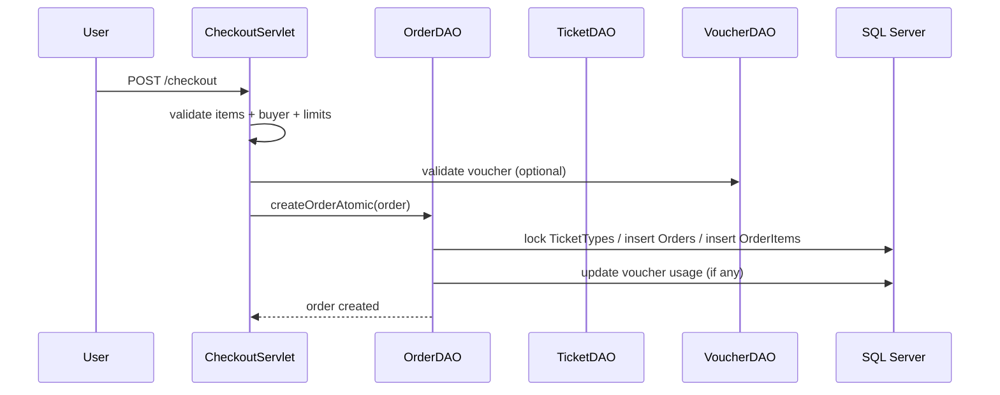

### CheckoutServlet làm gì?

`CheckoutServlet`:

- có xử lý voucher qua AJAX
- dùng cờ session `checkoutInProgress` để giảm double-submit
- build order từ request
- kiểm tra số lượng vé, giới hạn mỗi người, giới hạn mỗi đơn, giới hạn tổng vé của event
- kiểm tra số vé user đã mua trước đó
- ép phương thức thanh toán về `seepay`

Nguồn: `src/java/com/sellingticket/controller/CheckoutServlet.java:99-429`.

### OrderDAO mới là lớp an toàn thật sự

`OrderDAO.createOrderAtomic(order)` dùng transaction và lock:

- `UPDLOCK, HOLDLOCK` trên `TicketTypes`
- insert order
- insert order items
- cập nhật voucher usage
- commit / rollback theo transaction

Nguồn: `src/java/com/sellingticket/dao/OrderDAO.java:21-105`.

### Tại sao cách này tốt?

- chặn oversell khi nhiều người đặt cùng lúc
- dữ liệu order và stock đi cùng một transaction
- voucher usage cũng được cập nhật đồng bộ

### Tác hại / đánh đổi

- lock làm hệ thống chậm hơn khi tải cao
- transaction dài hơn thì cạnh tranh lock nhiều hơn
- code khó hơn so với chỉ `INSERT` đơn giản

### Phương án hiện tại

Phương án này là đúng cho hệ thống bán vé vì “không bán vượt số lượng” quan trọng hơn tốc độ cực cao.
Nói ngắn gọn:

> “Tốc độ có thể tối ưu tiếp, nhưng bán sai số lượng thì không chấp nhận được.”

### Voucher

`VoucherDAO` tạo, sửa, xóa voucher, đọc voucher theo organizer, đọc voucher theo mã.
Trong schema, `voucherScope` có thể là `SYSTEM` hoặc `EVENT`, nên voucher có thể áp dụng toàn hệ thống hoặc theo từng event.

Nguồn: `src/java/com/sellingticket/dao/VoucherDAO.java:40-158`, `database/schema/ticketbox_schema.sql:315-345`.

---

## 11) Thanh toán, idempotency và webhook

`OrderDAO.confirmPaymentAtomic(...)` chỉ cập nhật đơn nếu trạng thái còn là `pending`.

Ý nghĩa:

- tránh xử lý lại một đơn đã được confirm
- giảm lỗi double-confirm

Nguồn: `src/java/com/sellingticket/dao/OrderDAO.java:340-345`.

`OrderDAO.updateTransactionId(...)` ghi transaction vào `PaymentTransactions`.

Nguồn: `src/java/com/sellingticket/dao/OrderDAO.java:367-376`, `database/schema/ticketbox_schema.sql:268`.

Schema còn có `SeepayWebhookDedup`.

Inference: tên bảng này cho thấy hệ thống đã tính đến việc webhook có thể bắn lặp, nên cần cơ chế chống xử lý trùng.
Tôi ghi rõ đây là suy luận từ schema, vì controller webhook không được đọc sâu hết trong đợt này.

Nguồn: `database/schema/ticketbox_schema.sql:299`.

### Tác dụng

- chống ghi thanh toán trùng
- giảm lỗi khi provider gửi callback nhiều lần

### Tác hại / đánh đổi

- phải duy trì thêm bảng dedup / transaction log
- logic payment khó debug hơn flow CRUD thường

---

## 12) Vé được sinh ra và check-in thế nào?

### Sơ đồ check-in

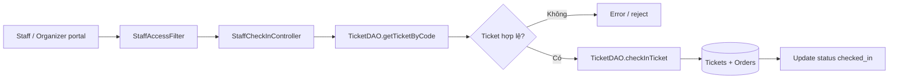

### Luồng tạo ticket

`TicketDAO.createTicketsForOrder(...)`:

- lấy order items
- insert ticket
- sinh ticket code
- tạo QR code / cập nhật lại sau khi có key cần thiết

Nguồn: `src/java/com/sellingticket/dao/TicketDAO.java:30-93,263-278`.

### Luồng check-in

`TicketDAO.checkInTicket(...)`:

- đánh dấu ticket đã check-in
- nếu tất cả ticket của order đã check-in thì update order status sang `checked_in`

Nguồn: `src/java/com/sellingticket/dao/TicketDAO.java:176-188`.

### Staff portal

`StaffCheckInController`:

- nếu không có `eventId` thì load danh sách event được phân công
- kiểm tra quyền check-in qua `eventService.hasCheckInPermission(...)`
- nhận `ticketCode`
- chặn vé đã check-in
- gọi `ticketDAO.checkInTicket(...)`

Nguồn: `src/java/com/sellingticket/controller/staff/StaffCheckInController.java:39-127`.

### Tác dụng

- check-in có thể kiểm soát theo event
- không phải ai cũng cầm điện thoại quét vé là xong
- trạng thái vé và đơn được đồng bộ

### Phương án hiện tại

Staff không phải một role DB riêng.
Quyền staff phụ thuộc bảng `EventStaff` và filter portal staff.
Đây là cách linh hoạt vì một người có thể làm staff cho nhiều event khác nhau.

Nguồn: `src/java/com/sellingticket/dao/EventStaffDAO.java:17-129`, `src/java/com/sellingticket/filter/StaffAccessFilter.java:20-61`, `database/schema/ticketbox_schema.sql:435`.

---

## 13) Support, chat và notification đang ra sao?

### Support ticket

`SupportTicketDAO` có:

- tạo ticket
- thêm message
- cập nhật status
- assign ticket

Nguồn: `src/java/com/sellingticket/dao/SupportTicketDAO.java:21-219`.

### Notification

`NotificationDAO` có:

- mark một notification là đã đọc
- mark tất cả là đã đọc

Nguồn: `src/java/com/sellingticket/dao/NotificationDAO.java:17-95`.

### Chat

Schema có `ChatSessions` và `ChatMessages`, và `AuthFilter` cũng bảo vệ `/api/chat/*`.

Inference:

- hệ thống có subsystem chat nội bộ / support chat
- phần controller/view chat chưa được tổng hợp sâu như checkout và auth trong bộ tài liệu này, nhưng sự tồn tại của bảng và route cho thấy đây là một feature thật

Nguồn: `src/webapp/WEB-INF/web.xml:112-190`, `database/schema/ticketbox_schema.sql:509-530`.

### Tác dụng

- tạo kênh hỗ trợ người dùng
- hỗ trợ xử lý ticket và phản hồi
- tạo điểm theo dõi tương tác

---

## 14) Database đang tổ chức theo kiểu nào?

### Các bảng lõi

- `Users` cho tài khoản và role (`database/schema/ticketbox_schema.sql:26-34`)
- `Categories` cho phân loại (`:76-84`)
- `Media` cho ảnh/video Cloudinary (`:94-119`)
- `Events` cho sự kiện (`:133-167`)
- `TicketTypes` cho loại vé (`:167-190`)
- `Orders`, `OrderItems`, `Tickets` cho dòng mua vé (`:192-245`)
- `PaymentTransactions` cho giao dịch (`:268`)
- `SeepayWebhookDedup` cho chống webhook trùng (`:299`)
- `Vouchers`, `VoucherUsages` cho mã giảm giá (`:315-345`)
- `UserSessions` cho refresh token/session persistence (`:363`)
- `PasswordResets`, `Permissions`, `RolePermissions` cho reset mật khẩu và ma trận quyền (`:384,403,419`)
- `EventStaff` cho quyền staff theo event (`:435`)
- `SupportTickets`, `TicketMessages` cho support (`:456-490`)
- `ChatSessions`, `ChatMessages` cho chat (`:509-530`)
- `SiteSettings` cho cấu hình hệ thống (`:548`)
- `ActivityLog` cho log hoạt động (`:562`)
- `Notifications` cho thông báo (`:582`)

### Bảng session/token

`RefreshTokenDAO` dùng trực tiếp bảng `UserSessions` để lưu refresh token state:

- `session_token` là JWT jti
- `device_info` là user-agent
- `ip_address` là IP client
- `expires_at` là hạn
- `is_active` dùng để revoke

Nguồn: `src/java/com/sellingticket/dao/RefreshTokenDAO.java:9-117`.

### Seed dữ liệu

Schema có seed 3 user mẫu:

- admin
- organizer
- customer

Nguồn: `database/schema/ticketbox_schema.sql:850-872`.

### Tác dụng

- schema đã được thiết kế đủ để chạy luồng thực tế chứ không chỉ demo CRUD
- có cả security / payment / support / notification

### Tác hại / đánh đổi

- nhiều bảng hơn thì query/join nhiều hơn
- maintenance khó hơn CRUD đơn giản

---

## 15) Cơ chế bảo mật hiện tại có tác dụng gì, và có điểm yếu nào?

### 15.1 Session fixation protection

Trong `LoginServlet` và `AuthFilter`, hệ thống invalidates session cũ rồi tạo session mới sau khi đăng nhập hoặc khôi phục session.

Tác dụng:

- giảm rủi ro session fixation

Đánh đổi:

- code auth phức tạp hơn

Nguồn: `src/java/com/sellingticket/controller/LoginServlet.java:139-151`, `src/java/com/sellingticket/filter/AuthFilter.java:97-127`.

### 15.2 HttpOnly / SameSite / Secure cookies

`CookieUtil` tạo cookie `HttpOnly`, `SameSite=Lax`, và `Secure` nếu dùng HTTPS.

Tác dụng:

- giảm khả năng JS đọc cookie
- giảm rủi ro CSRF ở mức nhất định
- đảm bảo cookie chỉ đi qua HTTPS khi cấu hình đúng

Đánh đổi:

- nếu dev/test không chuẩn HTTPS, Secure cookie có thể gây khó debug

Nguồn: `src/java/com/sellingticket/util/CookieUtil.java:8-74`.

### 15.3 JWT HS256 + secret chung

`JwtUtil` ký token bằng HS256 với secret từ `AppConstants.JWT_SECRET`.

Tác dụng:

- token có thể verify nhanh
- không cần public/private key như RSA trong project nhỏ

Đánh đổi:

- secret lộ thì toàn bộ token bị ảnh hưởng

Nguồn: `src/java/com/sellingticket/util/JwtUtil.java:18-23,205-223`.

### 15.4 Pha trộn session + refresh token DB

Tác dụng:

- dễ login lại
- có thể revoke token theo DB
- phù hợp web app truyền thống

Đánh đổi:

- có 2 nơi phải đồng bộ
- cần dọn token hết hạn

Nguồn: `src/java/com/sellingticket/service/AuthTokenService.java:38-168`, `src/java/com/sellingticket/dao/RefreshTokenDAO.java:24-117`.

### 15.5 Route-based authorization

Tác dụng:

- dễ kiểm soát theo URL
- dễ giải thích

Đánh đổi:

- khi thêm route mới phải nhớ cập nhật filter
- nếu map thiếu thì có thể lộ đường vào

Nguồn: `src/webapp/WEB-INF/web.xml:64-190`, `src/java/com/sellingticket/filter/AuthFilter.java:153-223`.

Lưu ý thêm:

- `support_agent` chỉ được mở các khu vực support/chat/notification trong admin portal
- `organizer` và `customer` cũng có nhánh riêng trong route API
- `Permissions` và `RolePermissions` có tồn tại trong schema, nhưng trong bộ luồng đã đọc ở đây, lớp bảo vệ thực thi chính vẫn là filter + role + bảng staff/event

Nguồn: `src/java/com/sellingticket/filter/AuthFilter.java:153-223`, `database/schema/ticketbox_schema.sql:403-419`.

### 15.6 Transaction và lock chống oversell

Tác dụng:

- bảo vệ số lượng vé
- chống race condition khi nhiều người đặt cùng lúc

Đánh đổi:

- contention cao hơn
- throughput giảm khi peak traffic

Nguồn: `src/java/com/sellingticket/dao/OrderDAO.java:21-105`.

---

## 16) Nếu thầy hỏi, trả lời thế nào cho ngắn mà đúng?

### Câu 1: “Hệ thống này dùng kiến trúc gì?”

Bạn có thể trả lời:

> “Đây là Java Web truyền thống theo mô hình `Servlet/JSP`, tách lớp `Controller -> Service -> DAO -> SQL Server`. Bảo mật được xử lý bằng `Filter` như `AuthFilter` và `CsrfFilter`.”

### Câu 2: “Đăng nhập xong chuyện gì xảy ra?”

> “`LoginServlet` gọi `UserService.authenticate`, rồi invalidates session cũ, tạo session mới, set `user/account`, sinh CSRF token và phát hành JWT access/refresh token qua cookie. Sau đó `AuthFilter` dùng session hoặc cookie để giữ trạng thái đăng nhập.”

### Câu 3: “Vì sao không bán vượt vé?”

> “Vì checkout không chỉ check ở servlet mà còn có `OrderDAO.createOrderAtomic` dùng transaction và lock `UPDLOCK/HOLDLOCK` để reserve stock. Nên dù nhiều người đặt cùng lúc, DB vẫn là nơi chốt số lượng cuối cùng.”

### Câu 4: “CSRF đang bảo vệ gì?”

> “`CsrfFilter` bắt token trong form/POST, riêng API bearer token thì có cơ chế khác. Mục tiêu là ngăn request giả mạo từ site khác.”

### Câu 5: “Staff access dựa vào đâu?”

> “Không phải role riêng trong DB. Staff được quyết định bởi bảng `EventStaff` và các filter route `/staff/*`.”

---

## 17) Chốt lại: phương án hiện tại mạnh ở đâu, yếu ở đâu?

### Mạnh

- dễ đọc source
- luồng request rõ ràng
- bảo mật có nhiều lớp
- tránh oversell bằng transaction thật
- có sẵn support, notification, chat, activity log

### Yếu

- nhiều cơ chế tự code nên phải giữ kỷ luật cao
- auth hiện tại là hybrid nên phức tạp
- route protection phụ thuộc maintainer nhớ cập nhật `web.xml`
- chat/payment/support chưa được chuẩn hóa bằng framework hiện đại

### Kết luận ngắn gọn

Nếu nói theo kiểu “đánh giá hệ thống”, bạn có thể nói:

> “Phương án hiện tại đủ tốt cho một project Java Web thực chiến: có phân tầng, có filter bảo mật, có CSRF, có session fixation protection, có refresh token persistence, có transaction chống oversell. Đổi lại, code phức tạp hơn một hệ thống CRUD đơn giản vì phải tự quản lý nhiều lớp an ninh và trạng thái.”

---

## 18) Bảo mật theo lý thuyết: hệ thống đang phòng cái gì?

Nếu gom theo lý thuyết bảo mật, hệ thống này đang phòng 6 nhóm rủi ro chính:

| Rủi ro | Cơ chế đang dùng | Source chính | Đánh đổi |
|---|---|---|---|
| Mạo danh / takeover tài khoản | BCrypt, session fixation protection, JWT cookie, revoke refresh token | `PasswordUtil`, `LoginServlet`, `AuthTokenService`, `RefreshTokenDAO`, `JwtUtil` | tốn CPU hơn, auth phức tạp hơn |
| CSRF | `CsrfFilter`, hidden token, origin/referer check, webhook exemption | `CsrfFilter`, `web.xml` | form/AJAX phải mang token đúng |
| Truy cập trái phép | `AuthFilter`, `OrganizerAccessFilter`, `StaffAccessFilter` | các filter + `web.xml` | phải cập nhật route thủ công |
| Bán vượt vé | transaction, `UPDLOCK/HOLDLOCK`, limit check ở servlet | `CheckoutServlet`, `OrderDAO` | lock nhiều hơn, contention cao hơn |
| Xử lý trùng / replay | `confirmPaymentAtomic`, `SeepayWebhookDedup` | `OrderDAO`, schema | thêm state, khó debug hơn |
| Lộ cookie / secret | `HttpOnly`, `SameSite`, `Secure`, `HS256` secret | `CookieUtil`, `JwtUtil` | cookie ít linh hoạt hơn, secret phải giữ kín |

### Tư duy defense in depth

Điểm hay của source này là nó không tin một lớp duy nhất.

- Frontend có hidden CSRF token
- Filter chặn trước servlet
- Service kiểm tra nghiệp vụ
- DAO chốt bằng transaction
- DB là nơi quyết định cuối cùng

Nói cách khác:

> “UI giúp người dùng thao tác, filter chặn kẻ xấu, service kiểm tra đúng/sai theo business, DAO bảo vệ dữ liệu thật bằng transaction.”

### Authentication, authorization và session khác nhau thế nào?

- `Authentication` là xác minh “ai đang vào?”
- `Authorization` là xác minh “người đó được làm gì?”
- `Session` là bộ nhớ tạm của lần đăng nhập trong server
- `JWT access/refresh` là cách duy trì danh tính giữa các request và giữa các lần mở trình duyệt

Trong source:

- `Authentication` nằm ở `LoginServlet` -> `UserService` -> `UserDAO` -> `PasswordUtil`
- `Authorization` nằm ở `AuthFilter`, `OrganizerAccessFilter`, `StaffAccessFilter`
- `Session` nằm ở `HttpSession`
- `JWT + refresh persistence` nằm ở `AuthTokenService`, `RefreshTokenDAO`, `JwtUtil`, `CookieUtil`

### Anti-replay và idempotency

Hai khái niệm này rất đáng nhớ:

- `Anti-replay` là ngăn request hoặc callback được dùng lại để tạo hiệu ứng xấu
- `Idempotency` là bấm/nhận lại nhiều lần nhưng kết quả vẫn không bị nhân đôi

Trong project:

- `confirmPaymentAtomic()` chỉ cho update khi order còn `pending`
- bảng `SeepayWebhookDedup` cho thấy webhook trùng đã được nghĩ đến

Nguồn: `src/java/com/sellingticket/dao/OrderDAO.java:340-345,367-387`, `database/schema/ticketbox_schema.sql:299`.

---

## 19) Bài thực hành trên code: tự trace từng luồng

Phần này là để bạn học như đang làm lab. Mỗi bài đều có:

- file cần mở
- câu hỏi phải tự trả lời
- đáp án ngắn để tự kiểm tra

### Bài 1: Trace login end-to-end

Mở:

- `src/webapp/login.jsp`
- `src/webapp/WEB-INF/web.xml`
- `src/java/com/sellingticket/controller/LoginServlet.java`
- `src/java/com/sellingticket/service/UserService.java`
- `src/java/com/sellingticket/dao/UserDAO.java`
- `src/java/com/sellingticket/util/PasswordUtil.java`
- `src/java/com/sellingticket/service/AuthTokenService.java`

Tự hỏi:

1. Form gửi gì lên server?
2. CSRF token lấy từ đâu?
3. Password được verify ở đâu?
4. Session mới được tạo ở đâu?
5. Refresh token được lưu ở đâu?

Đáp án ngắn:

- form gửi `email`, `password`, `rememberMe`, `returnUrl`, `csrf_token`
- verify mật khẩu bằng BCrypt trong `PasswordUtil`
- session cũ bị invalidate trong `LoginServlet`
- session mới set `user`, `account`, `csrf_token`
- refresh token được persist qua `AuthTokenService` -> `RefreshTokenDAO` -> `UserSessions`

### Bài 2: Trace checkout và chống bán vượt vé

Mở:

- `src/java/com/sellingticket/controller/CheckoutServlet.java`
- `src/java/com/sellingticket/dao/OrderDAO.java`
- `src/java/com/sellingticket/dao/VoucherDAO.java`
- `src/java/com/sellingticket/dao/TicketDAO.java`

Tự hỏi:

1. Check số lượng vé ở tầng nào?
2. Voucher được validate ở tầng nào?
3. Lock chống oversell nằm ở đâu?
4. Khi nào order được coi là đã chốt?

Đáp án ngắn:

- `CheckoutServlet` check limit, số lượng, buyer info, per-user cap
- voucher được kiểm qua `VoucherDAO` và xử lý trong `CheckoutServlet`
- lock thật nằm trong `OrderDAO.createOrderAtomic()` với `UPDLOCK/HOLDLOCK`
- order chỉ an toàn khi transaction commit thành công

### Bài 3: Trace CSRF

Mở:

- `src/java/com/sellingticket/filter/CsrfFilter.java`
- `src/webapp/login.jsp`
- `src/webapp/register.jsp`
- `src/webapp/checkout.jsp`

Tự hỏi:

1. Token được gắn vào request như thế nào?
2. POST nào bị chặn?
3. Khi nào API bearer token được skip?
4. Request nào được exempt?

Đáp án ngắn:

- token được tạo theo session và đưa xuống request attribute
- POST không có token hợp lệ sẽ bị chặn
- bearer token hợp lệ có thể bypass CSRF cho API
- webhook SeePay được exempt

### Bài 4: Trace staff check-in

Mở:

- `src/java/com/sellingticket/filter/StaffAccessFilter.java`
- `src/java/com/sellingticket/controller/staff/StaffCheckInController.java`
- `src/java/com/sellingticket/dao/EventStaffDAO.java`
- `src/java/com/sellingticket/dao/TicketDAO.java`

Tự hỏi:

1. Ai được vào `/staff/*`?
2. Danh sách event staff lấy từ đâu?
3. Vé đã check-in rồi thì sao?
4. Khi nào order chuyển sang `checked_in`?

Đáp án ngắn:

- admin hoặc user nằm trong `EventStaff`
- danh sách event lấy từ `EventStaffDAO.getEventsWhereStaff(...)`
- vé đã check-in bị từ chối
- khi toàn bộ vé của order đã check-in thì order đổi trạng thái

### Bài 5: Trace logout và revoke token

Mở:

- `src/java/com/sellingticket/controller/LogoutServlet.java`
- `src/java/com/sellingticket/service/AuthTokenService.java`
- `src/java/com/sellingticket/dao/RefreshTokenDAO.java`

Tự hỏi:

1. Logout xóa gì ngoài session?
2. Token nào bị revoke?
3. Làm sao force logout toàn bộ thiết bị?

Đáp án ngắn:

- logout xóa session và auth cookies
- refresh token trong DB bị revoke
- `revokeAllTokens(userId)` có thể force logout mọi thiết bị

### Bài 6: Tự test hiểu biết nhanh

Nếu bạn trả lời được 5 câu sau mà không nhìn đáp án, tức là đã nắm khá chắc flow:

1. `AuthFilter` khác `CsrfFilter` ở chỗ nào?
2. Vì sao login phải invalidate session cũ?
3. Vì sao checkout không chỉ kiểm tra ở servlet mà còn phải có transaction trong DAO?
4. Vì sao staff không phải là role riêng trong DB?
5. Vì sao `confirmPaymentAtomic()` chỉ update khi status còn `pending`?

---

## 20) Atlas tính năng: muốn tra luồng nào thì mở file nào?

Phần này dùng như “bản đồ điều hướng”. Khi thầy hỏi một tính năng, bạn không cần nhớ hết code, chỉ cần nhớ:

- route đi vào đâu
- servlet/controller nào nhận request
- service/DAO nào xử lý nghiệp vụ
- bảng DB nào giữ trạng thái thật

### 20.1. Bản đồ tính năng theo luồng

| Tính năng | Route / điểm vào | File xử lý chính | Service / DAO chính | Bảng dữ liệu chính |
|---|---|---|---|---|
| Trang chủ / danh sách sự kiện | `/home`, `/events` | `HomeServlet`, `EventsServlet` | `EventService`, `EventDAO` | `Events`, `Categories`, `Media` |
| Chi tiết sự kiện | `/event-detail` | `EventDetailServlet` | `EventService`, `TicketTypeDAO`, `MediaDAO` | `Events`, `TicketTypes`, `Media` |
| Chọn vé trước checkout | `/tickets` | `TicketSelectionServlet` | `EventService`, `TicketService` | `Events`, `TicketTypes` |
| Đăng ký | `/register` | `RegisterServlet` | `UserService`, `UserDAO` | `Users` |
| Đăng nhập | `/login` | `LoginServlet` | `UserService`, `AuthTokenService`, `RefreshTokenDAO` | `Users`, `UserSessions` |
| Google OAuth | `/auth/google` hoặc route servlet tương ứng | `GoogleOAuthServlet` | `UserService`, `UserDAO` | `Users` |
| Đăng xuất | `/logout` | `LogoutServlet` | `AuthTokenService`, `RefreshTokenDAO` | `UserSessions` |
| Hồ sơ cá nhân | `/profile` | `ProfileServlet` | `UserService`, `MediaService` | `Users`, `Media` |
| Đổi mật khẩu | `/change-password` | `ChangePasswordServlet` | `UserService`, `PasswordUtil` | `Users` |
| Upload media người dùng / sự kiện | `/media/upload`, `/api/upload` | `MediaUploadServlet`, `UploadServlet` | `MediaService`, `MediaDAO`, `CloudinaryUtil` | `Media` |
| Checkout | `/checkout` | `CheckoutServlet` | `OrderService`, `VoucherService`, `OrderDAO`, `VoucherDAO` | `Orders`, `OrderItems`, `TicketTypes`, `VoucherUsages` |
| Khởi tạo thanh toán | bên trong checkout | `CheckoutServlet` | `OrderService`, `PaymentFactory`, `SeepayProvider` | `Orders`, `PaymentTransactions` |
| Poll trạng thái thanh toán | `/api/payment/status` | `PaymentStatusServlet` | `OrderService`, `OrderDAO`, `TicketDAO` | `Orders`, `Tickets`, `PaymentTransactions` |
| Webhook SePay | `/api/seepay/webhook` | `SeepayWebhookServlet` | `OrderService`, `SeepayWebhookDedupDAO` | `Orders`, `Tickets`, `SeepayWebhookDedup`, `PaymentTransactions` |
| Xác nhận đơn sau thanh toán | `/order-confirmation`, `/resume-payment` | `OrderConfirmationServlet`, `ResumePaymentServlet` | `OrderService`, `OrderDAO` | `Orders`, `OrderItems` |
| Vé của tôi / đơn của tôi | `/my-tickets`, `/api/my-tickets`, `/api/my-orders` | `MyTicketsServlet`, `MyTicketApiServlet`, `MyOrderApiServlet` | `TicketService`, `OrderService`, `TicketDAO`, `OrderDAO` | `Tickets`, `Orders`, `OrderItems`, `Events` |
| Trung tâm thông báo | `/notifications` và action read/count | `NotificationController`, `AdminNotificationController` | `NotificationService`, `NotificationDAO` | `Notifications` |
| Support ticket của customer | `/support/*` | `SupportTicketServlet` | `SupportTicketService`, `SupportTicketDAO` | `SupportTickets`, `TicketMessages` |
| Chat realtime-style giữa user và admin/organizer | `/api/chat/*`, `/organizer/chat`, `/admin/chat-dashboard` | `ChatApiServlet`, `OrganizerChatController`, `AdminChatDashboardController` | `ChatService`, `ChatDAO`, `CustomerTierService` | `ChatSessions`, `ChatMessages`, `Users` |
| Dashboard admin | `/admin`, `/admin/dashboard` | `AdminDashboardController` | `DashboardService`, `DashboardDAO` | nhiều bảng tổng hợp |
| Quản lý user admin | `/admin/users`, `/api/admin/users` | `AdminUserController`, `AdminUserApiServlet` | `UserService`, `UserDAO` | `Users`, `RolePermissions`, `ActivityLog` |
| Duyệt / quản lý sự kiện admin | `/admin/events`, `/api/admin/events` | `AdminEventController`, `AdminEventApiServlet`, `AdminEventFeatureApiServlet` | `EventService`, `EventDAO` | `Events`, `Media`, `Categories` |
| Quản lý đơn admin | `/admin/orders`, `/api/admin/orders`, `/api/admin/orders/confirm-payment` | `AdminOrderController`, `AdminOrderApiServlet`, `AdminConfirmPaymentApiServlet` | `OrderService`, `OrderDAO`, `TicketDAO` | `Orders`, `Tickets`, `PaymentTransactions` |
| Báo cáo / activity log / settings admin | `/admin/reports`, `/admin/activity-log`, `/admin/settings` | `AdminReportsController`, `AdminActivityLogController`, `AdminSettingsController` | `DashboardService`, `ActivityLogService`, `SiteSettingsDAO` | `ActivityLog`, `SiteSettings`, các bảng thống kê |
| Voucher hệ thống admin | `/admin/system-vouchers` | `AdminSystemVoucherController` | `VoucherService`, `VoucherDAO` | `Vouchers`, `VoucherUsages` |
| Dashboard organizer | `/organizer`, `/organizer/dashboard` | `OrganizerDashboardController` | `DashboardService`, `DashboardDAO` | `Events`, `Orders`, `Tickets` |
| Vòng đời sự kiện organizer | `/organizer/events`, `/organizer/create-event`, `/organizer/events/*` | `OrganizerEventController` | `EventService`, `CategoryService`, `TicketService`, `OrderService` | `Events`, `Media`, `EventStaff`, `Orders` |
| Ticket types của organizer | `/organizer/tickets` | `OrganizerTicketController` | `TicketService`, `TicketTypeDAO` | `TicketTypes` |
| Voucher của organizer | `/organizer/vouchers` | `OrganizerVoucherController` | `VoucherService`, `VoucherDAO` | `Vouchers`, `VoucherUsages` |
| Team/staff sự kiện | `/organizer/team`, `/organizer/events/*/staff` | `OrganizerTeamController`, `OrganizerEventController` | `EventStaffDAO`, `PermissionCache`, `EventService` | `EventStaff`, `Users` |
| Check-in tại cổng sự kiện | `/organizer/check-in`, `/staff/check-in` | `OrganizerCheckInController`, `StaffCheckInController` | `TicketDAO`, `EventStaffDAO`, `PermissionCache` | `Tickets`, `Orders`, `EventStaff` |
| Support center của organizer | `/organizer/support/*` | `OrganizerSupportController` | `SupportTicketService`, `SupportTicketDAO` | `SupportTickets`, `TicketMessages` |
| Statistics của organizer | `/organizer/statistics` | `OrganizerStatisticsController` | `DashboardService`, `DashboardDAO` | `Orders`, `Tickets`, `Events` |

### 20.2. Cách đọc một tính năng cho nhanh

Khi muốn hiểu một flow bất kỳ, đọc theo đúng thứ tự này:

1. Route mapping trong `web.xml` hoặc annotation `@WebServlet`
2. Controller/Servlet nhận request
3. Service xử lý nghiệp vụ
4. DAO chạm database
5. Schema SQL để hiểu trạng thái dữ liệu thật

Mẹo học nhanh:

- Nếu là câu hỏi “ai được làm gì?”: mở `web.xml` + filter trước
- Nếu là câu hỏi “vì sao không bị race condition?”: mở controller rồi xuống DAO transaction
- Nếu là câu hỏi “dữ liệu cuối cùng nằm ở đâu?”: mở schema

---

## 21) Luồng đồng thời và race condition: hệ thống đang chống đụng nhau ra sao?

Đây là phần rất quan trọng vì project bán vé luôn có rủi ro nhiều request đến cùng lúc.

### 21.1. Bảng điểm nóng đồng thời

| Điểm nóng đồng thời | Cơ chế hiện tại | Tác dụng | Giới hạn / tác hại |
|---|---|---|---|
| User bấm checkout nhiều lần trong cùng session | cờ `checkoutInProgress` trong session | giảm double-submit ở browser/session đó | không chặn được 2 thiết bị khác nhau |
| 2 user mua nốt số vé cuối cùng | `createOrderAtomic()` + `UPDLOCK, HOLDLOCK` | chặn oversell tại DB | lock tăng, có thể contention khi flash sale |
| Poll thanh toán + webhook cùng xác nhận 1 order | `confirmPaymentAtomic()` chỉ update khi `status='pending'` | ai đến sau sẽ fail an toàn | phải chấp nhận logic “already processed” |
| Webhook SePay gửi lại nhiều lần | dedup in-memory + dedup DB + check order status | chống replay / retry / duplicate callback | in-memory mất khi restart, phải dựa thêm DB |
| Cấp vé sau khi xác nhận thanh toán | issue ticket sau khi mark paid | user không bị mất trạng thái thanh toán | có cửa sổ “đã paid nhưng vé chưa generate xong” nếu lỗi phát sinh |
| Check-in cùng lúc quét 1 vé hai lần | `UPDATE ... WHERE is_checked_in = 0` | chỉ 1 request thắng | request thua phải xử lý UX “vé đã check-in” |
| Nhiều request lấy connection DB | pool nhẹ dùng `LinkedBlockingQueue` + `AtomicInteger` | giảm cost mở connection liên tục | không mạnh bằng pool chuyên dụng như HikariCP |
| Brute force login nhiều luồng | `ConcurrentHashMap` + progressive lockout | chặn spam đăng nhập nhanh | chỉ là memory local, restart là mất |
| Permission staff thay đổi lúc người dùng đang thao tác | `PermissionCache` có TTL + invalidate | giảm query lặp lại mà vẫn có kiểm soát | có độ trễ TTL ngắn trước khi cache hết hạn nếu chưa invalidate |

### 21.2. Checkout chống bán vượt vé

Flow thật sự không dừng ở `CheckoutServlet`.

- `CheckoutServlet` lọc request xấu: eventId, ticket type, quantity, per-user limit, buyer info, voucher
- `OrderService.createOrder()` chuyển xuống `OrderDAO.createOrderAtomic()`
- chính DAO mới là nơi “khóa dữ liệu thật” bằng transaction và lock SQL Server

Ý nghĩa:

- servlet chỉ là lớp kiểm tra sớm để trả lỗi thân thiện
- DAO mới là lớp quyết định cuối cùng xem còn vé hay không

Nếu chỉ check ở servlet mà không khóa trong DAO thì:

- request A đọc còn 1 vé
- request B cũng đọc còn 1 vé
- cả hai cùng insert thành công
- hệ thống bị oversell

Phương án hiện tại vì vậy là đúng hướng cho bài toán bán vé.

### 21.3. Race giữa polling tay, admin confirm và webhook ngân hàng

Có 3 nơi có thể “đòi xác nhận thanh toán”:

- customer poll `/api/payment/status`
- admin bấm xác nhận tay
- webhook `/api/seepay/webhook`

Điểm chốt là `confirmPaymentAtomic()`:

- chỉ update khi order đang `pending`
- nếu request khác đã đổi sang `paid` rồi thì request đến sau không được ghi đè nữa

Tác dụng:

- chống double-confirm
- chống cấp vé hai lần
- chống update transaction reference lẫn lộn

Đây là mẫu `idempotent update` rất đáng học.

### 21.4. Webhook SePay có 3 lớp chống trùng

`SeepayWebhookServlet` đang dùng 3 lớp:

1. Lớp RAM: `ConcurrentHashMap` / set dedup rất nhanh
2. Lớp DB: bảng `SeepayWebhookDedup` sống được qua restart
3. Lớp order: nếu order không còn `pending` thì bỏ qua

Tại sao phải nhiều lớp?

- chỉ RAM thì restart server là mất dấu
- chỉ DB thì request nào cũng phải chạm DB, tốn hơn
- chỉ check order status thì thiếu dấu vết callback nào đã xử lý

Đây là một ví dụ đẹp của `defense in depth` trong xử lý async callback.

### 21.5. Cấp vé sau thanh toán: nhất quán tuyệt đối hay sẵn sàng phục vụ?

Trong `PaymentStatusServlet` và webhook, flow đang là:

- xác nhận order paid trước
- sau đó generate từng ticket

Ưu điểm:

- tiền/đơn không bị mất vì lỗi tạo vé tạm thời
- admin có thể re-issue vé sau nếu cần

Nhược điểm:

- có thể xuất hiện trạng thái trung gian: order đã paid nhưng tickets chưa tạo xong

Nói ngắn gọn:

> “Hệ thống đang ưu tiên không mất trạng thái thanh toán, rồi xử lý cấp vé ngay sau đó. Đây là đánh đổi giữa consistency tuyệt đối và operational safety.”

### 21.6. Check-in chống double-scan

`TicketDAO.checkInTicket()` làm điều rất đúng:

- update vé với điều kiện `is_checked_in = 0`
- nếu đã bị request khác check-in trước đó thì row count = 0

Vì vậy:

- không cần lock phức tạp ở application layer
- DB tự trở thành trọng tài cuối cùng

Sau đó DAO mới kiểm tra xem toàn bộ vé của order đã check-in hết chưa để đổi `Orders.status` sang `checked_in`.

### 21.7. LoginAttemptTracker: đồng thời ổn nhưng chưa phải distributed-safe

`LoginAttemptTracker` dùng:

- `ConcurrentHashMap`
- `compute(...)`
- cleanup thread nền

Nó tốt khi:

- chạy 1 server
- muốn chặn nhanh brute-force

Nhưng hạn chế khi:

- scale nhiều node
- deploy lại server
- attacker đổi node/load balancer path

Nghĩa là:

> “Phương án hiện tại tốt cho đồ án và hệ thống đơn node; nếu production lớn hơn thì nên đẩy attempt tracking sang Redis hoặc DB.”

### 21.8. PermissionCache: cache nhanh nhưng vẫn chống giả mạo

`PermissionCache` không chỉ cache role staff đơn thuần mà còn:

- gắn `eventId`, `userId`, `timestamp`
- ký HMAC bằng `JWT_SECRET`

Tác dụng:

- giảm query `EventStaff`
- nếu session data bị sửa trái phép thì chữ ký không khớp

Giới hạn:

- cache theo TTL nên thay đổi quyền không phải lúc nào cũng phản ánh ngay nếu quên invalidate

May là code đã có `invalidate(session)` để xóa cache sau khi đổi team/staff.

### 21.9. DBContext pool nhẹ: đủ dùng nhưng không phải enterprise pool

`DBContext` đang tự làm pool nhẹ:

- queue giữ connection rảnh
- `AtomicInteger` giữ số lượng connection đã mở
- proxy connection để trả connection về pool

Tác dụng:

- đơn giản, ít phụ thuộc
- tốt hơn mở connection mới cho mọi request

Giới hạn:

- thiếu metric, health-check sâu, leak detection mạnh như HikariCP
- bảo trì khó hơn nếu hệ thống lớn lên

Bạn có thể trả lời kiểu giáo viên:

> “Phương án hiện tại là lightweight pool tự quản, đủ cho đồ án; nếu scale production lớn thì nên thay bằng pool chuẩn như HikariCP.”

### 21.10. Tóm tắt luồng đồng thời theo câu trả lời ngắn

Nếu bị hỏi nhanh:

- chống oversell bằng transaction + lock ở DAO
- chống double payment bằng update có điều kiện `pending`
- chống duplicate webhook bằng RAM + DB + check order status
- chống double check-in bằng `WHERE is_checked_in = 0`
- chống brute-force bằng tracker concurrent in-memory

---

## 22) Chỉ mục file code toàn hệ thống backend: mở file nào để biết cái gì?

Chỉ mục này bao phủ toàn bộ `137` file Java trong `src/java/com/sellingticket`. Tôi ưu tiên viết theo kiểu “mở file này ra sẽ thấy gì” để bạn tra cứu nhanh. Phần JSP/view không liệt kê hết ở đây vì chúng chủ yếu là view shell, còn logic thực thi nằm ở servlet/service/DAO.

### 22.1. Điểm vào và cấu hình gốc

- `src/webapp/WEB-INF/web.xml`: map filter, route bảo vệ, CSRF coverage, auth coverage, welcome file.
- `database/schema/ticketbox_schema.sql`: schema chuẩn, ràng buộc trạng thái, seed role/user, bảng hỗ trợ payment, support, staff, notification.

### 22.2. Controller public / customer

- `src/java/com/sellingticket/controller/ChangePasswordServlet.java`: đổi mật khẩu cho user đang đăng nhập và kiểm tra mật khẩu cũ/mới.
- `src/java/com/sellingticket/controller/CheckoutServlet.java`: nhận request checkout, validate buyer/voucher/quantity và gọi tạo order + khởi tạo thanh toán.
- `src/java/com/sellingticket/controller/EventDetailServlet.java`: tải chi tiết sự kiện, media, ticket type và dữ liệu hiển thị trang event detail.
- `src/java/com/sellingticket/controller/EventsServlet.java`: danh sách sự kiện, filter/search/sort cho khu public.
- `src/java/com/sellingticket/controller/GoogleOAuthServlet.java`: đăng nhập/đăng ký qua Google OAuth và nối vào user local.
- `src/java/com/sellingticket/controller/HomeServlet.java`: assemble dữ liệu cho trang chủ như featured/upcoming/popular events.
- `src/java/com/sellingticket/controller/LoginServlet.java`: đăng nhập, session fixation protection, gắn CSRF token, issue access/refresh tokens.
- `src/java/com/sellingticket/controller/LogoutServlet.java`: hủy session và revoke/xóa token cookie.
- `src/java/com/sellingticket/controller/MediaUploadServlet.java`: upload/delete media qua Cloudinary với check ownership/quyền sửa.
- `src/java/com/sellingticket/controller/MyTicketsServlet.java`: shell JSP cho khu vé/đơn của user; dữ liệu chính lấy từ API.
- `src/java/com/sellingticket/controller/NotificationController.java`: trang notification cho user, count unread, mark read, mark all read.
- `src/java/com/sellingticket/controller/OrderConfirmationServlet.java`: hiển thị kết quả đơn hàng sau thanh toán/checkout.
- `src/java/com/sellingticket/controller/ProfileServlet.java`: xem/sửa profile cá nhân, avatar và dữ liệu account.
- `src/java/com/sellingticket/controller/RegisterServlet.java`: đăng ký account mới và validate dữ liệu đầu vào.
- `src/java/com/sellingticket/controller/ResumePaymentServlet.java`: quay lại thanh toán đang dở hoặc tiếp tục pending order.
- `src/java/com/sellingticket/controller/StaticPagesServlet.java`: phục vụ các trang tĩnh như about/faq tương tự.
- `src/java/com/sellingticket/controller/SupportTicketServlet.java`: customer tạo ticket hỗ trợ, xem ticket, gửi reply/message.
- `src/java/com/sellingticket/controller/TermsServlet.java`: hiển thị trang terms/điều khoản.
- `src/java/com/sellingticket/controller/TicketSelectionServlet.java`: bước chọn loại vé/số lượng trước khi checkout.

### 22.3. Controller admin

- `src/java/com/sellingticket/controller/admin/AdminActivityLogController.java`: màn activity log, filter log, xem trace hành động hệ thống.
- `src/java/com/sellingticket/controller/admin/AdminCategoryController.java`: CRUD category cho hệ thống sự kiện.
- `src/java/com/sellingticket/controller/admin/AdminChatDashboardController.java`: dashboard chat cho admin/support nhận và xử lý phiên chat.
- `src/java/com/sellingticket/controller/admin/AdminDashboardController.java`: dashboard tổng admin, KPI, chart-data, revenue/order/event summaries.
- `src/java/com/sellingticket/controller/admin/AdminEventApprovalController.java`: controller chuyển tiếp legacy; approval thực tế đã gộp sang admin events.
- `src/java/com/sellingticket/controller/admin/AdminEventController.java`: duyệt, từ chối, xóa, feature, pin/unpin, xem/sửa sự kiện ở góc admin.
- `src/java/com/sellingticket/controller/admin/AdminNotificationController.java`: quản trị notification hệ thống hoặc notification nghiệp vụ phía admin.
- `src/java/com/sellingticket/controller/admin/AdminOrderController.java`: quản lý đơn hàng, hủy đơn, mark paid, approve refund, theo dõi trạng thái payment.
- `src/java/com/sellingticket/controller/admin/AdminReportsController.java`: report tổng hợp cho admin, thường kéo từ `DashboardService`.
- `src/java/com/sellingticket/controller/admin/AdminSettingsController.java`: đọc/ghi site settings.
- `src/java/com/sellingticket/controller/admin/AdminSupportController.java`: giao diện xử lý support tickets phía admin/support.
- `src/java/com/sellingticket/controller/admin/AdminSystemVoucherController.java`: quản lý voucher hệ thống áp dụng ở quy mô global.
- `src/java/com/sellingticket/controller/admin/AdminUserController.java`: CRUD mềm cho user, activate/deactivate, đổi role, gán admin có private key.

### 22.4. Controller API

- `src/java/com/sellingticket/controller/api/AdminConfirmPaymentApiServlet.java`: endpoint admin xác nhận thanh toán bằng API.
- `src/java/com/sellingticket/controller/api/AdminEventApiServlet.java`: API dữ liệu sự kiện ở góc admin.
- `src/java/com/sellingticket/controller/api/AdminEventFeatureApiServlet.java`: API bật/tắt feature/pin cho sự kiện.
- `src/java/com/sellingticket/controller/api/AdminOrderApiServlet.java`: API list/filter/order admin.
- `src/java/com/sellingticket/controller/api/AdminUserApiServlet.java`: API danh sách/thao tác user admin.
- `src/java/com/sellingticket/controller/api/ChatApiServlet.java`: API chat session/message cho user, organizer, admin/support.
- `src/java/com/sellingticket/controller/api/EmailAvailabilityApiServlet.java`: kiểm tra email đã tồn tại chưa khi đăng ký.
- `src/java/com/sellingticket/controller/api/EventApiServlet.java`: API public event list/detail cho AJAX.
- `src/java/com/sellingticket/controller/api/MyOrderApiServlet.java`: API đơn hàng của chính user.
- `src/java/com/sellingticket/controller/api/MyTicketApiServlet.java`: API vé của chính user, thường dùng cho trang my tickets.
- `src/java/com/sellingticket/controller/api/OrganizerEventApiServlet.java`: API event data cho khu organizer.
- `src/java/com/sellingticket/controller/api/PaymentStatusServlet.java`: poll trạng thái thanh toán, confirm tay, issue tickets sau confirm.
- `src/java/com/sellingticket/controller/api/SeepayWebhookServlet.java`: IPN SePay, verify auth header, parse body, dedup, verify amount, confirm payment.
- `src/java/com/sellingticket/controller/api/UploadServlet.java`: API upload media kiểu JSON/AJAX.
- `src/java/com/sellingticket/controller/api/VoucherValidateApiServlet.java`: API validate voucher trước khi user checkout.

### 22.5. Controller organizer

- `src/java/com/sellingticket/controller/organizer/OrganizerChatController.java`: shell page chat của organizer; dữ liệu thật đi qua `ChatApiServlet`.
- `src/java/com/sellingticket/controller/organizer/OrganizerCheckInController.java`: check-in ở cổng sự kiện cho organizer, hỗ trợ scan/lookup và rotate CSRF.
- `src/java/com/sellingticket/controller/organizer/OrganizerDashboardController.java`: overview doanh thu, vé, sự kiện của organizer.
- `src/java/com/sellingticket/controller/organizer/OrganizerEventController.java`: controller lõi cho vòng đời sự kiện organizer: list, view, create, edit, submit draft, staff.
- `src/java/com/sellingticket/controller/organizer/OrganizerOrderController.java`: organizer xem đơn hàng của sự kiện mình quản lý.
- `src/java/com/sellingticket/controller/organizer/OrganizerSettingsController.java`: thiết lập riêng cho organizer hoặc profile settings liên quan tổ chức.
- `src/java/com/sellingticket/controller/organizer/OrganizerStatisticsController.java`: charts, KPI, settlement/revenue breakdown theo sự kiện hoặc organizer.
- `src/java/com/sellingticket/controller/organizer/OrganizerSupportController.java`: trung tâm support cho organizer, tạo ticket và reply.
- `src/java/com/sellingticket/controller/organizer/OrganizerTeamController.java`: quản lý staff thành viên của event, add/remove staff và check permission cache.
- `src/java/com/sellingticket/controller/organizer/OrganizerTicketController.java`: CRUD ticket type theo event.
- `src/java/com/sellingticket/controller/organizer/OrganizerVoucherController.java`: CRUD voucher thuộc organizer/event.

### 22.6. Controller staff

- `src/java/com/sellingticket/controller/staff/StaffCheckInController.java`: check-in dành cho staff được gán vào event.
- `src/java/com/sellingticket/controller/staff/StaffDashboardController.java`: dashboard đơn giản cho staff, dẫn đến các event được phép check-in.

### 22.7. Service layer

- `src/java/com/sellingticket/service/ActivityLogService.java`: facade nghiệp vụ cho ghi và truy vấn activity log.
- `src/java/com/sellingticket/service/AuthTokenService.java`: issue access/refresh, refresh access token, revoke token hiện tại hoặc toàn bộ user.
- `src/java/com/sellingticket/service/CategoryService.java`: logic category ở tầng service.
- `src/java/com/sellingticket/service/ChatService.java`: orchestration cho chat sessions/messages và rule nghiệp vụ chat.
- `src/java/com/sellingticket/service/CustomerTierService.java`: tính tier khách hàng từ lịch sử đơn/revenue để ưu tiên xử lý.
- `src/java/com/sellingticket/service/DashboardService.java`: tổng hợp số liệu dashboard từ `DashboardDAO`.
- `src/java/com/sellingticket/service/EventService.java`: nghiệp vụ event, permission event, create/update/state transitions, accessible events.
- `src/java/com/sellingticket/service/MediaService.java`: nghiệp vụ media phía application.
- `src/java/com/sellingticket/service/NotificationService.java`: tạo/gửi/đánh dấu notification.
- `src/java/com/sellingticket/service/OrderService.java`: tạo order, route payment provider, confirm/cancel/refund, issue tickets.
- `src/java/com/sellingticket/service/ServiceException.java`: exception tầng service cho lỗi nghiệp vụ.
- `src/java/com/sellingticket/service/SupportTicketService.java`: nghiệp vụ support ticket/reply/status.
- `src/java/com/sellingticket/service/TicketService.java`: nghiệp vụ ticket type/ticket lookup, bridge giữa controller và DAO.
- `src/java/com/sellingticket/service/UserService.java`: nghiệp vụ user/account/auth.
- `src/java/com/sellingticket/service/VoucherService.java`: validate, áp dụng, quản lý vòng đời voucher.

### 22.8. Payment service package

- `src/java/com/sellingticket/service/payment/BankTransferProvider.java`: contract/logic chung cho kiểu thanh toán chuyển khoản.
- `src/java/com/sellingticket/service/payment/PaymentFactory.java`: chọn `PaymentProvider` phù hợp theo `paymentMethod`.
- `src/java/com/sellingticket/service/payment/PaymentProvider.java`: interface trừu tượng cho các cổng thanh toán.
- `src/java/com/sellingticket/service/payment/PaymentResult.java`: object trả về khi initiate payment.
- `src/java/com/sellingticket/service/payment/SeepayProvider.java`: provider cụ thể cho flow SePay/bank transfer hiện tại.

### 22.9. DAO layer

- `src/java/com/sellingticket/dao/ActivityLogDAO.java`: insert/search/filter/count activity logs.
- `src/java/com/sellingticket/dao/BaseDAO.java`: tiện ích DAO cha, dùng chung query/connection helpers.
- `src/java/com/sellingticket/dao/CategoryDAO.java`: CRUD categories.
- `src/java/com/sellingticket/dao/ChatDAO.java`: tạo/đóng/nhận session chat, gửi message, lịch sử chat, rule ownership organizer.
- `src/java/com/sellingticket/dao/DashboardDAO.java`: query tổng hợp dashboard cho admin/organizer/public.
- `src/java/com/sellingticket/dao/EventDAO.java`: CRUD event, filter/search, accessible events, event statistics cơ bản.
- `src/java/com/sellingticket/dao/EventStaffDAO.java`: add/remove/find/check permission staff trên event.
- `src/java/com/sellingticket/dao/MediaDAO.java`: insert/find/delete media và lookup theo entity/purpose.
- `src/java/com/sellingticket/dao/NotificationDAO.java`: CRUD/read status cho notifications.
- `src/java/com/sellingticket/dao/OrderDAO.java`: lõi transaction order, reserve ticket stock, search orders, confirm payment atomically, refund/cancel.
- `src/java/com/sellingticket/dao/RefreshTokenDAO.java`: persist/validate/revoke refresh token trong `UserSessions`.
- `src/java/com/sellingticket/dao/SeepayWebhookDedupDAO.java`: check/mark transaction webhook đã xử lý.
- `src/java/com/sellingticket/dao/SiteSettingsDAO.java`: key-value settings của site, batch update, cache nhẹ.
- `src/java/com/sellingticket/dao/SupportTicketDAO.java`: CRUD support tickets và ticket messages.
- `src/java/com/sellingticket/dao/TicketDAO.java`: create individual tickets, generate code/QR payload, check-in, query vé.
- `src/java/com/sellingticket/dao/TicketTypeDAO.java`: CRUD ticket types theo event.
- `src/java/com/sellingticket/dao/UserDAO.java`: truy vấn user, login lookup, role/status update.
- `src/java/com/sellingticket/dao/VoucherDAO.java`: validate voucher, usage count, CRUD voucher, apply business constraints.

### 22.10. Filters

- `src/java/com/sellingticket/filter/AuthFilter.java`: lớp auth chính, khôi phục user từ session/JWT cookie, chặn route theo role.
- `src/java/com/sellingticket/filter/CacheFilter.java`: thiết lập cache-control phù hợp cho dynamic pages hoặc tài nguyên nhạy cảm.
- `src/java/com/sellingticket/filter/CsrfFilter.java`: tạo/kiểm tra CSRF token, exempt webhook, xử lý API bearer/session-origin.
- `src/java/com/sellingticket/filter/OrganizerAccessFilter.java`: gate riêng cho route organizer.
- `src/java/com/sellingticket/filter/ProtectedJspAccessFilter.java`: chặn truy cập trực tiếp vào protected JSP.
- `src/java/com/sellingticket/filter/SecurityHeadersFilter.java`: set security headers và chặn direct JSP access.
- `src/java/com/sellingticket/filter/StaffAccessFilter.java`: gate route staff/check-in theo role/quyền event staff.

### 22.11. Security

- `src/java/com/sellingticket/security/LoginAttemptTracker.java`: in-memory brute-force tracker với progressive lockout theo email+IP và IP-only.

### 22.12. Utilities

- `src/java/com/sellingticket/util/AppConstants.java`: hằng số hệ thống như JWT secret, role constants, private key config.
- `src/java/com/sellingticket/util/CloudinaryUtil.java`: upload/delete tài nguyên media lên Cloudinary.
- `src/java/com/sellingticket/util/CookieUtil.java`: tạo/xóa auth cookies với `HttpOnly`, `SameSite`, `Secure` khi phù hợp.
- `src/java/com/sellingticket/util/DBContext.java`: connection pool nhẹ + cấp/trả connection.
- `src/java/com/sellingticket/util/FlashUtil.java`: flash message/toast giữa các redirect.
- `src/java/com/sellingticket/util/InputValidator.java`: kiểm tra đầu vào ở mức form/request.
- `src/java/com/sellingticket/util/JsonResponse.java`: helper trả JSON chuẩn cho servlet API.
- `src/java/com/sellingticket/util/JwtUtil.java`: sign/verify JWT access/refresh, parse claims, expiry policy.
- `src/java/com/sellingticket/util/PasswordUtil.java`: hash/verify password bằng BCrypt.
- `src/java/com/sellingticket/util/PermissionCache.java`: cache quyền event staff trong session với HMAC chống giả mạo.
- `src/java/com/sellingticket/util/ServletUtil.java`: helper dùng chung cho servlet như get session user, redirect, parse tiện ích.
- `src/java/com/sellingticket/util/ValidationUtil.java`: helper validation bổ sung ngoài `InputValidator`.

### 22.13. Models

- `src/java/com/sellingticket/model/ActivityLog.java`: model log hành động.
- `src/java/com/sellingticket/model/Category.java`: model category.
- `src/java/com/sellingticket/model/ChatMessage.java`: model tin nhắn chat.
- `src/java/com/sellingticket/model/ChatSession.java`: model phiên chat.
- `src/java/com/sellingticket/model/Event.java`: model sự kiện.
- `src/java/com/sellingticket/model/EventStaff.java`: model staff được gán cho event.
- `src/java/com/sellingticket/model/Media.java`: model media/asset.
- `src/java/com/sellingticket/model/Notification.java`: model notification.
- `src/java/com/sellingticket/model/Order.java`: model order/đơn hàng.
- `src/java/com/sellingticket/model/OrderItem.java`: model dòng vé trong order.
- `src/java/com/sellingticket/model/PageResult.java`: wrapper kết quả phân trang.
- `src/java/com/sellingticket/model/SupportTicket.java`: model support ticket.
- `src/java/com/sellingticket/model/Ticket.java`: model vé phát hành.
- `src/java/com/sellingticket/model/TicketMessage.java`: model reply/message trong support ticket.
- `src/java/com/sellingticket/model/TicketType.java`: model loại vé.
- `src/java/com/sellingticket/model/User.java`: model user/account.
- `src/java/com/sellingticket/model/Voucher.java`: model voucher/discount.

### 22.14. Exceptions

- `src/java/com/sellingticket/exception/TicketUnavailableException.java`: lỗi vé không đủ hoặc không thể giữ chỗ.
- `src/java/com/sellingticket/exception/UnauthorizedException.java`: lỗi truy cập không hợp lệ ở tầng nghiệp vụ.

### 22.15. Cách dùng chỉ mục này khi tra cứu

Nếu đang học theo câu hỏi, mở theo mẫu sau:

- hỏi về đăng nhập: `LoginServlet` -> `UserService` -> `UserDAO` -> `PasswordUtil` -> `AuthTokenService`
- hỏi về mua vé: `CheckoutServlet` -> `OrderService` -> `OrderDAO` -> schema `Orders/OrderItems/TicketTypes`
- hỏi về check-in: `OrganizerCheckInController` hoặc `StaffCheckInController` -> `TicketDAO` -> `EventStaffDAO`
- hỏi về chat/support: `ChatApiServlet` hoặc `SupportTicketServlet` -> service tương ứng -> `ChatDAO` / `SupportTicketDAO`
- hỏi về bảo mật route: `web.xml` -> `AuthFilter` -> `CsrfFilter` -> `SecurityHeadersFilter`

---

## 23) Cấu trúc thư mục toàn dự án: nhìn từ root xuống runtime

Phần trước đã đi sâu vào backend Java. Phần này trả lời câu hỏi rộng hơn:

- project được tổ chức ra sao?
- đâu là source-of-truth?
- đâu là file build, deploy, generated?
- khi học thì nên đọc thư mục nào trước, thư mục nào đọc sau?

### 23.1. Sơ đồ tổng thể từ root

```text
SellingTicketJava/
├─ build/                       # output build tạm thời do Ant/NetBeans tạo
├─ conf/                        # mẫu cấu hình Tomcat dùng khi dev
├─ database/                    # schema, reset, seed, tài liệu DB
├─ dist/                        # artifact đóng gói cuối cùng (.war)
├─ docss/                       # tài liệu học, thuyết trình, giải thích hệ thống
├─ nbproject/                   # metadata project của NetBeans + Ant web project
├─ src/
│  ├─ java/                     # backend Java source + resource properties
│  └─ webapp/                   # JSP, assets, WEB-INF, tag files, libs
├─ .env.example                 # mẫu biến môi trường bắt buộc/khuyên dùng
├─ .gitignore                   # quy tắc bỏ qua file không commit
└─ build.xml                    # entrypoint build Ant
```

### 23.2. Ý nghĩa từng thư mục top-level

- `build/`: thư mục generated trong lúc compile/deploy; không phải source-of-truth.
- `conf/`: chứa mẫu connector Tomcat cho môi trường dev, chủ yếu giúp local run ổn định hơn.
- `database/`: nơi chứa schema SQL, reset/seed script và README hướng dẫn dựng DB.
- `dist/`: nơi đặt file WAR cuối cùng để deploy.
- `docss/`: tài liệu nội bộ của nhóm; không tham gia runtime.
- `nbproject/`: project metadata của NetBeans; quyết định nhiều hành vi build/deploy bằng Ant.
- `src/java/`: toàn bộ logic backend Java + file `.properties` được nạp từ classpath.
- `src/webapp/`: view JSP, static assets, `WEB-INF`, tag files, thư viện jar.

### 23.3. Nguồn nào là “source thật”, nguồn nào là “phái sinh”

#### Nhóm source-of-truth

- `src/java/**`
- `src/webapp/**`
- `database/schema/**`
- `.env.example`
- `build.xml`
- `nbproject/project.properties`
- `nbproject/project.xml`

#### Nhóm generated / build artifact

- `build/empty`
- `build/generated-sources`
- `build/web`
- `dist/SellingTicketJava.war`

Nói đơn giản:

- muốn sửa logic: vào `src/java`
- muốn sửa giao diện JSP: vào `src/webapp`
- muốn sửa DB: vào `database/schema`
- muốn hiểu build/deploy: đọc `build.xml`, `nbproject/*`, `conf/*`
- không sửa trực tiếp `build/*` và `dist/*` vì đó là output

### 23.4. Hai trục chính của project

Project này có 2 trục source cực rõ:

1. `src/java`: nơi quyết định logic thật, bảo mật, DB, transaction
2. `src/webapp`: nơi render view, asset, tag file và cấu hình web runtime

Nếu trình bày trước hội đồng, bạn có thể nói:

> “Dự án chia thành 2 lớp source chính: backend Java ở `src/java` và presentation/web runtime ở `src/webapp`. Database scripts tách riêng ở `database` để việc dựng môi trường không phụ thuộc IDE.”

### 23.5. Đọc thư mục nào trước khi học?

Thứ tự khuyên đọc:

1. `src/webapp/WEB-INF/web.xml`
2. `src/java/com/sellingticket/filter/*`
3. `src/java/com/sellingticket/controller/*`
4. `src/java/com/sellingticket/service/*`
5. `src/java/com/sellingticket/dao/*`
6. `database/schema/ticketbox_schema.sql`
7. quay lại `src/webapp/*.jsp` để hiểu view dùng dữ liệu thế nào

Lý do:

- `web.xml` cho biết request đi đâu
- filter cho biết request bị chặn hay được cho qua
- controller cho biết feature entrypoint
- service cho biết business flow
- DAO cho biết DB update ra sao
- schema cho biết trạng thái thật sự của hệ thống

### 23.6. Những điểm kiến trúc đáng nói khi bảo vệ

- build system là `Ant` + `NetBeans Web Project`, không phải Spring Boot/Maven
- app đóng gói thành `WAR` để chạy trên Tomcat
- backend theo kiểu servlet/JSP truyền thống nhưng có nhiều lớp bảo mật thủ công
- resource config để trong classpath `.properties`
- static asset và JSP nằm chung trong `src/webapp`
- libs được check trực tiếp vào `WEB-INF/lib`, không kéo bằng Maven Central trong repo này

Đây là một điểm đáng nói:

> “Nhóm chọn kiến trúc Java Web truyền thống với Servlet/JSP, tự kiểm soát route/filter/session thay vì framework nặng. Cách này làm rõ luồng request nhưng đòi hỏi nhóm tự xây nhiều lớp bảo mật và transaction.”

---

## 24) Chỉ mục `src/webapp`: JSP, assets, tags, config và runtime web

`src/webapp` là lớp presentation/runtime web của dự án. Hiện tại có:

- `64` file JSP
- `11` tag files
- `6` file JavaScript
- `2` file CSS
- `3` file i18n JSON
- `13` thư viện jar trong `WEB-INF/lib`

### 24.1. Root JSP public/customer

- `src/webapp/404.jsp`: trang lỗi 404.
- `src/webapp/500.jsp`: trang lỗi 500.
- `src/webapp/about.jsp`: trang giới thiệu hệ thống.
- `src/webapp/categories.jsp`: trang danh mục sự kiện.
- `src/webapp/checkout.jsp`: giao diện checkout.
- `src/webapp/event-detail.jsp`: giao diện chi tiết sự kiện.
- `src/webapp/events.jsp`: trang listing sự kiện.
- `src/webapp/faq.jsp`: trang FAQ.
- `src/webapp/footer.jsp`: partial footer dùng lại.
- `src/webapp/header.jsp`: partial header/navbar dùng lại.
- `src/webapp/home.jsp`: trang chủ.
- `src/webapp/index.jsp`: welcome entry thường forward sang `/home`.
- `src/webapp/login.jsp`: trang đăng nhập.
- `src/webapp/my-support-tickets.jsp`: danh sách support tickets của customer.
- `src/webapp/my-tickets.jsp`: màn hình vé/đơn của customer.
- `src/webapp/notifications.jsp`: notification center của user.
- `src/webapp/order-confirmation.jsp`: trang xác nhận đơn hàng sau thanh toán.
- `src/webapp/payment-pending.jsp`: trang chờ thanh toán/chờ ngân hàng xác nhận.
- `src/webapp/profile.jsp`: giao diện hồ sơ cá nhân.
- `src/webapp/register.jsp`: trang đăng ký.
- `src/webapp/support-ticket-detail.jsp`: chi tiết ticket hỗ trợ của customer.
- `src/webapp/support-ticket.jsp`: form/tổng quan support customer.
- `src/webapp/terms.jsp`: điều khoản sử dụng.
- `src/webapp/ticket-selection.jsp`: chọn loại vé trước bước checkout.

### 24.2. JSP admin

- `src/webapp/admin/activity-log.jsp`: xem activity log hệ thống.
- `src/webapp/admin/categories.jsp`: CRUD category phía admin.
- `src/webapp/admin/chat-dashboard.jsp`: dashboard chat cho admin/support.
- `src/webapp/admin/dashboard.jsp`: dashboard tổng admin.
- `src/webapp/admin/event-approval.jsp`: trang duyệt sự kiện legacy/redirect-compatible.
- `src/webapp/admin/event-detail.jsp`: chi tiết một event trong góc admin.
- `src/webapp/admin/events.jsp`: bảng sự kiện admin.
- `src/webapp/admin/notifications.jsp`: trang notification admin.
- `src/webapp/admin/orders.jsp`: quản lý đơn hàng admin.
- `src/webapp/admin/reports.jsp`: dashboard báo cáo admin.
- `src/webapp/admin/settings.jsp`: settings hệ thống.
- `src/webapp/admin/sidebar.jsp`: partial sidebar admin.
- `src/webapp/admin/support-detail.jsp`: chi tiết ticket hỗ trợ phía admin.
- `src/webapp/admin/support.jsp`: danh sách/tổng quan support tickets phía admin.
- `src/webapp/admin/system-voucher-form.jsp`: form tạo/sửa voucher hệ thống.
- `src/webapp/admin/system-vouchers.jsp`: danh sách voucher hệ thống.
- `src/webapp/admin/user-detail.jsp`: chi tiết user ở góc admin.
- `src/webapp/admin/users.jsp`: quản lý users admin.

### 24.3. JSP organizer

- `src/webapp/organizer/chat.jsp`: shell chat cho organizer.
- `src/webapp/organizer/check-in.jsp`: màn check-in của organizer.
- `src/webapp/organizer/create-event.jsp`: form tạo sự kiện.
- `src/webapp/organizer/dashboard.jsp`: dashboard tổng organizer.
- `src/webapp/organizer/edit-event.jsp`: form sửa sự kiện.
- `src/webapp/organizer/event-detail.jsp`: chi tiết event của organizer.
- `src/webapp/organizer/event-orders.jsp`: danh sách order theo event.
- `src/webapp/organizer/events.jsp`: danh sách event organizer có thể truy cập.
- `src/webapp/organizer/manage-staff.jsp`: giao diện quản lý staff cho event.
- `src/webapp/organizer/orders.jsp`: quản lý orders ở khu organizer.
- `src/webapp/organizer/settings.jsp`: settings/profile cho organizer.
- `src/webapp/organizer/sidebar.jsp`: partial sidebar organizer.
- `src/webapp/organizer/statistics.jsp`: báo cáo/thống kê cho organizer.
- `src/webapp/organizer/support-detail.jsp`: chi tiết support ticket của organizer.
- `src/webapp/organizer/support.jsp`: danh sách support ticket organizer.
- `src/webapp/organizer/team.jsp`: màn team/staff overview.
- `src/webapp/organizer/tickets.jsp`: quản lý ticket types.
- `src/webapp/organizer/voucher-form.jsp`: form voucher organizer.
- `src/webapp/organizer/vouchers.jsp`: quản lý voucher organizer.

### 24.4. JSP staff

- `src/webapp/staff/check-in.jsp`: check-in UI cho staff.
- `src/webapp/staff/dashboard.jsp`: dashboard staff.
- `src/webapp/staff/sidebar.jsp`: partial sidebar staff.

### 24.5. Tag files trong `WEB-INF/tags`

Các tag này giúp JSP gọn hơn và giảm lặp UI logic:

- `src/webapp/WEB-INF/tags/csrf.tag`: render hidden CSRF token vào form.
- `src/webapp/WEB-INF/tags/emptyState.tag`: UI trạng thái rỗng.
- `src/webapp/WEB-INF/tags/eventCard.tag`: render card sự kiện dùng lại nhiều nơi.
- `src/webapp/WEB-INF/tags/eventDateCheck.tag`: hiển thị/kiểm tra trạng thái ngày sự kiện.
- `src/webapp/WEB-INF/tags/eventStatus.tag`: badge/trạng thái event.
- `src/webapp/WEB-INF/tags/orderStatus.tag`: badge trạng thái order.
- `src/webapp/WEB-INF/tags/price.tag`: format tiền.
- `src/webapp/WEB-INF/tags/requireRole.tag`: điều kiện render theo role/quyền.
- `src/webapp/WEB-INF/tags/statCard.tag`: card thống kê/dashboard.
- `src/webapp/WEB-INF/tags/ticketRow.tag`: dòng hiển thị thông tin ticket.
- `src/webapp/WEB-INF/tags/toast.tag`: hiển thị toast/flash message.

### 24.6. Static assets

#### JavaScript

- `src/webapp/assets/js/ajax-cards.js`: helper AJAX cho card-style loading/update.
- `src/webapp/assets/js/ajax-table.js`: helper AJAX cho bảng dữ liệu.
- `src/webapp/assets/js/animations.js`: animation UI/client interactions.
- `src/webapp/assets/js/i18n.js`: client-side switching/ngôn ngữ.
- `src/webapp/assets/js/navbar.js`: hành vi navbar/menu.
- `src/webapp/assets/js/toast.js`: hiển thị toast client-side.

#### CSS

- `src/webapp/assets/css/main.css`: stylesheet chính của hệ thống.
- `src/webapp/assets/css/navbar.css`: stylesheet riêng cho navigation bar.

#### Internationalization

- `src/webapp/assets/i18n/en.json`: bundle tiếng Anh.
- `src/webapp/assets/i18n/ja.json`: bundle tiếng Nhật.
- `src/webapp/assets/i18n/vi.json`: bundle tiếng Việt.

### 24.7. `META-INF` và `WEB-INF`

- `src/webapp/META-INF/context.xml`: đặt context path `/SellingTicketJava`.
- `src/webapp/WEB-INF/web.xml`: cấu hình servlet/filter chính.
- `src/webapp/WEB-INF/google-oauth.properties`: config OAuth dành cho runtime web layer.
- `src/webapp/WEB-INF/lib/*`: thư viện jar đóng gói cùng WAR.

### 24.8. Thư viện trong `WEB-INF/lib` và vai trò

- `cloudinary-core-1.39.0.jar`: SDK lõi cho Cloudinary.
- `cloudinary-http45-1.39.0.jar`: Cloudinary qua Apache HttpClient.
- `commons-codec-1.16.1.jar`: encode/decode helper cho HTTP/auth.
- `commons-logging-1.2.jar`: logging abstraction cho một số thư viện cũ.
- `httpclient-4.5.14.jar`: HTTP client.
- `httpcore-4.4.16.jar`: tầng core của Apache HTTP stack.
- `httpmime-4.5.14.jar`: hỗ trợ multipart upload.
- `jakarta.servlet-api-6.0.0.jar`: Servlet API Jakarta.
- `jakarta.servlet.jsp-api-3.1.0.jar`: JSP API.
- `jakarta.servlet.jsp.jstl-3.0.1.jar`: JSTL implementation.
- `jakarta.servlet.jsp.jstl-api-3.0.0.jar`: JSTL API.
- `jbcrypt-0.4.jar`: BCrypt password hashing.
- `mssql-jdbc-12.4.2.jre11.jar`: Microsoft SQL Server JDBC driver.

### 24.9. Lưu ý quan trọng về config trong webapp

Có một điểm phải ghi nhớ khi bảo vệ:

- config OAuth đang xuất hiện ở `WEB-INF/google-oauth.properties`
- đồng thời project còn có các file `.properties` tương tự ở `src/java`

Điều này cho thấy:

- app đang dùng resource config theo classpath/file-based
- có nguy cơ `config drift` nếu hai nơi không đồng bộ
- secret config nên được externalize thay vì lưu trực tiếp trong repo

Bạn có thể nói trước hội đồng:

> “Về mặt cấu trúc, hệ thống đã tách config ra file `.properties`, nhưng bước hardening tiếp theo nên là gom hoàn toàn về biến môi trường hoặc secret manager để tránh trùng file và lộ bí mật.”

---

## 25) Build, deploy, cấu hình môi trường và runtime packaging

Phần này giúp bạn trả lời nhóm câu hỏi:

- project build bằng gì?
- chạy trên server gì?
- đóng gói kiểu gì?
- có dependency manager không?
- config môi trường đang theo cách nào?

### 25.1. Công nghệ build/runtime hiện tại

Từ `build.xml`, `nbproject/project.properties`, `nbproject/project.xml`, có thể kết luận:

- project là `NetBeans Web Project`
- build tool là `Ant`
- platform là `Jakarta EE 10 Web`
- server target là `Tomcat`
- Java source/target là `17`
- artifact deploy là `SellingTicketJava.war`
- static files được copy on save
- deploy on save được bật trong môi trường IDE

Nói ngắn gọn:

> “Đây là WAR-based Java web application chạy trên Tomcat, build bằng Ant/NetBeans thay vì Maven/Gradle.”

### 25.2. File build và project metadata

- `.env.example`: mẫu biến môi trường cho JWT secret, admin key và DB config.
- `build.xml`: entrypoint build Ant, import `nbproject/build-impl.xml`.
- `nbproject/project.properties`: file cấu hình build quan trọng nhất, khai báo Java 17, web docbase, libs, dist WAR.
- `nbproject/project.xml`: định nghĩa project kiểu web và danh sách thư viện đóng vào WAR.
- `nbproject/ant-deploy.xml`: script hỗ trợ deploy theo project web của NetBeans.
- `nbproject/build-impl.xml`: phần build logic generated bởi IDE/Ant.
- `nbproject/genfiles.properties`: metadata generated files.
- `nbproject/private/private.properties`: thông tin local IDE/private, không phải logic nghiệp vụ.
- `nbproject/private/private.xml`: metadata riêng của môi trường local.

### 25.3. Build output và artifact deploy

- `build/empty`: thư mục generated trong quá trình build.
- `build/generated-sources`: generated sources nếu có.
- `build/web`: web output staging area trước khi đóng WAR.
- `dist/SellingTicketJava.war`: WAR hoàn chỉnh để deploy.

Điểm rất đáng nhớ:

- `build/web/WEB-INF/classes/*.properties` chỉ là bản copy/generated của config classpath
- source thật vẫn là `src/java/*.properties` hoặc file runtime config gốc

### 25.4. Cấu hình môi trường và bí mật

#### Các file config nhìn thấy trong repo

- `src/java/cloudinary.properties`
- `src/java/db.properties`
- `src/java/google-oauth.properties`
- `src/java/seepay.properties`
- `src/webapp/WEB-INF/google-oauth.properties`
- `.env.example`

#### Ý nghĩa kiến trúc

- `db.properties`: kết nối SQL Server
- `cloudinary.properties`: media storage/upload
- `google-oauth.properties`: OAuth client configuration
- `seepay.properties`: cấu hình cổng/thông tin webhook SePay
- `.env.example`: định hướng hardening bằng env vars

#### Nhận xét thẳng thắn

Phương án hiện tại tiện cho dev/demo vì:

- mở project là có thể thấy config format ngay
- không cần dựng hệ secret manager phức tạp

Nhưng về bảo mật:

- secret file-based dễ bị commit nhầm
- config đang bị phân tán thành nhiều điểm
- nên ưu tiên env vars hoặc secret store ở production

### 25.5. Tomcat runtime và cổng chạy

- `src/webapp/META-INF/context.xml` đặt context path là `/SellingTicketJava`
- `conf/tomcat-connector.dev-example.xml` cho thấy local dev dùng connector `port="9999"` với header size lớn hơn bình thường

Ý nghĩa:

- local run của nhóm nhiều khả năng dùng `http://localhost:9999/SellingTicketJava`
- OAuth redirect/config cần khớp cổng và context path này

### 25.6. Database setup files hiện có

Các file thực tế đang thấy trong repo:

- `database/README.md`
- `database/schema/cleanup.ps1`
- `database/schema/full_reset_seed.sql`
- `database/schema/ticketbox_schema.sql`

Giải thích:

- `ticketbox_schema.sql`: schema chính + seed cơ bản
- `full_reset_seed.sql`: reset mạnh hơn, dựng lại DB + seed đầy đủ hơn cho test/demo
- `cleanup.ps1`: script dọn DB/môi trường theo kiểu PowerShell
- `README.md`: hướng dẫn dựng DB

Một điểm thú vị:

- `database/README.md` mô tả cấu trúc rộng hơn, có cả migrations/seeds
- nhưng ở checkout hiện tại repo chủ yếu ship nhóm file schema/reset cốt lõi

Nghĩa là:

> “Tài liệu database đang định hướng repo mở rộng theo migrations/seeds, nhưng snapshot hiện tại tập trung vào schema và reset script chính.”

### 25.7. Hội đồng hỏi “stack là gì?” thì trả lời thế nào

Bạn có thể trả lời nguyên câu sau:

> “Hệ thống dùng Java 17, Servlet/JSP trên Jakarta EE 10, deploy dưới dạng WAR lên Tomcat. Build hiện tại dùng Ant/NetBeans Web Project. Database là SQL Server qua JDBC driver Microsoft. Phần media dùng Cloudinary, mật khẩu hash bằng BCrypt, giao diện dùng JSP + JSTL + static JS/CSS.”

---

## 26) Cách dùng file này để học và báo cáo trước hội đồng

Đến đây, file `18_MASTER_SYSTEM_TEACHING_GUIDE.md` nên được xem là bản master handbook hợp nhất. Cách dùng tốt nhất không phải đọc từ đầu tới cuối một lần, mà đọc theo mục tiêu.

### 26.1. Nếu bạn muốn học để hiểu hệ thống

Lộ trình khuyên dùng:

1. Đọc mục `2`, `3`, `4`, `6`, `7` để hiểu request/auth/CSRF/phân quyền
2. Đọc mục `9`, `10`, `11`, `12` để nắm business lõi bán vé
3. Đọc mục `14`, `18`, `21` để hiểu DB và bảo mật chiều sâu
4. Đọc mục `20`, `22`, `24`, `25` để biến kiến thức thành khả năng tra code nhanh

### 26.2. Nếu bạn muốn báo cáo 7-10 phút trước hội đồng

Trình tự nói khuyên dùng:

1. Hệ thống là nền tảng bán vé có 4 vai trò: customer, organizer, admin, support/staff
2. Request đi qua `web.xml` và các filter bảo mật trước khi tới controller
3. Đăng nhập dùng session + JWT + refresh token persistence
4. Checkout dùng validation tầng servlet nhưng chống oversell thật ở transaction DAO
5. Thanh toán xử lý theo hướng idempotent với webhook dedup
6. Vé được sinh riêng từng chiếc và check-in chống double-scan
7. Hệ thống có thêm support, chat, notification, dashboard, team/staff
8. Project build bằng WAR trên Tomcat, database là SQL Server

### 26.3. Nếu hội đồng hỏi một câu bất kỳ, mở file nào?

| Câu hỏi hội đồng | Mở file đầu tiên | Mở tiếp file thứ hai |
|---|---|---|
| Route vào hệ thống thế nào? | `src/webapp/WEB-INF/web.xml` | `AuthFilter`, `CsrfFilter` |
| Đăng nhập bảo vệ ra sao? | `LoginServlet.java` | `AuthTokenService.java`, `PasswordUtil.java` |
| Vì sao không bị CSRF? | `CsrfFilter.java` | các form JSP có `csrf.tag` |
| Vì sao không bán vượt vé? | `CheckoutServlet.java` | `OrderDAO.java` |
| Webhook chống trùng thế nào? | `SeepayWebhookServlet.java` | `SeepayWebhookDedupDAO.java`, `OrderDAO.java` |
| Check-in hoạt động ra sao? | `OrganizerCheckInController.java` hoặc `StaffCheckInController.java` | `TicketDAO.java` |
| Staff có quyền trên event bằng gì? | `EventStaffDAO.java` | `PermissionCache.java` |
| UI của admin nằm đâu? | `src/webapp/admin/*.jsp` | controller admin tương ứng |
| UI của organizer nằm đâu? | `src/webapp/organizer/*.jsp` | controller organizer tương ứng |
| App build/deploy bằng gì? | `build.xml` | `nbproject/project.properties`, `dist/SellingTicketJava.war` |
| Database dựng bằng gì? | `database/schema/full_reset_seed.sql` | `database/schema/ticketbox_schema.sql` |
| Static assets và i18n nằm đâu? | `src/webapp/assets/*` | `i18n.js`, `*.json` |

### 26.4. Nếu bạn muốn tra cứu theo kiểu “từ file ngược ra chức năng”

Quy tắc rất hữu ích:

- thấy file trong `controller/` -> hỏi “route nào vào đây?”
- thấy file trong `service/` -> hỏi “đang gom business rule gì?”
- thấy file trong `dao/` -> hỏi “đang chạm bảng nào?”
- thấy file trong `filter/` -> hỏi “đang chặn hoặc harden request nào?”
- thấy file trong `src/webapp/*.jsp` -> hỏi “servlet nào forward tới view này?”
- thấy file `.properties` -> hỏi “đây là config source hay bản copy generated?”

### 26.5. Câu kết đẹp khi bảo vệ

Bạn có thể chốt như sau:

> “Điểm mạnh của hệ thống là luồng request rõ ràng, business logic tách lớp, transaction chống oversell, auth và CSRF được làm khá đầy đủ cho mô hình Servlet/JSP. Điểm có thể nâng cấp tiếp là quản lý secrets tập trung hơn, giảm trùng config file, và chuẩn hóa build/dependency theo Maven hoặc Gradle nếu muốn scale dự án lớn hơn.”

---

## 27) Kiến trúc dự án theo 4 góc nhìn: đọc một lần để nắm toàn cục

Nếu chỉ nhớ từng file riêng lẻ, rất dễ bị “rời rạc”. Muốn hiểu dự án thật tốt, cần nhìn nó đồng thời theo 4 góc:

1. góc request/runtime
2. góc tầng kiến trúc
3. góc domain nghiệp vụ
4. góc dữ liệu và trạng thái

### 27.1. Góc nhìn 1: request/runtime

Đây là góc nhìn đơn giản nhất:

- browser gọi URL
- `web.xml` + filters quyết định có cho qua không
- servlet/controller nhận request
- service xử lý business
- DAO chạm DB
- controller forward JSP hoặc trả JSON

Mermaid hóa luồng này:

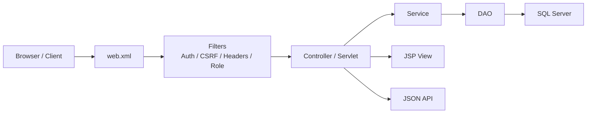

### 27.2. Góc nhìn 2: tầng kiến trúc

Project này gần như đang theo layered architecture thủ công:

- `Presentation Layer`
  - JSP, tag files, JS, CSS
  - servlet/controller
- `Application Layer`
  - service classes
  - orchestration, validation, policy
- `Data Access Layer`
  - DAO classes
  - SQL, transaction, mapping
- `Platform/Security Layer`
  - filters
  - util
  - auth token, password, db pool, cache

Bạn có thể nói trước hội đồng:

> “Dự án không dùng framework auto-magic kiểu Spring, mà nhóm triển khai layered architecture khá rõ bằng servlet/controller, service, DAO và filter/util riêng. Nhờ vậy luồng xử lý minh bạch nhưng đòi hỏi nhóm tự quản lý nhiều chi tiết kỹ thuật hơn.”

### 27.3. Góc nhìn 3: domain nghiệp vụ

Nếu gom theo business domain, dự án có thể chia như sau:

| Domain | Mục tiêu | File/Package nổi bật |
|---|---|---|
| Identity & Access | đăng ký, đăng nhập, session, JWT, phân quyền | `LoginServlet`, `RegisterServlet`, `AuthFilter`, `AuthTokenService`, `UserService` |
| Event Catalog | sự kiện, danh mục, media, featured/pinned | `EventService`, `EventDAO`, `CategoryDAO`, `MediaDAO` |
| Ticket Commerce | chọn vé, voucher, checkout, order, payment | `TicketService`, `VoucherService`, `CheckoutServlet`, `OrderService`, `OrderDAO` |
| Fulfillment & Gate | phát hành vé, QR/token, check-in | `TicketDAO`, `OrganizerCheckInController`, `StaffCheckInController` |
| Support & Communication | support ticket, chat, notification | `SupportTicketService`, `ChatService`, `NotificationService` |
| Admin & Operations | dashboard, reports, settings, user moderation | `DashboardService`, `Admin*Controller`, `SiteSettingsDAO`, `ActivityLogDAO` |
| Team & Event Staff | owner/manager/staff/scanner cho từng event | `EventStaffDAO`, `PermissionCache`, `OrganizerTeamController` |

### 27.4. Góc nhìn 4: dữ liệu và trạng thái

Khi nhìn theo data flow, hệ thống xoay quanh vài “trục sống”:

- `Users` là trục danh tính
- `Events` là trục sản phẩm/chương trình
- `TicketTypes` là inventory
- `Orders` + `OrderItems` là giao dịch thương mại
- `Tickets` là sản phẩm cuối cùng được phát hành
- `SupportTickets` / `ChatSessions` là trục hậu mãi
- `Notifications`, `ActivityLog`, `SiteSettings` là trục vận hành

### 27.5. Cách dùng 4 góc nhìn khi học

Nếu bị bí khi đọc một file, hãy tự hỏi:

- file này thuộc tầng nào?
- file này phục vụ domain nào?
- file này được gọi ở request nào?
- file này đang đọc/ghi trạng thái nào?

Chỉ cần trả lời được 4 câu đó, bạn sẽ không bị lạc.

---

## 28) Sequence diagram các luồng lớn: nhìn như phim chạy

Phần này giúp bạn nhìn hệ thống như chuỗi sự kiện, không phải đống file rời rạc.

### 28.1. Luồng đăng nhập

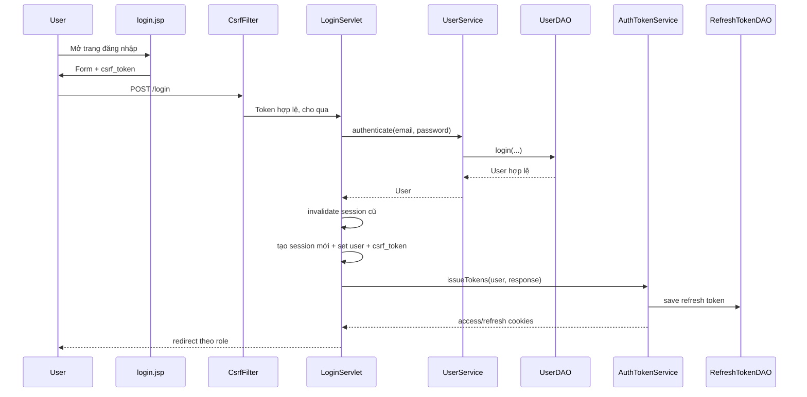

### 28.2. Luồng mua vé và thanh toán

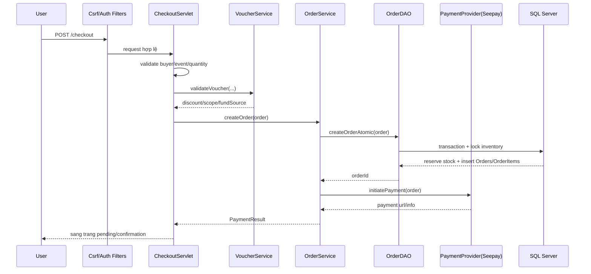

### 28.3. Luồng webhook xác nhận thanh toán

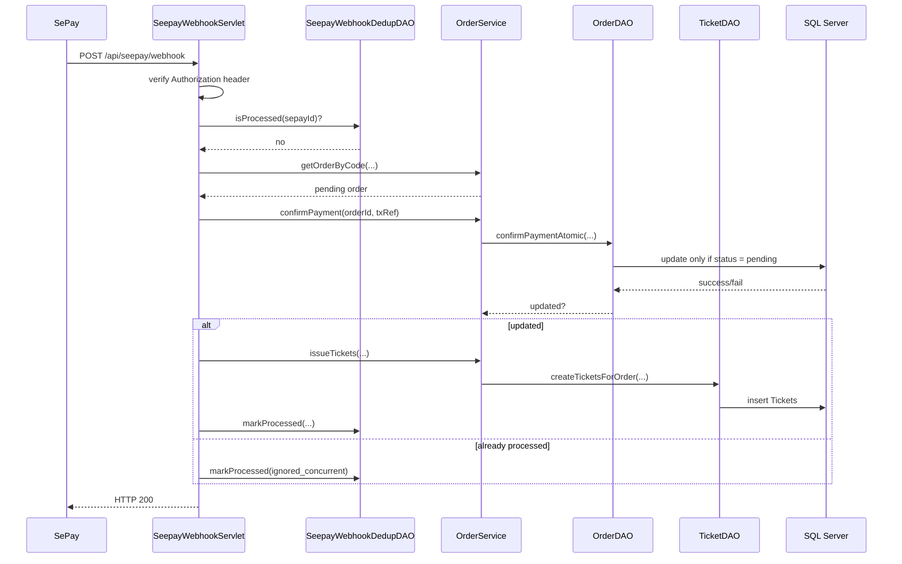

### 28.4. Luồng check-in vé

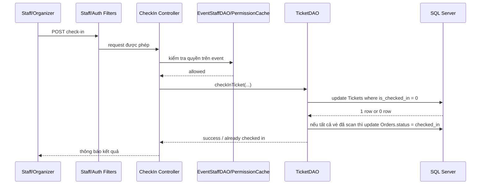

### 28.5. Luồng support ticket và chat

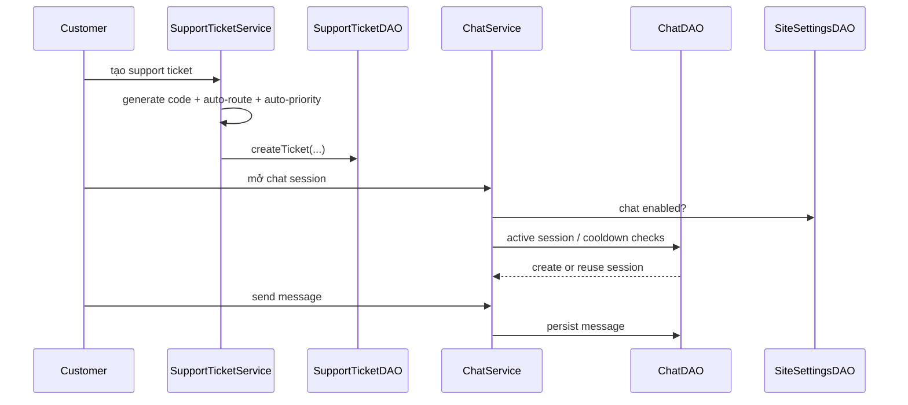

### 28.6. Vì sao sequence diagram quan trọng?

Vì khi báo cáo, hội đồng thường không muốn nghe “file này gọi file kia” một cách rời rạc. Họ muốn nghe:

- ai khởi tạo luồng
- lớp nào chặn/phê duyệt
- nơi nào quyết định nghiệp vụ
- DB được cập nhật ở đâu
- phản hồi cuối trả về cho ai

Phần này giúp bạn kể mạch hơn rất nhiều.

---

## 29) Atlas dữ liệu: entity, quan hệ bảng và trạng thái sống của hệ thống

Muốn hiểu một hệ thống bán vé, phải hiểu “trạng thái sống” của dữ liệu.

### 29.1. Nhóm bảng theo domain

| Nhóm | Bảng |
|---|---|
| Identity & Access | `Users`, `UserSessions`, `PasswordResets`, `Permissions`, `RolePermissions` |
| Event Catalog | `Categories`, `Media`, `Events`, `TicketTypes` |
| Commerce | `Orders`, `OrderItems`, `PaymentTransactions`, `Vouchers`, `VoucherUsages`, `SeepayWebhookDedup` |
| Fulfillment | `Tickets`, `EventStaff` |
| Support & Communication | `SupportTickets`, `TicketMessages`, `ChatSessions`, `ChatMessages`, `Notifications` |
| Operations | `SiteSettings`, `ActivityLog` |

### 29.2. Quan hệ bảng cốt lõi bằng lời

#### Trục user

- `Users` là bảng gốc của gần như toàn hệ thống
- một user có thể:
  - tạo event nếu là organizer
  - mua nhiều orders nếu là customer
  - nhận nhiều notifications
  - có nhiều refresh sessions trong `UserSessions`
  - được gán vào nhiều `EventStaff`
  - gửi nhiều support/chat messages

#### Trục event

- một `Event` thuộc:
  - một `organizer` trong `Users`
  - một `Category`
- một `Event` có:
  - nhiều `TicketTypes`
  - nhiều `Orders`
  - nhiều `EventStaff`
  - có thể liên quan `SupportTickets`, `ChatSessions`, `Vouchers`

#### Trục thương mại

- một `Order` thuộc:
  - một `User`
  - một `Event`
- một `Order` có:
  - nhiều `OrderItems`
  - có thể có `PaymentTransactions`
  - có thể dùng `VoucherUsages`
- một `OrderItem` tham chiếu một `TicketType`
- một `Ticket` sinh ra từ một `OrderItem`

### 29.3. Mermaid ER giản lược

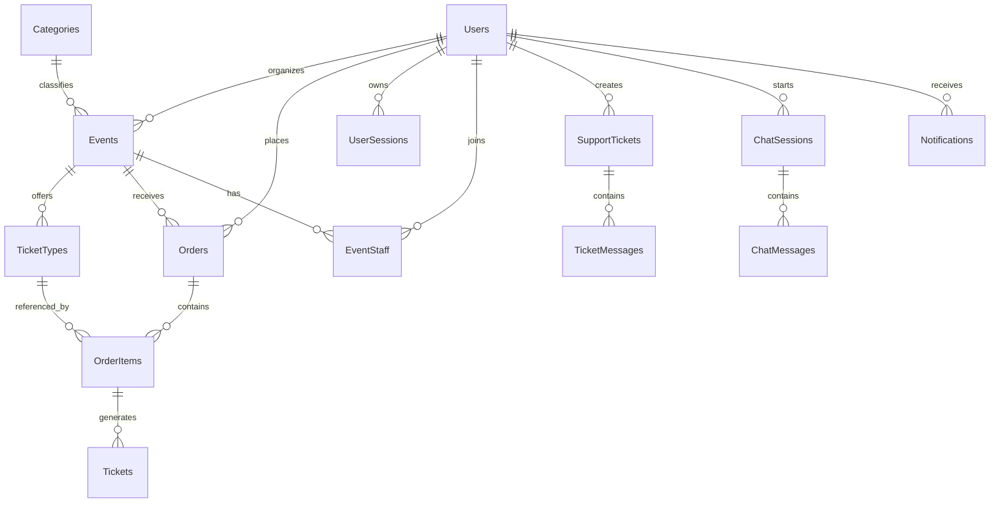
```

### 29.4. Trạng thái quan trọng cần nhớ

#### Event status

`draft -> pending -> approved / rejected -> ended`

Ý nghĩa:

- `draft`: organizer còn sửa nội bộ
- `pending`: chờ admin duyệt
- `approved`: được public
- `rejected`: bị từ chối
- `ended`: sự kiện đã kết thúc

#### Order status

thực tế trong flow hiện tại bạn nên nhớ ít nhất:

- `pending`
- `paid`
- `checked_in`
- `refund_requested`
- `refunded`
- `cancelled`

Điểm cần nhớ:

- `checked_in` là trạng thái order sau khi toàn bộ vé trong order đã scan xong
- nhưng từng vé vẫn có cờ `is_checked_in` riêng

#### Support status

thường sẽ xoay quanh:

- `open`
- `in_progress`
- `resolved`
- `closed`

#### Chat session status

theo logic service/DAO:

- `waiting`
- `active`
- `closed`

### 29.5. Các “sự thật dữ liệu” quan trọng

- vé không sinh trực tiếp từ `Order`, mà từ `OrderItems`
- quyền staff không phải role toàn hệ thống, mà là quyền gắn theo `EventStaff`
- voucher có 2 scope:
  - system/global
  - event-specific
- payment dedup không nằm chỉ trong `Orders`, mà còn có bảng `SeepayWebhookDedup`
- chat và support là 2 hệ khác nhau:
  - support ticket thiên về case management
  - chat thiên về realtime support session

### 29.6. Hội đồng hỏi “dữ liệu trung tâm của app là gì?” thì trả lời thế nào

> “Bốn trục dữ liệu trung tâm là `Users`, `Events`, `Orders` và `Tickets`. `Users` quyết định danh tính và vai trò, `Events` là sản phẩm, `Orders` là giao dịch, còn `Tickets` là artefact cuối cùng được phát hành và check-in.”

---

## 30) Những chỗ dễ nhầm nhất khi đọc dự án

Phần này rất quan trọng, vì nhiều bạn đọc code bị sai không phải vì thiếu thông tin, mà vì ghép mental model sai.

### 30.1. Session, access token và refresh token không phải một thứ

- `Session`: state trên server
- `Access token`: chứng minh danh tính ngắn hạn gắn trong cookie
- `Refresh token`: được persist trong `UserSessions` để cấp lại access token

Sai lầm thường gặp:

- tưởng chỉ có session
- tưởng JWT rồi thì không cần session nữa
- tưởng logout chỉ cần xóa cookie là đủ

### 30.2. Role hệ thống khác quyền trên event

Role hệ thống:

- `customer`
- `organizer`
- `admin`
- `support_agent`

Quyền trên event lại là:

- `owner`
- `manager`
- `staff`
- `scanner`

Điểm mấu chốt:

- `owner` không phải role lưu trong `Users`
- `owner` được suy ra khi `event.organizer_id == userId`
- `manager/staff/scanner` đến từ `EventStaff`

### 30.3. JSP không phải lúc nào cũng là nơi có data thật

Nhiều JSP chỉ là shell:

- render layout
- gọi AJAX tới API
- nhận JSON rồi mới vẽ UI

Ví dụ điển hình:

- `my-tickets.jsp`
- chat pages
- nhiều dashboard/table pages

Nghĩa là khi mở JSP mà không thấy data logic, phải tìm sang API/controller tương ứng.

### 30.4. `Order.status` không thay thế hoàn toàn trạng thái từng vé

Sai lầm dễ gặp:

- thấy order `paid` tưởng vé đã chắc chắn được cấp đủ
- thấy order `checked_in` tưởng chỉ cần check 1 vé là xong

Thực tế:

- vé được tạo theo từng `OrderItem`
- từng `Ticket` có trạng thái check-in riêng
- order chỉ đổi `checked_in` khi tất cả vé đã check-in

### 30.5. Voucher hệ thống và voucher event không giống nhau

Trong `VoucherService`:

- voucher `eventId <= 0` là voucher hệ thống
- voucher có `eventId > 0` là voucher của event cụ thể

Điều này kéo theo:

- discount phải tách nguồn tài trợ
- settlement phải phân biệt `SYSTEM` với `EVENT`

### 30.6. `build/web` không phải nơi sửa source

`build/web/WEB-INF/classes/*.properties` là bản copy generated.

Nếu sửa ở đó:

- lần build sau có thể mất
- không phải nguồn thật của project

Nguồn thật phải là:

- `src/java/*.properties`
- hoặc file config runtime chuẩn ở môi trường triển khai

### 30.7. OAuth config đang ở nhiều nơi

Hiện repo cho thấy config OAuth xuất hiện ở:

- `src/java/google-oauth.properties`
- `src/webapp/WEB-INF/google-oauth.properties`
- bản copy ở `build/web/...`

Đây là dấu hiệu phải cẩn thận khi debug:

- app đang load file nào?
- local đang dùng cổng/context nào?
- có trùng cấu hình hay không?

### 30.8. `SiteSettings` là công tắc runtime mềm

Nhiều hành vi không hardcode trong controller mà đi qua `SiteSettingsDAO`, ví dụ:

- `chat_enabled`
- `chat_auto_accept`
- `chat_cooldown_minutes`

Nghĩa là khi debug một feature “sao không chạy”, đừng chỉ nhìn controller; có thể feature đang bị tắt ở settings DB.

### 30.9. DAO không chỉ là CRUD, nhiều chỗ là “trọng tài cuối cùng”

Đặc biệt với:

- `OrderDAO`
- `TicketDAO`
- `RefreshTokenDAO`
- `SeepayWebhookDedupDAO`

Những DAO này không chỉ đọc/ghi dữ liệu, mà còn là nơi bảo toàn tính đúng đắn:

- transaction
- idempotency
- anti-race
- revoke/persist security state

### 30.10. Cách tự kiểm tra mình đã hiểu đúng chưa

Nếu bạn trả lời trơn tru được 6 câu này thì mental model của bạn khá vững:

1. Vì sao login cần cả session và refresh token persistence?
2. Vì sao voucher validation nằm ở service nhưng order safety nằm ở DAO?
3. Vì sao event staff permission không thể chỉ nhìn vào bảng `Users`?
4. Vì sao `payment confirmed` chưa chắc đồng nghĩa “mọi vé đã hiện ngay trên UI”?
5. Vì sao JSP có lúc không chứa business logic?
6. Vì sao `SiteSettings` có thể làm thay đổi hành vi hệ thống mà không phải sửa code?

---

## 31) Lộ trình đọc và làm chủ dự án theo thời gian

Phần này biến file 18 thành roadmap học thật sự.

### 31.1. Nếu bạn chỉ có 15 phút

Đọc:

1. mục `2`
2. mục `3`
3. mục `4`
4. mục `10`
5. mục `11`
6. mục `12`
7. mục `26.2`

Mục tiêu:

- nắm hệ thống là gì
- nắm luồng login, checkout, payment, check-in
- đủ để trả lời ở mức overview

### 31.2. Nếu bạn có 1 giờ

Đọc thêm:

- mục `6`, `7`, `14`, `18`, `21`, `27`, `28`, `29`

Mục tiêu:

- hiểu bảo mật và race condition
- kể lại được end-to-end flow
- trả lời chắc tay hơn trước các câu hỏi kỹ thuật

### 31.3. Nếu bạn có 1 buổi học nghiêm túc

Làm theo trình tự:

1. Đọc mục `20` để biết feature map
2. Đọc mục `22` để biết backend index
3. Đọc mục `24` để biết view/runtime index
4. Mở song song:
   - `web.xml`
   - một controller
   - một service
   - một DAO
   - schema
5. Tự trace ít nhất 3 luồng:
   - login
   - checkout/payment
   - check-in

### 31.4. Nếu bạn muốn làm chủ để báo cáo tự tin

Phải tự làm được 4 việc:

1. vẽ bằng lời một request đi từ browser tới DB
2. giải thích vì sao không bị oversell
3. giải thích vì sao webhook không làm double-payment
4. chỉ đúng file khi bị hỏi “em chứng minh bằng code ở đâu?”

### 31.5. Checklist tự ôn trước ngày bảo vệ

Checklist ngắn:

- tôi có phân biệt được role hệ thống và quyền staff theo event không?
- tôi có nói được vì sao dùng both session và JWT cookie không?
- tôi có nói được transaction nào chống oversell không?
- tôi có nói được webhook chống duplicate bằng mấy lớp không?
- tôi có biết JSP nào chỉ là shell và API nào đổ data vào không?
- tôi có biết project build thành WAR trên Tomcat không?
- tôi có biết config nào đang nên externalize ra env vars không?

### 31.6. Nếu bị hỏi sâu bất ngờ thì xử lý thế nào

Chiến thuật tốt nhất là trả lời theo khung:

1. mục tiêu của luồng là gì
2. lớp nào kiểm tra đầu vào
3. lớp nào giữ business rule
4. lớp nào chốt bằng transaction hoặc DB state
5. file nào chứng minh điều đó

Ví dụ:

> “Luồng checkout trước hết validate ở `CheckoutServlet`, sau đó `OrderService` gọi `OrderDAO.createOrderAtomic()`. Chính DAO mới dùng transaction và lock SQL để tránh oversell. Nếu cần em có thể chỉ ngay file `OrderDAO.java`.”

### 31.7. Định nghĩa “đã hiểu dự án”

Bạn có thể xem mình đã hiểu dự án tốt khi:

- không còn chỉ nhớ tên file, mà nhớ được file đóng vai trò gì
- không còn chỉ nhớ URL, mà nhớ được URL chạy qua tầng nào
- không còn chỉ nhớ bảng DB, mà nhớ được bảng đó đại diện trạng thái gì
- có thể giải thích một lỗi giả định sẽ debug từ đâu trước

---

## 32) Từ điển thuật ngữ và keyword quan trọng của dự án

Phần này giúp bạn đọc code nhanh hơn vì rất nhiều khái niệm trong dự án là khái niệm kỹ thuật, không phải tên business thuần.

| Thuật ngữ | Nghĩa trong dự án này |
|---|---|
| `Authentication` | xác minh người dùng là ai, chủ yếu ở `LoginServlet` + `UserService` |
| `Authorization` | xác minh người dùng được làm gì, chủ yếu ở filter và permission engine |
| `Session` | state trên server gắn với user sau login |
| `Access Token` | JWT ngắn hạn gắn trong cookie để nhận diện request |
| `Refresh Token` | token dài hạn hơn, được persist trong `UserSessions` để cấp lại access token |
| `Session Fixation Protection` | invalidate session cũ, tạo session mới sau login |
| `CSRF` | tấn công giả mạo request từ browser của user đã đăng nhập; được chặn bằng `CsrfFilter` |
| `Idempotency` | gửi lặp lại request/webhook nhưng hệ thống không xử lý trùng kết quả |
| `Race Condition` | hai request chạy gần như cùng lúc làm sai trạng thái nếu không khóa đúng |
| `Oversell` | bán vượt số vé thực có |
| `Webhook` | callback từ hệ thống ngoài, ở đây là SePay gọi về server |
| `Dedup` | chống xử lý trùng callback/request |
| `Owner` | organizer sở hữu event, được suy ra từ `event.organizer_id` |
| `Manager/Staff/Scanner` | quyền staff theo event lưu ở `EventStaff`, không phải role toàn hệ thống |
| `System Voucher` | voucher áp dụng toàn hệ thống, không gắn event cụ thể |
| `Event Voucher` | voucher chỉ áp dụng cho một event |
| `Settlement` | logic quy về bên nào chịu discount/chi phí, thường dùng khi thống kê voucher |
| `Shell JSP` | trang JSP chủ yếu render layout rồi đổ data bằng AJAX/API sau |
| `WAR` | gói deploy chuẩn của Java web app lên Tomcat |
| `Context Path` | prefix app khi chạy trên server, ở đây là `/SellingTicketJava` |
| `Deploy on Save` | NetBeans tự copy/build/deploy khi lưu file trong môi trường dev |
| `SiteSettings` | bảng key-value làm công tắc runtime mềm cho một số tính năng như chat |
| `Support Ticket` | case hỗ trợ có vòng đời và thread message riêng |
| `Chat Session` | phiên chat gần realtime, khác với support ticket truyền thống |

### 32.1. Ba cặp khái niệm hay bị nhầm nhất

#### `organizer` vs `owner`

- `organizer`: role ở bảng `Users`
- `owner`: quyền sở hữu một event cụ thể

Một user có role `organizer`, nhưng chỉ là `owner` của những event do chính họ tạo.

#### `Order` vs `Ticket`

- `Order`: giao dịch mua
- `Ticket`: sản phẩm/vé phát hành sau giao dịch

Một order có thể sinh nhiều ticket.

#### `Support Ticket` vs `Chat Session`

- `Support Ticket`: thiên về xử lý vụ việc có lưu hồ sơ
- `Chat Session`: thiên về trao đổi nhanh, gần realtime

### 32.2. Nếu đang đọc code mà thấy các từ này, hãy nghĩ ngay điều gì

- thấy `pending`: nghĩ đến trạng thái trung gian chờ xử lý tiếp
- thấy `atomic`: nghĩ đến điểm chống race condition
- thấy `revoke`: nghĩ đến logout/hủy token/hủy quyền lực cũ
- thấy `dedup`: nghĩ đến chống replay/chống xử lý trùng
- thấy `cached`: nghĩ đến tốc độ đổi lấy nguy cơ stale data ngắn hạn
- thấy `WEB-INF`: nghĩ đến tài nguyên runtime web không public trực tiếp
- thấy `build/web`: nghĩ đến output generated, không phải source thật

---

## 33) Ma trận giao diện <-> controller <-> API: nhìn UI là biết backend nào đứng sau

Phần này đặc biệt hữu ích khi bạn mở một JSP và muốn biết:

- trang này được controller nào forward tới?
- data nằm ngay trong request hay đổ qua API?
- trang này thiên về SSR kiểu cũ hay shell + AJAX?

### 33.1. Public / customer pages

| JSP / màn hình | Controller chính | API / nguồn dữ liệu phụ | Ghi chú đọc code |
|---|---|---|---|
| `home.jsp` | `HomeServlet` | có thể dùng thêm asset JS nhưng dữ liệu lõi từ servlet | trang chủ public |
| `events.jsp` | `EventsServlet` | `EventApiServlet` có thể hỗ trợ filter/AJAX | danh sách sự kiện |
| `event-detail.jsp` | `EventDetailServlet` | có thể dùng thêm `EventApiServlet` hoặc JS UI | chi tiết sự kiện + ticket types |
| `ticket-selection.jsp` | `TicketSelectionServlet` | ít API, chủ yếu server-render trước checkout | bước chọn vé |
| `checkout.jsp` | `CheckoutServlet` | `VoucherValidateApiServlet`, `PaymentStatusServlet` | voucher và payment polling là điểm cần nhớ |
| `payment-pending.jsp` | `ResumePaymentServlet` / flow checkout | `PaymentStatusServlet` | shell chờ xác nhận thanh toán |
| `order-confirmation.jsp` | `OrderConfirmationServlet` | có thể đọc thêm từ order APIs | kết quả cuối luồng mua |
| `login.jsp` | `LoginServlet` | không cần API riêng | form SSR cổ điển + CSRF |
| `register.jsp` | `RegisterServlet` | `EmailAvailabilityApiServlet` | có check email |
| `profile.jsp` | `ProfileServlet` | upload qua `MediaUploadServlet` / `UploadServlet` | profile + avatar |
| `my-tickets.jsp` | `MyTicketsServlet` | `MyTicketApiServlet`, `MyOrderApiServlet` | shell page điển hình |
| `my-support-tickets.jsp` | `SupportTicketServlet` | thường SSR trực tiếp | list support tickets customer |
| `support-ticket.jsp` | `SupportTicketServlet` | không bắt buộc API | form tạo ticket |
| `support-ticket-detail.jsp` | `SupportTicketServlet` | SSR + reply POST | thread của support ticket |
| `notifications.jsp` | `NotificationController` | `/notifications/count`, `/notifications/read`, `/notifications/read-all` | hybrid SSR + AJAX |
| `about.jsp`, `faq.jsp`, `terms.jsp`, `categories.jsp` | `StaticPagesServlet`, `TermsServlet`, `EventsServlet` tùy trang | hầu như không cần API | static/informational |

### 33.2. Admin pages

| JSP admin | Controller chính | API / nguồn phụ | Ghi chú |
|---|---|---|---|
| `admin/dashboard.jsp` | `AdminDashboardController` | chart-data endpoint cùng controller | dashboard admin |
| `admin/events.jsp` | `AdminEventController` | `AdminEventApiServlet`, `AdminEventFeatureApiServlet` | quản lý event tổng |
| `admin/event-detail.jsp` | `AdminEventController` | có thể dùng API phụ | chi tiết event |
| `admin/orders.jsp` | `AdminOrderController` | `AdminOrderApiServlet`, `AdminConfirmPaymentApiServlet` | order operations |
| `admin/users.jsp` | `AdminUserController` | `AdminUserApiServlet` | search/filter/update users |
| `admin/user-detail.jsp` | `AdminUserController` | có thể không cần API riêng | user detail |
| `admin/support.jsp` | `AdminSupportController` | data chính từ controller | support ticket backoffice |
| `admin/support-detail.jsp` | `AdminSupportController` | reply/status actions bằng POST | admin case handling |
| `admin/chat-dashboard.jsp` | `AdminChatDashboardController` | `ChatApiServlet` | chat live support |
| `admin/reports.jsp` | `AdminReportsController` | `DashboardService` data | report dashboards |
| `admin/settings.jsp` | `AdminSettingsController` | `SiteSettingsDAO` data | runtime switches/settings |
| `admin/categories.jsp` | `AdminCategoryController` | category operations | CRUD category |
| `admin/notifications.jsp` | `AdminNotificationController` | notification management | admin notifications |
| `admin/system-vouchers.jsp` | `AdminSystemVoucherController` | `VoucherService` | global vouchers |
| `admin/system-voucher-form.jsp` | `AdminSystemVoucherController` | SSR form | create/edit voucher |
| `admin/activity-log.jsp` | `AdminActivityLogController` | `ActivityLogService` | audit feed |

### 33.3. Organizer pages

| JSP organizer | Controller chính | API / nguồn phụ | Ghi chú |
|---|---|---|---|
| `organizer/dashboard.jsp` | `OrganizerDashboardController` | `DashboardService` | summary của organizer |
| `organizer/events.jsp` | `OrganizerEventController` | `OrganizerEventApiServlet` | list event có quyền truy cập |
| `organizer/create-event.jsp` | `OrganizerEventController` | upload/media helpers | tạo event |
| `organizer/edit-event.jsp` | `OrganizerEventController` | upload/media helpers | sửa event |
| `organizer/event-detail.jsp` | `OrganizerEventController` | có thể phối hợp order/check-in stats | event detail |
| `organizer/manage-staff.jsp` | `OrganizerEventController` / `OrganizerTeamController` | `EventStaffDAO`, `PermissionCache` | quản lý staff event |
| `organizer/orders.jsp` | `OrganizerOrderController` | data SSR + action POST | order list theo event |
| `organizer/event-orders.jsp` | `OrganizerOrderController` | SSR | chi tiết order một event |
| `organizer/tickets.jsp` | `OrganizerTicketController` | `TicketService` | CRUD ticket types |
| `organizer/vouchers.jsp` | `OrganizerVoucherController` | `VoucherService` | voucher organizer |
| `organizer/voucher-form.jsp` | `OrganizerVoucherController` | SSR form | create/edit voucher |
| `organizer/check-in.jsp` | `OrganizerCheckInController` | scan/lookup request trực tiếp controller | gate operation page |
| `organizer/chat.jsp` | `OrganizerChatController` | `ChatApiServlet` | shell page chat |
| `organizer/support.jsp` | `OrganizerSupportController` | `SupportTicketService` | organizer support desk |
| `organizer/support-detail.jsp` | `OrganizerSupportController` | message thread | support detail |
| `organizer/statistics.jsp` | `OrganizerStatisticsController` | JSON stats/chart endpoints | KPI/revenue |
| `organizer/team.jsp` | `OrganizerTeamController` | `EventStaffDAO` | team overview |
| `organizer/settings.jsp` | `OrganizerSettingsController` | profile/settings data | organizer settings |

### 33.4. Staff pages

| JSP staff | Controller chính | API / nguồn phụ | Ghi chú |
|---|---|---|---|
| `staff/dashboard.jsp` | `StaffDashboardController` | assigned events qua filter/DAO | staff portal |
| `staff/check-in.jsp` | `StaffCheckInController` | request check-in trực tiếp controller | gate staff page |
| `staff/sidebar.jsp` | layout partial | không có API riêng | UI shell |

### 33.5. Cách dùng ma trận này khi đọc code

Khi đứng ở UI:

- nhìn JSP để biết “màn hình nào”
- tra controller tương ứng để biết server chuẩn bị dữ liệu gì
- nếu trang là shell, tìm API phụ

Khi đứng ở backend:

- nhìn controller để biết forward tới JSP nào
- nhìn JSP để biết có đang gọi AJAX hay submit form tiếp không

---

## 34) Cơ chế cắt ngang toàn hệ thống: những thứ không thuộc riêng một feature

Đây là các cơ chế “đi ngang” qua nhiều luồng khác nhau. Nếu không hiểu chúng, bạn sẽ thấy code rời rạc; nếu hiểu rồi, bạn sẽ thấy dự án nhất quán hơn rất nhiều.

### 34.1. Caching

#### Browser/static caching

- `CacheFilter` thêm header:
  - `Cache-Control: public, max-age=..., immutable`
- mục tiêu:
  - trình duyệt cache asset tĩnh lâu hơn
  - giảm tải cho CSS/JS/static resources

#### In-memory/cache mềm ở application

- `PermissionCache`: cache quyền staff theo event trong session, có HMAC chống sửa trái phép
- `SiteSettingsDAO`: cache key-value settings của hệ thống
- `LoginAttemptTracker`: in-memory map cho anti-bruteforce
- webhook dedup fast-path: in-memory set trong `SeepayWebhookServlet`

### 34.2. Logging và audit

`ActivityLogService` và `ActivityLogDAO` là trục audit chính.

Tác dụng:

- ghi hành động quan trọng
- hỗ trợ dashboard/backoffice xem lịch sử
- không để logging failure làm hỏng main flow

Đây là điểm rất nên nhấn mạnh:

> “Activity log được thiết kế theo hướng best-effort: log lỗi thì cảnh báo nhưng không được làm hỏng giao dịch chính.”

### 34.3. Runtime switches bằng database

`SiteSettingsDAO` cho phép nhiều tính năng đổi hành vi mà không cần sửa code:

- bật/tắt chat
- auto-accept chat
- cooldown chat
- có thể mở rộng cho nhiều setting khác

Điều này làm project “vận hành được” hơn, không chỉ “chạy được”.

### 34.4. Notification như lớp giao tiếp vận hành

`NotificationService` là lớp giao tiếp trong-app:

- gửi cho một user
- gửi cho toàn bộ admin
- đếm unread
- mark read / mark all read

Nghĩa là notification không chỉ là UI đẹp mắt, mà là một bus nhỏ cho vận hành nội bộ.

### 34.5. Flash message / toast / UI feedback

Các thành phần liên quan:

- `FlashUtil`
- `toast.tag`
- `toast.js`

Vai trò:

- giữ message qua redirect
- tạo feedback cho user sau action thành công/thất bại

### 34.6. i18n và content delivery

Hiện `assets/i18n` chứa:

- `vi.json`
- `en.json`
- `ja.json`

`i18n.js` là cầu nối phía client. Đây cho thấy app đã nghĩ tới đa ngôn ngữ, dù mức độ phủ có thể chưa toàn bộ.

### 34.7. Media handling là cross-cutting concern

Media không chỉ thuộc một feature:

- profile avatar
- ảnh sự kiện
- có thể cả ticket/event assets khác

Do đó media được tách thành:

- `MediaUploadServlet` / `UploadServlet`
- `MediaService`
- `MediaDAO`
- `CloudinaryUtil`

### 34.8. Bảo mật cắt ngang

Những thứ gần như luồng nào cũng đi qua:

- `AuthFilter`
- `CsrfFilter`
- `SecurityHeadersFilter`
- `OrganizerAccessFilter`
- `StaffAccessFilter`

Đây là lớp “khung xương” chứ không phải feature riêng.

---

## 35) Atlas debug: gặp lỗi gì thì lần từ đâu?

Phần này cực hữu ích khi hội đồng hỏi kiểu tình huống hoặc khi bạn tự debug.

### 35.1. User không đăng nhập được

Kiểm tra theo thứ tự:

1. `login.jsp` có gửi đủ field không
2. `CsrfFilter` có chặn request không
3. `LoginServlet` có nhận request không
4. `UserService.authenticate()` có trả user không
5. `UserDAO.login()` / DB query có đúng không
6. `PasswordUtil` hash verify có khớp không
7. `LoginAttemptTracker` có đang block email/IP không

### 35.2. User đăng nhập xong nhưng vào trang protected vẫn bị đá ra

Kiểm tra:

1. session có set `user` / `account` chưa
2. cookie `st_access` / `st_refresh` có được set chưa
3. `AuthFilter` có restore user từ cookie không
4. route đó có match filter bảo vệ trong `web.xml` không
5. role user có đúng không

### 35.3. Voucher nhập đúng mà không áp dụng

Kiểm tra:

1. `VoucherValidateApiServlet`
2. `VoucherService.validateVoucher()`
3. voucher có active không
4. voucher có expired không
5. usage limit còn không
6. có đúng event scope không
7. order amount có đạt min amount không

### 35.4. Mua vé bị báo hết vé dù UI còn hiển thị còn vé

Đây là case race/inventory rất điển hình.

Kiểm tra:

1. `CheckoutServlet` validation ban đầu
2. `TicketTypeDAO.checkAvailability()`
3. `OrderDAO.createOrderAtomic()` transaction thật
4. dữ liệu `quantity`, `sold_quantity` trong DB

Kết luận thường gặp:

- UI chỉ là snapshot
- DB transaction là trọng tài cuối cùng

### 35.5. Thanh toán thành công ngoài ngân hàng nhưng hệ thống chưa hiện vé

Kiểm tra:

1. `SeepayWebhookServlet` có nhận callback chưa
2. auth header webhook có hợp lệ không
3. order code có parse được không
4. amount có match order không
5. `confirmPaymentAtomic()` có update thành công không
6. `TicketDAO.createTicketsForOrder()` có lỗi không
7. `PaymentStatusServlet` có thể confirm/re-issue bằng tay không

### 35.6. Một vé bị quét 2 lần

Kiểm tra:

1. controller check-in đang gọi `TicketDAO.checkInTicket()` đúng không
2. DB row update có điều kiện `is_checked_in = 0` không
3. UI có đang đọc response đúng và báo “already checked in” không

### 35.7. Organizer vào trang nhưng bị báo không có quyền

Kiểm tra:

1. `OrganizerAccessFilter`
2. `EventService.hasApprovedEvents(...)`
3. event đó user có phải owner không
4. nếu không phải owner, `EventStaffDAO.getStaffRole(...)` trả gì
5. `PermissionCache` có stale hay chưa invalidate không

### 35.8. Staff không vào được portal

Kiểm tra:

1. `StaffAccessFilter`
2. `EventStaffDAO.getEventsWhereStaff(userId)`
3. role user trong `Users`
4. session user có đúng không

### 35.9. Chat không mở được

Kiểm tra:

1. `SiteSettingsDAO.getBoolean("chat_enabled")`
2. `ChatService.getOrCreateSession(...)`
3. customer đã có active session khác chưa
4. cooldown có còn không
5. `ChatDAO.createSession(...)` có thành công không

### 35.10. Notification count sai

Kiểm tra:

1. `NotificationController /count`
2. `NotificationService.countUnread()`
3. `NotificationDAO.countUnread()`
4. flow mark read / mark all read có chạy đúng không

### 35.11. Config đúng mà app vẫn chạy sai sau build

Đây thường là lỗi “sửa nhầm generated output”.

Kiểm tra:

1. bạn đang sửa `src/java/*.properties` hay `build/web/...`?
2. `dist/*.war` có được build lại chưa?
3. Tomcat đang chạy artifact mới hay cũ?
4. context path / port có khớp local config không?

### 35.12. Quy tắc debug 5 bước cho dự án này

1. xác định URL hoặc action đầu vào
2. xác định filter nào chạm vào request
3. xác định controller chính
4. xác định service/DAO quyết định kết quả
5. kiểm tra DB state thật

---

## 36) Bộ câu hỏi phản biện hội đồng và cách trả lời chắc tay

Phần này không lặp lại y nguyên phần cũ, mà tập trung vào câu hỏi khó hơn, dễ bị hỏi khi hội đồng muốn thử độ hiểu sâu.

### 36.1. “Tại sao nhóm không dùng Spring Boot mà dùng Servlet/JSP?”

Gợi ý trả lời:

> “Nhóm chọn Servlet/JSP để kiểm soát trực tiếp request lifecycle, filter, session và transaction flow. Điều này giúp nhóm hiểu nền tảng Java Web rõ hơn. Đổi lại, nhóm phải tự triển khai nhiều cơ chế mà framework thường hỗ trợ sẵn, như auth orchestration, filter chaining và config management.”

### 36.2. “Nếu có 100 user cùng mua vé hot thì hệ thống chống oversell bằng gì?”

> “Lớp UI và servlet chỉ kiểm tra sơ bộ. Điểm chống oversell thực sự nằm ở `OrderDAO.createOrderAtomic()` dùng transaction và lock SQL (`UPDLOCK`, `HOLDLOCK`). Nghĩa là nhiều request có thể đến cùng lúc nhưng DB vẫn là trọng tài cuối cùng.”

### 36.3. “Tại sao phải dùng cả session và JWT?”

> “Session thuận tiện cho state server-side và tương thích tốt với JSP/servlet truyền thống. JWT cookie giúp duy trì danh tính linh hoạt hơn và hỗ trợ restore auth. Refresh token được persist trong DB để revoke/logout an toàn hơn. Tức là hệ thống đang dùng mô hình lai để cân bằng giữa web truyền thống và token-based auth.”

### 36.4. “Nếu webhook SePay gọi lại 2-3 lần thì sao?”

> “Có 3 lớp chặn trùng: in-memory dedup, DB dedup qua bảng `SeepayWebhookDedup`, và order-level dedup vì `confirmPaymentAtomic()` chỉ update khi order còn `pending`.”

### 36.5. “Tại sao ticket lại tách khỏi order?”

> “Order là giao dịch, còn ticket là artefact phát hành cuối cùng. Một order có thể chứa nhiều loại vé, nên cần `OrderItems` và từ đó sinh từng `Ticket` riêng. Thiết kế này giúp check-in từng vé độc lập và quản lý QR/code theo vé.”

### 36.6. “Nhóm đang có những hạn chế kiến trúc nào?”

> “Hiện tại config còn phân tán qua nhiều `.properties`, một số secret nên externalize tốt hơn. Build/dependency dùng Ant/NetBeans nên về lâu dài có thể chuẩn hóa lại bằng Maven/Gradle. Một số cache/in-memory tracker phù hợp single-node hơn là multi-node production.”

### 36.7. “Nếu scale production lớn hơn thì nâng cấp gì trước?”

> “Ưu tiên sẽ là: chuẩn hóa config/secret management, thay connection pool nhẹ bằng pool chuẩn như HikariCP, đưa một số state tạm như login attempt hoặc dedup fast-path sang Redis nếu cần multi-node, và chuẩn hóa build/dependency management.”

### 36.8. “Tại sao chat và support ticket tách riêng?”

> “Hai luồng này phục vụ hai kiểu tương tác khác nhau. Chat phục vụ trao đổi nhanh gần realtime với session/cooldown, còn support ticket thiên về quản lý vụ việc có subject, priority, assignment và lịch sử trao đổi bền vững hơn.”

### 36.9. “Điểm nào trong dự án thể hiện tư duy vận hành chứ không chỉ viết code?”

> “Có `ActivityLog`, `Notifications`, `SiteSettings`, `chat_enabled` runtime switch, voucher settlement reporting, dedup webhook, và phân tách role theo event staff. Đây là dấu hiệu nhóm có nghĩ tới vận hành hệ thống chứ không chỉ dựng CRUD.”

### 36.10. Công thức trả lời phản biện

Khi bị hỏi khó, trả lời theo khuôn:

1. nêu mục tiêu của bài toán
2. nêu cơ chế hiện tại
3. nêu file/chứng cứ
4. nêu đánh đổi
5. nêu hướng nâng cấp nếu scale hơn

---

## 37) Đề xuất nâng cấp kiến trúc và roadmap cải tiến nếu phát triển tiếp

Phần này rất hữu ích khi hội đồng hỏi “nếu làm tiếp thì em nâng cấp gì?”

### 37.1. Nhóm bảo mật

- gom secrets hoàn toàn về env vars hoặc secret manager
- bỏ hardcoded/duplicated OAuth config trong repo
- tăng chuẩn hóa security headers, CSP nếu cần
- cân nhắc centralize login attempt tracking cho multi-node

### 37.2. Nhóm hạ tầng/runtime

- chuyển từ custom DB pool sang pool chuẩn
- chuẩn hóa build bằng Maven/Gradle
- tách config theo environment rõ ràng hơn
- thêm health check và monitoring rõ hơn

### 37.3. Nhóm nghiệp vụ

- hỗ trợ re-issue ticket admin flow rõ ràng hơn
- chuẩn hóa settlement/report cho voucher phức tạp hơn
- nâng cấp order/payment state machine explicit hơn
- thêm audit sâu hơn cho support/chat moderation

### 37.4. Nhóm frontend/UI

- chuẩn hóa data loading giữa JSP SSR và AJAX shell pages
- giảm lặp UI bằng tag files/component partials hơn nữa
- làm rõ chiến lược i18n toàn hệ thống

### 37.5. Nhóm developer experience

- bổ sung test coverage tự động
- thêm tài liệu setup environment chuẩn hóa hơn
- chuẩn hóa naming/routing conventions
- tạo script bootstrap local môi trường dev

### 37.6. Câu trả lời gọn cho hội đồng

> “Nếu phát triển tiếp, em sẽ ưu tiên 3 hướng: chuẩn hóa secret/config management, nâng cấp hạ tầng build/runtime cho production tốt hơn, và làm giàu test/observability để hệ thống dễ vận hành và scale hơn.”

---

## 38) Phân tích từng package theo kiểu line-by-line: nên đọc từng khối code như thế nào?

Phần này không chỉ nói “package này dùng để làm gì”, mà hướng dẫn cách nhìn từng cụm dòng trong file để đọc nhanh mà vẫn hiểu sâu.

### 38.1. Bản đồ package thực tế của backend

Tính theo file `.java` hiện có trong `src/java/com/sellingticket`:

- `controller`: `60` file
- `service`: `20` file
- `dao`: `18` file
- `filter`: `7` file
- `model`: `17` file
- `util`: `12` file
- `exception`: `2` file
- `security`: `1` file

Riêng `controller` tách thành 5 lớp rất rõ:

- `controller` gốc: `19` file, thiên về public storefront
- `controller/admin`: `13` file, thiên về backoffice quản trị
- `controller/api`: `15` file, thiên về AJAX, webhook, JSON endpoint
- `controller/organizer`: `11` file, thiên về vận hành sự kiện
- `controller/staff`: `2` file, thiên về check-in tại cổng

Riêng `service` có thêm `service/payment`: `5` file, là cụm provider/payment result/payment abstraction.

### 38.2. Cách đọc package `controller` line-by-line

Khi mở bất kỳ controller nào trong dự án này, gần như luôn có 6 khối dòng:

- `dòng package + import`: cho biết controller phụ thuộc `service`, `util`, `model` nào. Nếu import nhiều `dao` trực tiếp thì controller đó đang chạm hạ tầng sâu hơn mức lý tưởng.
- `annotation`: `@WebServlet`, `@MultipartConfig` cho biết route, scope và ràng buộc upload.
- `field/service injection kiểu thủ công`: thường là `private final XxxService = new XxxService();` hoặc khởi tạo trong `init()`.
- `doGet/doPost`: đây là bộ phân luồng request-level. Chỉ cần đọc khối này là biết controller xử lý bao nhiêu route con.
- `private handler methods`: đây mới là business path thật. Ví dụ list, detail, create, update, webhook, lookup, check-in.
- `utility tail`: helper parse path, sanitize input, escape JSON, upload media, todayMidnight, slug generator.

Mẹo đọc:

- nếu là controller public thì tìm `forward("/xxx.jsp")` để biết view đích
- nếu là controller API thì tìm `sendJson(...)` hoặc `response.getWriter().write(...)`
- nếu là controller organizer/admin thì tìm permission check trước, rồi mới đọc business logic
- nếu là controller payment/webhook thì tìm `idempotency`, `status guard`, `amount verification`

### 38.3. Cách đọc package `controller` theo từng subpackage

`controller` gốc:

- đây là lớp vào của người dùng cuối: home, events, event detail, login, register, checkout, profile, support
- đọc theo thứ tự tốt nhất: `LoginServlet` -> `CheckoutServlet` -> `EventDetailServlet` -> `SupportTicketServlet`
- nếu muốn hiểu hành trình khách hàng từ đầu đến cuối thì đây là cụm nên đọc trước

`controller/admin`:

- đây là lớp điều hành hệ thống: dashboard, duyệt sự kiện, users, orders, support, settings, reports
- pattern thường gặp: nạp badge/sidebar count -> phân nhánh list/detail -> forward JSP admin
- nếu hội đồng hỏi “admin đang can thiệp nghiệp vụ ở đâu” thì source nằm ở đây

`controller/api`:

- đây là cụm endpoint JSON và integration edge
- file quan trọng nhất là `SeepayWebhookServlet` vì nó nối ngân hàng vào order lifecycle
- các file API thường ngắn hơn controller JSP, nhưng nhạy cảm hơn về validation, auth header, JSON shape và idempotency

`controller/organizer`:

- đây là cụm dày nhất về business vận hành sự kiện
- các file lớn nhất cần ưu tiên: `OrganizerEventController`, `OrganizerCheckInController`, `OrganizerOrderController`
- pattern thường gặp: check user -> check permission theo event -> gọi service -> forward trang organizer hoặc trả JSON

`controller/staff`:

- đây là cụm tối giản, tối ưu cho thao tác tại cổng
- ít route nhưng logic phải rất gọn vì chạm trực tiếp trải nghiệm check-in

### 38.4. Cách đọc package `service` line-by-line

Service ở dự án này là lớp orchestration chính. Khi đọc service, chia theo 5 khối:

- `imports`: xem service đó đang điều phối DAO nào
- `field DAO/service khác`: cho biết service là coordinator của use case nào
- `public methods đầu file`: thường là API business chính, ví dụ `authenticate`, `createOrder`, `validateVoucher`, `notify`
- `middle methods`: validation, permission, state transition, enrichment dữ liệu
- `tail methods`: helper nhỏ, default value, mapping, notify/log phụ trợ

Cách hiểu đúng:

- controller hỏi “làm route gì”
- service trả lời “nghiệp vụ diễn ra thế nào”
- DAO trả lời “SQL nào thực thi”

Các service trụ cột nên đọc:

- `UserService`
- `EventService`
- `OrderService`
- `VoucherService`
- `SupportTicketService`
- `NotificationService`
- `DashboardService`

`service/payment` là một cụm con riêng:

- nơi này giữ các class liên quan provider thanh toán
- nên đọc sau `CheckoutServlet` và `SeepayWebhookServlet` để nối request flow với payment flow

### 38.5. Cách đọc package `dao` line-by-line

DAO là nơi chứng minh nghiệp vụ có thật ở mức DB.

Khi đọc DAO, tập trung vào 6 thứ:

- method nào chỉ đọc dữ liệu
- method nào đổi trạng thái
- method nào mở transaction hoặc làm atomic flow
- method nào đang chống race condition bằng lock SQL
- method nào map joined result sang model mở rộng
- method nào là bottleneck hiệu năng

Một file DAO thường có 4 khối:

- constant SQL hoặc query builder
- method read list/detail
- method write/update/delete
- helper map `ResultSet -> model`

DAO bắt buộc phải đọc nếu muốn báo cáo chắc tay:

- `OrderDAO`
- `TicketDAO`
- `EventDAO`
- `VoucherDAO`
- `SupportTicketDAO`
- `SeepayWebhookDedupDAO`

### 38.6. Cách đọc package `filter` line-by-line

Filter là “cửa gác” thật sự của request.

Mỗi filter thường có cấu trúc:

- import servlet/filter/http
- `doFilter(...)`
- đọc session/cookie/path
- check điều kiện chặn hoặc cho đi tiếp
- set header hoặc redirect

Cách đọc đúng:

- `AuthFilter`: đọc để hiểu request nào bắt buộc login
- `CsrfFilter`: đọc để hiểu token sinh, validate, rotate ra sao
- `OrganizerAccessFilter`: đọc để hiểu organizer bị khóa trang nào khi chưa có event hoặc chưa có quyền
- `StaffAccessFilter`: đọc để hiểu staff được đi tới route nào
- `CacheFilter` và `SecurityHeadersFilter`: đọc để hiểu non-functional behavior

Nếu hội đồng hỏi “quyền được chặn ở controller hay trước controller”, câu trả lời đúng là: nhiều lớp, nhưng filter là chốt chặn sớm nhất ở HTTP pipeline.

### 38.7. Cách đọc package `model` line-by-line

Model trong dự án này không chỉ là entity DB thuần. Có 3 kiểu model:

- model gần với bảng DB
- model mang joined field để render JSP
- model mang state runtime/phụ trợ cho business flow

Khi mở model, đọc theo thứ tự:

- field nào là khóa chính/ngoại
- field nào là trạng thái nghiệp vụ
- field nào là dữ liệu render thêm
- getter/setter nào là computed hoặc alias

Model đặc biệt nên đọc:

- `Event`
- `Order`
- `OrderItem`
- `Ticket`
- `TicketType`
- `SupportTicket`
- `User`
- `Voucher`

### 38.8. Cách đọc package `util`, `exception`, `security`

`util` là nơi gom các primitive quan trọng toàn hệ thống:

- `ServletUtil`: parse path, redirect, JSON helper, session helper
- `InputValidator` và `ValidationUtil`: chuẩn hóa validation rule
- `JwtUtil`: token vé và xác minh QR
- `FlashUtil`: flash message cho admin flow
- `PermissionCache`: cache permission-level
- `DBContext`: gốc kết nối DB, phải hiểu nếu bị hỏi runtime access

`exception`:

- ít file nhưng quan trọng vì nó nói hệ thống xem lỗi nào là business error chứ không phải lỗi kỹ thuật

`security`:

- hiện có `LoginAttemptTracker`
- đây là một điểm rất đáng nhắc khi hội đồng hỏi brute-force defense và single-node state

### 38.9. Thứ tự đọc line-by-line tối ưu nhất để học nhanh

Nếu bắt đầu từ đầu, thứ tự hiệu quả nhất là:

1. `web.xml`
2. toàn bộ `filter`
3. `LoginServlet`
4. `CheckoutServlet`
5. `SeepayWebhookServlet`
6. `OrganizerEventController`
7. `OrganizerCheckInController`
8. `OrderService` + `OrderDAO` + `TicketDAO`
9. `SupportTicketServlet` + `AdminSupportController`
10. các model lõi `User`, `Event`, `Order`, `Ticket`, `Voucher`

Nếu báo cáo cho hội đồng, hãy nhớ công thức:

- muốn giải thích “route”
- mở controller
- muốn giải thích “nghiệp vụ”
- mở service
- muốn giải thích “chống đua/chống trùng/chống oversell”
- mở DAO và webhook/controller API

---

## 39) Mini-chapter riêng cho từng controller lớn: đọc file nào, từng khối dòng nói gì?

Phần này bóc từng controller lớn thành chương nhỏ để bạn có thể mở đúng file và đọc theo line block.

### 39.1. Cách dùng mini-chapter này

Mỗi mini-chapter bên dưới trả lời 4 câu:

- controller này đứng ở đâu trong luồng hệ thống
- các block line chính nằm ở đâu
- mỗi block đang quyết định điều gì
- khi báo cáo thì nên rút ra ý nào

### 39.2. `LoginServlet`

Vai trò: cửa vào xác thực public, kết nối session truyền thống với token-based auth.

Line map quan trọng:

- `18-27`: khai báo route `/login`, constants chống payload lớn, wire `UserService`, `AuthTokenService`, `LoginAttemptTracker`
- `29-35`: `doGet` chỉ làm 2 việc, anti-cache và forward `login.jsp`
- `37-90`: input validation + email format + rate limit theo IP và theo cặp `email + IP`
- `92-119`: authenticate thật sự, chèn constant-time delay để tránh timing leak, tăng counter nếu fail
- `121-176`: success path gồm deactivate check, reset tracker, update last login, rotate session, set CSRF seed, issue JWT cookie, chọn redirect an toàn
- `183-246`: helper zone gồm `showError`, `sanitizeRedirect`, `setNoCacheHeaders`, `enforceMinimumDelay`, `getClientIp`, `formatLockTime`

Kết luận cần nhớ:

- file này không chỉ “đăng nhập”
- nó còn là nơi thể hiện tư duy bảo mật: anti-cache, anti-bruteforce, anti-open-redirect, anti-session-fixation, anti-timing-attack

### 39.3. `CheckoutServlet`

Vai trò: trung tâm tạo order từ request người mua.

Line map quan trọng:

- `31-53`: route `/checkout`, constants limit, khởi tạo `OrderService`, `EventService`, `TicketService`, `VoucherService`
- `56-96`: `doGet` dựng màn hình checkout, nạp event, ticket list, preview selected items, subtotal
- `98-200`: `doPost` là trục chính của checkout, gồm voucher AJAX branch, login guard, double-submit guard, build order, apply voucher, create order, process payment, forward `payment-pending.jsp`
- `203-224`: `handleVoucherValidation` trả JSON kiểm tra mã giảm giá trước khi submit
- `226-267`: `parseItemsParam` biến chuỗi `typeId:qty` thành danh sách item preview
- `270-390`: `buildOrderFromRequest` là lõi nghiệp vụ, chặn event chưa duyệt, event quá hạn, sale window sai, quantity vượt limit, ticket không thuộc event, sold-out, per-buyer limit, max total event limit
- `392-432`: helper zone gồm `showError`, default param, truncate, bank display name, resolve per-buyer limit

Điểm báo cáo quan trọng:

- chống oversell không nằm ở mỗi UI
- checkout servlet chỉ là lớp validation đầu, còn atomic guarantee nằm tiếp ở `OrderDAO`

### 39.4. `SeepayWebhookServlet`

Vai trò: biên nhận tiền tự động từ SePay, nối payment vào order state machine.

Line map quan trọng:

- `25-60`: doc comment + constants + dedup state + regex order code
- `61-75`: `init()` đọc `seepay.properties`, chuẩn bị API key và DAO dedup
- `77-117`: HTTP hardening, verify `Authorization`, giới hạn body `64KB`, reject JSON malformed
- `118-207`: parse payload, bỏ qua giao dịch không phải incoming, dedup nhiều lớp, extract order code, tìm order, check status pending, verify amount, confirm payment, issue tickets, trả `200` kể cả khi internal error để tránh retry storm
- `210-221`: `extractOrderCode` bóc mã order từ transfer content
- `223-312`: helper đọc body có size limit và JSON string extractor có xử lý escaped chars
- `314-337`: `markProcessed` và `rememberInMemory` nối DB dedup với in-memory fast-path

Điểm báo cáo quan trọng:

- webhook này chính là nơi thể hiện mạnh nhất tư duy idempotency
- nó có 3 lớp chặn trùng: in-memory, DB dedup, order-status dedup

### 39.5. `OrganizerEventController`

Vai trò: controller dày nghiệp vụ nhất phía organizer, quản lý gần như toàn bộ vòng đời event.

Line map quan trọng:

- `29-53`: contract của controller, route `/organizer/events`, multipart upload, service phụ thuộc
- `58-84`: `doGet` chỉ làm routing, phân tách list, detail, create form, edit form, staff management
- `90-115`: `doPost` tiếp tục routing, phân nhánh create, update, delete, submit draft, add/remove staff
- `121-160`: `listEvents` dựng danh sách event theo quyền truy cập, tính role map và thống kê summary
- `162-194`: `viewEvent` dựng detail page, số order, số check-in, tỉ lệ check-in và cờ quyền để JSP bật/tắt nút
- `196-219`: `showCreateForm` và `showEditForm`, chủ yếu chuẩn bị data cho form
- `225-328`: `createEvent` là lõi create flow, validate title/description/category/location/date, chặn private+featured, upload banner, chọn trạng thái `draft/pending`, parse ticket types rồi tạo event cùng ticket
- `330-340`: `returnFormWithError` giữ lại dữ liệu form khi validate fail
- `342-420`: `updateEvent` cập nhật event hiện có, validate lại text/date/location, cập nhật limit và settings
- `423-482`: `deleteEvent` và `submitDraft`, thể hiện rule đổi trạng thái draft -> pending
- `488-535`: `manageStaff`, `addStaff`, `removeStaff`, là nhánh quản trị nhân sự theo event
- `541-645`: utility tail gồm `getAccessibleEvent`, `buildEventFromRequest`, `uploadBanner`, `generateSlug`, `parseTicketTypes`, `todayMidnight`

Điểm báo cáo quan trọng:

- đây là file nên mở đầu tiên nếu hội đồng hỏi “organizer quản trị event bằng gì”
- file này cho thấy kiến trúc servlet đang dùng route muxing trong cùng một controller lớn thay vì chia quá nhỏ

### 39.6. `OrganizerCheckInController`

Vai trò: controller check-in cho organizer, hỗ trợ cả QR JWT lẫn manual order lookup.

Line map quan trọng:

- `30-43`: contract + dependency `EventService`, `OrderService`, `TicketDAO`, `JwtUtil`
- `44-92`: `doGet` nạp event list được phép check-in, chặn event hết hạn, tính issued/checked-in count, dò LAN IP để mở máy scan/mobile
- `99-140`: `doPost` là router của luồng AJAX, tách `qrToken`, `orderCode`, `action`, đồng thời đưa CSRF token mới về client
- `145-217`: `handleQrCheckIn` verify JWT token, check event mismatch, permission, order status, double-scan, rồi mark check-in
- `222-283`: `handleOrderLookup` cho manual flow, hỗ trợ reverse lookup từ ticket code về order code, trả danh sách vé trong order
- `288-342`: `handleSingleTicketCheckIn` check-in từng vé riêng từ picker UI
- `344-447`: helper zone gồm escape JSON, normalize scanner input, decode deep link, parse query param, pattern nhận diện order/ticket code, detect local IPs

Điểm báo cáo quan trọng:

- file này là minh chứng mạnh cho tư duy vận hành thực tế
- không chỉ có “quét QR”, mà còn xử lý scanner lỗi format, deep link, manual fallback, expired event và CSRF rotation

### 39.7. `SupportTicketServlet`

Vai trò: cổng support của khách hàng cuối.

Line map quan trọng:

- `22-39`: contract, category whitelist, subject/reply length limit, wire `SupportTicketService`
- `41-86`: `doGet` xử lý 3 màn: form tạo mới, danh sách ticket của user, detail ticket theo ownership
- `88-170`: `doPost` tách create và reply, enforce required field, truncate độ dài, whitelist category, ownership check trước khi reply
- `172-175`: helper parse int local

Điểm báo cáo quan trọng:

- đây là support flow bền vững theo kiểu case management
- khác với chat ở chỗ nó có subject, category, ownership, thread message và lịch sử xử lý rõ ràng

### 39.8. `AdminSupportController`

Vai trò: backoffice xử lý support ticket.

Line map quan trọng:

- `22-33`: contract, status/priority whitelist, service dependency
- `35-81`: `doGet` vừa nạp sidebar badge vừa phân nhánh list/detail, đồng thời tính ticket stats cho dashboard support
- `84-135`: `doPost` nhận action reply/status/assign/priority, validate dữ liệu cơ bản rồi redirect lại detail

Điểm báo cáo quan trọng:

- file này cho thấy admin support không chỉ đọc ticket mà còn phân công, đổi trạng thái, đổi ưu tiên và thêm internal note/reply

### 39.9. `OrganizerOrderController`

Vai trò: nhìn order từ góc nhìn organizer.

Line map quan trọng:

- `21-26`: route contract + `EventService` + `OrderService`
- `28-44`: `doGet` tách list toàn bộ order và detail order theo event
- `46-64`: `doPost` tách confirm payment và cancel
- `66-110`: `listAllOrders` nạp event user được quản lý, thống kê paid/pending/cancelled và revenue
- `113-132`: `viewEventOrders` kiểm tra quyền manager rồi nạp list order của một event
- `134-160`: `handleOrderAction` check `orderId/eventId`, re-check permission, rồi gọi `markAsPaid` hoặc `cancelOrder`

Điểm báo cáo quan trọng:

- controller này cho thấy organizer không thao tác trên mọi order của hệ thống
- họ chỉ thấy order gắn với event mình có quyền quản lý

### 39.10. `StaffCheckInController`

Vai trò: bản check-in tối giản cho staff tại cổng.

Line map quan trọng:

- `24-36`: contract, dependency `EventStaffDAO`, `TicketDAO`, `EventService`
- `38-79`: `doGet` nạp selector event nếu chưa chọn event, hoặc dựng màn check-in cho event cụ thể nếu staff có quyền
- `81-89`: `computeHighestRole` chỉ để render badge/quyền hiển thị gọn ở sidebar
- `91-138`: `doPost` là AJAX endpoint check mã vé, check permission, check đã scan chưa, rồi `checkInTicket`

Điểm báo cáo quan trọng:

- đây là phiên bản lean hơn `OrganizerCheckInController`
- nó tối ưu cho thao tác nhanh tại cổng, ít branch hơn, ít helper hơn

### 39.11. Nếu hội đồng hỏi “controller nào là quan trọng nhất?”

Bạn có thể trả lời theo nhóm:

- public auth: `LoginServlet`
- public order entry: `CheckoutServlet`
- payment integration edge: `SeepayWebhookServlet`
- organizer core business: `OrganizerEventController`
- gate operation: `OrganizerCheckInController` và `StaffCheckInController`
- support workflow: `SupportTicketServlet` và `AdminSupportController`

---

## 40) Mini-chapter riêng cho từng service lớn: business rule thực sự nằm ở đâu?

Phần controller cho biết request đi đâu. Phần service mới cho biết luật nghiệp vụ thực sự nằm ở đâu, lớp nào chỉ wrap DAO, lớp nào thật sự điều phối trạng thái.

### 40.1. Cách dùng mini-chapter service

Khi mở một service trong dự án này, hãy đọc theo thứ tự:

1. service đó giữ DAO nào
2. public method đầu tiên giải quyết use case gì
3. method nào chỉ wrap DAO, method nào có thêm validation/permission/state transition
4. helper/DTO nào đi kèm để hoàn tất flow

Quy tắc rất quan trọng:

- controller trả lời “route nào”
- service trả lời “nghiệp vụ nào”
- DAO trả lời “SQL nào”

### 40.2. `AuthTokenService`

Vai trò: điều phối vòng đời token, cookie và session restore.

Line map quan trọng:

- `28-31`: service phụ thuộc `RefreshTokenDAO` và `UserDAO`
- `38-62`: `issueTokens(...)` phát refresh cookie, xóa cookie cũ, lưu refresh token vào DB cùng user agent và IP
- `70-88`: `validateAccessToken(...)` đọc access token và verify claims
- `90-95`: `buildUserFromClaims(...)` không tin hoàn toàn JWT mà load user lại từ DB để lấy role/state mới nhất
- `103-129`: `refreshAccessToken(...)` restore session từ refresh cookie, check DB revocation rồi cleanup access cookie cũ
- `134-169`: revoke token, revoke all token, clear cookie cho logout hoặc security event
- `171-223`: helper tầng cookie gồm parse refresh cookie, clear access/refresh cookie, resolve cookie path

Điểm báo cáo quan trọng:

- service này là cầu nối giữa auth truyền thống kiểu web app và token-based auth
- điểm đáng nói nhất là refresh token được persist trong DB chứ không hoàn toàn stateless

### 40.3. `UserService`

Vai trò: auth, registration, profile và admin user operations.

Line map quan trọng:

- `17-24`: constants như tuổi tối thiểu và timezone VN, wire `UserDAO`
- `30-40`: auth cơ bản và update last login
- `46-86`: registration thường, registration full và registration OAuth; tất cả đều đi qua email/password validation và email uniqueness
- `92-126`: đọc user, update profile, detect OAuth-only user, đổi mật khẩu
- `132-166`: admin operations như activate/deactivate, đổi role, search paged
- `172-199`: validation helpers cho email, password, date-of-birth

Điểm báo cáo quan trọng:

- `UserService` không phải nơi chặn brute-force, vì brute-force nằm ở `LoginServlet` + `LoginAttemptTracker`
- nhưng đây là nơi chuẩn hóa rule tài khoản: tuổi, email, password, active state

### 40.4. `EventService`

Vai trò: service trụ cột của domain event, đồng thời là permission engine theo event.

Line map quan trọng:

- `22-32`: service này wire cùng lúc `EventDAO`, `TicketTypeDAO`, `CategoryDAO`, `EventStaffDAO`
- `38-92`: read operations, đặc biệt `getEventDetails(...)` và `getEventBySlug(...)` có enrich ticket list, ticket stats và tăng view count
- `98-112`: write operations cơ bản như create/update/delete/settings
- `118-155`: admin operations cho approve/reject/submit draft, featured, pin/unpin
- `161-203`: statistics, paged search, category list, quota check `canUserCreateEvent(...)`
- `210-301`: permission engine thật sự của event domain, gồm `getUserEventRole`, `hasManagerPermission`, `hasEditPermission`, `hasCheckInPermission`, `hasDeletePermission`, `hasVoucherPermission`, `getAccessibleEvents`
- `308-318`: event staff management

Điểm báo cáo quan trọng:

- đây không chỉ là service CRUD event
- đây là nơi tập trung gần như toàn bộ khái niệm “ai có quyền làm gì trên một event”

### 40.5. `OrderService`

Vai trò: service điều phối order lifecycle và nối payment subsystem với ticket issuance.

Line map quan trọng:

- `21-28`: wire `OrderDAO` và `TicketDAO`
- `41-59`: tạo order atomic, đếm số vé user đã mua cho event, sinh `orderCode`
- `65-99`: read operations và paged search
- `109-172`: payment/state transition zone, gồm `processPayment`, `issueTickets`, `markAsPaid`, `confirmPayment`, `cancelOrder`, `checkInOrder`, refund flow
- `178-184`: revenue/statistics

Điểm báo cáo quan trọng:

- `OrderService` khá “mỏng”, nhưng nó nằm đúng chỗ giao giữa controller, payment provider và DAO atomic flow
- phần chống đua thật sự vẫn nằm sâu hơn ở `OrderDAO.confirmPaymentAtomic()` và `createOrderAtomic()`

### 40.6. `VoucherService`

Vai trò: validate voucher và tính toán settlement split.

Line map quan trọng:

- `12-16`: wire `VoucherDAO`
- `18-45`: CRUD và load voucher theo organizer/system/code
- `47-50`: `applyVoucher(...)` là flow increment usage đơn giản
- `57-110`: `validateVoucher(...)` là lõi nghiệp vụ, check tồn tại, active, expiry, usage limit, event scope, min order amount, kiểu discount, max discount, rồi tách `eventDiscount` và `systemDiscount`
- `113-138`: `VoucherResult` giữ toàn bộ kết quả validation + settlement metadata

Điểm báo cáo quan trọng:

- file này không chỉ kiểm tra mã giảm giá
- nó còn quyết định ai là bên tài trợ giảm giá: hệ thống hay organizer

### 40.7. `SupportTicketService`

Vai trò: điều phối support ticket theo route, priority và thread message.

Line map quan trọng:

- `12-13`: wire `SupportTicketDAO` và `CustomerTierService`
- `15-17`: sinh ticket code
- `22-38`: create flow với auto-route và auto-priority theo tier khách hàng
- `41-63`: read operations ticket/message
- `65-83`: reply, update status, assign, update priority
- `86-92`: count open/count by status

Điểm báo cáo quan trọng:

- service này cho thấy support không đơn thuần là CRUD
- nó có tự động hóa nhẹ: route và priority sinh từ ngữ cảnh người dùng

### 40.8. `DashboardService`

Vai trò: facade thống nhất cho dashboard metrics, chart data và settlement reports.

Line map quan trọng:

- `15-20`: wire `DashboardDAO` và logger
- `26-61`: admin/public metrics, category distribution, revenue by days
- `67-129`: organizer metrics, organizer event stats, revenue, ticket distribution, top events, pending events, hourly distribution
- `135-168`: “dashboard 2.0” metrics như event status distribution, hourly orders today, active users today, conversion rate
- `175-223`: event-specific metrics và voucher settlement reports

Điểm báo cáo quan trọng:

- `DashboardService` chủ yếu là orchestration + error normalization
- giá trị lớn nhất của nó là gom nhiều báo cáo rời thành một API business ổn định cho controller

### 40.9. `TicketService`

Vai trò: quản lý ticket type, availability và batch create.

Line map quan trọng:

- `14-18`: wire `TicketTypeDAO`
- `27-49`: read operations như tickets by event, batch load, min price
- `59-71`: availability zone
- `81-104`: CRUD ticket type và update sold quantity
- `113-122`: bulk create ticket types cho event

Điểm báo cáo quan trọng:

- đây là service nền, rất thường được gọi từ event flow và checkout flow
- bản thân nó mỏng, nhưng lại chạm đúng inventory primitive của hệ thống

### 40.10. `ChatService`

Vai trò: điều phối live chat session, anti-spam và auto-accept policy.

Line map quan trọng:

- `11-12`: wire `ChatDAO` và `SiteSettingsDAO`
- `15-22`: đọc runtime setting `chat_enabled` và `chat_auto_accept`
- `28-60`: `getOrCreateSession(...)` là lõi nghiệp vụ, chặn khi chat disabled, chặn multiple active sessions, kiểm tra cooldown, tạo session mới và auto-activate nếu cấu hình cho phép
- `63-100`: message/session operations
- `103-115`: `ChatSessionResult` chứa session hoặc blockedReason

Điểm báo cáo quan trọng:

- live chat ở đây không phải websocket-heavy platform
- nó được vận hành như support real-time có policy chống spam và runtime toggle

### 40.11. `MediaService`

Vai trò: pipeline upload media từ validate -> Cloudinary -> DB.

Line map quan trọng:

- `16-33`: wire `MediaDAO`, `CloudinaryUtil`, constants về size/type/count
- `52-115`: `uploadMedia(...)` là pipeline chính: validate type, validate size, limit số ảnh event, replace avatar/banner cũ, upload Cloudinary, persist DB
- `124-147`: read methods
- `156-178`: delete media đơn lẻ hoặc toàn entity
- `185-195`: helper resolve media type và parse int

Điểm báo cáo quan trọng:

- service này là ví dụ rõ của integration service: vừa business rule vừa external service adapter

### 40.12. `NotificationService`

Vai trò: in-app notification dispatch và housekeeping.

Line map quan trọng:

- `18-20`: wire `NotificationDAO` và `UserDAO`
- `25-45`: gửi cho một user hoặc broadcast toàn bộ admin
- `49-70`: đọc, đếm unread, mark read, mark all read, cleanup old read

Điểm báo cáo quan trọng:

- service này mỏng nhưng rất quan trọng vì nó là cross-cutting mechanism, được nhiều luồng khác gọi tới

### 40.13. `ActivityLogService`

Vai trò: audit log convenience layer.

Line map quan trọng:

- `18-20`: wire `ActivityLogDAO`
- `24-34`: log action từ HTTP request, tự bóc IP, và không để logging failure phá main flow
- `39-44`: log action không có request context
- `48-65`: recent/search/count/distinct actions
- `71-80`: helper lấy IP tôn trọng proxy header

Điểm báo cáo quan trọng:

- đây là minh chứng rõ cho tư duy auditability và vận hành

### 40.14. Cụm `service/payment`

Đây là mini-subsystem nên đọc như một cụm:

- `PaymentProvider`: `10-22` là strategy interface
- `PaymentFactory`: `12-46` map `payment_method -> provider`
- `PaymentResult`: `15-53` là DTO kết quả thanh toán
- `BankTransferProvider`: `17-41` là provider manual transfer đơn giản
- `SeepayProvider`: `26-114` là provider VietQR/SePay thật, đọc config và build QR URL

Điểm báo cáo quan trọng:

- payment ở dự án này đã có dấu hiệu design pattern tương đối tốt: strategy + factory + result DTO

### 40.15. Các service nhỏ hơn nhưng vẫn nên đọc

Những service dưới đây ngắn hơn, có thể đọc xen giữa các mini-chapter lớn:

- `CategoryService`
- `CustomerTierService`
- `ServiceException`

Chúng không phải trung tâm của flow, nhưng lại làm rõ vocabulary và behavior phụ trợ của hệ thống.

### 40.16. Nếu chỉ được chọn 5 service để đọc kỹ nhất

Ưu tiên:

1. `EventService`
2. `OrderService`
3. `AuthTokenService`
4. `VoucherService`
5. `DashboardService`

Nếu muốn hiểu support/realtime:

- thêm `SupportTicketService`
- thêm `ChatService`

---

## 41) Chỉ mục toàn bộ `137` file Java theo thứ tự học từ dễ đến khó

Mục này không thay thế `Mục 22`.

- `Mục 22`: trả lời “file này dùng để làm gì?”
- `Mục 41`: trả lời “nên học file nào trước, file nào sau?”

### 41.1. Cách đọc mục này

Nguyên tắc xếp “dễ -> khó” ở đây là:

- dễ: model thuần, util nhỏ, wrapper mỏng
- trung bình: controller public, service có rule gọn
- khó: filter, permission engine, organizer/admin controller lớn
- rất khó: DAO transaction, webhook, payment integration, cross-cutting runtime

### 41.2. Phase A — Từ vựng và primitive nền tảng

Đọc phase này để hiểu ngôn ngữ của hệ thống trước khi đọc luồng.

- `src/java/com/sellingticket/model/PageResult.java`
- `src/java/com/sellingticket/model/Category.java`
- `src/java/com/sellingticket/model/Notification.java`
- `src/java/com/sellingticket/model/ActivityLog.java`
- `src/java/com/sellingticket/model/TicketMessage.java`
- `src/java/com/sellingticket/model/ChatMessage.java`
- `src/java/com/sellingticket/model/ChatSession.java`
- `src/java/com/sellingticket/model/EventStaff.java`
- `src/java/com/sellingticket/model/Media.java`
- `src/java/com/sellingticket/model/TicketType.java`
- `src/java/com/sellingticket/model/OrderItem.java`
- `src/java/com/sellingticket/model/Voucher.java`
- `src/java/com/sellingticket/model/SupportTicket.java`
- `src/java/com/sellingticket/model/Ticket.java`
- `src/java/com/sellingticket/model/Order.java`
- `src/java/com/sellingticket/model/Event.java`
- `src/java/com/sellingticket/model/User.java`
- `src/java/com/sellingticket/exception/TicketUnavailableException.java`
- `src/java/com/sellingticket/exception/UnauthorizedException.java`
- `src/java/com/sellingticket/util/JsonResponse.java`
- `src/java/com/sellingticket/util/AppConstants.java`
- `src/java/com/sellingticket/util/ValidationUtil.java`
- `src/java/com/sellingticket/util/InputValidator.java`
- `src/java/com/sellingticket/util/FlashUtil.java`
- `src/java/com/sellingticket/util/CookieUtil.java`
- `src/java/com/sellingticket/util/PasswordUtil.java`
- `src/java/com/sellingticket/util/ServletUtil.java`
- `src/java/com/sellingticket/util/PermissionCache.java`
- `src/java/com/sellingticket/util/JwtUtil.java`
- `src/java/com/sellingticket/util/CloudinaryUtil.java`
- `src/java/com/sellingticket/util/DBContext.java`
- `src/java/com/sellingticket/security/LoginAttemptTracker.java`

### 41.3. Phase B — Service mỏng và wrapper dễ tiêu

Đọc phase này để quen nhịp “controller gọi service, service gọi DAO”.

- `src/java/com/sellingticket/service/ServiceException.java`
- `src/java/com/sellingticket/service/CategoryService.java`
- `src/java/com/sellingticket/service/NotificationService.java`
- `src/java/com/sellingticket/service/ActivityLogService.java`
- `src/java/com/sellingticket/service/CustomerTierService.java`
- `src/java/com/sellingticket/service/TicketService.java`
- `src/java/com/sellingticket/service/SupportTicketService.java`
- `src/java/com/sellingticket/service/ChatService.java`
- `src/java/com/sellingticket/service/MediaService.java`

### 41.4. Phase C — Public storefront đọc trước, không đụng auth sâu

Đây là phase tốt nhất để nắm “người dùng ngoài nhìn thấy gì”.

- `src/java/com/sellingticket/controller/HomeServlet.java`
- `src/java/com/sellingticket/controller/StaticPagesServlet.java`
- `src/java/com/sellingticket/controller/TermsServlet.java`
- `src/java/com/sellingticket/controller/EventsServlet.java`
- `src/java/com/sellingticket/controller/EventDetailServlet.java`
- `src/java/com/sellingticket/controller/TicketSelectionServlet.java`
- `src/java/com/sellingticket/controller/MyTicketsServlet.java`
- `src/java/com/sellingticket/controller/NotificationController.java`
- `src/java/com/sellingticket/controller/OrderConfirmationServlet.java`
- `src/java/com/sellingticket/controller/ResumePaymentServlet.java`

### 41.5. Phase D — Auth, tài khoản và session

Đọc phase này để hiểu login/session/JWT/OAuth/profile.

- `src/java/com/sellingticket/service/AuthTokenService.java`
- `src/java/com/sellingticket/service/UserService.java`
- `src/java/com/sellingticket/controller/RegisterServlet.java`
- `src/java/com/sellingticket/controller/LoginServlet.java`
- `src/java/com/sellingticket/controller/LogoutServlet.java`
- `src/java/com/sellingticket/controller/GoogleOAuthServlet.java`
- `src/java/com/sellingticket/controller/ProfileServlet.java`
- `src/java/com/sellingticket/controller/ChangePasswordServlet.java`
- `src/java/com/sellingticket/controller/MediaUploadServlet.java`

### 41.6. Phase E — Service lõi và payment subsystem

Đây là phase “nghiệp vụ thật”.

- `src/java/com/sellingticket/service/EventService.java`
- `src/java/com/sellingticket/service/OrderService.java`
- `src/java/com/sellingticket/service/VoucherService.java`
- `src/java/com/sellingticket/service/DashboardService.java`
- `src/java/com/sellingticket/service/payment/PaymentProvider.java`
- `src/java/com/sellingticket/service/payment/PaymentResult.java`
- `src/java/com/sellingticket/service/payment/BankTransferProvider.java`
- `src/java/com/sellingticket/service/payment/SeepayProvider.java`
- `src/java/com/sellingticket/service/payment/PaymentFactory.java`
- `src/java/com/sellingticket/controller/CheckoutServlet.java`
- `src/java/com/sellingticket/controller/SupportTicketServlet.java`

### 41.7. Phase F — Filter và cổng kiểm soát request

Đây là phase nên đọc sau auth/service, vì nếu đọc quá sớm sẽ thấy rất rối.

- `src/java/com/sellingticket/filter/SecurityHeadersFilter.java`
- `src/java/com/sellingticket/filter/CacheFilter.java`
- `src/java/com/sellingticket/filter/ProtectedJspAccessFilter.java`
- `src/java/com/sellingticket/filter/AuthFilter.java`
- `src/java/com/sellingticket/filter/CsrfFilter.java`
- `src/java/com/sellingticket/filter/OrganizerAccessFilter.java`
- `src/java/com/sellingticket/filter/StaffAccessFilter.java`

### 41.8. Phase G — Organizer và staff operation

Đây là phase vận hành sự kiện thực chiến.

- `src/java/com/sellingticket/controller/staff/StaffDashboardController.java`
- `src/java/com/sellingticket/controller/staff/StaffCheckInController.java`
- `src/java/com/sellingticket/controller/organizer/OrganizerDashboardController.java`
- `src/java/com/sellingticket/controller/organizer/OrganizerEventController.java`
- `src/java/com/sellingticket/controller/organizer/OrganizerTicketController.java`
- `src/java/com/sellingticket/controller/organizer/OrganizerVoucherController.java`
- `src/java/com/sellingticket/controller/organizer/OrganizerOrderController.java`
- `src/java/com/sellingticket/controller/organizer/OrganizerCheckInController.java`
- `src/java/com/sellingticket/controller/organizer/OrganizerStatisticsController.java`
- `src/java/com/sellingticket/controller/organizer/OrganizerTeamController.java`
- `src/java/com/sellingticket/controller/organizer/OrganizerSupportController.java`
- `src/java/com/sellingticket/controller/organizer/OrganizerSettingsController.java`
- `src/java/com/sellingticket/controller/organizer/OrganizerChatController.java`

### 41.9. Phase H — Admin backoffice

Đây là phase phù hợp khi bạn đã hiểu event/order/support phía public và organizer.

- `src/java/com/sellingticket/controller/admin/AdminDashboardController.java`
- `src/java/com/sellingticket/controller/admin/AdminEventApprovalController.java`
- `src/java/com/sellingticket/controller/admin/AdminEventController.java`
- `src/java/com/sellingticket/controller/admin/AdminCategoryController.java`
- `src/java/com/sellingticket/controller/admin/AdminUserController.java`
- `src/java/com/sellingticket/controller/admin/AdminOrderController.java`
- `src/java/com/sellingticket/controller/admin/AdminSupportController.java`
- `src/java/com/sellingticket/controller/admin/AdminNotificationController.java`
- `src/java/com/sellingticket/controller/admin/AdminReportsController.java`
- `src/java/com/sellingticket/controller/admin/AdminSettingsController.java`
- `src/java/com/sellingticket/controller/admin/AdminActivityLogController.java`
- `src/java/com/sellingticket/controller/admin/AdminSystemVoucherController.java`
- `src/java/com/sellingticket/controller/admin/AdminChatDashboardController.java`

### 41.10. Phase I — API và edge integration

Đây là phase khó hơn vì bắt đầu chạm AJAX, webhook, integration edge và JSON contract.

- `src/java/com/sellingticket/controller/api/EmailAvailabilityApiServlet.java`
- `src/java/com/sellingticket/controller/api/EventApiServlet.java`
- `src/java/com/sellingticket/controller/api/VoucherValidateApiServlet.java`
- `src/java/com/sellingticket/controller/api/MyOrderApiServlet.java`
- `src/java/com/sellingticket/controller/api/MyTicketApiServlet.java`
- `src/java/com/sellingticket/controller/api/ChatApiServlet.java`
- `src/java/com/sellingticket/controller/api/PaymentStatusServlet.java`
- `src/java/com/sellingticket/controller/api/UploadServlet.java`
- `src/java/com/sellingticket/controller/api/OrganizerEventApiServlet.java`
- `src/java/com/sellingticket/controller/api/AdminEventApiServlet.java`
- `src/java/com/sellingticket/controller/api/AdminEventFeatureApiServlet.java`
- `src/java/com/sellingticket/controller/api/AdminOrderApiServlet.java`
- `src/java/com/sellingticket/controller/api/AdminConfirmPaymentApiServlet.java`
- `src/java/com/sellingticket/controller/api/AdminUserApiServlet.java`
- `src/java/com/sellingticket/controller/api/SeepayWebhookServlet.java`

### 41.11. Phase J — DAO và lớp SQL sâu nhất

Đây là phase cuối vì bạn sẽ cần toàn bộ context phía trên để đọc DAO không bị “mù domain”.

- `src/java/com/sellingticket/dao/BaseDAO.java`
- `src/java/com/sellingticket/dao/CategoryDAO.java`
- `src/java/com/sellingticket/dao/UserDAO.java`
- `src/java/com/sellingticket/dao/RefreshTokenDAO.java`
- `src/java/com/sellingticket/dao/NotificationDAO.java`
- `src/java/com/sellingticket/dao/ActivityLogDAO.java`
- `src/java/com/sellingticket/dao/MediaDAO.java`
- `src/java/com/sellingticket/dao/TicketTypeDAO.java`
- `src/java/com/sellingticket/dao/EventStaffDAO.java`
- `src/java/com/sellingticket/dao/EventDAO.java`
- `src/java/com/sellingticket/dao/VoucherDAO.java`
- `src/java/com/sellingticket/dao/SupportTicketDAO.java`
- `src/java/com/sellingticket/dao/ChatDAO.java`
- `src/java/com/sellingticket/dao/DashboardDAO.java`
- `src/java/com/sellingticket/dao/OrderDAO.java`
- `src/java/com/sellingticket/dao/TicketDAO.java`
- `src/java/com/sellingticket/dao/SiteSettingsDAO.java`
- `src/java/com/sellingticket/dao/SeepayWebhookDedupDAO.java`

### 41.12. Nếu chỉ có 3 buổi để học toàn bộ dự án

Buổi 1:

- Phase A
- Phase C
- Phase D

Buổi 2:

- Phase E
- Phase F
- Phase G

Buổi 3:

- Phase H
- Phase I
- Phase J

### 41.13. Nếu chỉ cần đủ để báo cáo trước hội đồng

Đọc tối thiểu:

- `LoginServlet`
- `CheckoutServlet`
- `SeepayWebhookServlet`
- `OrganizerEventController`
- `OrganizerCheckInController`
- `AuthFilter`
- `CsrfFilter`
- `EventService`
- `OrderService`
- `VoucherService`
- `OrderDAO`
- `TicketDAO`
- `database/schema/ticketbox_schema.sql`

---

## 42) Mini-chapter riêng cho từng DAO lớn: nơi SQL, transaction và report thật sự nằm

Controller trả lời request đi đâu. Service trả lời nghiệp vụ nằm đâu. DAO mới là nơi hệ thống nói ra sự thật cuối cùng bằng SQL: join gì, update gì, transaction khóa chỗ nào, report được ghép từ bảng nào.

### 42.1. Cách dùng mini-chapter DAO

Khi mở một DAO, hãy đọc theo thứ tự:

1. mapper đầu tiên đang biến `ResultSet` thành model nào
2. constants/select template có đang chuẩn hóa join hay không
3. method write nào là transaction boundary thật
4. method search/paged/report nào đang phục vụ admin dashboard hay list screen

Quy tắc rất quan trọng:

- service nói “luật gì”
- DAO nói “câu SQL nào”
- schema nói “vì sao câu SQL đó tồn tại”

### 42.2. `BaseDAO`

Vai trò: nền tảng query helper chung cho nhiều DAO còn lại.

Line map quan trọng:

- `28`: `BaseDAO` định nghĩa abstract base cho toàn bộ tầng SQL
- `38`: `ParamSetter` chuẩn hóa cách bind parameter cho `PreparedStatement`
- `44`: `RowMapper<T>` chuẩn hóa cách map từng dòng ra object
- `63`: `queryList(...)` là helper read nhiều bản ghi
- `87`: `querySingle(...)` là helper read một bản ghi
- `110`: `queryScalar(...)` là helper lấy count/sum/value đơn
- `138`: `queryPaged(...)` là helper rất đáng học vì nó đóng gói count query + data query
- `173`: `executeUpdate(...)` cho insert/update/delete không cần key trả về
- `191`: `executeInsertReturnKey(...)` cho insert cần lấy generated key

Điểm báo cáo quan trọng:

- đây là nỗ lực “generic hóa JDBC” theo kiểu đủ dùng
- khi đọc DAO lớn, nếu thấy pattern bind/map lặp lại, hãy quay về `BaseDAO` trước để hiểu template vận hành

### 42.3. `UserDAO`

Vai trò: DAO lõi của account domain, vừa xử lý auth, vừa xử lý admin search.

Line map quan trọng:

- `17`: `mapResultSetToUser(...)` là cửa ngõ chuyển row SQL thành `User`
- `47`: `getUserByEmail(...)`
- `60`: `login(...)`
- `79`: `updateLastLogin(...)`
- `92`: `register(...)`
- `107`: `registerFull(...)`
- `128`: `registerOAuth(...)`
- `143`: `isEmailExists(...)`
- `171`: `getUserById(...)`
- `187`: `getAllUsers(...)`
- `205`: `getUsersByRole(...)`
- `221`: `updateUser(...)`
- `242`: `updateOrganizerProfile(...)`
- `262`: `changePassword(...)`
- `280`: `getUserPasswordHash(...)`
- `319`: `deactivateUser(...)`
- `331`: `activateUser(...)`
- `347`: `searchUsers(...)`
- `375`: `searchUsersPaged(...)`

Điểm báo cáo quan trọng:

- file này cho thấy dự án tách khá rõ “service validate” và “DAO persist”
- phần thú vị nhất không phải login, mà là các query admin/search/paged vì chúng cho thấy hệ thống nhìn user theo góc vận hành như thế nào

### 42.4. `EventDAO`

Vai trò: một trong những DAO nặng nhất dự án, giữ phần lớn SQL của event domain.

Line map quan trọng:

- `18`: `mapResultSetToEvent(...)` là mapper cơ bản
- `64`: `mapEventWithJoins(...)` là mapper giàu dữ liệu hơn, dùng cho list/report có join
- `77`: `hasColumn(...)` cho thấy DAO này phải sống chung với nhiều shape query khác nhau
- `88`: `BASE_SELECT_WITH_JOINS` là “xương sống SQL” của nhiều màn event
- `97`: `getApprovedEvents(...)`
- `107`: `getFeaturedEvents(...)`
- `111`: `getUpcomingEvents(...)`
- `115`: `searchEvents(...)`
- `144`: `appendDateFilter(...)` là helper build điều kiện thời gian
- `154`: `getEventById(...)`
- `181`: `getEventBySlug(...)`
- `186`: `getEventsByOrganizer(...)`
- `213`: `getAllEventsWithStats(...)`
- `242`: `getPendingEvents(...)`
- `257`: `createEvent(...)`
- `290`: `createEventWithTickets(...)` là đoạn cực quan trọng vì nó gộp event insert + ticket type insert
- `400`: `isValidTicketType(...)`
- `408`: `updateEventStatus(...)`
- `418`: `updateEventStatusWithReason(...)`
- `429`: `incrementViews(...)`
- `439`: `updateEvent(...)`
- `482`: `deleteEvent(...)`
- `488`: `updateEventSettings(...)`
- `516`: `countEventsByStatus(...)`
- `553`: `getAdminEventStatusCounts(...)`
- `594`: `pinEvent(...)`
- `611`: `searchEventsPaged(...)`
- `676`: `getAllEventsPaged(...)`
- `739`: `getEventsByOrganizerPaged(...)`

Điểm báo cáo quan trọng:

- đây không còn là DAO CRUD đơn giản; nó là “SQL engine” của toàn event module
- nếu muốn hiểu admin event list, organizer event list, event detail và create event flow, bạn gần như chắc chắn phải quay về file này

### 42.5. `OrderDAO`

Vai trò: transaction core của checkout, payment confirmation và order history.

Line map quan trọng:

- `27`: `createOrderAtomic(...)` là method quan trọng bậc nhất ở tầng data
- `155`: `countUserTicketsForEvent(...)` hỗ trợ rule giới hạn mua
- `177`: `createOrder(...)`
- `181`: `getOrderById(...)`
- `199`: `getOrderItems(...)`
- `229`: `loadOrderItemsBatch(...)`
- `266`: `getOrderByCode(...)`
- `284`: `mapResultSetToOrder(...)`
- `316`: `updateOrderStatus(...)`
- `340`: `confirmPaymentAtomic(...)` là transaction boundary còn lại cực kỳ đáng học
- `367`: `updateTransactionId(...)`
- `387`: `cancelOrder(...)`
- `438`: `getOrdersByUser(...)`
- `463`: `getOrdersByEvent(...)`
- `484`: `getAllOrders(...)`
- `514`: `getTotalRevenue(...)`
- `526`: `countOrdersByStatus(...)`
- `540`: `countCheckedInByEvent(...)`
- `560`: `searchOrdersPaged(...)`
- `630`: `getOrdersByUserPaged(...)`

Điểm báo cáo quan trọng:

- nếu thầy hỏi “chống race condition ở đâu”, câu trả lời mạnh nhất nằm ở `OrderDAO`
- đây là file chứng minh hệ thống không chỉ validate ở controller/service mà còn bảo vệ ở tầng transaction

### 42.6. `TicketDAO`

Vai trò: phát vé, đọc vé và check-in vé.

Line map quan trọng:

- `30`: `createTicketsForOrder(...)` là batch insert ticket sau khi order được xác nhận
- `89`: `updateQrCode(...)`
- `100`: `getTicketByCode(...)`
- `124`: `getTicketById(...)`
- `148`: `getTicketsByOrder(...)`
- `176`: `checkInTicket(...)` là method phải đọc kỹ vì đây là nơi khóa trạng thái check-in
- `224`: `countCheckedInByEvent(...)`
- `245`: `countIssuedByEvent(...)`
- `263`: `generateTicketCode(...)`
- `268`: `mapTicket(...)`
- `317`: `getTicketsByUserPaged(...)`

Điểm báo cáo quan trọng:

- `TicketDAO` là nửa sau của `OrderDAO`: order xác nhận xong thì vé mới thật sự xuất hiện
- phần check-in ở đây là bằng chứng dữ liệu cho luồng staff/organizer check vé

### 42.7. `SupportTicketDAO`

Vai trò: lưu ticket support và toàn bộ thread message hỗ trợ.

Line map quan trọng:

- `21`: `createTicket(...)`
- `52`: `addMessage(...)`
- `74`: `getById(...)`
- `94`: `getByCode(...)`
- `114`: `getByUser(...)`
- `126`: `getByEvent(...)`
- `138`: `getAll(...)`
- `176`: `getMessages(...)`
- `197`: `updateStatus(...)`
- `211`: `assignTicket(...)`
- `224`: `updatePriority(...)`
- `241`: `countByStatus(...)`
- `260`: `mapTicket(...)`
- `290`: `mapMessage(...)`
- `304`: `queryList(...)`

Điểm báo cáo quan trọng:

- file này cho thấy support screen thực ra là dữ liệu join từ rất nhiều nguồn: user, event, order, assignee, tier
- nếu muốn giải thích “vì sao admin support nhìn được nhiều context như vậy”, hãy chỉ vào các mapper và join trong DAO này

### 42.8. `DashboardDAO`

Vai trò: data warehouse mini của toàn dự án, chuyên tổng hợp metric và chart.

Line map quan trọng:

- `24`: `getAdminDashboardStats(...)`
- `65`: `getPublicStats(...)`
- `92`: `getCategoryDistribution(...)`
- `116`: `getRevenueByDays(...)`
- `147`: `getOrganizerDashboardStats(...)`
- `183`: `getOrganizerEventStats(...)`
- `214`: `getOrganizerRevenueByDays(...)`
- `246`: `getTopEventsByRevenue(...)`
- `281`: `getPendingEventsCount(...)`
- `296`: `getOrganizerTicketDistribution(...)`
- `326`: `getOrganizerHourlyDistribution(...)`
- `353`: `getEventSpecificStats(...)`
- `391`: `getEventRevenueByDays(...)`
- `427`: `getEventStatusDistribution(...)`
- `448`: `getHourlyOrdersToday(...)`
- `471`: `getActiveUsersToday(...)`
- `486`: `getConversionRate(...)`
- `510`: `getVoucherSettlementStats(...)`
- `544`: `getOrganizerSettlementStats(...)`
- `576`: `getEventSettlementBreakdown(...)`

Điểm báo cáo quan trọng:

- đây là DAO lý tưởng để chứng minh hệ thống đã đi xa hơn CRUD và có lớp phân tích vận hành thực thụ
- phần settlement query đặc biệt đáng chú ý vì nó nối voucher, order và organizer payout logic lại với nhau

### 42.9. `ChatDAO`

Vai trò: giữ toàn bộ SQL cho live chat session và message history.

Line map quan trọng:

- `22`: `createSession(...)`
- `39`: `getSession(...)`
- `52`: `findActiveSession(...)`
- `73`: `getActiveSessions(...)`
- `113`: `acceptSession(...)`
- `127`: `autoActivateSession(...)`
- `139`: `closeSession(...)`
- `159`: `getSessionsByOrganizer(...)`
- `201`: `isOrganizerOfSession(...)`
- `224`: `countActiveSessionsByCustomer(...)`
- `238`: `getCooldownMinutesRemaining(...)`
- `261`: `sendMessage(...)`
- `278`: `getMessages(...)`
- `286`: `getHistory(...)`
- `295`: `getRecentMessages(...)`
- `316`: `SESSION_COLS`
- `324`: `mapSession(...)`
- `341`: `mapMessage(...)`
- `353`: `queryMessages(...)`
- `367`: `computeTierFromScore(...)`

Điểm báo cáo quan trọng:

- `ChatDAO` thú vị ở chỗ nó không chỉ lưu chat, mà còn encode luôn policy đọc dữ liệu như active session, cooldown, organizer ownership
- khi muốn hiểu “vì sao customer không spam mở chat vô hạn”, phải đọc cả service lẫn DAO này

### 42.10. `VoucherDAO`

Vai trò: persist voucher và usage counter.

Line map quan trọng:

- `18`: `mapResultSetToVoucher(...)`
- `40`: `getVouchersByOrganizer(...)`
- `60`: `getSystemVouchers(...)`
- `76`: `getVoucherById(...)`
- `91`: `getVoucherByCode(...)`
- `106`: `createVoucher(...)`
- `135`: `updateVoucher(...)`
- `158`: `deleteVoucher(...)`
- `170`: `incrementUsedCount(...)`

Điểm báo cáo quan trọng:

- validation discount logic nằm chủ yếu ở `VoucherService`
- còn `VoucherDAO` lại là nơi chứng minh voucher được phân loại system/organizer và được đếm usage ở tầng DB

### 42.11. `RefreshTokenDAO`

Vai trò: DAO nhỏ nhưng rất nhạy cảm vì nó giữ vòng đời refresh token.

Line map quan trọng:

- `25`: `saveToken(...)`
- `43`: `isTokenValid(...)`
- `56`: `getUserIdByActiveToken(...)`
- `73`: `revokeToken(...)`
- `86`: `revokeAllTokens(...)`
- `99`: `updateLastActivity(...)`
- `112`: `cleanupExpired(...)`
- `123`: `truncate(...)`

Điểm báo cáo quan trọng:

- nếu muốn chứng minh refresh token của hệ thống không hoàn toàn stateless, đây là file cần chỉ ra
- quy mô file nhỏ, nhưng tầm quan trọng bảo mật lại rất lớn

### 42.12. `TicketTypeDAO` và `EventStaffDAO`

Đây là hai DAO không dài bằng `EventDAO` hay `OrderDAO`, nhưng lại là xương phụ bắt buộc để hiểu event domain.

`TicketTypeDAO` line map:

- `15`: `getTicketTypesByEventId(...)`
- `47`: `getTicketTypesByEventIds(...)`
- `86`: `getTicketTypeById(...)`
- `110`: `createTicketType(...)`
- `129`: `updateSoldQuantity(...)`
- `144`: `getMinPriceByEventId(...)`
- `166`: `updateTicketType(...)`
- `189`: `deleteTicketType(...)`
- `204`: `checkAvailability(...)`

`EventStaffDAO` line map:

- `17`: `hasPermission(...)`
- `31`: `getStaffByEvent(...)`
- `58`: `addStaffByEmail(...)`
- `80`: `getStaffRole(...)`
- `95`: `getEventsWhereStaff(...)`
- `109`: `removeStaff(...)`
- `126`: `getAssignedEventsWithDetails(...)`

Điểm báo cáo quan trọng:

- `TicketTypeDAO` là inventory primitive thật sự của hệ thống
- `EventStaffDAO` là cầu nối dữ liệu cho permission model staff/manager trên event

### 42.13. Cụm DAO trung bình và DAO hỗ trợ

Những file dưới đây không phải “đại DAO” như `EventDAO` hay `OrderDAO`, nhưng đọc chúng sẽ làm bức tranh hoàn chỉnh hơn.

`CategoryDAO`:

- `15`: `hasColumn(...)`
- `29`: `mapCategory(...)`
- `41`: `getAllCategories(...)`
- `79`: `getCategoryBySlug(...)`
- `114`: `getCategoryById(...)`
- `151`: `createCategory(...)`
- `185`: `updateCategory(...)`
- `214`: `deleteCategory(...)`

`MediaDAO`:

- `39`: `insert(...)`
- `79`: `getById(...)`
- `95`: `getByEntity(...)`
- `113`: `getByEntityAndPurpose(...)`
- `132`: `getSingleByEntityAndPurpose(...)`
- `150`: `deleteById(...)`
- `165`: `deleteByEntity(...)`
- `181`: `getPublicIdsByEntity(...)`

`NotificationDAO`:

- `24`: `create(...)`
- `43`: `getByUser(...)`
- `63`: `countUnread(...)`
- `79`: `markRead(...)`
- `95`: `markAllRead(...)`
- `110`: `deleteOldRead(...)`

`ActivityLogDAO`:

- `24`: `log(...)`
- `46`: `getRecent(...)`
- `75`: `search(...)`
- `124`: `countSearch(...)`
- `159`: `getDistinctActions(...)`

`SiteSettingsDAO`:

- `17`: static cache nội bộ
- `21`: `get(...)`
- `26`: `getBoolean(...)`
- `32`: `getInt(...)`
- `39`: `set(...)`
- `60`: `setAll(...)`
- `88`: `getAllCached(...)`
- `108`: `clearCache(...)`

`SeepayWebhookDedupDAO`:

- `17`: `isProcessed(...)`
- `36`: `markProcessed(...)`

Điểm báo cáo quan trọng:

- cụm này làm rõ vì sao hệ thống có thể có category, media, notification, audit, runtime setting và webhook idempotency mà không làm nặng controller

### 42.14. Nếu chỉ được chọn 5 DAO để đọc kỹ nhất

Ưu tiên:

1. `OrderDAO`
2. `EventDAO`
3. `TicketDAO`
4. `UserDAO`
5. `DashboardDAO`

Nếu muốn nói mạnh về auth và support:

- thêm `RefreshTokenDAO`
- thêm `SupportTicketDAO`
- thêm `ChatDAO`

---

## 43) Mini-chapter riêng cho từng filter lớn: request bị chặn ở đâu và vì sao?

Filter là nơi request bị đổi hướng trước cả khi controller chạy. Nếu không hiểu filter, bạn sẽ rất dễ bị lạc ở những câu hỏi kiểu:

- vì sao user bị redirect về login
- vì sao API trả `401` hoặc `403`
- vì sao mở `.jsp` trực tiếp lại ra `404`
- vì sao cùng là POST nhưng chỗ này cần CSRF, chỗ kia lại exempt

### 43.1. Cách dùng mini-chapter filter

Khi đọc một filter, hãy đọc theo thứ tự:

1. filter áp vào URL nào
2. điều kiện “pass through” nằm ở đâu
3. điều kiện “block / redirect / sendError” nằm ở đâu
4. dữ liệu nào được inject thêm vào request/session trước khi chain tiếp

Quy tắc rất quan trọng:

- controller trả lời “nếu request vào được thì làm gì”
- filter trả lời “request có được vào hay không”
- vì vậy bug auth/permission rất thường phải trace từ filter trước rồi mới xuống controller

### 43.2. `AuthFilter`

Vai trò: cổng auth tổng quát của toàn app, nối session auth, JWT cookie restore và API bearer auth vào cùng một flow.

Line map quan trọng:

- `40`: `PUBLIC_EXACT_PATHS` là allowlist public route nền
- `53`: `doFilter(...)` là luồng chính
- `72`: `isPublicRoute(path)` cho request public đi thẳng qua
- `79`: webhook SePay được exempt vì có auth riêng
- `84`: bắt đầu nhánh bearer token cho API path
- `99`: thử restore user từ access token trong request/cookie
- `102`: fallback sang `refreshAccessToken(...)` nếu access token không còn dùng được
- `134`: `cleanupLegacyAccessCookie(...)` dọn compatibility cookie cũ
- `141`: API unauthenticated trả `401` JSON
- `147`: web unauthenticated redirect về login
- `154`: chốt quyền cho `/admin/*`
- `181`: chốt quyền cho `/organizer/*`
- `208`: chốt quyền cho `/api/admin/*`
- `216`: chốt quyền cho `/api/organizer/*`
- `234`: `isPublicRoute(...)`
- `241`: `extractBearerToken(...)`

Điểm báo cáo quan trọng:

- đây là filter “điều phối auth” chứ không chỉ kiểm tra session đơn giản
- nó cho thấy hệ thống đang ở trạng thái hybrid: web session cũ, JWT mới, cookie restore, bearer API cùng tồn tại

### 43.3. `CsrfFilter`

Vai trò: lớp chống CSRF thật sự cho POST request, đồng thời xử lý mode chuyển tiếp giữa session auth và bearer auth.

Line map quan trọng:

- `27`: `TOKEN_NAME`
- `28`: `PREV_TOKEN_NAME` cho phép one-step grace khi rotate token
- `36`: `doFilter(...)`
- `44-54`: tạo token nếu session chưa có và inject token vào request cho JSP
- `61`: nhận diện API endpoint
- `62`: nhận diện webhook SePay để exempt
- `63`: nhận diện multipart upload
- `75`: branch xử lý API POST
- `76`: đọc bearer token
- `78`: nếu bearer access token hợp lệ thì không cần CSRF
- `96`: `isOriginTrusted(...)` là lớp defense-in-depth cho session-authenticated API call
- `105-127`: lấy submitted token từ header, param hoặc query string tùy loại request
- `130`: `csrfValid`
- `134`: nhánh fail, có log và xử lý riêng cho `login/register`
- `158-162`: rotate token cho web form POST, nhưng giữ token ổn định cho API POST
- `174`: `extractBearerToken(...)`
- `185`: `isValidAccessToken(...)`
- `194`: `isOriginTrusted(...)`

Điểm báo cáo quan trọng:

- filter này không làm CSRF kiểu “một rule cho tất cả”, mà phân biệt rõ web form, API session auth, bearer auth và multipart upload
- đây là một trong những file bảo mật đáng đọc nhất dự án

### 43.4. `OrganizerAccessFilter`

Vai trò: khóa các trang organizer theo trạng thái event thực tế và quyền trên event cụ thể.

Line map quan trọng:

- `30`: khởi tạo `EventService`
- `34`: `doFilter(...)`
- `49`: lấy tổng số event của organizer
- `50`: check organizer có event approved hay chưa
- `57`: `isDashboard`
- `61`: nếu chưa có event nào thì khóa dashboard, đẩy về list event
- `67`: `isExempt` cho những trang được vào dù chưa có approved event
- `73`: operational lockout khi chưa có event approved
- `82`: `extractEventId(...)`
- `86`: event-specific check cho check-in bằng `hasCheckInPermission(...)`
- `87`: các path event còn lại đi bằng `hasEditPermission(...)`
- `102`: helper `extractEventId(...)`

Điểm báo cáo quan trọng:

- `AuthFilter` chỉ trả lời “bạn có role gì”
- `OrganizerAccessFilter` mới trả lời “với role đó và với event này, bạn có được làm việc thật không”

### 43.5. `SecurityHeadersFilter`

Vai trò: hardening tầng HTTP response và chặn truy cập `.jsp` trực tiếp.

Line map quan trọng:

- `42`: `JSP_REDIRECT_MAP` map từ `.jsp` cũ sang clean URL
- `69`: `doFilter(...)`
- `81`: khối chặn direct `.jsp` access
- `87`: nếu `.jsp` có mapping sạch thì redirect lịch sự thay vì 404 ngay
- `93`: log block direct JSP access
- `102`: `X-Content-Type-Options`
- `105`: `X-Frame-Options`
- `108`: `X-XSS-Protection`
- `111`: `Referrer-Policy`
- `115`: `Permissions-Policy` cho phép camera chỉ ở organizer check-in / staff check-in
- `117`: ngoài check-in thì camera bị khóa

Điểm báo cáo quan trọng:

- đây là filter cho thấy hệ thống có tư duy “surface hardening”
- đồng thời nó giải thích vì sao user không được mở JSP trực tiếp mà phải đi qua clean URL và servlet flow

### 43.6. `StaffAccessFilter`

Vai trò: khóa `/staff/*` dựa trên dữ liệu thật trong `EventStaff`.

Line map quan trọng:

- `30`: khởi tạo `EventStaffDAO`
- `34`: `doFilter(...)`
- `48`: admin được pass thẳng
- `54`: check `getEventsWhereStaff(...)`
- `60`: inject `staffAssignedEvents` vào request để UI/controller dùng tiếp

Điểm báo cáo quan trọng:

- đây là filter “data-backed role gate”, không chỉ dựa vào string role trong session

### 43.7. `ProtectedJspAccessFilter` và `CacheFilter`

Hai filter này ngắn hơn nhưng vẫn đáng biết.

`ProtectedJspAccessFilter`:

- `25`: `PROTECTED_ROOT_JSP`
- `43`: `doFilter(...)`
- `53`: bỏ qua request không phải protected JSP
- `58-59`: check forward/include
- `68`: direct access thì `404`
- `71`: `isProtectedJsp(...)`

`CacheFilter`:

- `17`: `maxAge` mặc định 1 năm
- `21-24`: nhận `maxAge` từ init-param
- `32`: `doFilter(...)`
- `37`: set `Cache-Control: public, max-age=..., immutable`

Điểm báo cáo quan trọng:

- `ProtectedJspAccessFilter` hơi giống `SecurityHeadersFilter` ở mục tiêu chặn JSP, cho thấy dự án có cả lớp cũ lẫn lớp hardening mới
- `CacheFilter` là phần cross-cutting cho hiệu năng, không liên quan auth nhưng ảnh hưởng trực tiếp trải nghiệm tải asset

### 43.8. Nếu chỉ được chọn 3 filter để đọc kỹ nhất

Ưu tiên:

1. `AuthFilter`
2. `CsrfFilter`
3. `OrganizerAccessFilter`

Nếu cần nói về hardening bề mặt web:

- thêm `SecurityHeadersFilter`

---

## 44) Bảng mapping `controller -> service -> DAO -> bảng DB` theo từng use case

Mục này không thay thế `Mục 20`.

- `Mục 20`: trả lời “tính năng này mở file nào?”
- `Mục 44`: trả lời “nếu đi hết một use case, chain xử lý thực sự là gì?”

Lưu ý rất quan trọng:

- không phải flow nào cũng thuần `controller -> service -> DAO`
- một số controller gọi DAO trực tiếp ở chỗ nóng như dashboard, check-in, my-tickets, settings
- vì vậy bảng dưới đây dùng tư duy “chuỗi xử lý thực tế”, không ép mọi flow phải qua service

### 44.1. Public, auth và hồ sơ người dùng

| Use case | Controller / Servlet | Service chính | DAO chạm DB | Bảng DB thật |
|---|---|---|---|---|
| Đăng ký tài khoản | `RegisterServlet` | `UserService` | `UserDAO` | `Users` |
| Đăng nhập web | `LoginServlet` | `UserService`, `AuthTokenService` | `UserDAO`, `RefreshTokenDAO` | `Users`, `UserSessions` |
| Đăng nhập Google OAuth | `GoogleOAuthServlet` | `UserService`, `AuthTokenService` | `UserDAO`, `RefreshTokenDAO` | `Users`, `UserSessions` |
| Đăng xuất | `LogoutServlet` | `AuthTokenService` | `RefreshTokenDAO` | `UserSessions` |
| Khôi phục phiên từ JWT/cookie | `AuthFilter` | `AuthTokenService` | `RefreshTokenDAO`, `UserDAO` | `UserSessions`, `Users` |
| Hồ sơ cá nhân | `ProfileServlet` | `UserService` | `UserDAO` | `Users` |
| Đổi mật khẩu | `ChangePasswordServlet` | `UserService`, `AuthTokenService` | `UserDAO`, `RefreshTokenDAO` | `Users`, `UserSessions` |
| Upload avatar / media hồ sơ | `MediaUploadServlet`, `UploadServlet` | `MediaService`, `EventService` | `MediaDAO`, `EventDAO` | `Media`, `Events` |
| Danh sách và chi tiết sự kiện public | `HomeServlet`, `EventsServlet`, `EventDetailServlet` | `EventService` | `EventDAO`, `TicketTypeDAO`, `MediaDAO` | `Events`, `TicketTypes`, `Media`, `Categories` |

### 44.2. Commerce, payment, ticket và check-in

| Use case | Controller / Servlet | Service chính | DAO chạm DB | Bảng DB thật |
|---|---|---|---|---|
| Chọn vé trước checkout | `TicketSelectionServlet` | `EventService`, `TicketService` | `EventDAO`, `TicketTypeDAO` | `Events`, `TicketTypes` |
| Validate voucher trước thanh toán | `VoucherValidateApiServlet` | `VoucherService` | `VoucherDAO` | `Vouchers`, `VoucherUsages` |
| Tạo order pending khi checkout | `CheckoutServlet` | `EventService`, `TicketService`, `VoucherService`, `OrderService` | `EventDAO`, `TicketTypeDAO`, `VoucherDAO`, `OrderDAO` | `Events`, `TicketTypes`, `Orders`, `OrderItems`, `Vouchers`, `VoucherUsages` |
| Resume / poll trạng thái thanh toán | `ResumePaymentServlet`, `PaymentStatusServlet` | `OrderService` | `OrderDAO`, `TicketDAO` | `Orders`, `OrderItems`, `Tickets`, `PaymentTransactions` |
| Webhook SePay xác nhận thanh toán | `SeepayWebhookServlet` | `OrderService` | `SeepayWebhookDedupDAO`, `OrderDAO`, `TicketDAO` | `SeepayWebhookDedup`, `Orders`, `Tickets`, `PaymentTransactions` |
| Xem trang xác nhận đơn | `OrderConfirmationServlet` | `OrderService` | `OrderDAO`, `TicketDAO` | `Orders`, `OrderItems`, `Tickets` |
| Xem đơn của tôi | `MyOrderApiServlet` | `OrderService` | `OrderDAO` | `Orders`, `OrderItems`, `Events` |
| Xem vé của tôi | `MyTicketApiServlet` | direct DAO read | `TicketDAO` | `Tickets`, `Orders`, `Events` |
| Check-in ở cổng cho organizer | `OrganizerCheckInController` | `EventService`, `OrderService` | `TicketDAO`, `OrderDAO`, `EventDAO` | `Tickets`, `Orders`, `Events` |
| Check-in ở cổng cho staff | `StaffCheckInController` | `EventService` + direct DAO gate | `EventStaffDAO`, `TicketDAO` | `EventStaff`, `Tickets`, `Events` |

### 44.3. Organizer operations

| Use case | Controller / Servlet | Service chính | DAO chạm DB | Bảng DB thật |
|---|---|---|---|---|
| Tạo / sửa / xem event organizer | `OrganizerEventController`, `OrganizerEventApiServlet` | `EventService`, `CategoryService`, `TicketService`, `OrderService` | `EventDAO`, `CategoryDAO`, `TicketTypeDAO`, `EventStaffDAO`, `OrderDAO` | `Events`, `Categories`, `TicketTypes`, `EventStaff`, `Orders`, `Media` |
| Quản lý ticket types | `OrganizerTicketController` | `TicketService`, `EventService` | `TicketTypeDAO`, `EventDAO` | `TicketTypes`, `Events` |
| Quản lý voucher organizer | `OrganizerVoucherController` | `VoucherService`, `EventService` | `VoucherDAO`, `EventDAO` | `Vouchers`, `VoucherUsages`, `Events` |
| Quản lý team / staff event | `OrganizerTeamController`, `OrganizerEventController` | `EventService` | `EventStaffDAO` | `EventStaff`, `Users`, `Events` |
| Dashboard organizer | `OrganizerDashboardController` | `EventService` + direct dashboard read | `DashboardDAO`, `EventDAO` | `Events`, `Orders`, `Tickets` |
| Statistics organizer | `OrganizerStatisticsController` | `DashboardService`, `EventService` | `DashboardDAO`, `EventDAO` | `Orders`, `Tickets`, `Events`, `Vouchers` |
| Settings organizer | `OrganizerSettingsController` | `UserService`, `SupportTicketService` | `UserDAO`, `SupportTicketDAO` | `Users`, `SupportTickets`, `TicketMessages` |

### 44.4. Support, chat, notification và media

| Use case | Controller / Servlet | Service chính | DAO chạm DB | Bảng DB thật |
|---|---|---|---|---|
| Customer tạo / xem support ticket | `SupportTicketServlet` | `SupportTicketService` | `SupportTicketDAO` | `SupportTickets`, `TicketMessages` |
| Organizer xử lý support center | `OrganizerSupportController` | `SupportTicketService` | `SupportTicketDAO` | `SupportTickets`, `TicketMessages` |
| Admin / support agent xử lý support | `AdminSupportController` | `SupportTicketService`, `DashboardService` | `SupportTicketDAO`, `DashboardDAO` | `SupportTickets`, `TicketMessages`, `Users`, `Events`, `Orders` |
| Live chat user <-> organizer/admin | `ChatApiServlet` | `ChatService` | `ChatDAO`, `SiteSettingsDAO` | `ChatSessions`, `ChatMessages`, `SiteSettings`, `Users` |
| Notification center | `NotificationController`, `AdminNotificationController` | `NotificationService` | `NotificationDAO`, `UserDAO` | `Notifications`, `Users` |
| Upload media event / asset | `MediaUploadServlet`, `UploadServlet` | `MediaService`, `EventService` | `MediaDAO`, `EventDAO` | `Media`, `Events` |

### 44.5. Admin và backoffice

| Use case | Controller / Servlet | Service chính | DAO chạm DB | Bảng DB thật |
|---|---|---|---|---|
| Dashboard admin | `AdminDashboardController` | `DashboardService`, `EventService`, `OrderService`, `ActivityLogService` | `DashboardDAO`, `EventDAO`, `OrderDAO`, `ActivityLogDAO` | `Events`, `Orders`, `Tickets`, `ActivityLog`, `Vouchers` |
| Quản lý user admin | `AdminUserController`, `AdminUserApiServlet` | `UserService`, `DashboardService`, `ActivityLogService` | `UserDAO`, `DashboardDAO`, `ActivityLogDAO` | `Users`, `ActivityLog` |
| Quản lý event admin | `AdminEventController`, `AdminEventApiServlet`, `AdminEventFeatureApiServlet` | `EventService`, `CategoryService`, `ActivityLogService` + direct dashboard read | `EventDAO`, `CategoryDAO`, `DashboardDAO`, `ActivityLogDAO` | `Events`, `Categories`, `Media`, `ActivityLog` |
| Quản lý order admin | `AdminOrderController`, `AdminOrderApiServlet`, `AdminConfirmPaymentApiServlet` | `OrderService`, `DashboardService` + direct ticket read | `OrderDAO`, `TicketDAO`, `DashboardDAO` | `Orders`, `OrderItems`, `Tickets`, `PaymentTransactions` |
| Reports admin | `AdminReportsController` | `DashboardService` | `DashboardDAO` | `Orders`, `Tickets`, `Events`, `Vouchers` |
| Activity log admin | `AdminActivityLogController` | `ActivityLogService` | `ActivityLogDAO` | `ActivityLog` |
| Runtime settings admin | `AdminSettingsController` | `DashboardService` + direct settings read | `SiteSettingsDAO`, `DashboardDAO` | `SiteSettings`, các bảng tổng hợp |
| Category CRUD admin | `AdminCategoryController` | `CategoryService`, `DashboardService` | `CategoryDAO`, `DashboardDAO` | `Categories`, `Events` |
| System voucher admin | `AdminSystemVoucherController` | `VoucherService` | `VoucherDAO` | `Vouchers`, `VoucherUsages` |

### 44.6. Cách dùng bảng mapping khi thầy hỏi ngược

Nếu thầy hỏi theo góc “table -> code”, bạn lần ngược như sau:

1. hỏi tới `Users`, `UserSessions` thì mở `LoginServlet`, `GoogleOAuthServlet`, `AuthTokenService`, `UserDAO`, `RefreshTokenDAO`
2. hỏi tới `Orders`, `OrderItems`, `Tickets`, `PaymentTransactions` thì mở `CheckoutServlet`, `SeepayWebhookServlet`, `OrderService`, `OrderDAO`, `TicketDAO`
3. hỏi tới `Events`, `TicketTypes`, `EventStaff` thì mở `OrganizerEventController`, `EventService`, `EventDAO`, `TicketTypeDAO`, `EventStaffDAO`
4. hỏi tới `SupportTickets`, `TicketMessages`, `ChatSessions`, `ChatMessages` thì mở `SupportTicketServlet`, `AdminSupportController`, `ChatApiServlet`, `SupportTicketDAO`, `ChatDAO`

---

## 45) Mini-chapter riêng cho từng API servlet lớn: JSON contract, AJAX flow và edge logic nằm ở đâu?

API servlet là lớp ở giữa giao diện động và business/backend core. Nếu controller SSR trả lời “mở trang nào”, thì API servlet trả lời “JS trên trang đó gọi gì, nhận JSON gì và trigger business flow nào”.

### 45.1. Cách dùng mini-chapter API servlet

Khi đọc một API servlet, hãy đọc theo thứ tự:

1. URL pattern và HTTP method nào được hỗ trợ
2. auth/ownership check nằm ở đâu
3. request parameter nào được parse và normalize
4. service/DAO nào được gọi
5. JSON response đang phục vụ UI contract nào

Quy tắc rất quan trọng:

- JSP shell page thường chỉ dựng khung
- API servlet mới là nơi data động chảy về browser
- vì vậy bug “UI không hiện dữ liệu” rất hay phải trace qua API servlet trước rồi mới xuống service/DAO

### 45.2. `ChatApiServlet`

Vai trò: JSON hub cho live chat, vừa làm polling message, vừa quản lý session lifecycle, typing state và seen state.

Line map quan trọng:

- `23-32`: comment block mô tả đầy đủ route contract của chat API
- `36-43`: service dependency và các in-memory map cho online, typing, seen
- `46-110`: `doGet(...)` xử lý `messages`, `history`, `sessions`
- `57-81`: nhánh `/messages` poll message mới, mark seen và trả về header online/typing/seen-up-to
- `84-93`: nhánh `/history` load message cũ theo cursor
- `95-105`: nhánh `/sessions` trả list session cho agent hoặc organizer
- `114-194`: `doPost(...)` xử lý `start`, `send`, `typing`, `accept`, `close`
- `125-139`: `/start` gọi `chatService.getOrCreateSession(...)`, trả blocked reason hoặc session mới
- `141-160`: `/send` validate input, truncate 500 ký tự và push message
- `163-172`: `/typing`
- `174-180`: `/accept`
- `183-189`: `/close`
- `197-205`: guard `canAccessSession(...)` và `isOwner(...)`
- `208-239`: build JSON cho messages và sessions
- `242-310`: helper cho online state, typing state, seen state
- `321-339`: helper format time và parse int

Điểm báo cáo quan trọng:

- đây là API servlet “giống realtime” nhưng thực ra chạy trên AJAX polling có state phụ trong memory
- file này nối rất rõ UI chat với `ChatService` và `ChatDAO`

### 45.3. `SeepayWebhookServlet`

Vai trò: edge endpoint khó nhất trong cụm API, nhận callback SePay, xác thực nguồn gửi, chống duplicate và tự confirm payment.

Line map quan trọng:

- `26-43`: header comment mô tả security model và idempotency model
- `47-59`: constants về body size, regex order code, memory dedup cache
- `62-75`: `init()` load config và khởi tạo `OrderService`, `SeepayWebhookDedupDAO`
- `78-83`: setup response JSON
- `84-95`: verify `Authorization` header bằng SePay API key
- `97-113`: read body với size limit và validate JSON shape
- `118-145`: parse field và chạy multi-layer idempotency
- `150-157`: extract order code từ transaction content
- `159-166`: lookup order
- `168-173`: skip nếu order không còn `pending`
- `176-183`: verify amount
- `186-201`: confirm payment, issue tickets và mark processed
- `205-206`: luôn giữ HTTP `200` khi internal error để tránh retry storm
- `211-220`: `extractOrderCode(...)`
- `227-241`: `readBodyLimited(...)`
- `249-307`: helper parse JSON string/number kiểu “safe extractor”
- `314-322`: `markProcessed(...)` và `rememberInMemory(...)`

Điểm báo cáo quan trọng:

- đây là API servlet tốt nhất để nói về edge security, idempotency, race condition và payment reconciliation
- phần business core thực ra nằm ở `OrderService` + `OrderDAO`, nhưng webhook servlet là nơi chặn rủi ro đầu vào

### 45.4. `PaymentStatusServlet`

Vai trò: API cho `payment-pending.jsp`, vừa poll trạng thái đơn, vừa hỗ trợ manual confirm trong luồng chờ thanh toán.

Line map quan trọng:

- `17-23`: contract GET/POST rõ ràng ngay ở comment đầu file
- `31-33`: khởi tạo `OrderService`
- `36-64`: `doGet(...)` poll trạng thái hiện tại của order
- `42-58`: auth + ownership check cho GET
- `60-64`: trả JSON trạng thái `pending/paid/...`
- `74-185`: `doPost(...)` manual confirm flow
- `80-87`: auth check
- `89-95`: parse `orderId`
- `100-116`: fetch order
- `118-125`: ownership check
- `127-142`: status guard (`paid`, `checked_in`, `pending`)
- `144-166`: gọi `confirmPayment(...)` và xử lý race condition
- `169-179`: `issueTickets(...)`, nhưng nếu phát vé lỗi thì vẫn không phủ định fact thanh toán đã thành công
- `181-185`: success response

Điểm báo cáo quan trọng:

- đây là API nối trực tiếp shell page `payment-pending.jsp` với order state machine
- nó cũng là ví dụ tốt để giải thích separation giữa “confirm payment” và “issue tickets”

### 45.5. `UploadServlet`

Vai trò: upload API mức edge cho media, tập trung vào validation và permission hơn là nghiệp vụ sâu.

Line map quan trọng:

- `24-33`: contract upload tới Cloudinary
- `43-56`: dependency + whitelist folder prefix
- `59-63`: setup JSON response
- `65-71`: auth check
- `73-79`: kiểm tra Cloudinary config
- `81-102`: validate file presence, size, content type
- `104-133`: normalize folder và chống path traversal / unauthorized prefix
- `136-169`: verify ownership cho `ticketbox/events/{id}` và `ticketbox/users/{id}`
- `171-180`: đọc file bytes và upload Cloudinary
- `187-196`: trả `{url, publicId}`
- `198-201`: error handling
- `205-209`: `isAllowedType(...)`
- `212-221`: `getFileName(...)`

Điểm báo cáo quan trọng:

- API này quan trọng vì nó là lớp edge-security cho upload, còn persist media metadata sâu hơn lại nằm ở `MediaService` / `MediaDAO`
- phần đáng nói nhất là folder whitelist và event ownership check

### 45.6. `EventApiServlet`

Vai trò: public AJAX search/filter/pagination cho danh sách event.

Line map quan trọng:

- `17-22`: comment contract cho public events API
- `29-30`: khởi tạo `EventService`
- `34-43`: parse keyword, category, date, sort, page, size
- `45-72`: normalize `priceRange` và backward compatibility với `priceMin/priceMax`
- `74-75`: gọi `eventService.searchEventsPaged(...)`
- `77-106`: build JSON page metadata + array items
- `109-116`: escape JSON helper

Điểm báo cáo quan trọng:

- file này là contract động cho `events.jsp`
- business logic filter thật vẫn nằm ở `EventService` và `EventDAO`, còn servlet này chủ yếu lo request contract + response contract

### 45.7. `OrganizerEventApiServlet`

Vai trò: API động cho màn event list của organizer, nhưng dữ liệu được nhìn theo `accessible events` chứ không chỉ ownership thô.

Line map quan trọng:

- `21-25`: comment contract của organizer events API
- `32-33`: khởi tạo `EventService`
- `37-50`: auth + role gate
- `52-55`: parse keyword, statuses, page, size
- `57-64`: lấy `accessible` events rồi filter keyword/status trong memory
- `66-73`: sort theo `createdAt`
- `75-81`: tự paginate trong memory bằng `PageResult`
- `85-110`: build JSON cho table/list UI
- `119-139`: helper `matchesKeyword`, `matchesAnyStatus`, `toSafeLower`

Điểm báo cáo quan trọng:

- file này đáng nói vì nó phản ánh permission model của organizer/staff/customer draft-owner ở level API
- thay vì query một table thô, nó bắt đầu từ `eventService.getAccessibleEvents(...)`

### 45.8. `MyOrderApiServlet` và `MyTicketApiServlet`

Hai file này là cặp API nền cho `my-tickets.jsp`.

`MyOrderApiServlet` line map:

- `21-26`: contract order history
- `34-35`: khởi tạo `OrderService`
- `39-45`: auth check
- `49-55`: parse keyword/status/page/size và gọi `getOrdersByUserPaged(...)`
- `59-98`: build JSON, đặc biệt có nested `items[]` cho order items
- `99-101`: server error fallback

`MyTicketApiServlet` line map:

- `20-24`: contract ticket list
- `32-33`: khởi tạo `TicketDAO`
- `37-43`: auth check
- `47-57`: parse keyword/checkedIn/page/size rồi gọi `getTicketsByUserPaged(...)`
- `61-91`: build JSON cho ticket card/table
- `92-94`: server error fallback

Điểm báo cáo quan trọng:

- `my-tickets.jsp` là shell page tiêu biểu: controller mỏng, data thật chạy từ 2 API riêng
- `MyOrderApiServlet` dùng service, còn `MyTicketApiServlet` đọc DAO trực tiếp

### 45.9. Bộ API bảng động của admin: `AdminEventApiServlet`, `AdminOrderApiServlet`, `AdminUserApiServlet`

Ba file này cùng một pattern: auth admin -> parse filter -> query paged -> trả JSON cho data table.

`AdminEventApiServlet`:

- `30-31`: khởi tạo `EventService`
- `35-42`: auth gate
- `44-50`: parse keyword/status/category/page/size
- `50-51`: lấy `PageResult<Event>` và status counts
- `58-89`: build JSON items + counter dashboard nhỏ

`AdminOrderApiServlet`:

- `29-30`: khởi tạo `OrderService`
- `34-41`: auth gate
- `43-51`: parse keyword/status/date/page/size
- `50-51`: gọi `searchOrdersPaged(...)`
- `55-80`: build JSON item list

`AdminUserApiServlet`:

- `28-29`: khởi tạo `UserService`
- `33-40`: auth gate
- `42-52`: parse keyword/role/isActive/page/size
- `52`: gọi `searchUsersPaged(...)`
- `56-78`: build JSON item list

Điểm báo cáo quan trọng:

- đây là 3 API bảng động rất “chuẩn backoffice”
- nếu muốn giải thích admin UI lấy filter/search/pagination theo kiểu nào, hãy mở chính các file này

### 45.10. `AdminConfirmPaymentApiServlet`

Vai trò: API thao tác nóng của admin cho order, vừa confirm payment vừa issue tickets và trả luôn QR/ticket data.

Line map quan trọng:

- `21-27`: comment contract nói rõ response có cả order và tickets
- `37-39`: khởi tạo `OrderService`, `TicketDAO`
- `43-50`: auth admin
- `52-56`: parse `orderId`
- `58-62`: fetch order
- `64-81`: step 1 confirm payment, có xử lý race condition bằng refresh order state
- `83-93`: step 2 issue tickets, nhưng skip nếu vé đã tồn tại
- `95-119`: build response với ticket + QR data
- `121-123`: audit log bằng logger

Điểm báo cáo quan trọng:

- file này là ví dụ rất rõ của API action, không phải API list/read
- nó cho thấy admin backoffice có thể “đẩy” một order đi tiếp trong lifecycle ngay tại AJAX layer

### 45.11. Nhóm API nhỏ nhưng rất thực dụng

`VoucherValidateApiServlet`:

- `28-29`: khởi tạo `VoucherService`
- `33-42`: auth check
- `44-53`: validate input cơ bản `code`, `eventId`, `amount`
- `55-64`: gọi `validateVoucher(...)` và trả về `{valid, discountAmount, voucherScope, fundSource, message}`

`EmailAvailabilityApiServlet`:

- `17-24`: constants + in-memory cache TTL
- `27-52`: validate email input và format
- `41-50`: cache hit path
- `54-61`: cache miss path gọi `userService.isEmailExists(...)`
- `72-109`: cache helpers và `isValidEmail(...)`

`AdminEventFeatureApiServlet`:

- `27-29`: khởi tạo `EventService`
- `32-39`: auth admin
- `41-49`: parse `eventId`, `featured`
- `49-53`: gọi `setFeatured(...)` và trả kết quả toggle

Điểm báo cáo quan trọng:

- các API này ngắn, nhưng lại là chỗ JS/UI có cảm giác “nhanh, trực tiếp”
- chúng rất hợp để minh họa khái niệm API helper hoặc action-specific endpoint

### 45.12. Nếu chỉ được chọn 5 API servlet để đọc kỹ nhất

Ưu tiên:

1. `SeepayWebhookServlet`
2. `ChatApiServlet`
3. `PaymentStatusServlet`
4. `UploadServlet`
5. `OrganizerEventApiServlet`

Nếu muốn nói mạnh về backoffice:

- thêm `AdminConfirmPaymentApiServlet`
- thêm `AdminEventApiServlet`

---

## 46) Bảng mapping `JSP -> controller -> API -> service -> DAO -> DB` để nhìn từ giao diện xuống database

Mục này là bản hợp nhất giữa góc nhìn giao diện và góc nhìn data flow.

- `Mục 33`: nhấn vào quan hệ `JSP <-> controller <-> API`
- `Mục 44`: nhấn vào quan hệ `controller -> service -> DAO -> DB`
- `Mục 46`: ghép hai nửa đó lại thành một hành trình hoàn chỉnh từ màn hình xuống bảng dữ liệu

### 46.1. Cách dùng bảng này

Khi mở một JSP, hãy lần theo thứ tự:

1. JSP nào là shell page
2. controller nào forward vào JSP đó
3. API nào được JS trên trang gọi tiếp
4. service nào đứng sau controller/API
5. DAO và bảng DB nào giữ trạng thái thật

### 46.2. Public và customer pages

| JSP | Controller / SSR entry | API phụ / AJAX | Service chính | DAO chính | Bảng DB thật |
|---|---|---|---|---|---|
| `home.jsp` | `HomeServlet` | `-` | `EventService`, `DashboardService` | `EventDAO`, `DashboardDAO` | `Events`, `Categories`, `Media`, bảng thống kê |
| `events.jsp` | `EventsServlet` | `EventApiServlet` | `EventService` | `EventDAO`, `TicketTypeDAO`, `MediaDAO` | `Events`, `TicketTypes`, `Media`, `Categories` |
| `event-detail.jsp` | `EventDetailServlet` | có thể gọi thêm `EventApiServlet` tùy UI | `EventService` | `EventDAO`, `TicketTypeDAO`, `MediaDAO` | `Events`, `TicketTypes`, `Media` |
| `ticket-selection.jsp` | `TicketSelectionServlet` | `-` hoặc API rất nhẹ | `EventService`, `TicketService` | `EventDAO`, `TicketTypeDAO` | `Events`, `TicketTypes` |
| `checkout.jsp` | `CheckoutServlet` | `VoucherValidateApiServlet`; sau submit thì `payment-pending.jsp` mới poll `PaymentStatusServlet` | `OrderService`, `VoucherService`, `EventService`, `TicketService` | `OrderDAO`, `VoucherDAO`, `EventDAO`, `TicketTypeDAO` | `Orders`, `OrderItems`, `Vouchers`, `VoucherUsages`, `Events`, `TicketTypes`, `PaymentTransactions` |
| `payment-pending.jsp` | `ResumePaymentServlet` | `PaymentStatusServlet` | `OrderService` | `OrderDAO`, `TicketDAO` | `Orders`, `Tickets`, `PaymentTransactions` |
| `order-confirmation.jsp` | `OrderConfirmationServlet` | có thể re-fetch qua `PaymentStatusServlet` | `OrderService` | `OrderDAO`, `TicketDAO` | `Orders`, `OrderItems`, `Tickets` |
| `login.jsp` | `LoginServlet` | `-` | `UserService`, `AuthTokenService` | `UserDAO`, `RefreshTokenDAO` | `Users`, `UserSessions` |
| `register.jsp` | `RegisterServlet` | `EmailAvailabilityApiServlet` | `UserService` | `UserDAO` | `Users` |
| `profile.jsp` | `ProfileServlet` | `UploadServlet`, `MediaUploadServlet` | `UserService`, `MediaService` | `UserDAO`, `MediaDAO` | `Users`, `Media` |
| `my-tickets.jsp` | `MyTicketsServlet` | `MyTicketApiServlet`, `MyOrderApiServlet` | `OrderService` + direct ticket read | `OrderDAO`, `TicketDAO` | `Orders`, `OrderItems`, `Tickets`, `Events` |
| `notifications.jsp` | `NotificationController` | action read/count thường đi lại chính controller | `NotificationService` | `NotificationDAO`, `UserDAO` | `Notifications`, `Users` |
| `my-support-tickets.jsp` | `SupportTicketServlet` | `-` | `SupportTicketService` | `SupportTicketDAO` | `SupportTickets`, `TicketMessages` |
| `support-ticket.jsp` | `SupportTicketServlet` | `-` | `SupportTicketService` | `SupportTicketDAO` | `SupportTickets`, `TicketMessages` |
| `support-ticket-detail.jsp` | `SupportTicketServlet` | `-` | `SupportTicketService` | `SupportTicketDAO` | `SupportTickets`, `TicketMessages`, `Users`, `Orders`, `Events` |

### 46.3. Organizer pages

| JSP | Controller / SSR entry | API phụ / AJAX | Service chính | DAO chính | Bảng DB thật |
|---|---|---|---|---|---|
| `organizer/dashboard.jsp` | `OrganizerDashboardController` | `-` hoặc chart endpoint cùng controller | `EventService` + dashboard read | `DashboardDAO`, `EventDAO` | `Events`, `Orders`, `Tickets` |
| `organizer/events.jsp` | `OrganizerEventController` | `OrganizerEventApiServlet` | `EventService` | `EventDAO`, `EventStaffDAO` | `Events`, `EventStaff`, `Orders`, `TicketTypes` |
| `organizer/create-event.jsp` | `OrganizerEventController` | không phụ thuộc API servlet nội bộ; form submit thẳng controller, media inline trong editor upload trực tiếp ra Cloudinary | `EventService`, `CategoryService`, `TicketService` | `EventDAO`, `CategoryDAO`, `TicketTypeDAO`, `MediaDAO` | `Events`, `Categories`, `TicketTypes`, `Media` |
| `organizer/edit-event.jsp` | `OrganizerEventController` | không phụ thuộc API servlet nội bộ; form submit thẳng controller, media inline trong editor upload trực tiếp ra Cloudinary | `EventService`, `TicketService` | `EventDAO`, `TicketTypeDAO`, `MediaDAO` | `Events`, `TicketTypes`, `Media` |
| `organizer/event-detail.jsp` | `OrganizerEventController` | `OrganizerEventApiServlet` hoặc API phụ theo widget | `EventService`, `OrderService` | `EventDAO`, `OrderDAO`, `TicketTypeDAO` | `Events`, `Orders`, `OrderItems`, `TicketTypes` |
| `organizer/manage-staff.jsp` | `OrganizerEventController`, `OrganizerTeamController` | `-` | `EventService` | `EventStaffDAO`, `UserDAO` | `EventStaff`, `Users`, `Events` |
| `organizer/orders.jsp`, `organizer/event-orders.jsp` | `OrganizerOrderController` | `-` | `EventService`, `OrderService` | `OrderDAO`, `EventDAO` | `Orders`, `OrderItems`, `Events`, `Tickets` |
| `organizer/tickets.jsp` | `OrganizerTicketController` | `-` | `TicketService`, `EventService` | `TicketTypeDAO`, `EventDAO` | `TicketTypes`, `Events` |
| `organizer/vouchers.jsp`, `organizer/voucher-form.jsp` | `OrganizerVoucherController` | `-` | `VoucherService`, `EventService` | `VoucherDAO`, `EventDAO` | `Vouchers`, `VoucherUsages`, `Events` |
| `organizer/check-in.jsp` | `OrganizerCheckInController` | `-` | `EventService`, `OrderService` | `TicketDAO`, `OrderDAO`, `EventDAO` | `Tickets`, `Orders`, `Events`, `EventStaff` |
| `organizer/chat.jsp` | `OrganizerChatController` | `ChatApiServlet` | `ChatService` | `ChatDAO`, `SiteSettingsDAO` | `ChatSessions`, `ChatMessages`, `SiteSettings`, `Users` |
| `organizer/support.jsp`, `organizer/support-detail.jsp` | `OrganizerSupportController` | `-` | `SupportTicketService` | `SupportTicketDAO` | `SupportTickets`, `TicketMessages`, `Events`, `Orders` |
| `organizer/statistics.jsp` | `OrganizerStatisticsController` | JSON stats/chart endpoint cùng controller hoặc API hỗ trợ | `DashboardService`, `EventService` | `DashboardDAO`, `EventDAO` | `Orders`, `Tickets`, `Events`, `Vouchers` |
| `organizer/team.jsp` | `OrganizerTeamController` | `-` | `EventService` nhẹ + direct team read | `EventStaffDAO` | `EventStaff`, `Users`, `Events` |
| `organizer/settings.jsp` | `OrganizerSettingsController` | `UploadServlet` nếu có media | `UserService`, `SupportTicketService` | `UserDAO`, `SupportTicketDAO`, `MediaDAO` | `Users`, `SupportTickets`, `TicketMessages`, `Media` |

### 46.4. Admin pages

| JSP | Controller / SSR entry | API phụ / AJAX | Service chính | DAO chính | Bảng DB thật |
|---|---|---|---|---|---|
| `admin/dashboard.jsp` | `AdminDashboardController` | chart JSON thường cùng controller | `DashboardService`, `EventService`, `OrderService`, `ActivityLogService` | `DashboardDAO`, `EventDAO`, `OrderDAO`, `ActivityLogDAO` | `Events`, `Orders`, `Tickets`, `ActivityLog`, `Vouchers` |
| `admin/events.jsp`, `admin/event-detail.jsp`, `admin/event-approval.jsp` | `AdminEventController`, `AdminEventApprovalController` | `AdminEventApiServlet`, `AdminEventFeatureApiServlet` | `EventService`, `CategoryService`, `ActivityLogService` | `EventDAO`, `CategoryDAO`, `DashboardDAO`, `ActivityLogDAO` | `Events`, `Categories`, `Media`, `ActivityLog` |
| `admin/orders.jsp` | `AdminOrderController` | `AdminOrderApiServlet`, `AdminConfirmPaymentApiServlet` | `OrderService`, `DashboardService` | `OrderDAO`, `TicketDAO`, `DashboardDAO` | `Orders`, `OrderItems`, `Tickets`, `PaymentTransactions` |
| `admin/users.jsp`, `admin/user-detail.jsp` | `AdminUserController` | `AdminUserApiServlet` | `UserService`, `DashboardService`, `ActivityLogService` | `UserDAO`, `DashboardDAO`, `ActivityLogDAO` | `Users`, `ActivityLog` |
| `admin/support.jsp`, `admin/support-detail.jsp` | `AdminSupportController` | `-` | `SupportTicketService`, `DashboardService` | `SupportTicketDAO`, `DashboardDAO` | `SupportTickets`, `TicketMessages`, `Users`, `Orders`, `Events` |
| `admin/chat-dashboard.jsp` | `AdminChatDashboardController` | `ChatApiServlet` | `DashboardService`, `SupportTicketService`, `ChatService` | `DashboardDAO`, `SupportTicketDAO`, `ChatDAO` | `ChatSessions`, `ChatMessages`, `SupportTickets`, `TicketMessages`, `Events` |
| `admin/reports.jsp` | `AdminReportsController` | API nhẹ từ controller/report widget | `DashboardService` | `DashboardDAO` | `Orders`, `Tickets`, `Events`, `Vouchers`, bảng thống kê |
| `admin/settings.jsp` | `AdminSettingsController` | `-` | `DashboardService` + direct settings read | `SiteSettingsDAO`, `DashboardDAO` | `SiteSettings`, bảng tổng hợp |
| `admin/categories.jsp` | `AdminCategoryController` | `-` | `CategoryService`, `DashboardService` | `CategoryDAO`, `DashboardDAO` | `Categories`, `Events` |
| `admin/notifications.jsp` | `AdminNotificationController` | action read/count cùng controller | `NotificationService` | `NotificationDAO`, `UserDAO` | `Notifications`, `Users` |
| `admin/system-vouchers.jsp`, `admin/system-voucher-form.jsp` | `AdminSystemVoucherController` | `-` | `VoucherService` | `VoucherDAO` | `Vouchers`, `VoucherUsages` |
| `admin/activity-log.jsp` | `AdminActivityLogController` | `-` | `ActivityLogService` | `ActivityLogDAO` | `ActivityLog` |

### 46.5. Staff pages

| JSP | Controller / SSR entry | API phụ / AJAX | Service chính | DAO chính | Bảng DB thật |
|---|---|---|---|---|---|
| `staff/dashboard.jsp` | `StaffDashboardController` | `-` | direct DAO dashboard-style read | `EventStaffDAO` | `EventStaff`, `Events`, `Orders`, `Tickets` |
| `staff/check-in.jsp` | `StaffCheckInController` | `-` | `EventService` + direct check-in read/write | `EventStaffDAO`, `TicketDAO` | `EventStaff`, `Tickets`, `Events`, `Orders` |

### 46.6. Nếu debug theo góc nhìn UI

Khi một màn hình lỗi, hãy dùng đúng hướng lần:

1. UI không render shell page: kiểm tra JSP, controller forward và filter
2. UI render nhưng trống dữ liệu: kiểm tra API servlet tương ứng
3. API trả JSON sai: kiểm tra service hoặc DAO của endpoint đó
4. JSON đúng nhưng số liệu sai: kiểm tra query trong DAO và bảng SQL thật

---

## 47) Mini-chapter riêng cho từng JSP lớn: shell page, JS hook và data source nằm ở đâu?

Mục này không lặp lại `Mục 24` theo kiểu “liệt kê file”, mà bóc từng JSP lớn theo góc nhìn runtime:

- controller nào forward vào JSP đó
- phần nào là SSR shell, phần nào là JS behavior
- trang đó gọi API nào, hay submit thẳng controller
- nên mở JSP này khi muốn giải thích use case nào

### 47.1. Cách đọc JSP trong dự án này

Đừng đọc JSP như file HTML thuần. Mỗi trang lớn thường có 3 lớp:

1. lớp SSR nhận `request.setAttribute(...)` từ controller
2. lớp giao diện dựng card, form, modal, table
3. lớp script cuối file làm filter, AJAX, polling hoặc submit guard

Vì vậy nếu thầy hỏi “màn hình này lấy data ở đâu”, câu trả lời gần như luôn phải đi theo chuỗi:

- controller forward gì vào JSP
- JSP render shell nào trước
- JS cuối file bắn request nào tiếp theo
- endpoint sau đó chảy xuống service/DAO nào

### 47.2. `event-detail.jsp`

Vai trò: landing page public dày nhất của hệ thống, vừa là trang giới thiệu event, vừa là nơi chọn vé và bật luồng mua hàng.

Line map quan trọng:

- `730-872`: hero section, banner, organizer info, CTA “mua vé”, nút chat với ban tổ chức
- `874-1034`: vùng chọn ticket type, quantity, terms và buy button
- `1061-1103`: block related events ở sidebar
- `1117-1195`: rules chọn số lượng vé, cap theo `maxTicketsPerOrder`, cập nhật trạng thái nút mua
- `1223-1227`: build query format `items=typeId:qty,typeId:qty`
- `1229-1235`: `DOMContentLoaded` hooks để bind hành vi UI

Controller đứng sau:

- `EventDetailServlet`: đổ `event`, `ticketTypes`, `relatedEvents` vào trang rồi forward sang JSP

Điểm báo cáo quan trọng:

- đây là JSP public quan trọng nhất vì nó nối phần marketing của event với commerce flow
- buy flow của trang này không nặng AJAX, mà chủ yếu build query rồi chuyển sang `CheckoutServlet`

### 47.3. `checkout.jsp`

Vai trò: shell page chốt đơn hàng, giữ subtotal ban đầu từ controller rồi dùng JS để áp voucher và khóa submit.

Line map quan trọng:

- `40-58`: form checkout và hidden input giữ `eventId`, `ticketTypeId`, `quantity`, `items`
- `134-153`: block chọn payment method
- `155-158`: ô nhập promo code
- `197-235`: phần ticket details và order summary
- `260-368`: script điều khiển payment UI và total
- `291-324`: `applyPromo()` gọi `/api/voucher/validate`
- `338-344`: `removePromo()`
- `347-362`: `updateOrderTotal()`
- `364-368`: submit lock cho `payBtn`

Controller đứng sau:

- `CheckoutServlet#doGet(...)`: dựng dữ liệu event, selected items, subtotal
- `CheckoutServlet#doPost(...)`: tạo order và forward sang `payment-pending.jsp`

Điểm báo cáo quan trọng:

- JSP này là ví dụ đẹp của hybrid page: subtotal gốc do server đổ, nhưng voucher validation chạy qua API
- `PaymentStatusServlet` không thuộc bản thân trang này, mà thuộc màn `payment-pending.jsp` ngay sau nó

### 47.4. `my-tickets.jsp`

Vai trò: shell page kiểu SPA nhẹ cho user, một trang nhưng có hai view là “vé” và “đơn hàng”.

Line map quan trọng:

- `69-91`: header và nav tab chuyển giữa tickets/orders
- `95-157`: ticket view, filter button, search box, stats row, loading container
- `160-190`: order view với filter/search riêng
- `197-278`: helper, formatter và render ticket mini-card
- `286-324`: render order group có thể expand để xem QR
- `353-391`: `AjaxCards` load `/api/my-tickets`
- `394-442`: expand ticket, copy code, download QR
- `518-624`: `AjaxCards` load `/api/my-orders`
- `625-671`: `switchView(...)` và scroll behavior

Controller đứng sau:

- `MyTicketsServlet`: gần như chỉ forward shell page, data động được kéo hoàn toàn bởi API

Điểm báo cáo quan trọng:

- đây là JSP “mỏng ở SSR, dày ở client script” tiêu biểu nhất
- rất hợp để giải thích mô hình shell page + AJAX data source của dự án

### 47.5. `organizer/create-event.jsp`

Vai trò: form wizard lớn nhất hệ thống, gom cả event info, date/location, ticket setup, media preview và review trước khi submit.

Line map quan trọng:

- `270-285`: wizard step navigation
- `293-594`: form chính và 3 step đầu
- `595-692`: step 4 review trước khi submit
- `707-731`: `goToStep(...)`, `nextStep(...)`, `prevStep(...)`
- `734-823`: `validateCurrentStep(...)`
- `836-868`: preview banner image
- `901-979`: rich editor helper, insert table, inline media upload qua `fetch(...)`
- `1003-1039`: add/remove ticket type động
- `1051-1064`: tính tổng số vé và doanh thu tiềm năng
- `1091-1133`: `populateReview()`
- `1137-1263`: submit guard, default state, auto-fix input

Controller đứng sau:

- `OrganizerEventController`: GET đổ categories và permission tạo event; POST nhận toàn bộ multipart form để tạo event thật

Điểm báo cáo quan trọng:

- trang này không dựa vào API servlet nội bộ cho luồng chính; submit chính đi thẳng controller
- đây là JSP tốt nhất để nói về “business authoring UI” của phía organizer

### 47.6. `organizer/edit-event.jsp`

Vai trò: bản edit của wizard create-event, nhưng rút gọn còn 3 step và prefill toàn bộ dữ liệu event cũ.

Line map quan trọng:

- `272-282`: step navigation
- `290-572`: form edit và các vùng input chính
- `587-611`: step transitions
- `614-657`: validation các step
- `668-769`: preview image và inline media upload
- `811-834`: `populateReview()`
- `836-838`: submit loading state

Controller đứng sau:

- `OrganizerEventController`: GET lấy event cần sửa; POST cập nhật event

Điểm báo cáo quan trọng:

- nếu muốn so sánh create vs edit flow của organizer, chỉ cần đọc cặp `create-event.jsp` và `edit-event.jsp`
- trang này thể hiện rõ pattern “cùng UX wizard nhưng khác business constraints”

### 47.7. `organizer/events.jsp`

Vai trò: dashboard list chính của organizer cho toàn bộ event được phép truy cập, kèm action delete và submit draft.

Line map quan trọng:

- `296-309`: delete confirmation modal
- `320-333`: submit draft modal
- `344-366`: khởi tạo `AjaxCards` với `/api/organizer/events`
- `385-420`: render card cho từng event, stats, revenue, sold tickets
- `432-450`: mở modal delete / submit draft

Controller đứng sau:

- `OrganizerEventController`: SSR đổ count và quyền cơ bản
- `OrganizerEventApiServlet`: cấp data động cho list cards

Điểm báo cáo quan trọng:

- đây là JSP organizer dùng rõ nhất pattern “SSR count, AJAX list”
- đọc trang này sẽ hiểu nhanh organizer làm việc với event inventory theo kiểu nào

### 47.8. `organizer/check-in.jsp`

Vai trò: màn vận hành tại cửa soát vé, có camera scanner, dedup scan, order lookup và live stats.

Line map quan trọng:

- `265-312`: scanner card và camera area
- `315-358`: stats check-in
- `361-374`: recent check-ins feed
- `378-397`: import `html5-qrcode` và state variables
- `400-564`: lifecycle camera, chọn camera, orientation, start/stop/switch
- `565-639`: scan handler, dedup scan, parse payload
- `640-777`: POST tới `/organizer/check-in`, xử lý QR check-in, order lookup, ticket picker
- `793-860`: render result, update stats, append feed, play sound

Controller đứng sau:

- `OrganizerCheckInController`: vừa render page, vừa nhận POST check-in

Điểm báo cáo quan trọng:

- đây là JSP vận hành giàu logic nhất vì có thiết bị camera, dedup và nhiều trạng thái runtime
- nếu cần minh họa “UI không chỉ CRUD mà còn gắn với process thật”, hãy dùng chính trang này

### 47.9. `organizer/chat.jsp`

Vai trò: live support shell page cho organizer, gần như là frontend mỏng bọc quanh `ChatApiServlet`.

Line map quan trọng:

- `13-60`: layout 2 cột gồm session list và chat window
- `102-123`: helper `fetchJsonSafe(...)`, `postFormSafe(...)`
- `125-166`: load sessions, select session, gọi `/api/chat/accept`
- `169-179`: đóng phiên chat qua `/api/chat/close`
- `183-220`: load messages và gửi tin qua `/api/chat/messages`, `/api/chat/send`
- `231-232`: polling timer refresh sessions

Controller đứng sau:

- `OrganizerChatController`: chỉ forward shell page

Điểm báo cáo quan trọng:

- trang này rất tốt để nói về polling-based realtime
- JSP gần như chỉ là thin client, business flow thật nằm ở `ChatApiServlet` + `ChatService`

### 47.10. `admin/dashboard.jsp`

Vai trò: backoffice overview page, phối hợp giữa SSR stats ban đầu và chart data kéo về sau.

Line map quan trọng:

- `60-179`: stats cards và quick action links
- `180-239`: canvas/chart containers
- `372-480`: khởi tạo Chart.js và first load
- `483-497`: `loadRevenueChart(...)`
- `500-509`: `loadCategoryChart(...)`
- `520-549`: `loadEventStatusChart(...)`
- `553-567`: `loadHourlyOrdersChart(...)`

Controller đứng sau:

- `AdminDashboardController`: đổ số liệu summary ban đầu
- chart endpoint cùng cụm admin dashboard trả JSON cho các chart

Điểm báo cáo quan trọng:

- đây là JSP tốt để giải thích pattern “SSR for first paint, JSON for charts”
- nó cũng cho thấy dashboard admin không phụ thuộc một API servlet riêng kiểu `/api/admin/dashboard`

### 47.11. `admin/events.jsp`

Vai trò: bảng quản trị event của admin, trộn giữa AjaxTable, reject modal và feature toggle.

Line map quan trọng:

- `133-160`: table shell
- `162-197`: reject modal với rich text editor
- `210-214`: `prepareReject()`
- `226-237`: `toggleFeatured(...)` gọi `/api/admin/events/feature`
- `242-329`: `AjaxTable` load `/api/admin/events`, render actions approve/reject/delete/feature

Controller đứng sau:

- `AdminEventController`: SSR đổ counters và fallback data
- `AdminEventApiServlet` + `AdminEventFeatureApiServlet`: data table và toggle action

Điểm báo cáo quan trọng:

- trang này là đại diện rõ nhất cho backoffice CRUD table
- cùng một JSP nhưng phối hợp cả form POST truyền thống lẫn AJAX action

### 47.12. `admin/orders.jsp`

Vai trò: bảng quản trị order, nhưng nổi bật hơn các trang khác vì có thể confirm payment bằng AJAX và render QR ngay tại modal.

Line map quan trọng:

- `160-176`: table shell
- `188-201`: modal hiển thị QR
- `238-256`: `confirmPaymentAjax(...)` gọi `/api/admin/orders/confirm-payment`
- `269-309`: `showTicketQrModal(...)`
- `318-404`: `generateQrSvg(...)` tạo QR ở client-side
- `414-446`: `AjaxTable` load `/api/admin/orders`

Controller đứng sau:

- `AdminOrderController`: SSR page shell
- `AdminOrderApiServlet` + `AdminConfirmPaymentApiServlet`: data table và action nóng

Điểm báo cáo quan trọng:

- đây là JSP admin “giàu hành vi” nhất
- nó chứng minh luồng admin có thể tác động trực tiếp vào order lifecycle mà không cần rời khỏi table page

### 47.13. `admin/chat-dashboard.jsp`

Vai trò: bản admin của chat shell page, giống organizer chat nhưng có switch type `system/event`.

Line map quan trọng:

- `23-60`: type switch, session column, chat window
- `102-127`: fetch helpers
- `136-176`: load sessions, select session, accept session
- `179-216`: load messages và gửi message
- `221-222`: poll sessions định kỳ

Controller đứng sau:

- `AdminChatDashboardController`: forward page và đổ vài counters support/open tickets

Điểm báo cáo quan trọng:

- nếu muốn đối chiếu “same API, different shell page”, hãy đặt cạnh `organizer/chat.jsp`
- phần khác biệt của admin nằm ở view mode và context switch, không nằm ở transport layer

### 47.14. Nếu chỉ được chọn vài JSP để đọc trước

Ưu tiên:

1. `event-detail.jsp`
2. `checkout.jsp`
3. `my-tickets.jsp`
4. `organizer/create-event.jsp`
5. `organizer/check-in.jsp`
6. `admin/orders.jsp`

Nếu muốn hiểu backoffice nhiều hơn:

- thêm `admin/events.jsp`
- thêm `admin/dashboard.jsp`
- thêm `admin/chat-dashboard.jsp`

---

## 48) Nguồn trụ cột để đọc sâu hơn

- `src/webapp/WEB-INF/web.xml`
- `src/webapp/event-detail.jsp`
- `src/webapp/checkout.jsp`
- `src/webapp/my-tickets.jsp`
- `src/webapp/organizer/create-event.jsp`
- `src/webapp/organizer/edit-event.jsp`
- `src/webapp/organizer/check-in.jsp`
- `src/webapp/organizer/events.jsp`
- `src/webapp/organizer/chat.jsp`
- `src/webapp/admin/dashboard.jsp`
- `src/webapp/admin/events.jsp`
- `src/webapp/admin/orders.jsp`
- `src/webapp/admin/chat-dashboard.jsp`
- `src/java/com/sellingticket/filter/AuthFilter.java`
- `src/java/com/sellingticket/filter/CsrfFilter.java`
- `src/java/com/sellingticket/filter/OrganizerAccessFilter.java`
- `src/java/com/sellingticket/filter/SecurityHeadersFilter.java`
- `src/java/com/sellingticket/filter/StaffAccessFilter.java`
- `src/java/com/sellingticket/controller/LoginServlet.java`
- `src/java/com/sellingticket/controller/CheckoutServlet.java`
- `src/java/com/sellingticket/controller/EventDetailServlet.java`
- `src/java/com/sellingticket/controller/SupportTicketServlet.java`
- `src/java/com/sellingticket/controller/MyTicketsServlet.java`
- `src/java/com/sellingticket/controller/admin/AdminDashboardController.java`
- `src/java/com/sellingticket/controller/admin/AdminOrderController.java`
- `src/java/com/sellingticket/controller/admin/AdminChatDashboardController.java`
- `src/java/com/sellingticket/controller/organizer/OrganizerChatController.java`
- `src/java/com/sellingticket/controller/organizer/OrganizerEventController.java`
- `src/java/com/sellingticket/controller/organizer/OrganizerCheckInController.java`
- `src/java/com/sellingticket/controller/api/SeepayWebhookServlet.java`
- `src/java/com/sellingticket/controller/api/ChatApiServlet.java`
- `src/java/com/sellingticket/controller/api/EventApiServlet.java`
- `src/java/com/sellingticket/controller/api/OrganizerEventApiServlet.java`
- `src/java/com/sellingticket/controller/api/PaymentStatusServlet.java`
- `src/java/com/sellingticket/controller/api/UploadServlet.java`
- `src/java/com/sellingticket/controller/api/AdminConfirmPaymentApiServlet.java`
- `src/java/com/sellingticket/controller/organizer/OrganizerOrderController.java`
- `src/java/com/sellingticket/controller/admin/AdminSupportController.java`
- `src/java/com/sellingticket/controller/staff/StaffCheckInController.java`
- `src/java/com/sellingticket/service/AuthTokenService.java`
- `src/java/com/sellingticket/service/EventService.java`
- `src/java/com/sellingticket/service/OrderService.java`
- `src/java/com/sellingticket/service/VoucherService.java`
- `src/java/com/sellingticket/service/SupportTicketService.java`
- `src/java/com/sellingticket/service/ChatService.java`
- `src/java/com/sellingticket/service/MediaService.java`
- `src/java/com/sellingticket/dao/EventDAO.java`
- `src/java/com/sellingticket/dao/OrderDAO.java`
- `src/java/com/sellingticket/dao/TicketDAO.java`
- `src/java/com/sellingticket/dao/DashboardDAO.java`
- `src/java/com/sellingticket/dao/SeepayWebhookDedupDAO.java`
- `src/java/com/sellingticket/util/DBContext.java`
- `src/java/com/sellingticket/util/JwtUtil.java`
- `database/schema/ticketbox_schema.sql`

Đến thời điểm này, file này nên được xem là bản master hợp nhất để học, tra code và báo cáo. Khi cần đào sâu một chủ đề, hãy dùng mục `20`, `22`, `24`, `26`, `38`, `39`, `40`, `41`, `42`, `43`, `44`, `45`, `46`, `47` như index; khi cần chứng minh bằng source code, quay lại danh sách “nguồn trụ cột” ở mục `48`.
