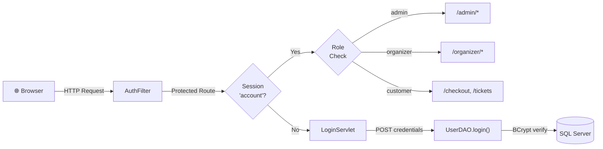
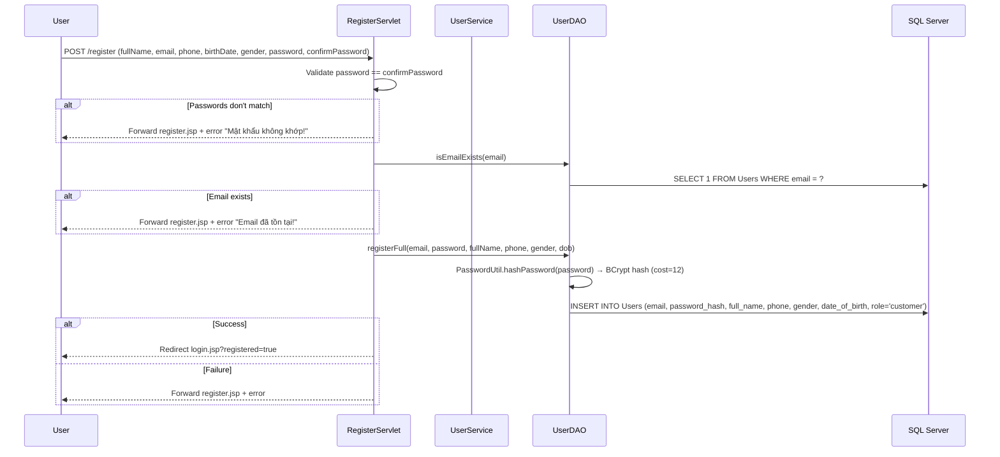
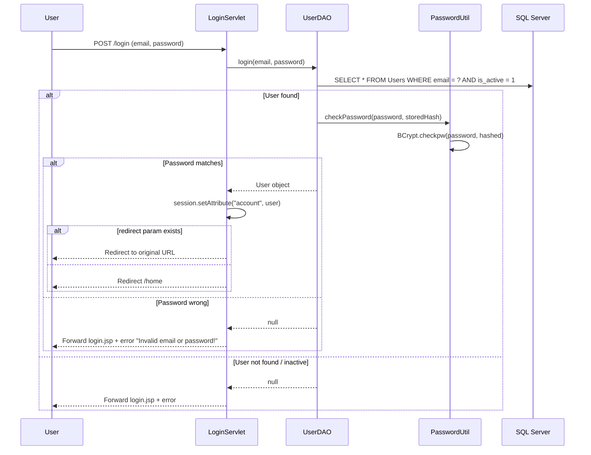
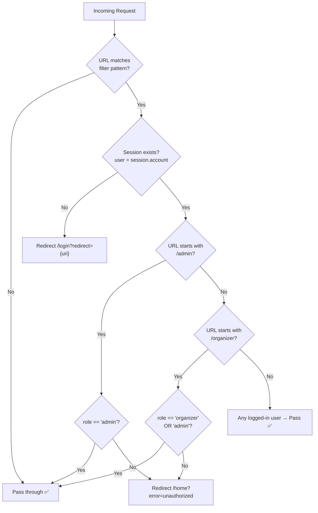

# Authentication & Authorization Flow

> **SellingTicket** — Session-based Auth with BCrypt password hashing  
> Tech Stack: Jakarta Servlet 6.0, BCrypt (jBCrypt), SQL Server

---

## 1. Architecture Overview



---

## 2. User Roles

| Role | Access Level | Protected URLs |
|------|-------------|----------------|
| `customer` | Buy tickets, view profile | `/checkout`, `/tickets`, `/order-confirmation` |
| `organizer` | Manage own events & orders | `/organizer/*` |
| `admin` | Full system access | `/admin/*` |

---

## 3. Registration Flow



### Key Implementation Details

- **Password hashing**: `BCrypt.hashpw(password, BCrypt.gensalt(12))` — cost factor 12
- **Default role**: All new users are registered as `customer`
- **Validation**: Server-side only (email format regex, password ≥ 6 chars in `UserService`)
- **Files**: [RegisterServlet.java](file:///d:/GITHUB/PRJ301_GROUP4_SELLING_TICKET/SellingTicketJava/src/java/com/sellingticket/controller/RegisterServlet.java), [UserDAO.java](file:///d:/GITHUB/PRJ301_GROUP4_SELLING_TICKET/SellingTicketJava/src/java/com/sellingticket/dao/UserDAO.java)

---

## 4. Login Flow



### Session Storage

```java
// Session attribute key: "account"
HttpSession session = request.getSession();
session.setAttribute("account", user);  // User model object

// Reading in other servlets
User user = (User) session.getAttribute("account");
// Legacy compat: some servlets also check "user" attribute
```

---

## 5. Authorization Filter (AuthFilter)

### Protected URL Patterns

```java
@WebFilter(urlPatterns = {"/organizer/*", "/admin/*", "/checkout", "/tickets", "/order-confirmation"})
```

### Decision Logic



### Important: Redirect-after-login

When an unauthenticated user hits a protected URL, the filter appends `?redirect={uri}` to the login URL. After successful login, `LoginServlet` reads this parameter and redirects back to the original page.

---

## 6. Logout Flow

```java
// GET /logout
HttpSession session = request.getSession(false);
if (session != null) {
    session.invalidate();  // Destroy entire session
}
response.sendRedirect("home");
```

- **Method**: GET only
- **Session**: Fully invalidated (not just attribute removal)
- **Redirect**: Always to `/home`

---

## 7. Password Security

| Aspect | Implementation |
|--------|---------------|
| **Algorithm** | BCrypt (jBCrypt library) |
| **Cost factor** | 12 rounds |
| **Hashing** | `BCrypt.hashpw(password, BCrypt.gensalt(12))` |
| **Verification** | `BCrypt.checkpw(plaintext, storedHash)` |
| **Storage** | `password_hash` column in `Users` table |
| **Null safety** | Returns `false` for null/empty hash |

### File: [PasswordUtil.java](file:///d:/GITHUB/PRJ301_GROUP4_SELLING_TICKET/SellingTicketJava/src/java/com/sellingticket/util/PasswordUtil.java)

---

## 8. User Model

```java
public class User {
    int userId;
    String email;
    String passwordHash;  // BCrypt hash, never exposed to session/JSP
    String fullName;
    String phone;
    String role;           // "customer" | "organizer" | "admin"
    String avatar;
    boolean isActive;      // Soft-delete flag
    Date createdAt;
    Date updatedAt;
}
```

---

## 9. Security Considerations

> [!WARNING]
> **Current limitations to address before production:**

| Issue | Status | Recommendation |
|-------|--------|----------------|
| No CSRF protection | ⚠️ Missing | Add CSRF tokens to all POST forms |
| No rate limiting on login | ⚠️ Missing | Implement login attempt throttling |
| No session timeout config | ⚠️ Missing | Set `session-timeout` in `web.xml` |
| Password reset flow | ⚠️ Missing | Add email-based password reset |
| Remember-me cookie | ⚠️ Missing | Optional: secure cookie with token |
| Input sanitization | ✅ Partial | Parameterized SQL prevents SQLi |

---

## 10. File Reference

| File | Purpose |
|------|---------|
| [LoginServlet.java](file:///d:/GITHUB/PRJ301_GROUP4_SELLING_TICKET/SellingTicketJava/src/java/com/sellingticket/controller/LoginServlet.java) | Login controller |
| [RegisterServlet.java](file:///d:/GITHUB/PRJ301_GROUP4_SELLING_TICKET/SellingTicketJava/src/java/com/sellingticket/controller/RegisterServlet.java) | Registration controller |
| [LogoutServlet.java](file:///d:/GITHUB/PRJ301_GROUP4_SELLING_TICKET/SellingTicketJava/src/java/com/sellingticket/controller/LogoutServlet.java) | Logout handler |
| [AuthFilter.java](file:///d:/GITHUB/PRJ301_GROUP4_SELLING_TICKET/SellingTicketJava/src/java/com/sellingticket/filter/AuthFilter.java) | Authorization filter |
| [UserService.java](file:///d:/GITHUB/PRJ301_GROUP4_SELLING_TICKET/SellingTicketJava/src/java/com/sellingticket/service/UserService.java) | Business logic |
| [UserDAO.java](file:///d:/GITHUB/PRJ301_GROUP4_SELLING_TICKET/SellingTicketJava/src/java/com/sellingticket/dao/UserDAO.java) | Data access |
| [PasswordUtil.java](file:///d:/GITHUB/PRJ301_GROUP4_SELLING_TICKET/SellingTicketJava/src/java/com/sellingticket/util/PasswordUtil.java) | BCrypt utility |
| [User.java](file:///d:/GITHUB/PRJ301_GROUP4_SELLING_TICKET/SellingTicketJava/src/java/com/sellingticket/model/User.java) | User model |
