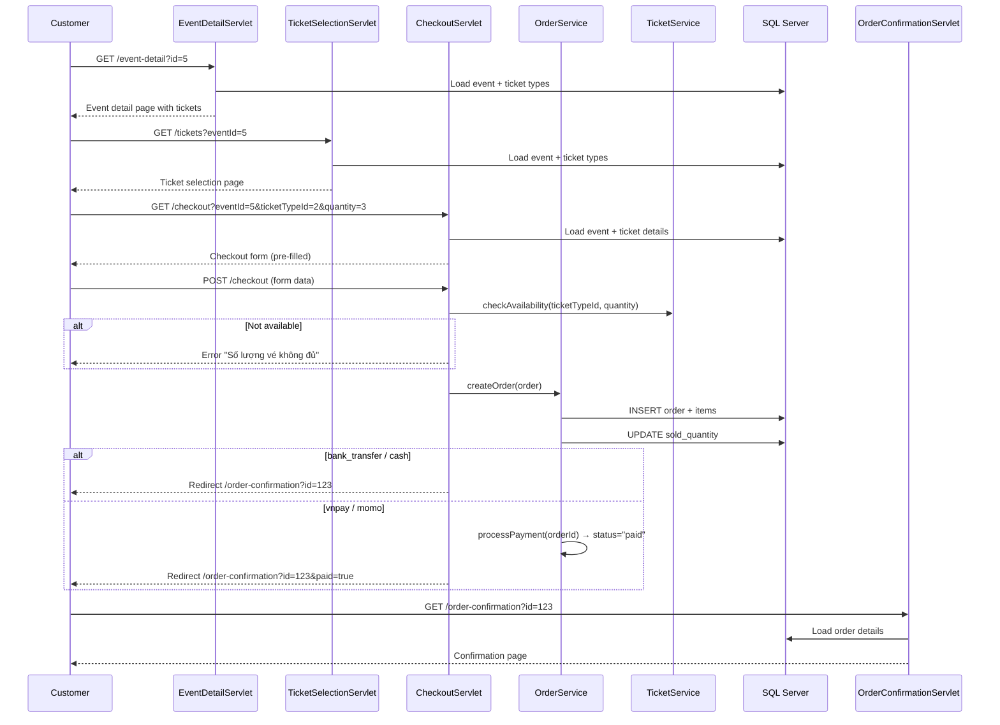
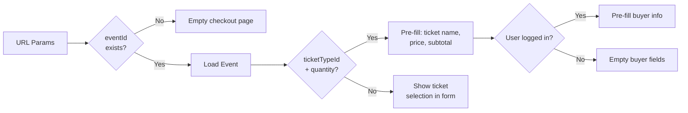
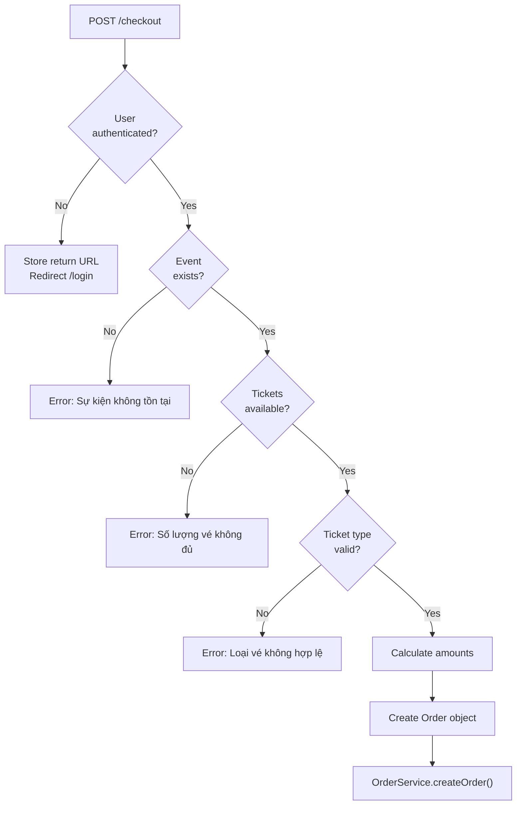
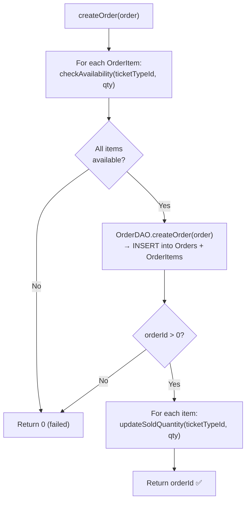
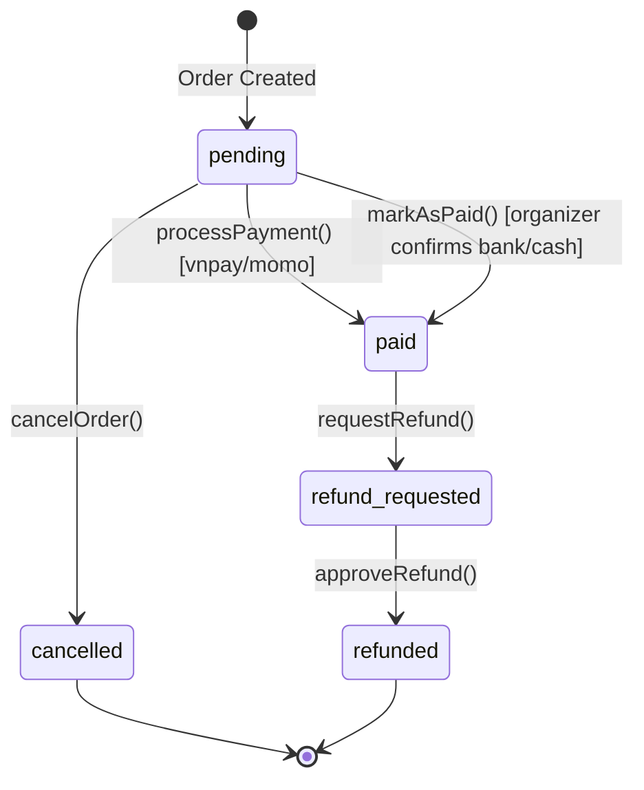

# Payment & Checkout Flow

> **SellingTicket** — Multi-step ticket purchasing with payment simulation  
> Tech Stack: Jakarta Servlet, Service Layer, SQL Server

---

## 1. End-to-End Purchase Flow



---

## 2. Step-by-Step Breakdown

### Step 1: Event Discovery → Ticket Selection

| Servlet | URL | Purpose |
|---------|-----|---------|
| `EventDetailServlet` | `GET /event-detail?id={eventId}` | Show event info + available ticket types |
| `TicketSelectionServlet` | `GET /tickets?eventId={eventId}` | Dedicated ticket selection view |

Both load the `Event` model and associated `TicketType` list from the database.

---

### Step 2: Checkout Page (GET)

**URL**: `GET /checkout?eventId={id}&ticketTypeId={id}&quantity={n}`



---

### Step 3: Order Submission (POST)

**URL**: `POST /checkout`

#### Form Parameters

| Parameter | Type | Required | Description |
|-----------|------|----------|-------------|
| `eventId` | int | ✅ | Event being purchased |
| `ticketTypeId` | int | ✅ | Selected ticket tier |
| `quantity` | int | ✅ | Number of tickets (default: 1) |
| `paymentMethod` | string | ✅ | `bank_transfer` \| `cash` \| `vnpay` \| `momo` |
| `buyerName` | string | ❌ | Falls back to user's fullName |
| `buyerEmail` | string | ❌ | Falls back to user's email |
| `buyerPhone` | string | ❌ | Falls back to user's phone |
| `notes` | string | ❌ | Optional buyer notes |
| `voucherCode` | string | ❌ | Discount voucher (TODO: not yet implemented) |

#### Validation Pipeline



---

## 3. Order Creation (Service Layer)

### OrderService.createOrder(order)



### Order Code Generation

```java
// Pattern: ORD-{timestamp}-{random}
"ORD-" + System.currentTimeMillis() + "-" + (int)(Math.random() * 1000)
// Example: ORD-1707523200000-742
```

### Price Calculation

```java
double unitPrice = ticket.getPrice();
double totalAmount = unitPrice * quantity;
double discountAmount = 0;        // Voucher discount (TODO)
double finalAmount = totalAmount - discountAmount;
```

---

## 4. Payment Processing

### Payment Methods & Status Transitions



### Payment Method Handling

| Method | Initial Status | Auto-pay? | Confirmation |
|--------|---------------|-----------|--------------|
| `bank_transfer` | `pending` | ❌ | Organizer manual confirmation |
| `cash` | `pending` | ❌ | Organizer manual confirmation |
| `vnpay` | `paid` | ✅ Simulated | Auto (payment gateway simulation) |
| `momo` | `paid` | ✅ Simulated | Auto (payment gateway simulation) |

### Post-Payment Redirect

```java
if ("bank_transfer".equals(paymentMethod) || "cash".equals(paymentMethod)) {
    // Order stays "pending" → organizer confirms later
    response.sendRedirect("order-confirmation?id=" + orderId);
} else {
    // Simulate payment success for VNPay/Momo
    orderService.processPayment(orderId, paymentMethod);
    response.sendRedirect("order-confirmation?id=" + orderId + "&paid=true");
}
```

---

## 5. Order Management (Organizer)

### Organizer Can:

| Action | URL | Method | Description |
|--------|-----|--------|-------------|
| View event orders | `GET /organizer/orders/{eventId}` | GET | List all orders for own event |
| Confirm payment | `POST /organizer/orders/confirm-payment` | POST | Mark order as `paid` |
| Cancel order | `POST /organizer/orders/cancel` | POST | Cancel + restore tickets |

### Ownership Verification

Every organizer action verifies `event.organizerId == user.userId` before proceeding. This prevents organizers from managing other organizers' events.

---

## 6. Order Model

```java
public class Order {
    int orderId;
    String orderCode;         // "ORD-{timestamp}-{random}"
    int userId;               // Buyer
    int eventId;
    double totalAmount;
    double discountAmount;
    double finalAmount;
    String status;            // pending | paid | cancelled | refund_requested | refunded
    String paymentMethod;     // bank_transfer | cash | vnpay | momo
    Date paymentDate;
    String buyerName;
    String buyerEmail;
    String buyerPhone;
    String notes;
    Date createdAt;
    String eventTitle;        // Joined field
    List<OrderItem> items;    // Order line items
}

public class OrderItem {
    int orderItemId;
    int orderId;
    int ticketTypeId;
    int quantity;
    double unitPrice;
    double subtotal;
    String ticketTypeName;    // Joined field
}
```

---

## 7. Ticket Inventory Management

### Availability Check

```java
// TicketTypeDAO.checkAvailability(ticketTypeId, requestedQty)
// SQL: SELECT (quantity - sold_quantity) >= ? FROM TicketTypes WHERE ticket_type_id = ?
```

### After Purchase

```java
// TicketTypeDAO.updateSoldQuantity(ticketTypeId, purchasedQty)
// SQL: UPDATE TicketTypes SET sold_quantity = sold_quantity + ? WHERE ticket_type_id = ?
```

### Available Quantity Display

```java
// TicketType.getAvailableQuantity()
return quantity - soldQuantity;
```

---

## 8. Error Handling

| Error | Vietnamese Message | Trigger |
|-------|-------------------|---------|
| Event not found | "Sự kiện không tồn tại" | Invalid eventId |
| Tickets sold out | "Số lượng vé không đủ" | `quantity > available` |
| Invalid ticket type | "Loại vé không hợp lệ" | Invalid ticketTypeId |
| Order creation failed | "Không thể tạo đơn hàng. Vui lòng thử lại." | DB insert failure |
| General exception | "Đã xảy ra lỗi: {message}" | Any unhandled exception |

---

## 9. Future Enhancements

> [!NOTE]
> **Planned but not yet implemented:**

- **Voucher/Discount system**: `voucherCode` parameter is parsed but discount calculation is commented out
- **Real payment gateway**: VNPay and Momo are simulated (always succeed)
- **Email confirmation**: No order confirmation email is sent
- **QR Code tickets**: No ticket generation after purchase
- **Concurrent purchase protection**: No database-level locking for ticket reservation

---

## 10. File Reference

| File | Purpose |
|------|---------|
| [CheckoutServlet.java](file:///d:/GITHUB/PRJ301_GROUP4_SELLING_TICKET/SellingTicketJava/src/java/com/sellingticket/controller/CheckoutServlet.java) | Checkout controller (GET + POST) |
| [OrderConfirmationServlet.java](file:///d:/GITHUB/PRJ301_GROUP4_SELLING_TICKET/SellingTicketJava/src/java/com/sellingticket/controller/OrderConfirmationServlet.java) | Confirmation page |
| [TicketSelectionServlet.java](file:///d:/GITHUB/PRJ301_GROUP4_SELLING_TICKET/SellingTicketJava/src/java/com/sellingticket/controller/TicketSelectionServlet.java) | Ticket selector |
| [OrderService.java](file:///d:/GITHUB/PRJ301_GROUP4_SELLING_TICKET/SellingTicketJava/src/java/com/sellingticket/service/OrderService.java) | Order business logic |
| [TicketService.java](file:///d:/GITHUB/PRJ301_GROUP4_SELLING_TICKET/SellingTicketJava/src/java/com/sellingticket/service/TicketService.java) | Ticket business logic |
| [OrganizerOrderController.java](file:///d:/GITHUB/PRJ301_GROUP4_SELLING_TICKET/SellingTicketJava/src/java/com/sellingticket/controller/organizer/OrganizerOrderController.java) | Organizer order management |
| [Order.java](file:///d:/GITHUB/PRJ301_GROUP4_SELLING_TICKET/SellingTicketJava/src/java/com/sellingticket/model/Order.java) | Order model |
| [OrderItem.java](file:///d:/GITHUB/PRJ301_GROUP4_SELLING_TICKET/SellingTicketJava/src/java/com/sellingticket/model/OrderItem.java) | OrderItem model |
| [TicketType.java](file:///d:/GITHUB/PRJ301_GROUP4_SELLING_TICKET/SellingTicketJava/src/java/com/sellingticket/model/TicketType.java) | TicketType model |
