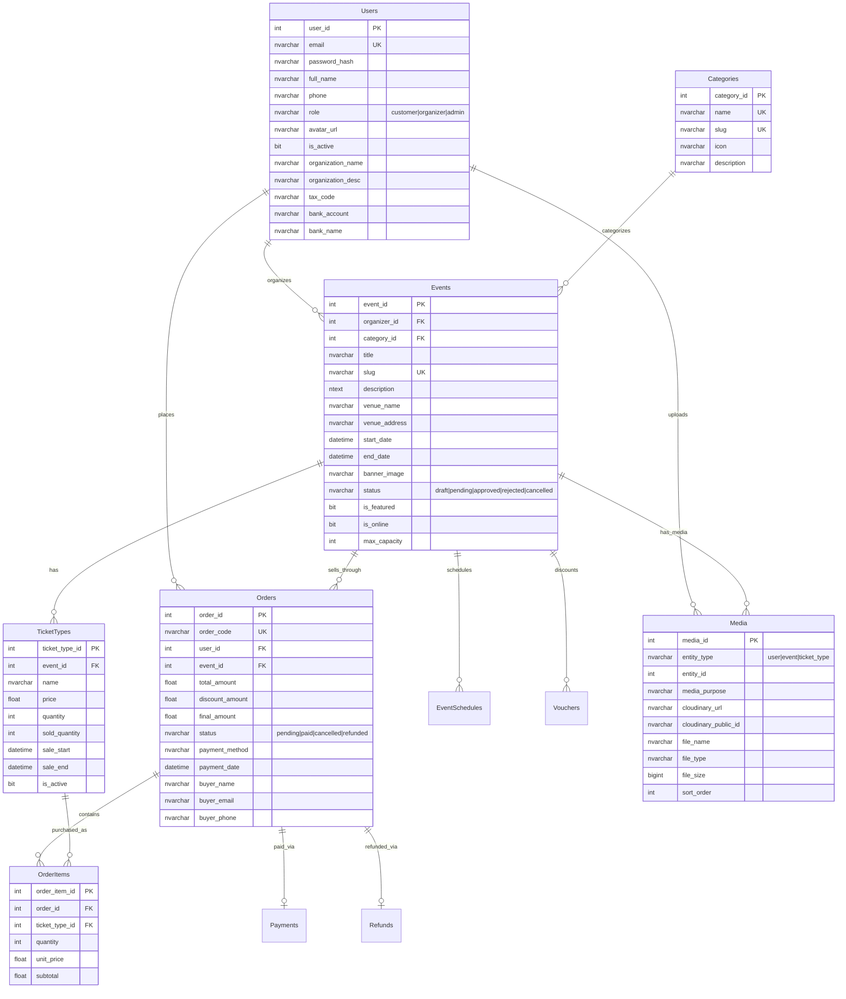
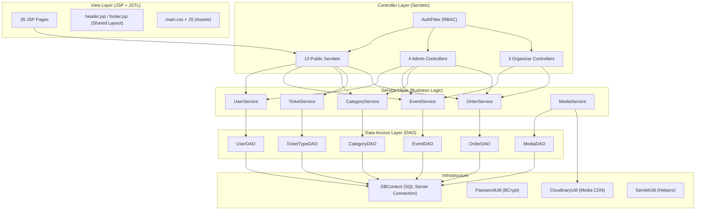
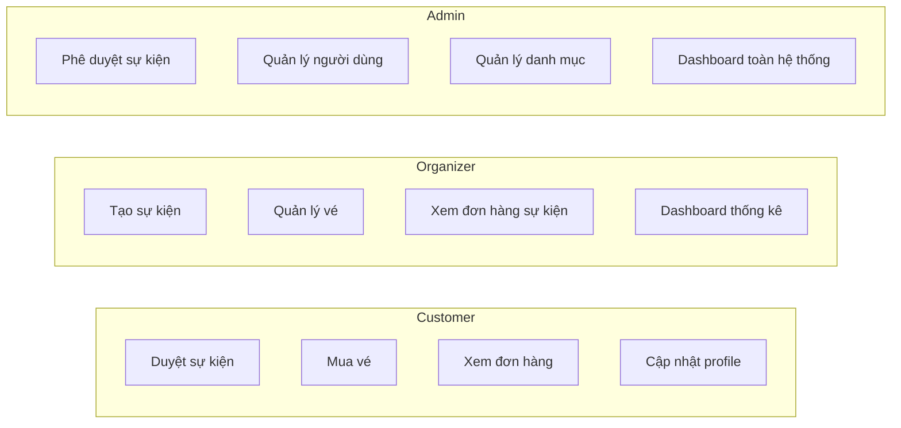
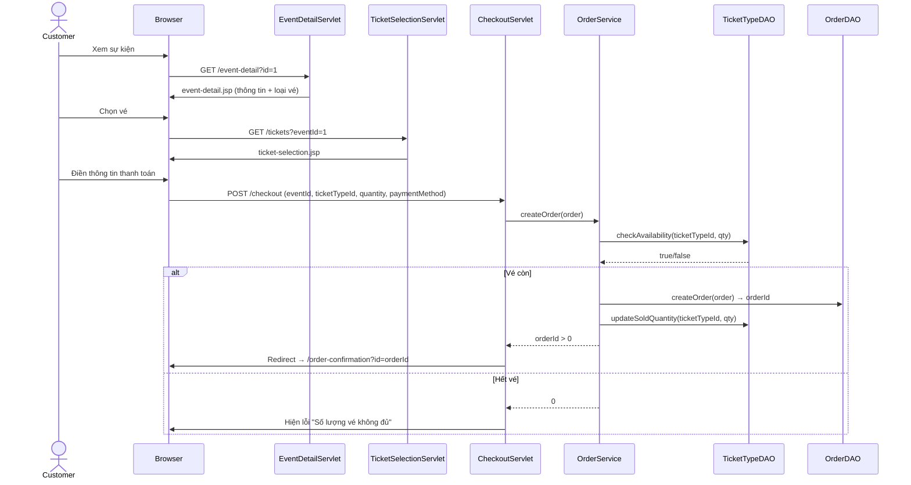
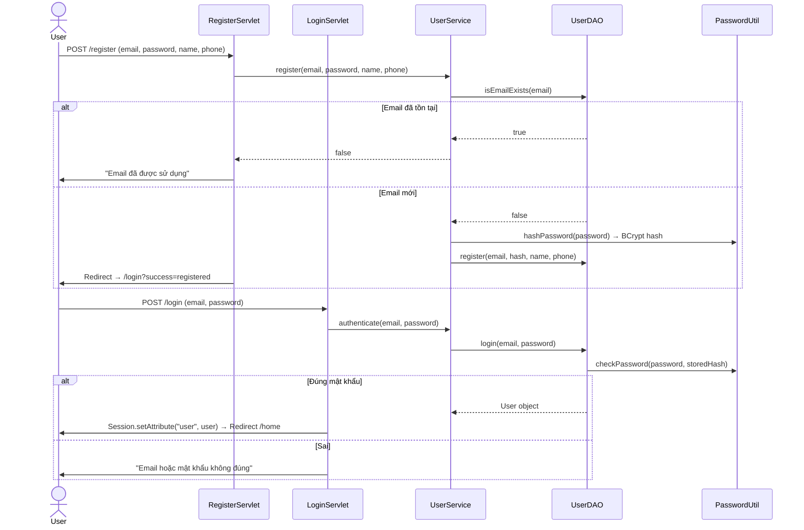
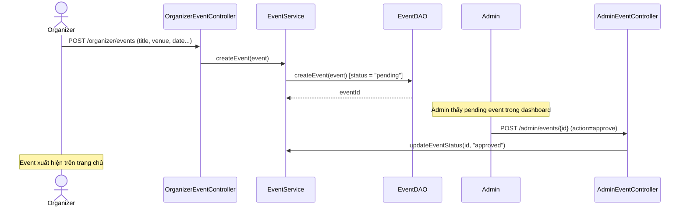
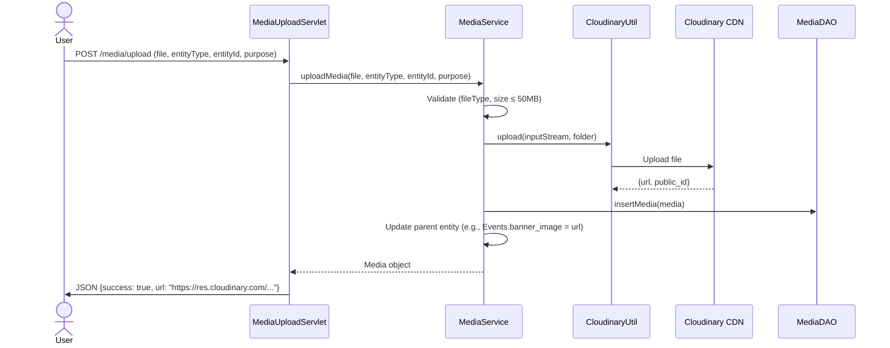

# 📋 TÀI LIỆU HỆ THỐNG TICKETBOX
### Nền tảng bán vé sự kiện trực tuyến | PRJ301 - Nhóm 4

---

## 1. TỔNG QUAN HỆ THỐNG

### 1.1 Mô tả dự án
TicketBox là nền tảng bán vé sự kiện trực tuyến cho phép:
- **Khách hàng (Customer):** duyệt, tìm kiếm và mua vé sự kiện
- **Nhà tổ chức (Organizer):** tạo và quản lý sự kiện, theo dõi đơn hàng
- **Quản trị viên (Admin):** phê duyệt sự kiện, quản lý người dùng, xem thống kê

### 1.2 Tech Stack

| Thành phần | Công nghệ | Phiên bản |
|------------|-----------|-----------|
| **Backend** | Java Servlet (Jakarta EE) | Jakarta EE 10 |
| **Web Server** | Apache Tomcat | 10.x |
| **Database** | Microsoft SQL Server | 2019+ |
| **View Engine** | JSP + JSTL | 3.0 |
| **Password Hashing** | jBCrypt | 0.4 |
| **Media Storage** | Cloudinary SDK | 1.39.0 |
| **HTTP Client** | Apache HttpClient | 4.5.14 |
| **Build Tool** | Apache Ant (NetBeans) | NetBeans 21+ |
| **Java** | JDK | 17 |

### 1.3 Kiến trúc tổng quan

```
┌─────────────────────────────────────────────────────────────────┐
│                        BROWSER (Client)                         │
│                   HTML / CSS / JavaScript                        │
└────────────────────────┬────────────────────────────────────────┘
                         │ HTTP Request
┌────────────────────────▼────────────────────────────────────────┐
│                    APACHE TOMCAT 10.x                            │
│  ┌──────────────┐  ┌──────────────────┐  ┌───────────────────┐  │
│  │  AuthFilter   │→│    Servlets       │→│   JSP Views        │  │
│  │  (RBAC)       │  │  (Controllers)   │  │  (Presentation)   │  │
│  └──────────────┘  └────────┬─────────┘  └───────────────────┘  │
│                             │                                    │
│                    ┌────────▼─────────┐                          │
│                    │    Services       │                          │
│                    │ (Business Logic)  │                          │
│                    └────────┬─────────┘                          │
│                             │                                    │
│                    ┌────────▼─────────┐                          │
│                    │      DAOs         │                          │
│                    │ (Data Access)     │                          │
│                    └────────┬─────────┘                          │
│                             │                                    │
│                    ┌────────▼─────────┐  ┌───────────────────┐  │
│                    │    DBContext      │  │  CloudinaryUtil    │  │
│                    │ (SQL Server)      │  │  (Media CDN)       │  │
│                    └──────────────────┘  └───────────────────┘  │
└─────────────────────────────────────────────────────────────────┘
           │                                     │
    ┌──────▼──────┐                      ┌───────▼───────┐
    │  SQL Server  │                      │  Cloudinary   │
    │  Database    │                      │  CDN          │
    └─────────────┘                      └───────────────┘
```

---

## 2. CẤU TRÚC THƯ MỤC DỰ ÁN

```
SellingTicketJava/
├── database/
│   ├── ticketbox_schema.sql          # Schema V3.0 (15 bảng)
│   └── mock_data.sql                 # Dữ liệu mẫu
├── nbproject/                        # NetBeans project config
│   └── project.properties            # Classpath & JARs
├── src/
│   ├── java/
│   │   ├── cloudinary.properties     # Cấu hình Cloudinary (không commit)
│   │   └── com/sellingticket/
│   │       ├── model/                # 7 Model classes
│   │       │   ├── User.java
│   │       │   ├── Event.java
│   │       │   ├── Category.java
│   │       │   ├── TicketType.java
│   │       │   ├── Order.java
│   │       │   ├── OrderItem.java
│   │       │   └── Media.java
│   │       ├── dao/                  # 6 DAO classes
│   │       │   ├── UserDAO.java
│   │       │   ├── EventDAO.java
│   │       │   ├── CategoryDAO.java
│   │       │   ├── TicketTypeDAO.java
│   │       │   ├── OrderDAO.java
│   │       │   └── MediaDAO.java
│   │       ├── service/              # 6 Service classes
│   │       │   ├── UserService.java
│   │       │   ├── EventService.java
│   │       │   ├── CategoryService.java
│   │       │   ├── TicketService.java
│   │       │   ├── OrderService.java
│   │       │   └── MediaService.java
│   │       ├── controller/           # 13 Public Servlets
│   │       │   ├── HomeServlet.java
│   │       │   ├── LoginServlet.java
│   │       │   ├── RegisterServlet.java
│   │       │   ├── LogoutServlet.java
│   │       │   ├── EventsServlet.java
│   │       │   ├── EventDetailServlet.java
│   │       │   ├── TicketSelectionServlet.java
│   │       │   ├── CheckoutServlet.java
│   │       │   ├── OrderConfirmationServlet.java
│   │       │   ├── ProfileServlet.java
│   │       │   ├── StaticPagesServlet.java
│   │       │   ├── OrganizerServlet.java
│   │       │   ├── MediaUploadServlet.java
│   │       │   ├── admin/            # 4 Admin Controllers
│   │       │   │   ├── AdminDashboardController.java
│   │       │   │   ├── AdminEventController.java
│   │       │   │   ├── AdminUserController.java
│   │       │   │   └── AdminCategoryController.java
│   │       │   └── organizer/        # 3 Organizer Controllers
│   │       │       ├── OrganizerDashboardController.java
│   │       │       ├── OrganizerEventController.java
│   │       │       └── OrganizerOrderController.java
│   │       ├── filter/
│   │       │   └── AuthFilter.java   # RBAC Authentication Filter
│   │       └── util/
│   │           ├── DBContext.java     # Database connection base
│   │           ├── PasswordUtil.java  # BCrypt hashing
│   │           ├── ServletUtil.java   # Common servlet helpers
│   │           └── CloudinaryUtil.java# Cloudinary SDK wrapper
│   └── webapp/
│       ├── WEB-INF/
│       │   ├── web.xml               # Jakarta EE 10 deployment descriptor
│       │   └── lib/                  # 13 JAR dependencies
│       ├── assets/
│       │   ├── css/main.css          # Global stylesheet
│       │   └── js/                   # animations.js, toast.js
│       ├── index.jsp                 # Welcome page (redirect)
│       ├── home.jsp                  # Landing page
│       ├── login.jsp / register.jsp  # Authentication pages
│       ├── events.jsp                # Event listing
│       ├── event-detail.jsp          # Event detail view
│       ├── ticket-selection.jsp      # Ticket picker
│       ├── checkout.jsp              # Payment form
│       ├── order-confirmation.jsp    # Order success
│       ├── profile.jsp               # User profile
│       ├── categories.jsp            # Category listing
│       ├── about.jsp / faq.jsp       # Static pages
│       ├── header.jsp / footer.jsp   # Shared layout
│       ├── 404.jsp                   # Error page
│       ├── admin/                    # 8 Admin JSPs
│       │   ├── dashboard.jsp
│       │   ├── events.jsp / event-approval.jsp
│       │   ├── users.jsp
│       │   ├── categories.jsp
│       │   ├── reports.jsp / settings.jsp
│       │   └── sidebar.jsp
│       └── organizer/                # 10 Organizer JSPs
│           ├── dashboard.jsp
│           ├── events.jsp / create-event.jsp
│           ├── orders.jsp / tickets.jsp
│           ├── statistics.jsp / vouchers.jsp
│           ├── check-in.jsp / team.jsp / settings.jsp
│           └── sidebar.jsp
```

---

## 3. CƠ SỞ DỮ LIỆU

### 3.1 Sơ đồ ERD (Entity Relationship Diagram)



### 3.2 Danh sách 15 bảng

| # | Bảng | Mô tả | Quan hệ chính |
|---|------|-------|----------------|
| 1 | **Users** | Người dùng (customer, organizer, admin) | → Events, Orders, Media |
| 2 | **Categories** | Danh mục sự kiện (Âm nhạc, Thể thao...) | → Events |
| 3 | **Events** | Sự kiện | → Users, Categories, TicketTypes, Orders |
| 4 | **EventSchedules** | Lịch trình sự kiện (multi-day) | → Events |
| 5 | **TicketTypes** | Loại vé (VIP, Standard, Early Bird) | → Events, OrderItems |
| 6 | **Orders** | Đơn hàng | → Users, Events, OrderItems |
| 7 | **OrderItems** | Chi tiết đơn hàng (từng loại vé) | → Orders, TicketTypes |
| 8 | **Payments** | Thanh toán (VNPay, Momo, bank_transfer) | → Orders |
| 9 | **Refunds** | Hoàn tiền | → Orders |
| 10 | **Vouchers** | Mã giảm giá | → Events |
| 11 | **VoucherUsage** | Lịch sử dùng voucher | → Vouchers, Users, Orders |
| 12 | **Reviews** | Đánh giá sự kiện | → Users, Events |
| 13 | **Notifications** | Thông báo | → Users |
| 14 | **AuditLog** | Nhật ký hoạt động | → Users |
| 15 | **Media** | Tệp media (Cloudinary) | → polymorphic (Users, Events, TicketTypes) |

---

## 4. KIẾN TRÚC PHẦN MỀM

### 4.1 Design Pattern: 4-Tier MVC



### 4.2 Phân tầng chi tiết

| Tầng | Package | Vai trò | Quy tắc |
|------|---------|---------|---------|
| **Model** | `com.sellingticket.model` | POJO với getter/setter | Không chứa logic, chỉ dữ liệu |
| **DAO** | `com.sellingticket.dao` | SQL CRUD trực tiếp | Extends `DBContext`, JDBC PreparedStatement |
| **Service** | `com.sellingticket.service` | Validation + Business rules | Gọi DAO, xử lý lỗi, phối hợp nhiều DAO |
| **Controller** | `com.sellingticket.controller` | Nhận HTTP, parse params, trả JSP | Gọi Service, forward/redirect |
| **Filter** | `com.sellingticket.filter` | Intercept request | Kiểm tra session, role |
| **Util** | `com.sellingticket.util` | Shared utilities | Static methods, singleton |

---

## 5. HỆ THỐNG PHÂN QUYỀN (RBAC)

### 5.1 Ba vai trò



### 5.2 AuthFilter Logic

```
Request → AuthFilter
  ├── URL matches /organizer/*, /admin/*, /checkout, /tickets, /order-confirmation?
  │   ├── NO → Pass through (public page)
  │   └── YES → Check session user
  │       ├── user == null → Redirect to /login?redirect=<original_url>
  │       └── user != null → Check role
  │           ├── /admin/* && role != "admin" → Redirect /home?error=unauthorized
  │           ├── /organizer/* && role != "organizer" && role != "admin" → Redirect /home
  │           └── Role OK → chain.doFilter() (allow)
```

### 5.3 Ma trận quyền truy cập

| URL Pattern | Public | Customer | Organizer | Admin |
|-------------|--------|----------|-----------|-------|
| `/home`, `/events`, `/event-detail` | ✅ | ✅ | ✅ | ✅ |
| `/categories`, `/about`, `/faq` | ✅ | ✅ | ✅ | ✅ |
| `/login`, `/register` | ✅ | ✅ | ✅ | ✅ |
| `/checkout`, `/tickets` | ❌ | ✅ | ✅ | ✅ |
| `/order-confirmation` | ❌ | ✅ | ✅ | ✅ |
| `/profile` | ❌ | ✅ | ✅ | ✅ |
| `/organizer/*` | ❌ | ❌ | ✅ | ✅ |
| `/admin/*` | ❌ | ❌ | ❌ | ✅ |
| `/media/upload` | ✅* | ✅ | ✅ | ✅ |

> *`/media/upload` kiểm tra auth trong servlet code, không qua AuthFilter

---

## 6. SERVLET ENDPOINTS (API Reference)

### 6.1 Public Endpoints

| Servlet | URL | Method | Chức năng |
|---------|-----|--------|-----------|
| `HomeServlet` | `/home` | GET | Trang chủ: featured events + categories + upcoming events |
| `EventsServlet` | `/events` | GET | Danh sách sự kiện: search, filter by category/date, phân trang |
| `EventDetailServlet` | `/event-detail` | GET | Chi tiết sự kiện: info, ticket types, related events |
| `TicketSelectionServlet` | `/tickets` | GET | Chọn loại vé + số lượng 🔒 |
| `CheckoutServlet` | `/checkout` | GET/POST | Form thanh toán (GET) + Tạo đơn hàng (POST) 🔒 |
| `OrderConfirmationServlet` | `/order-confirmation` | GET | Xác nhận đơn hàng thành công 🔒 |
| `LoginServlet` | `/login` | GET/POST | Form đăng nhập (GET) + Xử lý login (POST) |
| `RegisterServlet` | `/register` | GET/POST | Form đăng ký (GET) + Tạo tài khoản (POST) |
| `LogoutServlet` | `/logout` | GET | Xóa session, redirect về home |
| `ProfileServlet` | `/profile` | GET/POST | Xem (GET) + Cập nhật profile (POST) |
| `StaticPagesServlet` | `/categories`, `/about`, `/faq` | GET | Trang tĩnh |
| `MediaUploadServlet` | `/media/upload` | POST/DELETE | Upload file → Cloudinary, trả JSON |

> 🔒 = Yêu cầu đăng nhập (AuthFilter protected)

### 6.2 Admin Endpoints

| Servlet | URL | Method | Chức năng |
|---------|-----|--------|-----------|
| `AdminDashboardController` | `/admin`, `/admin/dashboard` | GET | Dashboard: tổng users, events, orders, revenue |
| `AdminEventController` | `/admin/events`, `/admin/events/*` | GET/POST | CRUD sự kiện + phê duyệt/từ chối |
| `AdminUserController` | `/admin/users`, `/admin/users/*` | GET/POST | CRUD người dùng: search, update role, deactivate |
| `AdminCategoryController` | `/admin/categories`, `/admin/categories/*` | GET/POST | CRUD danh mục sự kiện |

### 6.3 Organizer Endpoints

| Servlet | URL | Method | Chức năng |
|---------|-----|--------|-----------|
| `OrganizerDashboardController` | `/organizer`, `/organizer/dashboard` | GET | Dashboard: thống kê sự kiện cá nhân |
| `OrganizerEventController` | `/organizer/events`, `/organizer/events/*` | GET/POST | CRUD sự kiện của organizer |
| `OrganizerOrderController` | `/organizer/orders`, `/organizer/orders/*` | GET/POST | Xem đơn hàng, cập nhật trạng thái |

---

## 7. DATA MODELS (Chi tiết)

### 7.1 User

| Field | Type | DB Column | Mô tả |
|-------|------|-----------|-------|
| `userId` | int | `user_id` | PK, auto-increment |
| `email` | String | `email` | Unique, dùng để login |
| `fullName` | String | `full_name` | Tên hiển thị |
| `phone` | String | `phone` | Số điện thoại |
| `role` | String | `role` | `customer` / `organizer` / `admin` |
| `avatar` | String | `avatar` | URL ảnh đại diện |
| `isActive` | boolean | `is_active` | Tài khoản đang hoạt động |
| `createdAt` | Date | `created_at` | Ngày tạo |

### 7.2 Event

| Field | Type | DB Column | Mô tả |
|-------|------|-----------|-------|
| `eventId` | int | `event_id` | PK |
| `organizerId` | int | `organizer_id` | FK → Users |
| `categoryId` | int | `category_id` | FK → Categories |
| `title` | String | `title` | Tên sự kiện |
| `slug` | String | `slug` | URL-friendly identifier |
| `description` | String | `description` | Mô tả HTML |
| `venueName` | String | `venue_name` | Tên địa điểm |
| `venueAddress` | String | `venue_address` | Địa chỉ |
| `startDate` | Date | `start_date` | Ngày bắt đầu |
| `endDate` | Date | `end_date` | Ngày kết thúc |
| `bannerImage` | String | `banner_image` | URL banner (Cloudinary) |
| `status` | String | `status` | `draft`/`pending`/`approved`/`rejected`/`cancelled` |
| `isFeatured` | boolean | `is_featured` | Sự kiện nổi bật |
| `isOnline` | boolean | `is_online` | Sự kiện online |
| `maxCapacity` | int | `max_capacity` | Sức chứa tối đa |
| `viewCount` | int | `view_count` | Lượt xem |
| *categoryName* | String | *JOIN* | Tên danh mục (joined) |
| *organizerName* | String | *JOIN* | Tên organizer (joined) |
| *minPrice* | double | *Subquery* | Giá vé thấp nhất (computed) |

### 7.3 TicketType

| Field | Type | Mô tả |
|-------|------|-------|
| `ticketTypeId` | int | PK |
| `eventId` | int | FK → Events |
| `name` | String | Tên loại vé (VIP, Standard...) |
| `description` | String | Mô tả quyền lợi |
| `price` | double | Giá vé (VNĐ) |
| `quantity` | int | Tổng số lượng |
| `soldQuantity` | int | Đã bán |
| `saleStart` / `saleEnd` | Date | Thời gian mở bán |
| `isActive` | boolean | Trạng thái (soft delete) |
| *availableQuantity* | int | `quantity - soldQuantity` (computed) |

### 7.4 Order

| Field | Type | Mô tả |
|-------|------|-------|
| `orderId` | int | PK |
| `orderCode` | String | Mã đơn hàng unique (ORD-timestamp-random) |
| `userId` | int | FK → Users (khách mua) |
| `eventId` | int | FK → Events |
| `totalAmount` | double | Tổng giá trước giảm |
| `discountAmount` | double | Giảm giá (voucher) |
| `finalAmount` | double | Thành tiền |
| `status` | String | `pending`/`paid`/`cancelled`/`refund_requested`/`refunded` |
| `paymentMethod` | String | `bank_transfer`/`cash`/`vnpay`/`momo` |
| `paymentDate` | Date | Ngày thanh toán |
| `buyerName` / `buyerEmail` / `buyerPhone` | String | Thông tin người mua |
| `notes` | String | Ghi chú |
| *items* | List\<OrderItem\> | Danh sách vé trong đơn (joined) |

### 7.5 Media (Cloudinary)

| Field | Type | Mô tả |
|-------|------|-------|
| `mediaId` | int | PK |
| `entityType` | String | `user` / `event` / `ticket_type` (polymorphic) |
| `entityId` | int | ID của entity liên quan |
| `mediaPurpose` | String | `avatar` / `banner` / `gallery` / `ticket_image` |
| `cloudinaryUrl` | String | URL đầy đủ trên Cloudinary |
| `cloudinaryPublicId` | String | ID để delete/transform |
| `fileName` | String | Tên file gốc |
| `fileType` | String | MIME type (image/jpeg...) |
| `fileSize` | long | Kích thước (bytes, max 50MB) |
| `sortOrder` | int | Thứ tự hiển thị |

---

## 8. LUỒNG NGHIỆP VỤ CHÍNH

### 8.1 Luồng mua vé



### 8.2 Luồng đăng ký & đăng nhập



### 8.3 Luồng tạo sự kiện (Organizer)



### 8.4 Luồng upload media (Cloudinary)



---

## 9. CẤU HÌNH & TRIỂN KHAI

### 9.1 Database Connection

File: `com.sellingticket.util.DBContext`

```java
// Connection string format:
String url = "jdbc:sqlserver://localhost:1433;databaseName=SellingTicketDB;encrypt=true;trustServerCertificate=true";
String user = "sa";
String password = "your_password";
```

### 9.2 Cloudinary Configuration

File: `src/java/cloudinary.properties`

```properties
cloudinary.cloud_name=YOUR_CLOUD_NAME
cloudinary.api_key=YOUR_API_KEY
cloudinary.api_secret=YOUR_API_SECRET
cloudinary.secure=true
```

> ⚠️ File này nằm trong `.gitignore` — KHÔNG commit credentials lên Git

### 9.3 Dependencies (WEB-INF/lib)

| JAR | Phiên bản | Mục đích |
|-----|-----------|----------|
| `jakarta.servlet-api` | 6.0.0 | Servlet API (Jakarta EE 10) |
| `jakarta.servlet.jsp-api` | 3.1.0 | JSP API |
| `jakarta.servlet.jsp.jstl` | 3.0.1 | JSTL Tags |
| `jakarta.servlet.jsp.jstl-api` | 3.0.0 | JSTL API |
| `mssql-jdbc` | 12.4.2 | SQL Server JDBC Driver |
| `jbcrypt` | 0.4 | BCrypt Password Hashing |
| `cloudinary-core` | 1.39.0 | Cloudinary SDK Core |
| `cloudinary-http45` | 1.39.0 | Cloudinary HTTP Transport |
| `httpclient` | 4.5.14 | Apache HTTP Client |
| `httpcore` | 4.4.16 | Apache HTTP Core |
| `httpmime` | 4.5.14 | Multipart Upload Support |
| `commons-logging` | 1.2 | Logging (HttpClient dependency) |
| `commons-codec` | 1.16.1 | Encoding (HttpClient dependency) |

### 9.4 Hướng dẫn cài đặt

```bash
# 1. Clone project
git clone https://github.com/YOUR_REPO/PRJ301_GROUP4_SELLING_TICKET.git

# 2. Mở SQL Server Management Studio
#    - Chạy database/ticketbox_schema.sql → Tạo DB + 15 bảng
#    - Chạy database/mock_data.sql → Dữ liệu mẫu

# 3. Cấu hình DB
#    - Mở src/java/com/sellingticket/util/DBContext.java
#    - Sửa connection string, username, password

# 4. Cấu hình Cloudinary (tùy chọn)
#    - Tạo tài khoản tại https://cloudinary.com
#    - Sửa src/java/cloudinary.properties

# 5. Mở project trong NetBeans
#    - File → Open Project → Chọn SellingTicketJava/
#    - Nếu lỗi classpath: Right-click → Resolve Problems
#    - Shift+F11 → Clean & Build

# 6. Deploy
#    - F6 → Run (Tomcat tự deploy)
#    - Mở http://localhost:8080/SellingTicketJava/home
```

### 9.5 Tài khoản mẫu (Mock Data)

| Email | Password | Role |
|-------|----------|------|
| `admin@ticketbox.vn` | `123456` | Admin |
| `organizer@ticketbox.vn` | `123456` | Organizer |
| `user@ticketbox.vn` | `123456` | Customer |

---

## 10. TỔNG KẾT SỐ LIỆU

| Metric | Giá trị |
|--------|---------|
| **Tổng file Java** | 44 |
| **Models** | 7 (User, Event, Category, TicketType, Order, OrderItem, Media) |
| **DAOs** | 6 (User, Event, Category, TicketType, Order, Media) |
| **Services** | 6 (User, Event, Category, Ticket, Order, Media) |
| **Servlets** | 20 (13 public + 4 admin + 3 organizer) |
| **Filters** | 1 (AuthFilter) |
| **Utilities** | 4 (DBContext, PasswordUtil, ServletUtil, CloudinaryUtil) |
| **JSP Pages** | 35 (17 public + 8 admin + 10 organizer) |
| **CSS/JS** | 3 files (main.css, animations.js, toast.js) |
| **Database Tables** | 15 |
| **JAR Dependencies** | 13 |
